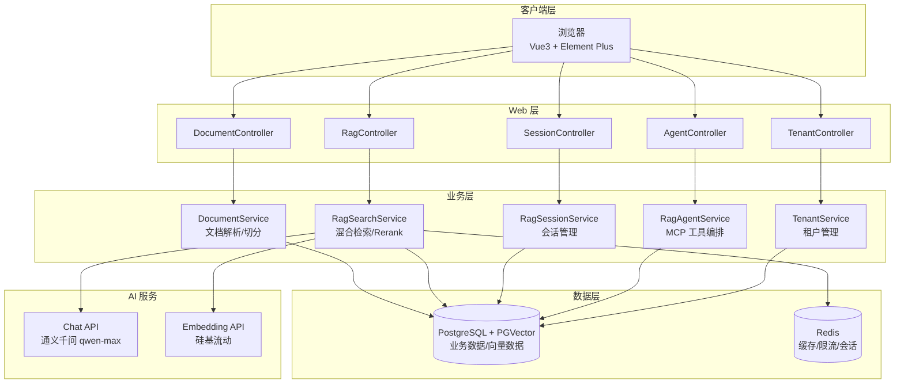
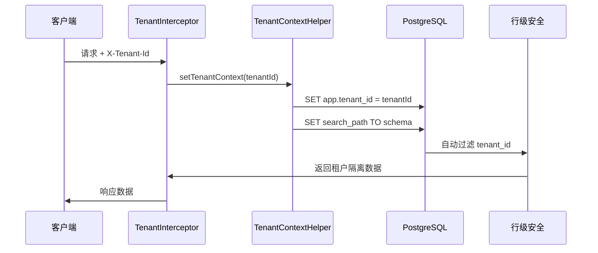
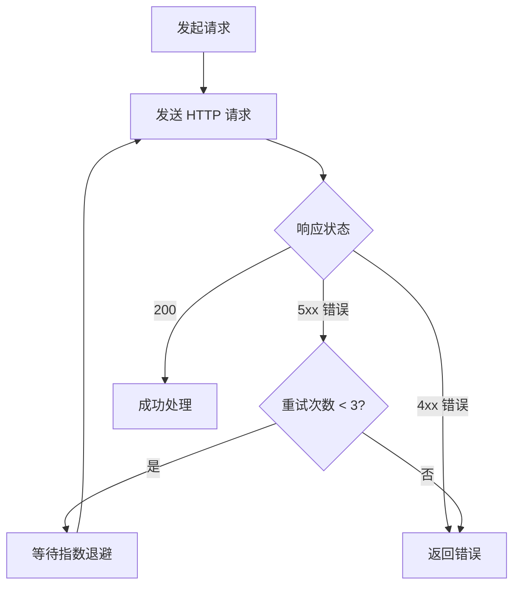
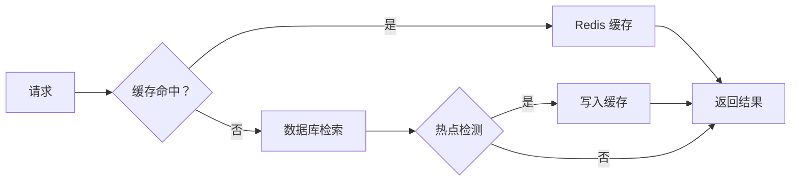

# API 参考文档

**本文档引用的文件**
- [README.md](../../../README.md)
- [R.java](../../../company-rag-common/src/main/java/com/company/rag/common/model/R.java)
- [TenantContextHelper.java](../../../company-rag-tenant/src/main/java/com/company/rag/tenant/context/TenantContextHelper.java)
- [DocumentController.java](../../../company-rag-web/src/main/java/com/company/rag/web/controller/DocumentController.java)
- [RagController.java](../../../company-rag-web/src/main/java/com/company/rag/web/controller/RagController.java)
- [SessionController.java](../../../company-rag-web/src/main/java/com/company/rag/web/controller/SessionController.java)
- [AgentController.java](../../../company-rag-web/src/main/java/com/company/rag/web/controller/AgentController.java)
- [TenantController.java](../../../company-rag-web/src/main/java/com/company/rag/web/controller/TenantController.java)
- [application.yml](../../../company-rag-bootstrap/src/main/resources/application.yml)

## 目录
1. [简介](#简介)
2. [认证和授权](#认证和授权)
3. [统一响应格式](#统一响应格式)
4. [文档管理 API](#文档管理-api)
5. [RAG 检索 API](#rag 检索-api)
6. [会话管理 API](#会话管理-api)
7. [Agent 工具 API](#agent 工具-api)
8. [租户管理 API](#租户管理-api)
9. [错误处理](#错误处理)
10. [最佳实践](#最佳实践)

## 简介

CompanyRag 是企业级知识库检索增强生成 (RAG) 系统，基于 Spring Boot 3.4 + Spring AI 1.0 + PGVector + 通义千问构建。系统提供文档解析、智能切分、向量化存储、混合检索、重排序与流式回答等完整 RAG 链路。

### 版本控制策略
- API 版本：v1.0
- URL 格式：`/api/{module}/{endpoint}`
- 内容协商：支持 JSON 格式
- 缓存策略：Redis 两级缓存（热点检测 + 异步更新）

### 基础配置
- 服务器端口：8080
- 管理端口：Actuator（9090，通过 Prometheus 暴露）
- 数据库连接池：HikariCP（PostgreSQL + PGVector）
- 请求超时：30 秒（LLM 调用）

### 技术架构



**图表来源**
- [README.md](../../../README.md)(L5-L45)
- [application.yml](../../../company-rag-bootstrap/src/main/resources/application.yml)(L1-L90)

## 认证和授权

### 认证机制

系统采用多租户架构，通过 `X-Tenant-Id` 请求头传递租户标识，实现租户隔离。认证流程如下：

1. 客户端在请求头中携带 `X-Tenant-Id`
2. `TenantInterceptor` 拦截器提取租户 ID
3. `TenantContextHelper` 设置 PostgreSQL session 变量
4. MyBatis-Plus 租户拦截器自动追加 `tenant_id` 条件



**图表来源**
- [TenantContextHelper.java](../../../company-rag-tenant/src/main/java/com/company/rag/tenant/context/TenantContextHelper.java)(L20-L70)
- [README.md](../../../README.md)(L50-L53)

### 角色定义

| 角色 | 描述 | 权限范围 |
|------|------|----------|
| admin | 系统管理员 | 租户管理、系统配置、所有数据访问 |
| user | 普通用户 | 文档上传、RAG 检索、会话管理 |
| viewer | 只读用户 | 仅可查看文档和检索结果 |

### 租户隔离机制

系统采用 **Schema 隔离 + 行级安全（RLS）**双重保障：

1. **Schema 隔离**：每个租户拥有独立 Schema，通过 `search_path` 切换
2. **行级安全**：MyBatis-Plus 拦截器自动追加 `tenant_id = ?` 条件
3. **公共表**：`sys_tenant` 等系统表位于 `public` Schema，通过 `tenant_id` 字段隔离

**章节来源**
- [TenantContextHelper.java](../../../company-rag-tenant/src/main/java/com/company/rag/tenant/context/TenantContextHelper.java)(L1-L97)
- [README.md](../../../README.md)(L50-L53)

## 统一响应格式

所有 API 接口均返回统一响应体 `R<T>`，确保前后端交互一致性。

### 响应结构

```java
@Data
public class R<T> {
    private int code;      // 状态码：200 成功，其他为失败
    private String msg;    // 响应消息
    private T data;        // 响应数据（泛型）
}
```

### 响应方法

| 方法 | 说明 | 返回示例 |
|------|------|----------|
| `R.ok(T data)` | 成功响应（带数据） | `{"code":200,"msg":"success","data":{...}}` |
| `R.ok()` | 成功响应（无数据） | `{"code":200,"msg":"success","data":null}` |
| `R.fail(int code, String msg)` | 失败响应（自定义状态码） | `{"code":400,"msg":"错误信息","data":null}` |
| `R.fail(String msg)` | 失败响应（默认 400） | `{"code":400,"msg":"错误信息","data":null}` |

**章节来源**
- [R.java](../../../company-rag-common/src/main/java/com/company/rag/common/model/R.java)(L1-L37)

## 文档管理 API

### 文档上传

**端点：** `POST /api/document/upload`

**描述：** 上传文档并自动解析、切分、向量化

**认证要求：** 需要 `X-Tenant-Id` 请求头

**请求体格式：**（multipart/form-data）
```
file: @document.pdf
```

**响应格式：**
```json
{
  "code": 200,
  "msg": "success",
  "data": {
    "id": 1,
    "fileName": "document.pdf",
    "fileSize": 1024000,
    "fileType": "application/pdf",
    "chunkCount": 15,
    "uploadTime": "2026-07-19T10:00:00"
  }
}
```

**章节来源**
- [DocumentController.java](../../../company-rag-web/src/main/java/com/company/rag/web/controller/DocumentController.java)(L23-L32)

### 文档列表

**端点：** `GET /api/document/list`

**描述：** 获取当前租户的文档列表

**认证要求：** 需要 `X-Tenant-Id` 请求头

**响应格式：**
```json
{
  "code": 200,
  "msg": "success",
  "data": [
    {
      "id": 1,
      "fileName": "document.pdf",
      "fileSize": 1024000,
      "fileType": "application/pdf",
      "chunkCount": 15,
      "uploadTime": "2026-07-19T10:00:00"
    }
  ]
}
```

**章节来源**
- [DocumentController.java](../../../company-rag-web/src/main/java/com/company/rag/web/controller/DocumentController.java)(L34-L42)

## RAG 检索 API

### 混合检索

**端点：** `POST /api/rag/search`

**描述：** 执行混合检索（向量 + 关键词）+ Rerank 重排序

**认证要求：** 需要 `X-Tenant-Id` 请求头

**请求体格式：**
```json
{
  "query": "什么是微服务架构？",
  "tenantId": 1,
  "topK": 10,
  "rerankTopK": 5,
  "enableRerank": true
}
```

**响应格式：**
```json
{
  "code": 200,
  "msg": "success",
  "data": {
    "query": "什么是微服务架构？",
    "chunks": [
      {
        "chunkId": 101,
        "content": "微服务架构是一种...",
        "score": 0.95,
        "documentId": 1,
        "documentName": "架构设计文档.pdf"
      }
    ],
    "answer": "微服务架构是一种将单一应用程序开发为一组小型服务的方法..."
  }
}
```

**章节来源**
- [RagController.java](../../../company-rag-web/src/main/java/com/company/rag/web/controller/RagController.java)(L22-L25)
- [README.md](../../../README.md)(L56-L61)

### 流式回答

**端点：** `POST /api/rag/stream`

**描述：** 流式输出 RAG 回答（SSE）

**认证要求：** 需要 `X-Tenant-Id` 请求头

**请求体格式：**
```json
{
  "query": "什么是微服务架构？",
  "tenantId": 1
}
```

**响应格式：**（Server-Sent Events）
```
data: 微

data: 服

data: 务

data: 架

data: 构

data: 是

data: 一

data: 种
...
```

**章节来源**
- [RagController.java](../../../company-rag-web/src/main/java/com/company/rag/web/controller/RagController.java)(L27-L31)

### 纯检索

**端点：** `POST /api/rag/retrieve`

**描述：** 仅执行检索（不调用 LLM 生成回答）

**认证要求：** 需要 `X-Tenant-Id` 请求头

**请求体格式：**
```json
{
  "query": "什么是微服务架构？",
  "tenantId": 1,
  "topK": 10
}
```

**响应格式：**
```json
{
  "code": 200,
  "msg": "success",
  "data": {
    "chunks": [
      {
        "chunkId": 101,
        "content": "微服务架构是一种...",
        "score": 0.95,
        "documentId": 1
      }
    ]
  }
}
```

**章节来源**
- [RagController.java](../../../company-rag-web/src/main/java/com/company/rag/web/controller/RagController.java)(L33-L36)

## 会话管理 API

### 创建会话

**端点：** `POST /api/session`

**描述：** 创建新的会话

**认证要求：** 需要 `X-Tenant-Id` 请求头

**请求体格式：**
```json
{
  "title": "新会话"
}
```

**响应格式：**
```json
{
  "code": 200,
  "msg": "success",
  "data": {
    "sessionId": "uuid-string",
    "title": "新会话",
    "createTime": "2026-07-19T10:00:00",
    "updateTime": "2026-07-19T10:00:00",
    "tags": []
  }
}
```

**章节来源**
- [SessionController.java](../../../company-rag-web/src/main/java/com/company/rag/web/controller/SessionController.java)(L28-L36)

### 获取会话列表

**端点：** `GET /api/session/list`

**描述：** 获取当前租户的会话列表（分页 + 搜索）

**认证要求：** 需要 `X-Tenant-Id` 请求头

**查询参数：**
- `keyword`: 关键词搜索（可选）
- `tags`: 标签过滤（可选，支持多个）
- `page`: 页码（默认 1）
- `size`: 每页大小（默认 20）

**响应格式：**
```json
{
  "code": 200,
  "msg": "success",
  "data": {
    "records": [
      {
        "sessionId": "uuid-string",
        "title": "会话标题",
        "createTime": "2026-07-19T10:00:00",
        "tags": ["RAG", "问答"]
      }
    ],
    "total": 100,
    "current": 1,
    "size": 20
  }
}
```

**章节来源**
- [SessionController.java](../../../company-rag-web/src/main/java/com/company/rag/web/controller/SessionController.java)(L41-L51)

### 获取会话详情

**端点：** `GET /api/session/{sessionId}`

**描述：** 获取会话的完整对话历史

**认证要求：** 需要 `X-Tenant-Id` 请求头

**路径参数：**
- `sessionId`: 会话 ID

**响应格式：**
```json
{
  "code": 200,
  "msg": "success",
  "data": [
    {
      "id": 1,
      "sessionId": "uuid-string",
      "role": "user",
      "content": "什么是 RAG？",
      "createTime": "2026-07-19T10:00:00"
    },
    {
      "id": 2,
      "sessionId": "uuid-string",
      "role": "assistant",
      "content": "RAG 是检索增强生成...",
      "createTime": "2026-07-19T10:00:01"
    }
  ]
}
```

**章节来源**
- [SessionController.java](../../../company-rag-web/src/main/java/com/company/rag/web/controller/SessionController.java)(L56-L61)

### 删除会话

**端点：** `DELETE /api/session/{sessionId}`

**描述：** 软删除会话

**认证要求：** 需要 `X-Tenant-Id` 请求头

**路径参数：**
- `sessionId`: 会话 ID

**响应格式：**
```json
{
  "code": 200,
  "msg": "success",
  "data": null
}
```

**章节来源**
- [SessionController.java](../../../company-rag-web/src/main/java/com/company/rag/web/controller/SessionController.java)(L66-L71)

### 更新会话

**端点：** `PUT /api/session/{sessionId}`

**描述：** 更新会话信息（标题/标签）

**认证要求：** 需要 `X-Tenant-Id` 请求头

**路径参数：**
- `sessionId`: 会话 ID

**请求体格式：**
```json
{
  "title": "新标题",
  "tags": ["RAG", "更新"]
}
```

**响应格式：**
```json
{
  "code": 200,
  "msg": "success",
  "data": null
}
```

**章节来源**
- [SessionController.java](../../../company-rag-web/src/main/java/com/company/rag/web/controller/SessionController.java)(L76-L82)

## Agent 工具 API

### 智能对话

**端点：** `POST /api/agent/chat`

**描述：** Agent 智能对话（支持工具调用）

**请求体格式：**
```json
{
  "message": "查询用户表结构",
  "context": "当前租户：default"
}
```

**响应格式：**
```json
{
  "code": 200,
  "msg": "success",
  "data": "用户表结构如下：\n- id: 主键\n- username: 用户名\n- email: 邮箱..."
}
```

**章节来源**
- [AgentController.java](../../../company-rag-web/src/main/java/com/company/rag/web/controller/AgentController.java)(L20-L25)

### 数据库查询

**端点：** `POST /api/agent/query-db`

**描述：** 通过自然语言查询数据库

**请求体格式：**
```json
{
  "sql": "SELECT * FROM users LIMIT 10"
}
```

**响应格式：**
```json
{
  "code": 200,
  "msg": "success",
  "data": "查询结果：\n[{'id': 1, 'username': 'admin'}, ...]"
}
```

**章节来源**
- [AgentController.java](../../../company-rag-web/src/main/java/com/company/rag/web/controller/AgentController.java)(L27-L30)

### 代码检索

**端点：** `POST /api/agent/search-code`

**描述：** 在项目源码中搜索代码片段

**请求体格式：**
```json
{
  "keyword": "RagController",
  "fileExtension": ".java"
}
```

**响应格式：**
```json
{
  "code": 200,
  "msg": "success",
  "data": "找到以下代码片段：\n- company-rag-web/.../RagController.java:15"
}
```

**章节来源**
- [AgentController.java](../../../company-rag-web/src/main/java/com/company/rag/web/controller/AgentController.java)(L32-L37)

### API 文档生成

**端点：** `GET /api/agent/api-doc`

**描述：** 动态扫描 Spring 端点生成 API 文档

**查询参数：**
- `filter`: 过滤条件（可选）

**响应格式：**
```json
{
  "code": 200,
  "msg": "success",
  "data": "API 文档内容..."
}
```

**章节来源**
- [AgentController.java](../../../company-rag-web/src/main/java/com/company/rag/web/controller/AgentController.java)(L39-L42)

## 租户管理 API

### 创建租户

**端点：** `POST /api/tenant`

**描述：** 创建新租户（自动初始化 Schema 和默认管理员用户）

**请求体格式：**
```json
{
  "tenantCode": "tenant001",
  "tenantName": "测试租户",
  "contactName": "张三",
  "contactPhone": "13800138000"
}
```

**响应格式：**
```json
{
  "code": 200,
  "msg": "success",
  "data": {
    "id": 1,
    "tenantCode": "tenant001",
    "tenantName": "测试租户",
    "schemaName": "tenant_tenant001",
    "status": "active",
    "contactName": "张三",
    "contactPhone": "13800138000",
    "createTime": "2026-07-19T10:00:00"
  }
}
```

**章节来源**
- [TenantController.java](../../../company-rag-web/src/main/java/com/company/rag/web/controller/TenantController.java)(L26-L53)

### 获取租户列表

**端点：** `GET /api/tenant/list`

**描述：** 获取所有租户列表

**响应格式：**
```json
{
  "code": 200,
  "msg": "success",
  "data": [
    {
      "id": 1,
      "tenantCode": "tenant001",
      "tenantName": "测试租户",
      "schemaName": "tenant_tenant001",
      "status": "active",
      "contactName": "张三",
      "contactPhone": "13800138000",
      "createTime": "2026-07-19T10:00:00"
    }
  ]
}
```

**章节来源**
- [TenantController.java](../../../company-rag-web/src/main/java/com/company/rag/web/controller/TenantController.java)(L58-L76)

### 获取租户详情

**端点：** `GET /api/tenant/{id}`

**描述：** 获取指定租户的详细信息

**路径参数：**
- `id`: 租户 ID

**响应格式：**
```json
{
  "code": 200,
  "msg": "success",
  "data": {
    "id": 1,
    "tenantCode": "tenant001",
    "tenantName": "测试租户",
    "schemaName": "tenant_tenant001",
    "status": "active",
    "contactName": "张三",
    "contactPhone": "13800138000",
    "createTime": "2026-07-19T10:00:00"
  }
}
```

**章节来源**
- [TenantController.java](../../../company-rag-web/src/main/java/com/company/rag/web/controller/TenantController.java)(L81-L100)

## 错误处理

### HTTP 状态码

| 状态码 | 含义 | 使用场景 |
|--------|------|----------|
| 200 | OK | 请求成功 |
| 400 | Bad Request | 请求参数错误、JSON 格式错误 |
| 401 | Unauthorized | 未认证（缺少 X-Tenant-Id） |
| 403 | Forbidden | 权限不足 |
| 404 | Not Found | 资源不存在（租户/文档/会话） |
| 413 | Payload Too Large | 文件超出大小限制（50MB） |
| 429 | Too Many Requests | 请求频率过高（触发限流） |
| 500 | Internal Server Error | 服务器错误（LLM 调用失败/数据库异常） |

### 错误响应格式

```json
{
  "code": 400,
  "msg": "请求参数错误：tenantId 不能为空",
  "data": null
}
```

### 常见错误类型

#### 租户未指定
```json
{
  "code": 401,
  "msg": "未指定租户 ID，请在请求头中设置 X-Tenant-Id",
  "data": null
}
```

#### 文件过大
```json
{
  "code": 413,
  "msg": "文件大小超出限制（50MB）",
  "data": null
}
```

#### LLM 调用失败
```json
{
  "code": 500,
  "msg": "LLM 调用失败：连接超时（已触发熔断保护）",
  "data": null
}
```

### 熔断保护

外部 LLM 调用配置了 Resilience4j 熔断保护：
- **滑动窗口**：10 次调用
- **失败阈值**：50%
- **打开等待**：30 秒
- **最小调用数**：5 次

**章节来源**
- [application.yml](../../../company-rag-bootstrap/src/main/resources/application.yml)(L60-L73)
- [README.md](../../../README.md)(L82-L85)

## 最佳实践

### 请求重试策略



### 速率限制

系统对每个租户实施速率限制：
- **限制周期**：1 秒
- **周期内请求数**：10 次
- **超时等待**：500ms

触发限流时返回 HTTP 429 状态码。

### 缓存策略



**缓存策略说明**：
1. **两级缓存**：Redis + 热点检测
2. **缓存更新**：首次实时落库，后续异步批量更新
3. **缓存失效**：文档上传/删除时自动失效

### 错误恢复

1. **自动重试**：针对 5xx 错误，最多重试 3 次（指数退避）
2. **降级处理**：LLM 调用失败时返回检索结果（不生成回答）
3. **监控告警**：Prometheus 指标异常时触发 Grafana 告警

### 性能优化建议

1. **批量操作**：文档上传支持批量处理（减少数据库交互）
2. **分页查询**：会话列表使用分页（默认 20 条/页）
3. **条件过滤**：使用关键词/标签过滤减少数据传输
4. **缓存利用**：重复查询自动命中 Redis 缓存

### 安全最佳实践

1. **HTTPS 传输**：生产环境建议使用 HTTPS
2. **输入验证**：所有请求参数均经过校验（@Validated）
3. **输出编码**：响应内容自动转义（防止 XSS）
4. **日志审计**：关键操作记录审计日志
5. **权限最小化**：租户隔离确保数据访问最小权限

---

## API 端点汇总表

| 模块 | 端点 | 方法 | 描述 | 认证要求 |
|------|------|------|------|----------|
| **文档管理** | `/api/document/upload` | POST | 上传文档 | X-Tenant-Id |
| | `/api/document/list` | GET | 文档列表 | X-Tenant-Id |
| **RAG 检索** | `/api/rag/search` | POST | 混合检索 + 回答 | X-Tenant-Id |
| | `/api/rag/stream` | POST | 流式回答 | X-Tenant-Id |
| | `/api/rag/retrieve` | POST | 纯检索 | X-Tenant-Id |
| **会话管理** | `/api/session` | POST | 创建会话 | X-Tenant-Id |
| | `/api/session/list` | GET | 会话列表 | X-Tenant-Id |
| | `/api/session/{id}` | GET | 会话详情 | X-Tenant-Id |
| | `/api/session/{id}` | DELETE | 删除会话 | X-Tenant-Id |
| | `/api/session/{id}` | PUT | 更新会话 | X-Tenant-Id |
| **Agent 工具** | `/api/agent/chat` | POST | 智能对话 | 无 |
| | `/api/agent/query-db` | POST | 数据库查询 | 无 |
| | `/api/agent/search-code` | POST | 代码检索 | 无 |
| | `/api/agent/api-doc` | GET | API 文档生成 | 无 |
| **租户管理** | `/api/tenant` | POST | 创建租户 | 无 |
| | `/api/tenant/list` | GET | 租户列表 | 无 |
| | `/api/tenant/{id}` | GET | 租户详情 | 无 |

---

**文档版本**：1.0  
**最后更新**：2026-07-19
