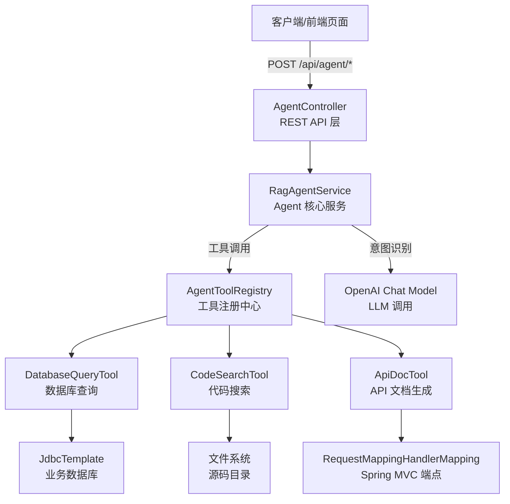
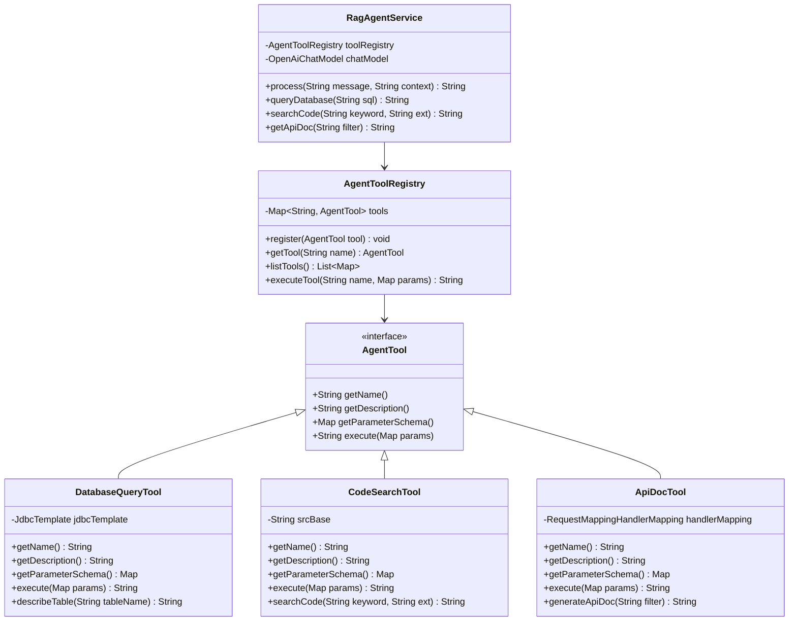
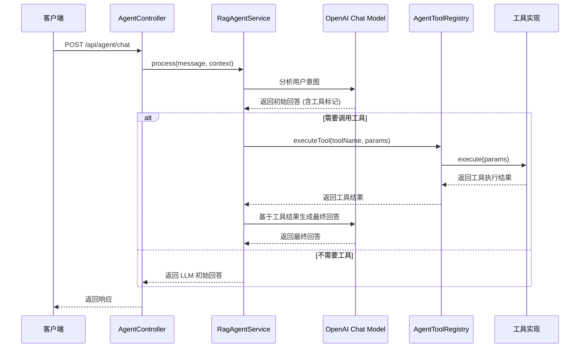

# Agent API

**本文档中引用的文件**
- [AgentController.java](../../../company-rag-web/src/main/java/com/company/rag/web/controller/AgentController.java)
- [RagAgentService.java](../../../company-rag-agent/src/main/java/com/company/rag/agent/service/RagAgentService.java)
- [AgentToolRegistry.java](../../../company-rag-agent/src/main/java/com/company/rag/agent/tool/AgentToolRegistry.java)
- [AgentTool.java](../../../company-rag-agent/src/main/java/com/company/rag/agent/tool/AgentTool.java)
- [DatabaseQueryTool.java](../../../company-rag-agent/src/main/java/com/company/rag/agent/tool/DatabaseQueryTool.java)
- [CodeSearchTool.java](../../../company-rag-agent/src/main/java/com/company/rag/agent/tool/CodeSearchTool.java)
- [ApiDocTool.java](../../../company-rag-agent/src/main/java/com/company/rag/agent/tool/ApiDocTool.java)

## 目录
1. [简介](#简介)
2. [项目架构概览](#项目架构概览)
3. [核心数据模型](#核心数据模型)
4. [API 端点](#api 端点)
5. [Agent 工具系统](#agent 工具系统)
6. [错误处理与异常管理](#错误处理与异常管理)
7. [总结](#总结)

## 简介

- **系统描述**: Agent 模块是企业知识库 RAG 系统的智能工具调用层，基于 Spring AI 实现 LLM 驱动的工具编排能力。通过自然语言交互，系统可自动分析用户意图并调用相应工具（数据库查询、代码搜索、API 文档生成等），实现智能化的企业助手功能。

- **核心功能**:
  - 智能对话：基于 LLM 分析用户意图，自动决策是否调用工具
  - 数据库查询：支持自然语言转 SQL，查询企业业务数据
  - 代码搜索：在项目源码中按关键词和文件类型检索代码
  - API 文档生成：动态扫描 Spring MVC 端点生成接口文档

- **技术架构**: 采用 Controller-Service-Tool 三层架构
  - Controller 层：提供 REST API 接收外部请求
  - Service 层：RagAgentService 实现 Agent 核心逻辑，包括意图识别、工具选择、结果编排
  - Tool 层：各个工具实现 AgentTool 接口，提供具体能力

- **用户角色**: 
  - 业务用户：通过自然语言对话获取业务数据和分析结果
  - 开发人员：使用代码搜索和 API 文档功能辅助开发
  - 系统管理员：监控系统 Agent 工具调用情况

**图表来源**
- [AgentController.java](../../../company-rag-web/src/main/java/com/company/rag/web/controller/AgentController.java)(L13-L43)
- [RagAgentService.java](../../../company-rag-agent/src/main/java/com/company/rag/agent/service/RagAgentService.java)(L29-L144)

## 项目架构概览



**图表来源**
- [AgentController.java](../../../company-rag-web/src/main/java/com/company/rag/web/controller/AgentController.java)
- [RagAgentService.java](../../../company-rag-agent/src/main/java/com/company/rag/agent/service/RagAgentService.java)
- [AgentToolRegistry.java](../../../company-rag-agent/src/main/java/com/company/rag/agent/tool/AgentToolRegistry.java)

## 核心数据模型



**图表来源**
- [AgentTool.java](../../../company-rag-agent/src/main/java/com/company/rag/agent/tool/AgentTool.java)
- [DatabaseQueryTool.java](../../../company-rag-agent/src/main/java/com/company/rag/agent/tool/DatabaseQueryTool.java)
- [CodeSearchTool.java](../../../company-rag-agent/src/main/java/com/company/rag/agent/tool/CodeSearchTool.java)
- [ApiDocTool.java](../../../company-rag-agent/src/main/java/com/company/rag/agent/tool/ApiDocTool.java)
- [AgentToolRegistry.java](../../../company-rag-agent/src/main/java/com/company/rag/agent/tool/AgentToolRegistry.java)
- [RagAgentService.java](../../../company-rag-agent/src/main/java/com/company/rag/agent/service/RagAgentService.java)

### 关键属性说明

**AgentTool 接口**
- `getName()`: 工具唯一标识，如 `database_query`、`code_search`、`api_doc`
- `getDescription()`: 工具功能描述，用于 LLM 理解工具用途
- `getParameterSchema()`: 参数 Schema 定义，遵循 JSON Schema 格式，描述工具接受的参数类型和约束
- `execute(Map params)`: 工具执行方法，接收参数 Map，返回执行结果字符串

**DatabaseQueryTool 安全措施**
- 只允许 SELECT 查询，防止数据修改操作
- SQL 白名单检查，禁止 DROP、DELETE、UPDATE 等危险关键字
- 结果行数限制，默认最多返回 100 行
- 表名验证，只允许字母、数字、下划线组合

**CodeSearchTool 配置**
- `srcBase`: 源码根目录，可通过配置项 `app.code-search.src-base` 覆盖，默认值为 `./src`
- 支持按文件扩展名过滤，如 `.java`
- 关键词匹配不区分大小写

## API 端点

### 客户端访问端点

所有端点基础路径：`/api/agent`

#### 1. 智能聊天接口

**HTTP 方法**: `POST`  
**路径**: `/chat`  
**请求体**:
```json
{
  "message": "查询最近的订单数据",
  "context": "用户希望了解销售情况"
}
```

**响应示例**:
```json
{
  "code": 200,
  "message": "success",
  "data": "根据数据库查询，最近共有 156 个订单..."
}
```

**处理流程**:


**章节来源**
- [AgentController.java](../../../company-rag-web/src/main/java/com/company/rag/web/controller/AgentController.java)(L20-L25)
- [RagAgentService.java](../../../company-rag-agent/src/main/java/com/company/rag/agent/service/RagAgentService.java)(L53-L102)

#### 2. 数据库查询接口

**HTTP 方法**: `POST`  
**路径**: `/query-db`  
**请求体**:
```json
{
  "sql": "SELECT * FROM orders WHERE status = 'COMPLETED'"
}
```

**响应示例**:
```json
{
  "code": 200,
  "message": "success",
  "data": "查询结果（50 行）：\norder_id | user_id | amount | status\n--------------------------------------------------------------------------------\n1001 | 2001 | 299.00 | COMPLETED\n..."
}
```

**权限要求**: 需要业务数据库访问权限

**章节来源**
- [AgentController.java](../../../company-rag-web/src/main/java/com/company/rag/web/controller/AgentController.java)(L27-L30)
- [DatabaseQueryTool.java](../../../company-rag-agent/src/main/java/com/company/rag/agent/tool/DatabaseQueryTool.java)(L62-L91)

#### 3. 代码搜索接口

**HTTP 方法**: `POST`  
**路径**: `/search-code`  
**请求体**:
```json
{
  "keyword": "RagAgentService",
  "fileExtension": ".java"
}
```

**响应示例**:
```json
{
  "code": 200,
  "message": "success",
  "data": "src/main/java/com/company/rag/agent/service/RagAgentService.java: public class RagAgentService {\n..."
}
```

**章节来源**
- [AgentController.java](../../../company-rag-web/src/main/java/com/company/rag/web/controller/AgentController.java)(L32-L37)
- [CodeSearchTool.java](../../../company-rag-agent/src/main/java/com/company/rag/agent/tool/CodeSearchTool.java)(L59-L89)

#### 4. API 文档生成接口

**HTTP 方法**: `GET`  
**路径**: `/api-doc`  
**查询参数**:
- `filter` (可选): 端点名称过滤关键字

**请求示例**: `GET /api/agent/api-doc?filter=rag`

**响应示例**:
```json
{
  "code": 200,
  "message": "success",
  "data": "## API 文档\n  [GET] /api/rag/search -> RagController.search()\n  [POST] /api/rag/chat -> RagController.chat()\n..."
}
```

**章节来源**
- [AgentController.java](../../../company-rag-web/src/main/java/com/company/rag/web/controller/AgentController.java)(L39-L42)
- [ApiDocTool.java](../../../company-rag-agent/src/main/java/com/company/rag/agent/tool/ApiDocTool.java)(L61-L76)

## Agent 工具系统

### 工具注册机制

AgentToolRegistry 通过 Spring 依赖注入自动收集所有实现 AgentTool 接口的组件，并在构造函数中完成注册。工具列表通过 `listTools()` 方法暴露给 LLM，用于意图识别时的工具选择。

**工具注册流程**:
```mermaid
flowchart TD
    A[Spring 容器启动] --> B[扫描@Component 注解]
    B --> C[识别 AgentTool 实现类]
    C --> D[创建 Tool Bean 实例]
    D --> E[注入到 AgentToolRegistry 构造函数]
    E --> F[遍历工具列表调用 register]
    F --> G[工具名称 -> Tool 映射存入 HashMap]
    G --> H[记录日志：已注册 N 个 Agent 工具]
```

**章节来源**
- [AgentToolRegistry.java](../../../company-rag-agent/src/main/java/com/company/rag/agent/tool/AgentToolRegistry.java)(L18-L24)

### 工具调用编排

RagAgentService 实现了两阶段调用流程：

1. **意图识别阶段**: 将用户消息和工具描述发送给 LLM，让其分析是否需要调用工具
2. **工具执行阶段**: 如果 LLM 返回包含 `[USE_TOOL:工具名]` 标记，则执行对应工具并基于结果生成最终回答

**Agent 系统提示词模板**:
```
你是一个智能企业助手，拥有以下工具可以使用：

{工具列表描述}

当用户的问题需要使用工具时，请在回答中标注 [USE_TOOL:工具名] 并说明理由。
当不需要工具时，直接回答用户问题。
回答要简洁专业。
```

**章节来源**
- [RagAgentService.java](../../../company-rag-agent/src/main/java/com/company/rag/agent/service/RagAgentService.java)(L37-L45)

### 工具详情

#### DatabaseQueryTool

**功能**: 查询企业业务数据库，获取订单、用户、产品等业务数据

**参数 Schema**:
```json
{
  "type": "object",
  "properties": {
    "sql": {
      "type": "string",
      "description": "SQL 查询语句（仅支持 SELECT）"
    },
    "limit": {
      "type": "integer",
      "description": "返回行数限制（默认 100）",
      "default": 100
    }
  },
  "required": ["sql"]
}
```

**安全检查**:
- 只允许 SELECT 查询
- 禁止危险关键字：DROP、DELETE、UPDATE、INSERT、TRUNCATE、ALTER 等
- 自动添加 LIMIT 限制（最多 100 行）
- 表名验证：只允许字母、数字、下划线

**章节来源**
- [DatabaseQueryTool.java](../../../company-rag-agent/src/main/java/com/company/rag/agent/tool/DatabaseQueryTool.java)(L11-L165)

#### CodeSearchTool

**功能**: 在项目源码目录中搜索代码片段，支持按关键词和文件类型过滤

**参数 Schema**:
```json
{
  "type": "object",
  "properties": {
    "keyword": {
      "type": "string",
      "description": "搜索关键词"
    },
    "ext": {
      "type": "string",
      "description": "文件扩展名过滤（如 .java），可选"
    }
  },
  "required": ["keyword"]
}
```

**配置项**:
- `app.code-search.src-base`: 源码根目录，默认值 `./src`

**章节来源**
- [CodeSearchTool.java](../../../company-rag-agent/src/main/java/com/company/rag/agent/tool/CodeSearchTool.java)(L15-L90)

#### ApiDocTool

**功能**: 动态扫描 Spring MVC 端点生成 API 文档，获取当前系统的所有 REST 接口信息

**参数 Schema**:
```json
{
  "type": "object",
  "properties": {
    "filter": {
      "type": "string",
      "description": "端点名称过滤关键字（可选）"
    }
  }
}
```

**实现原理**: 使用 `RequestMappingHandlerMapping` 获取所有已注册的请求映射，提取 HTTP 方法、路径模式、处理方法等信息。

**章节来源**
- [ApiDocTool.java](../../../company-rag-agent/src/main/java/com/company/rag/agent/tool/ApiDocTool.java)(L13-L77)

## 错误处理与异常管理

### 异常类型分类

| 异常场景 | 处理方式 | 返回消息 |
|---------|---------|---------|
| 工具不存在 | AgentToolRegistry 检查 | `错误：工具不存在：{toolName}` |
| 工具执行异常 | try-catch 捕获 | `工具执行失败：{errorMessage}` |
| SQL 包含危险关键字 | 白名单检查 | `错误：SQL 包含禁止的操作` |
| 非 SELECT 查询 | SQL 前缀检查 | `错误：仅支持 SELECT 查询` |
| 非法表名 | 正则验证 | `错误：非法表名` |
| 数据库查询失败 | 捕获 JDBC 异常 | `查询失败：{errorMessage}` |
| 代码搜索失败 | 捕获 IO 异常 | `代码搜索失败：{errorMessage}` |
| 关键词为空 | 参数校验 | `错误：搜索关键词不能为空` |

### 错误响应格式

所有 API 端点统一返回 `R<String>` 格式，错误信息通过 data 字段传递：

```json
{
  "code": 200,
  "message": "success",
  "data": "错误：仅支持 SELECT 查询"
}
```

**章节来源**
- [DatabaseQueryTool.java](../../../company-rag-agent/src/main/java/com/company/rag/agent/tool/DatabaseQueryTool.java)(L68-L90)
- [CodeSearchTool.java](../../../company-rag-agent/src/main/java/com/company/rag/agent/tool/CodeSearchTool.java)(L59-L89)
- [AgentToolRegistry.java](../../../company-rag-agent/src/main/java/com/company/rag/agent/tool/AgentToolRegistry.java)(L57-L70)

### 日志记录

关键操作均记录日志便于排查问题：

- 工具注册：`已注册{}个 Agent 工具：{}`
- 工具执行：`执行 Agent 工具：{} | params={}`
- 工具执行失败：`工具执行失败：{} | error={}`
- 数据库查询：`Agent 执行数据库查询：{}`
- 数据库查询失败：`数据库查询失败：{}`
- 代码搜索失败：记录 IO 异常
- 危险 SQL 关键字：`检测到危险 SQL 关键字：{}`

**章节来源**
- [AgentToolRegistry.java](../../../company-rag-agent/src/main/java/com/company/rag/agent/tool/AgentToolRegistry.java)(L23-L67)
- [DatabaseQueryTool.java](../../../company-rag-agent/src/main/java/com/company/rag/agent/tool/DatabaseQueryTool.java)(L84-L126)

## 总结

### 主要特点

1. **LLM 驱动的智能编排**: 基于 Spring AI 和通义千问模型，实现自然语言意图识别和工具自动选择
2. **工具注册机制**: 通过 Spring 依赖注入自动发现和注册工具，支持扩展
3. **多层安全防护**: 数据库查询工具实施 SQL 白名单、危险关键字过滤、行数限制等多重保护
4. **统一响应格式**: 所有 API 端点返回 `R<String>` 格式，便于前端处理
5. **完善的错误处理**: 各类异常场景均有明确错误消息和日志记录

### 技术亮点

1. **Agent 模式实现**: 两阶段调用流程（意图识别 → 工具执行 → 结果编排）
2. **动态 API 文档**: 基于 RequestMappingHandlerMapping 实时扫描端点
3. **文件系统搜索**: 使用 Java NIO Files.walk 实现高效的代码搜索
4. **参数 Schema 定义**: 遵循 JSON Schema 格式，便于 LLM 理解工具参数
5. **配置可扩展**: 源码根目录等参数可通过配置文件覆盖

### 业务价值

Agent 模块为企业知识库 RAG 系统提供了智能化的工具调用能力，使得用户可以通过自然语言交互获取业务数据、搜索代码、生成文档等，大幅降低了系统使用门槛，提升了信息获取效率。同时，通过严格的安全措施和错误处理机制，确保了系统的稳定性和数据安全性。
