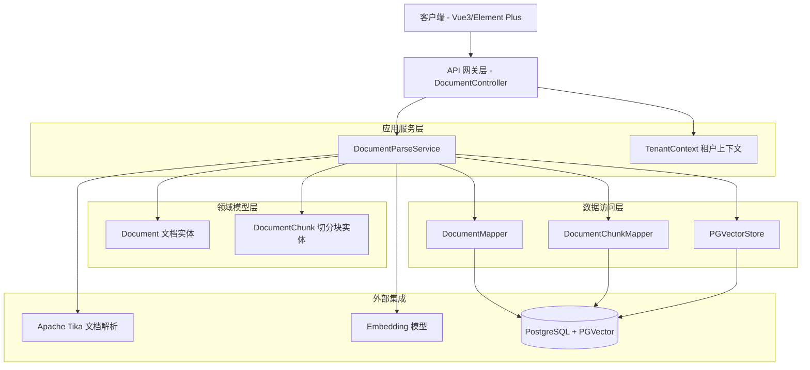
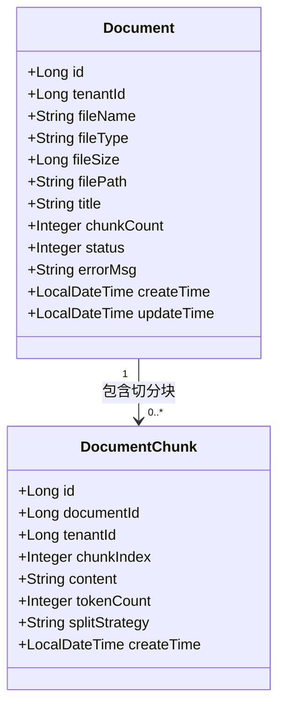
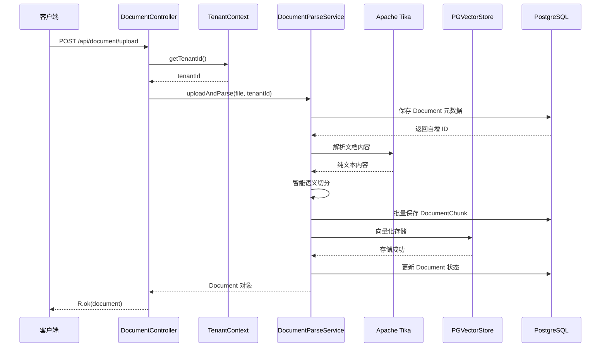
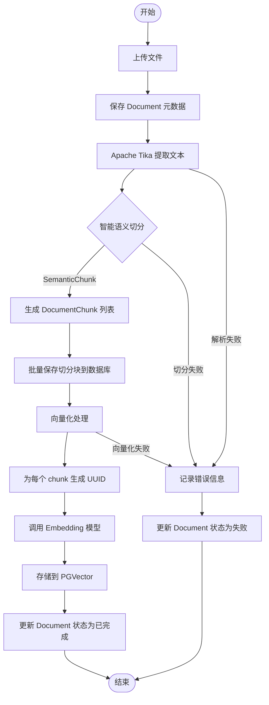
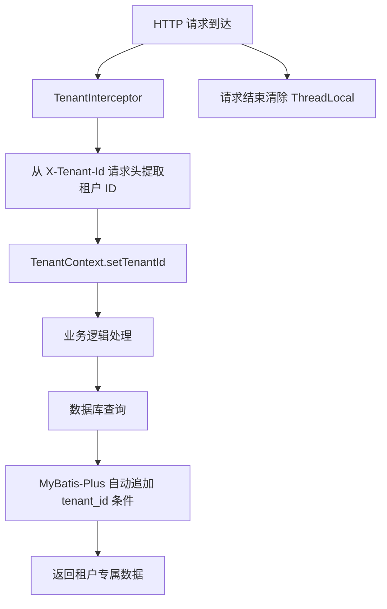

# 文档管理 API

**本文档中引用的文件**
- [DocumentController.java](../../../company-rag-web/src/main/java/com/company/rag/web/controller/DocumentController.java)
- [Document.java](../../../company-rag-document/src/main/java/com/company/rag/document/entity/Document.java)
- [DocumentChunk.java](../../../company-rag-document/src/main/java/com/company/rag/document/entity/DocumentChunk.java)
- [DocumentParseService.java](../../../company-rag-document/src/main/java/com/company/rag/document/service/DocumentParseService.java)
- [DocumentParseServiceImpl.java](../../../company-rag-document/src/main/java/com/company/rag/document/service/impl/DocumentParseServiceImpl.java)
- [TenantContext.java](../../../company-rag-tenant/src/main/java/com/company/rag/tenant/context/TenantContext.java)
- [README.md](../../../README.md)

## 目录
1. [简介](#简介)
2. [项目架构概览](#项目架构概览)
3. [核心数据模型](#核心数据模型)
4. [API 端点](#api 端点)
5. [文档处理流程](#文档处理流程)
6. [多租户隔离机制](#多租户隔离机制)
7. [错误处理与异常管理](#错误处理与异常管理)
8. [性能考虑](#性能考虑)
9. [总结](#总结)

## 简介

- **系统描述**: 文档管理 API 是企业知识库 RAG 系统的核心入口，负责文档的上传、解析、切分和向量化存储。该模块将用户上传的各类文档（PDF/DOCX/TXT/MD/HTML）自动处理为向量化的知识块，存储到 PGVector 中供后续检索使用。
- **核心功能**: 
  - 文档上传与自动解析
  - 智能语义切分
  - 向量化存储
  - 多租户隔离管理
- **技术架构**: 基于 Spring Boot 3.4 + Spring AI 1.0，使用 Apache Tika 进行文档解析，PGVector 进行向量存储
- **用户角色**: 系统管理员、知识库管理员、普通用户（通过多租户隔离）

## 项目架构概览



**图表来源**: 
- 控制器层：[DocumentController.java](../../../company-rag-web/src/main/java/com/company/rag/web/controller/DocumentController.java)(L16-L43)
- 服务层：[DocumentParseServiceImpl.java](../../../company-rag-document/src/main/java/com/company/rag/document/service/impl/DocumentParseServiceImpl.java)(L37-L211)
- 数据模型：[Document.java](../../../company-rag-document/src/main/java/com/company/rag/document/entity/Document.java)、[DocumentChunk.java](../../../company-rag-document/src/main/java/com/company/rag/document/entity/DocumentChunk.java)

## 核心数据模型



### 关键属性说明

**Document 文档元数据**
- `id`: 文档自增主键
- `tenantId`: 租户 ID，用于多租户隔离
- `fileName`: 原始文件名
- `fileType`: 文件类型（pdf/docx/txt/md/html）
- `fileSize`: 文件大小（字节）
- `filePath`: 文件存储路径
- `title`: 文档标题
- `chunkCount`: 切分后的块数量
- `status`: 处理状态（0-待处理 1-处理中 2-已完成 3-失败）
- `errorMsg`: 处理失败的错误信息

**DocumentChunk 文档切分块**
- `id`: 切分块自增主键
- `documentId`: 关联的文档 ID
- `tenantId`: 租户 ID（冗余字段，便于查询）
- `chunkIndex`: 块序号，标识在文档中的位置
- `content`: 切分块的文本内容
- `tokenCount`: Token 数量（用于成本统计）
- `splitStrategy`: 使用的切分策略名称

**章节来源**: [Document.java](../../../company-rag-document/src/main/java/com/company/rag/document/entity/Document.java)(L11-L29)、[DocumentChunk.java](../../../company-rag-document/src/main/java/com/company/rag/document/entity/DocumentChunk.java)(L11-L24)

## API 端点

### 客户端访问端点

#### 1. 上传并解析文档



**HTTP 请求示例**
```http
POST /api/document/upload
Content-Type: multipart/form-data
X-Tenant-Id: 1

file: @document.pdf
```

**请求参数**
| 参数名 | 类型 | 必填 | 说明 |
|--------|------|------|------|
| file | MultipartFile | 是 | 待上传的文档文件 |
| X-Tenant-Id | Long | 否 | 租户 ID（从请求头获取，默认 1） |

**响应示例**
```json
{
  "code": 200,
  "message": "success",
  "data": {
    "id": 1,
    "tenantId": 1,
    "fileName": "product-manual.pdf",
    "fileType": "pdf",
    "fileSize": 1048576,
    "filePath": "/uploads/2024/01/product-manual.pdf",
    "title": "产品手册",
    "chunkCount": 15,
    "status": 2,
    "errorMsg": null,
    "createTime": "2024-01-15T10:30:00",
    "updateTime": "2024-01-15T10:30:05"
  }
}
```

**状态码说明**
- `200`: 上传成功
- `400`: 请求参数错误
- `500`: 服务器内部错误（文档解析失败等）

#### 2. 获取文档列表

**HTTP 请求示例**
```http
GET /api/document/list
X-Tenant-Id: 1
```

**请求参数**
| 参数名 | 类型 | 必填 | 说明 |
|--------|------|------|------|
| X-Tenant-Id | Long | 否 | 租户 ID（从请求头获取） |

**响应示例**
```json
{
  "code": 200,
  "message": "success",
  "data": [
    {
      "id": 1,
      "tenantId": 1,
      "fileName": "product-manual.pdf",
      "fileType": "pdf",
      "fileSize": 1048576,
      "chunkCount": 15,
      "status": 2,
      "createTime": "2024-01-15T10:30:00"
    },
    {
      "id": 2,
      "tenantId": 1,
      "fileName": "faq.md",
      "fileType": "md",
      "fileSize": 2048,
      "chunkCount": 5,
      "status": 2,
      "createTime": "2024-01-14T09:00:00"
    }
  ]
}
```

**章节来源**: [DocumentController.java](../../../company-rag-web/src/main/java/com/company/rag/web/controller/DocumentController.java)(L23-L42)

## 文档处理流程



### 处理步骤详解

1. **保存文档元数据**: 先插入 `rag_document` 表，获取自增 ID 用于后续关联
2. **文本提取**: 使用 Apache Tika 自动识别文件类型并提取纯文本内容
3. **智能切分**: 采用语义切分策略（默认 512 字符，重叠 64 字符）
4. **保存切分块**: 批量插入 `doc_chunk` 表
5. **向量化存储**: 
   - 为每个 chunk 生成 UUID（Spring AI PgVectorStore 要求）
   - 调用 Embedding 模型生成 1024 维向量
   - 存储到 PGVector 的 `vector_store` 表
6. **更新状态**: 将文档状态更新为"已完成"

**章节来源**: [DocumentParseServiceImpl.java](../../../company-rag-document/src/main/java/com/company/rag/document/service/impl/DocumentParseServiceImpl.java)(L48-L210)

## 多租户隔离机制

### 租户上下文管理

系统使用 `ThreadLocal` 存储当前请求的租户信息，确保多线程环境下的租户隔离。



### 租户隔离实现

1. **请求头传递**: 客户端通过 `X-Tenant-Id` 请求头传递租户 ID
2. **拦截器设置**: `TenantInterceptor` 在请求开始时设置 `TenantContext`
3. **自动隔离**: MyBatis-Plus 租户拦截器自动在 SQL 中追加 `tenant_id` 条件
4. **请求清理**: 请求结束时清除 `ThreadLocal` 防止内存泄漏

**代码示例**:
```java
// DocumentController.java (L25-L29)
Long tenantId = TenantContext.getTenantId();
if (tenantId == null) {
    tenantId = 1L; // 默认租户 ID（用于开发环境）
}
```

**章节来源**: [TenantContext.java](../../../company-rag-tenant/src/main/java/com/company/rag/tenant/context/TenantContext.java)(L6-L28)、[DocumentController.java](../../../company-rag-web/src/main/java/com/company/rag/web/controller/DocumentController.java)(L25-L29)

## 错误处理与异常管理

### 异常类型分类

| 异常类型 | 触发场景 | 处理策略 |
|----------|----------|----------|
| `TikaException` | 文档解析失败 | 记录错误日志，更新文档状态为失败 |
| `IOException` | 文件读写失败 | 记录错误日志，更新文档状态为失败 |
| `RuntimeException` | 向量化失败等 | 记录错误日志，更新文档状态为失败 |

### 错误响应格式

```json
{
  "code": 500,
  "message": "文档解析失败：PDF 文件损坏",
  "data": {
    "id": 1,
    "fileName": "corrupted.pdf",
    "status": -1,
    "errorMsg": "文档解析失败：PDF 文件损坏"
  }
}
```

### 状态码说明

| HTTP 状态码 | 说明 |
|-------------|------|
| 200 | 请求成功 |
| 400 | 请求参数错误（如文件为空） |
| 413 | 文件过大（超过服务器限制） |
| 500 | 服务器内部错误（解析失败、向量化失败等） |

**章节来源**: [DocumentParseServiceImpl.java](../../../company-rag-document/src/main/java/com/company/rag/document/service/impl/DocumentParseServiceImpl.java)(L89-L95)

## 性能考虑

### 缓存策略

- **两级缓存**: Redis + 热点检测，避免重复向量化计算
- **文档去重**: 相同文件内容可直接复用已有向量结果（根据业务需求扩展）

### 分页优化

- **文档列表查询**: 按 `create_time` 倒序排列，支持分页查询
- **批量插入**: 切分块使用批量插入，减少数据库交互次数

### 并发控制

- **事务保护**: `@Transactional` 确保文档处理流程的原子性
- **异步处理**: 可将耗时的向量化操作改为异步执行（当前为同步实现）
- **熔断保护**: 外部 LLM 调用配置了 Resilience4j 熔断器

### Token 成本优化

1. **语义切分**: 减少冗余块，提升 Token 利用率
2. **智能重叠**: 切分时保持语义完整性，避免信息断裂
3. **动态 Top-K**: 根据查询复杂度调整检索数量

**章节来源**: [README.md](../../../README.md)(L50-L86)、[DocumentParseServiceImpl.java](../../../company-rag-document/src/main/java/com/company/rag/document/service/impl/DocumentParseServiceImpl.java)(L49-L50)

## 总结

### 主要特点

1. **自动化处理**: 从上传到向量化全自动流程，无需人工干预
2. **多租户隔离**: 基于 ThreadLocal 和 MyBatis-Plus 实现租户数据隔离
3. **智能切分**: 支持语义切分、滑动窗口、固定大小三种策略
4. **状态追踪**: 完整的文档处理状态追踪和错误信息记录
5. **可扩展性**: 模块化设计，易于扩展新的文档类型和切分策略

### 技术亮点

1. **Apache Tika 集成**: 自动识别多种文档格式并提取纯文本
2. **PGVector 向量存储**: 使用 HNSW 索引和余弦距离，支持高效相似度检索
3. **UUID 生成策略**: 为每个切分块生成独立 UUID，满足 Spring AI 要求
4. **事务管理**: 完整的数据库事务保护，确保数据一致性
5. **错误恢复**: 处理失败时自动更新状态并记录错误信息

### 业务价值

文档管理 API 作为 RAG 系统的数据入口，将企业各类非结构化文档（产品手册、FAQ、技术文档等）自动转换为可向量化检索的知识库，为后续的智能问答、知识检索提供了坚实的数据基础。多租户架构设计使得系统能够服务于多个企业客户，实现 SaaS 化运营。

---

**文档版本**: 1.0  
**最后更新**: 2026-07-19  
**维护者**: CompanyRag 团队
