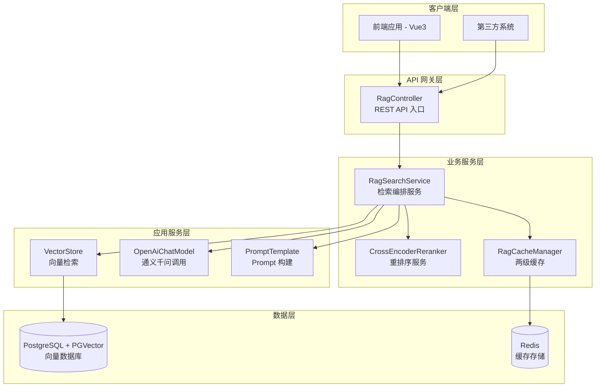
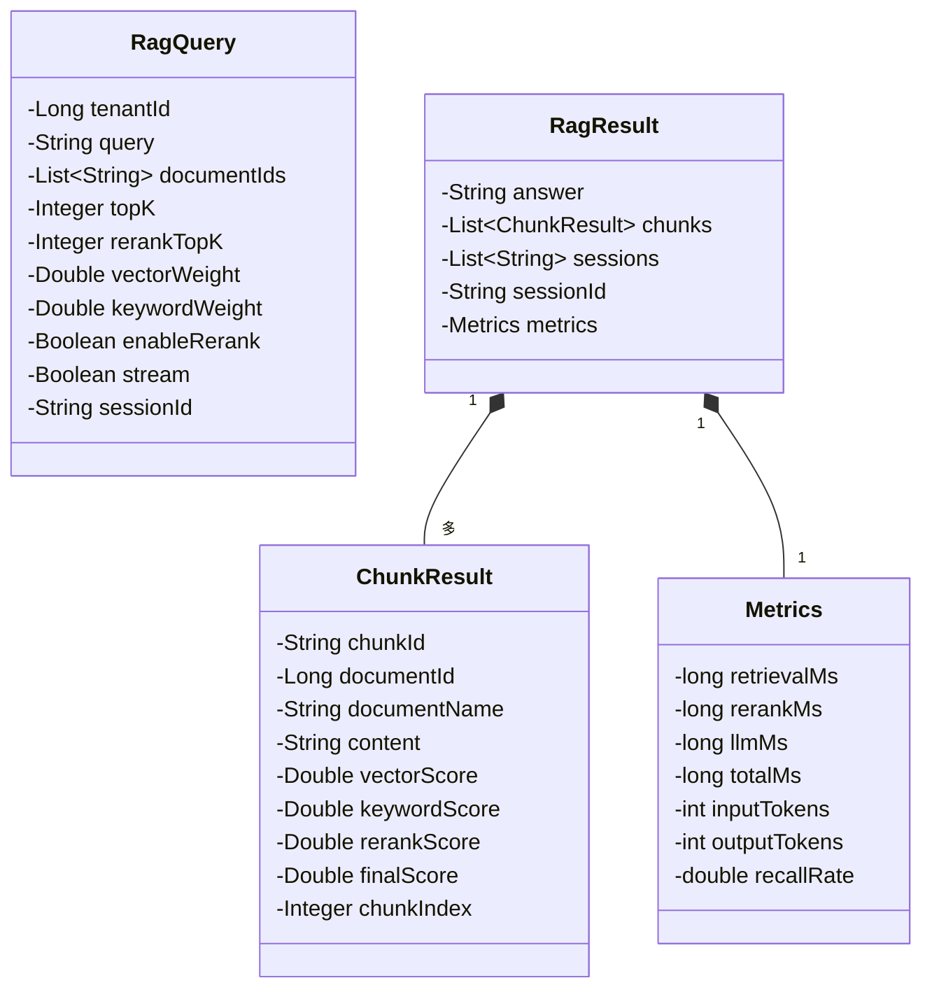
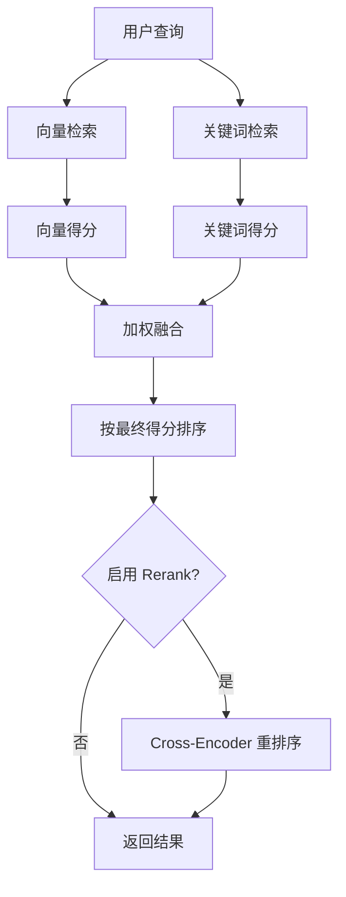
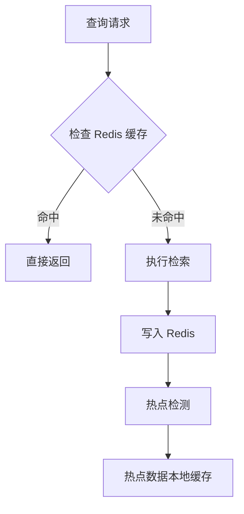

# RAG API

**本文档中引用的文件**
- [RagController.java](../../../company-rag-web/src/main/java/com/company/rag/web/controller/RagController.java)
- [RagQuery.java](../../../company-rag-rag/src/main/java/com/company/rag/rag/model/RagQuery.java)
- [RagResult.java](../../../company-rag-rag/src/main/java/com/company/rag/rag/model/RagResult.java)
- [RagSearchService.java](../../../company-rag-rag/src/main/java/com/company/rag/rag/service/RagSearchService.java)
- [RagSearchServiceImpl.java](../../../company-rag-rag/src/main/java/com/company/rag/rag/service/impl/RagSearchServiceImpl.java)
- [项目概述.md](../项目概述.md)

## 目录
1. [简介](#简介)
2. [项目架构概览](#项目架构概览)
3. [核心数据模型](#核心数据模型)
4. [API 端点](#api 端点)
5. [混合检索与 Rerank](#混合检索与 rerank)
6. [缓存机制](#缓存机制)
7. [错误处理与异常管理](#错误处理与异常管理)
8. [性能考虑](#性能考虑)
9. [总结](#总结)

## 简介

- **系统描述**: RAG 检索接口是企业知识库 RAG 系统的核心 API 层，负责接收用户查询请求，执行混合检索（向量 + 关键词）、重排序、LLM 调用，并返回智能答案。来源：[RagController.java](../../../company-rag-web/src/main/java/com/company/rag/web/controller/RagController.java)(L12-L37)
- **核心功能**:
  1. **标准检索**: 执行完整的 RAG 流程（检索 + Rerank + LLM），返回结构化答案
  2. **流式回答**: 基于 SSE 的流式输出，提升用户体验
  3. **纯检索**: 仅执行文档检索，不调用 LLM，适用于需要自定义处理场景
- **技术架构**: 基于 Spring Boot 3.4 + Spring AI 1.0，采用 RESTful 风格设计，支持多租户隔离。来源：[项目概述.md](../项目概述.md)(L25-L44)
- **用户角色**: 面向前端应用、第三方系统集成、管理员调试等场景。

## 项目架构概览

### 架构图



**图表来源**
- [RagController.java](../../../company-rag-web/src/main/java/com/company/rag/web/controller/RagController.java)(L15-L37)
- [RagSearchServiceImpl.java](../../../company-rag-rag/src/main/java/com/company/rag/rag/service/impl/RagSearchServiceImpl.java)(L27-L269)

## 核心数据模型

### 类图展示



### 关键属性说明

#### RagQuery - 查询参数

| 字段 | 类型 | 说明 | 默认值 |
|------|------|------|--------|
| tenantId | Long | 租户 ID，用于多租户隔离 | - |
| query | String | 用户查询问题 | - |
| documentIds | List~String~ | 限定检索文档范围（可选） | - |
| topK | Integer | 初始检索返回条数 | 10 |
| rerankTopK | Integer | Rerank 后保留条数 | 5 |
| vectorWeight | Double | 向量检索权重（混合检索用） | 0.5 |
| keywordWeight | Double | 关键词检索权重 | 0.5 |
| enableRerank | Boolean | 是否启用 Rerank | true |
| stream | Boolean | 是否流式输出 | false |
| sessionId | String | 会话 ID，用于对话历史 | - |

来源：[RagQuery.java](../../../company-rag-rag/src/main/java/com/company/rag/rag/model/RagQuery.java)(L7-L22)

#### RagResult - 检索结果

| 字段 | 类型 | 说明 |
|------|------|------|
| answer | String | LLM 生成的回答 |
| chunks | List~ChunkResult~ | 引用的文档块列表 |
| sessions | List~String~ | 引用来源说明 |
| sessionId | String | 会话 ID |
| metrics | Metrics | 性能指标 |

来源：[RagResult.java](../../../company-rag-rag/src/main/java/com/company/rag/rag/model/RagResult.java)(L7-L16)

#### ChunkResult - 文档块结果

| 字段 | 类型 | 说明 |
|------|------|------|
| chunkId | String | 文档块 ID |
| documentId | Long | 所属文档 ID |
| documentName | String | 文档名称 |
| content | String | 文档块内容 |
| vectorScore | Double | 向量检索得分 |
| keywordScore | Double | 关键词检索得分 |
| rerankScore | Double | Rerank 得分 |
| finalScore | Double | 最终融合得分 |
| chunkIndex | Integer | 块索引位置 |

来源：[RagResult.java](../../../company-rag-rag/src/main/java/com/company/rag/rag/model/RagResult.java)(L18-L29)

#### Metrics - 性能指标

| 字段 | 类型 | 说明 |
|------|------|------|
| retrievalMs | long | 检索耗时（毫秒） |
| rerankMs | long | 重排序耗时（毫秒） |
| llmMs | long | LLM 调用耗时（毫秒） |
| totalMs | long | 总耗时（毫秒） |
| inputTokens | int | 输入 Token 数 |
| outputTokens | int | 输出 Token 数 |
| recallRate | double | 召回率 |

来源：[RagResult.java](../../../company-rag-rag/src/main/java/com/company/rag/rag/model/RagResult.java)(L31-L40)

## API 端点

### 标准检索接口

**端点**: `POST /api/rag/search`

**请求示例**:
```json
{
  "tenantId": 1,
  "query": "如何配置多租户？",
  "documentIds": ["doc-001", "doc-002"],
  "topK": 10,
  "rerankTopK": 5,
  "vectorWeight": 0.5,
  "keywordWeight": 0.5,
  "enableRerank": true,
  "sessionId": "session-123"
}
```

**响应示例**:
```json
{
  "code": 200,
  "data": {
    "answer": "多租户配置需要...",
    "chunks": [
      {
        "chunkId": "chunk-001",
        "documentId": 1,
        "documentName": "租户配置手册",
        "content": "多租户架构采用 Schema 隔离...",
        "vectorScore": 0.85,
        "keywordScore": 0.75,
        "rerankScore": 0.90,
        "finalScore": 0.88,
        "chunkIndex": 3
      }
    ],
    "sessions": ["租户配置手册 (第 3 段)"],
    "sessionId": "session-123",
    "metrics": {
      "retrievalMs": 45,
      "rerankMs": 120,
      "llmMs": 800,
      "totalMs": 965,
      "inputTokens": 512,
      "outputTokens": 256,
      "recallRate": 0.92
    }
  }
}
```

**章节来源**
- [RagController.java](../../../company-rag-web/src/main/java/com/company/rag/web/controller/RagController.java)(L22-L25)
- [RagSearchServiceImpl.java](../../../company-rag-rag/src/main/java/com/company/rag/rag/service/impl/RagSearchServiceImpl.java)(L40-L109)

---

### 流式回答接口

**端点**: `POST /api/rag/stream`

**请求参数**: 与标准检索相同，自动设置 `stream=true`

**响应格式**: `text/event-stream` (SSE 流式)

**响应示例**:
```
data: 多

data: 租

data: 户

data: 配

data: 置

data: ...
```

**特性说明**:
- 采用 Server-Sent Events (SSE) 协议
- LLM 流式输出，实时返回生成的文本
- 30 秒超时保护，防止请求 hang 住
- 支持熔断降级，异常时返回友好提示

**章节来源**
- [RagController.java](../../../company-rag-web/src/main/java/com/company/rag/web/controller/RagController.java)(L27-L31)
- [RagSearchServiceImpl.java](../../../company-rag-rag/src/main/java/com/company/rag/rag/service/impl/RagSearchServiceImpl.java)(L137-L174)

---

### 纯检索接口

**端点**: `POST /api/rag/retrieve`

**请求参数**: 与标准检索相同

**响应示例**:
```json
{
  "code": 200,
  "data": [
    {
      "chunkId": "chunk-001",
      "documentId": 1,
      "documentName": "租户配置手册",
      "content": "多租户架构采用 Schema 隔离...",
      "vectorScore": 0.85,
      "keywordScore": 0.75,
      "rerankScore": 0.90,
      "finalScore": 0.88,
      "chunkIndex": 3
    }
  ]
}
```

**使用场景**:
- 需要自定义 LLM 调用逻辑
- 仅需检索相关文档块，不生成答案
- 用于调试或中间结果展示

**章节来源**
- [RagController.java](../../../company-rag-web/src/main/java/com/company/rag/web/controller/RagController.java)(L33-L36)
- [RagSearchServiceImpl.java](../../../company-rag-rag/src/main/java/com/company/rag/rag/service/impl/RagSearchServiceImpl.java)(L184-L193)

## 混合检索与 Rerank

### 检索流程图



### 混合检索策略

**向量检索**: 使用 Spring AI VectorStore 执行相似度搜索，基于 PGVector 的 HNSW 索引，余弦距离算法。

**关键词检索**: 简单 BM25 风格评分，计算查询词项在文档块中的匹配比例。

**加权融合公式**:
```
finalScore = vectorWeight * vectorScore + keywordWeight * keywordScore
```

默认权重各为 0.5，可通过 `RagQuery` 参数调整。

### Rerank 重排序

采用 Cross-Encoder 模型对检索结果进行精排，提升 Top-K 准确率（15-30%）。

**章节来源**
- [RagSearchServiceImpl.java](../../../company-rag-rag/src/main/java/com/company/rag/rag/service/impl/RagSearchServiceImpl.java)(L195-L250)

## 缓存机制

### 两级缓存架构



### 缓存键生成

使用租户 ID + 查询文本作为缓存键，避免 hashCode() 冲突：
```java
String cacheKey = tenantId + ":" + query.trim().toLowerCase();
```

### 缓存命中统计

通过 `RagMetricsRecorder` 记录缓存命中率，用于性能监控和优化。

**章节来源**
- [RagSearchServiceImpl.java](../../../company-rag-rag/src/main/java/com/company/rag/rag/service/impl/RagSearchServiceImpl.java)(L44-L52, L103-L107)

## 错误处理与异常管理

### 异常类型分类

| 异常类型 | 触发场景 | 处理方式 |
|----------|----------|----------|
| 熔断触发 | LLM 调用失败率超过 50% | 返回降级响应 |
| 限流触发 | 每秒请求超过 10 次 | 返回降级响应 |
| 超时异常 | LLM 调用超过 30 秒 | 返回超时提示 |
| 检索异常 | 向量数据库连接失败 | 返回空结果集 |

### 降级响应

**标准检索降级**:
```json
{
  "answer": "服务暂时繁忙，请稍后重试。",
  "chunks": [],
  "sessions": [],
  "metrics": {
    "totalMs": 0
  }
}
```

**流式回答降级**:
```
data: 服务暂时繁忙，请稍后重试。
```

### 熔断配置

基于 Resilience4j CircuitBreaker：
- 滑动窗口大小：10 次
- 失败率阈值：50%
- 熔断恢复等待：30 秒

来源：[application.yml](../../../company-rag-bootstrap/src/main/resources/application.yml)(L64-L71)

### 限流配置

基于 Resilience4j RateLimiter：
- 每租户每秒：10 次请求
- 超时时间：500ms

来源：[application.yml](../../../company-rag-bootstrap/src/main/resources/application.yml)(L72-L77)

**章节来源**
- [RagSearchServiceImpl.java](../../../company-rag-rag/src/main/java/com/company/rag/rag/service/impl/RagSearchServiceImpl.java)(L111-L135, L176-L182)

## 性能考虑

### 缓存策略

- **Redis 缓存**: 存储历史查询结果，减少重复计算
- **热点检测**: 识别高频查询，提升响应速度
- **缓存失效**: 文档更新时自动失效相关缓存

### 分页优化

- **topK 动态调整**: 根据查询复杂度调整检索数量
- **Rerank 截断**: 仅对 Top-K 结果重排序，降低计算成本

### 并发控制

- **限流保护**: 每租户每秒 10 次请求，防止过载
- **熔断保护**: LLM 调用失败率超 50% 自动熔断
- **超时控制**: 流式回答 30 秒超时，防止资源占用

### Token 成本优化

- **语义切分**: 减少冗余块，提升 Token 利用率
- **Prompt 压缩**: 去除低价值上下文
- **动态 Top-K**: 根据场景调整检索数量

**章节来源**
- [RagSearchServiceImpl.java](../../../company-rag-rag/src/main/java/com/company/rag/rag/service/impl/RagSearchServiceImpl.java)(L40-L109)
- [项目概述.md](../项目概述.md)(L203-L225)

## 总结

### 主要特点

1. **三种接口模式**: 标准检索、流式回答、纯检索，满足不同场景需求
2. **混合检索策略**: 向量 + 关键词加权融合，提升召回率
3. **智能重排序**: Cross-Encoder Rerank，准确率提升 15-30%
4. **两级缓存机制**: Redis + 热点检测，降低响应延迟
5. **工程级保障**: 熔断、限流、超时控制，确保系统稳定性

### 技术亮点

1. **Spring AI 集成**: 基于 Spring AI 1.0，支持通义千问模型
2. **PGVector 向量库**: HNSW 索引，1024 维，余弦距离
3. **响应式流式输出**: Reactor Flux 实现 SSE 流式回答
4. **Resilience4j 保护**: 熔断限流，提升系统韧性
5. **可观测性埋点**: Prometheus 指标，监控检索性能

### 业务价值

RAG 检索接口是企业知识库系统的核心能力，通过智能检索和生成，帮助用户快速获取所需信息，降低知识获取成本，提升工作效率。系统支持多租户隔离，适用于 SaaS 场景，可服务于多个企业客户。

---

**文档版本**: 1.0  
**最后更新**: 2026-07-19  
**维护团队**: CompanyRag 开发团队
