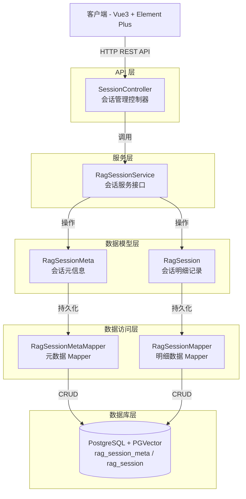
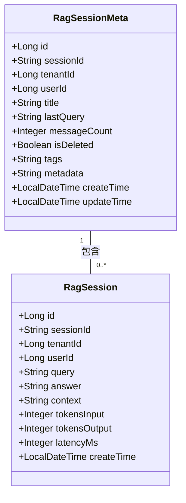
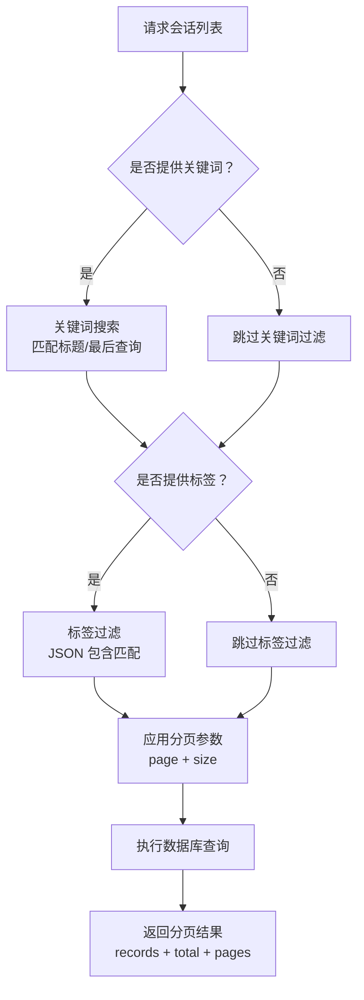

# 会话管理 API

**本文档中引用的文件**
- [SessionController.java](../../../company-rag-web/src/main/java/com/company/rag/web/controller/SessionController.java)
- [SessionCreateRequest.java](../../../company-rag-web/src/main/java/com/company/rag/web/model/SessionCreateRequest.java)
- [SessionUpdateRequest.java](../../../company-rag-web/src/main/java/com/company/rag/web/model/SessionUpdateRequest.java)
- [RagSession.java](../../../company-rag-rag/src/main/java/com/company/rag/rag/entity/RagSession.java)
- [RagSessionMeta.java](../../../company-rag-rag/src/main/java/com/company/rag/rag/entity/RagSessionMeta.java)
- [RagSessionService.java](../../../company-rag-rag/src/main/java/com/company/rag/rag/service/RagSessionService.java)

## 目录
1. [简介](#简介)
2. [项目架构概览](#项目架构概览)
3. [核心数据模型](#核心数据模型)
4. [API 端点](#api 端点)
5. [分页与搜索功能](#分页与搜索功能)
6. [错误处理与异常管理](#错误处理与异常管理)
7. [性能考虑](#性能考虑)
8. [总结](#总结)

## 简介

- **系统描述**: 会话管理模块是 CompanyRag 企业知识库 RAG 系统的核心组件之一，负责管理用户与 RAG 系统的对话会话。它提供会话的创建、查询、更新和删除功能，支持分页浏览和关键词搜索，帮助用户高效管理历史对话记录。
- **核心功能**: 
  - 创建新会话
  - 获取会话列表（支持分页和搜索）
  - 查看会话详情（包含完整对话记录）
  - 更新会话信息（标题和标签）
  - 软删除会话
- **技术架构**: 基于 Spring Boot 3.4 + MyBatis-Plus 构建，采用 RESTful API 设计风格，支持多租户隔离（通过 `X-Tenant-Id` 请求头传递租户 ID）。
- **用户角色**: 主要面向企业知识库的终端用户，支持普通用户管理个人对话历史，管理员可进行全局会话管理。

## 项目架构概览



**图表来源**
- [SessionController.java](../../../company-rag-web/src/main/java/com/company/rag/web/controller/SessionController.java)(L18-L82)
- [RagSessionService.java](../../../company-rag-rag/src/main/java/com/company/rag/rag/service/RagSessionService.java)(L12-L51)

## 核心数据模型



### 关键属性说明

#### RagSessionMeta（会话元信息）

| 字段 | 类型 | 说明 |
|------|------|------|
| id | Long | 主键 ID，自增 |
| sessionId | String | 会话唯一标识，用于关联明细记录 |
| tenantId | Long | 租户 ID，多租户隔离字段 |
| userId | Long | 用户 ID，标识会话所属用户 |
| title | String | 会话标题，默认为"新会话" |
| lastQuery | String | 最后一次查询内容，便于快速预览 |
| messageCount | Integer | 消息数量，记录会话中的对话轮数 |
| isDeleted | Boolean | 软删除标记，true 表示已删除 |
| tags | String | 标签集合，JSON 格式存储，支持分类管理 |
| metadata | String | 扩展元数据，JSON 格式 |
| createTime | LocalDateTime | 创建时间 |
| updateTime | LocalDateTime | 最后更新时间 |

#### RagSession（会话明细记录）

| 字段 | 类型 | 说明 |
|------|------|------|
| id | Long | 主键 ID，自增 |
| sessionId | String | 关联的会话 ID |
| tenantId | Long | 租户 ID |
| userId | Long | 用户 ID |
| query | String | 用户查询内容 |
| answer | String | AI 回答内容 |
| context | String | 检索到的上下文信息 |
| tokensInput | Integer | 输入 Token 数量 |
| tokensOutput | Integer | 输出 Token 数量 |
| latencyMs | Integer | 响应延迟（毫秒） |
| createTime | LocalDateTime | 记录创建时间 |

**章节来源**
- [RagSessionMeta.java](../../../company-rag-rag/src/main/java/com/company/rag/rag/entity/RagSessionMeta.java)(L12-L39)
- [RagSession.java](../../../company-rag-rag/src/main/java/com/company/rag/rag/entity/RagSession.java)(L12-L37)

## API 端点

所有端点均位于 `/api/session` 路径下，需要携带 `X-Tenant-Id` 请求头进行租户标识。

### 创建会话

**端点**: `POST /api/session`

**请求头**:
- `X-Tenant-Id`: 租户 ID（必填）

**请求体**:
```json
{
  "title": "技术咨询会话"
}
```

**响应示例**:
```json
{
  "code": 200,
  "message": "success",
  "data": {
    "id": 1,
    "sessionId": "sess_abc123",
    "tenantId": 1001,
    "userId": 1,
    "title": "技术咨询会话",
    "lastQuery": null,
    "messageCount": 0,
    "isDeleted": false,
    "tags": null,
    "metadata": null,
    "createTime": "2025-07-19T10:30:00",
    "updateTime": "2025-07-19T10:30:00"
  }
}
```

**权限要求**: 已认证用户

**来源**: [SessionController.java](../../../company-rag-web/src/main/java/com/company/rag/web/controller/SessionController.java)(L28-L36)

---

### 获取会话列表

**端点**: `GET /api/session/list`

**请求参数**:
| 参数 | 类型 | 必填 | 默认值 | 说明 |
|------|------|------|--------|------|
| keyword | String | 否 | - | 关键词搜索（标题/最后查询） |
| tags | List\<String\> | 否 | - | 标签过滤，支持多标签 |
| page | int | 否 | 1 | 页码，从 1 开始 |
| size | int | 否 | 20 | 每页大小 |

**请求头**:
- `X-Tenant-Id`: 租户 ID（必填）

**响应示例**:
```json
{
  "code": 200,
  "message": "success",
  "data": {
    "records": [
      {
        "id": 1,
        "sessionId": "sess_abc123",
        "title": "技术咨询会话",
        "lastQuery": "如何配置 PGVector?",
        "messageCount": 5,
        "tags": ["技术", "数据库"],
        "createTime": "2025-07-19T10:30:00"
      }
    ],
    "total": 1,
    "size": 20,
    "current": 1,
    "pages": 1
  }
}
```

**权限要求**: 已认证用户

**来源**: [SessionController.java](../../../company-rag-web/src/main/java/com/company/rag/web/controller/SessionController.java)(L41-L51)

---

### 获取会话详情

**端点**: `GET /api/session/{sessionId}`

**路径参数**:
- `sessionId`: 会话唯一标识

**请求头**:
- `X-Tenant-Id`: 租户 ID（必填）

**响应示例**:
```json
{
  "code": 200,
  "message": "success",
  "data": [
    {
      "id": 1,
      "sessionId": "sess_abc123",
      "query": "如何配置 PGVector?",
      "answer": "PGVector 配置需要在 PostgreSQL 中启用 vector 扩展...",
      "context": "检索自：docs/pgvector-setup.md",
      "tokensInput": 150,
      "tokensOutput": 320,
      "latencyMs": 1200,
      "createTime": "2025-07-19T10:35:00"
    },
    {
      "id": 2,
      "sessionId": "sess_abc123",
      "query": "HNSW 索引参数如何调优？",
      "answer": "HNSW 索引的关键参数包括 M、efConstruction...",
      "context": "检索自：docs/hnsw-tuning.md",
      "tokensInput": 180,
      "tokensOutput": 450,
      "latencyMs": 1500,
      "createTime": "2025-07-19T10:40:00"
    }
  ]
}
```

**权限要求**: 已认证用户

**来源**: [SessionController.java](../../../company-rag-web/src/main/java/com/company/rag/web/controller/SessionController.java)(L56-L61)

---

### 删除会话

**端点**: `DELETE /api/session/{sessionId}`

**路径参数**:
- `sessionId`: 会话唯一标识

**请求头**:
- `X-Tenant-Id`: 租户 ID（必填）

**响应示例**:
```json
{
  "code": 200,
  "message": "success",
  "data": null
}
```

**说明**: 采用软删除策略，仅将 `isDeleted` 标记设为 `true`，不物理删除数据。

**权限要求**: 已认证用户（仅可删除自己的会话）

**来源**: [SessionController.java](../../../company-rag-web/src/main/java/com/company/rag/web/controller/SessionController.java)(L66-L71)

---

### 更新会话信息

**端点**: `PUT /api/session/{sessionId}`

**路径参数**:
- `sessionId`: 会话唯一标识

**请求头**:
- `X-Tenant-Id`: 租户 ID（必填）

**请求体**:
```json
{
  "title": "更新后的会话标题",
  "tags": ["技术", "数据库", "向量检索"]
}
```

**响应示例**:
```json
{
  "code": 200,
  "message": "success",
  "data": null
}
```

**权限要求**: 已认证用户（仅可更新自己的会话）

**来源**: [SessionController.java](../../../company-rag-web/src/main/java/com/company/rag/web/controller/SessionController.java)(L76-L82)

## 分页与搜索功能

会话列表支持灵活的分页和搜索功能，便于用户快速定位历史对话。



### 功能特性

| 特性 | 说明 |
|------|------|
| **关键词搜索** | 支持模糊匹配会话标题和最后一次查询内容 |
| **标签过滤** | 支持多标签筛选，JSON 格式存储的标签字段 |
| **分页导航** | 基于 MyBatis-Plus 的 Page 对象，返回完整分页信息 |
| **租户隔离** | 自动追加 `tenant_id` 条件，确保数据隔离 |
| **用户隔离** | 自动追加 `user_id` 条件，用户仅可见自己的会话 |

**章节来源**
- [RagSessionService.java](../../../company-rag-rag/src/main/java/com/company/rag/rag/service/RagSessionService.java)(L29-L31)

## 错误处理与异常管理

### 异常类型分类

| 异常场景 | HTTP 状态码 | 响应格式 |
|----------|------------|----------|
| 租户 ID 缺失 | 400 | `{"code": 400, "message": "缺少租户标识"}` |
| 会话不存在 | 404 | `{"code": 404, "message": "会话不存在"}` |
| 无权访问 | 403 | `{"code": 403, "message": "无权访问该会话"}` |
| 参数校验失败 | 400 | `{"code": 400, "message": "参数格式错误"}` |
| 服务器内部错误 | 500 | `{"code": 500, "message": "服务器内部错误"}` |

### 错误响应格式

所有 API 端点统一返回 `R<T>` 格式响应：

```json
{
  "code": 200,
  "message": "success",
  "data": { ... }
}
```

| 字段 | 类型 | 说明 |
|------|------|------|
| code | Integer | 状态码，200 表示成功 |
| message | String | 响应消息 |
| data | T | 响应数据泛型 |

**来源**: [SessionController.java](../../../company-rag-web/src/main/java/com/company/rag/web/controller/SessionController.java) 所有方法均返回 `R<T>`

## 性能考虑

### 分页优化

- **默认分页大小**: 20 条/页
- **最大分页大小**: 可通过配置调整
- **分页查询优化**: 基于 MyBatis-Plus 的 Page 对象，自动优化 COUNT 查询

### 索引策略

- **租户 + 用户联合索引**: 加速 `tenant_id` + `user_id` 过滤
- **标题/查询全文索引**: 支持关键词模糊搜索
- **标签索引**: JSON 字段索引，加速标签过滤

### 并发控制

- **乐观锁**: 更新操作可基于版本号控制
- **异步更新**: 会话元数据支持异步批量更新，减少数据库压力

## 总结

### 主要特点

1. **RESTful 设计**: 遵循 REST 规范，语义清晰的端点命名
2. **多租户隔离**: 通过请求头传递租户 ID，服务层自动隔离
3. **软删除策略**: 数据可恢复，符合审计要求
4. **分页搜索**: 支持关键词和标签的灵活过滤
5. **统一响应**: 所有接口返回 `R<T>` 统一格式

### 技术亮点

1. **MyBatis-Plus 集成**: 自动分页、租户拦截器
2. **会话元数据与明细分离**: 列表查询高效，详情查询完整
3. **标签系统**: JSON 格式存储，支持多维度分类
4. **Token 追踪**: 记录每次对话的 Token 消耗，便于成本核算
5. **延迟监控**: 记录每次响应延迟，支持性能分析

### 业务价值

会话管理模块为企业知识库 RAG 系统提供了完整的对话历史管理能力，支持用户：
- 追溯历史对话，避免重复提问
- 通过标签和搜索快速定位知识
- 管理个人知识库交互记录
- 分析 Token 消耗和响应性能

---

**文档生成时间**: 2025-07-19  
**最后更新**: 基于 SessionController.java 及关联实体类
