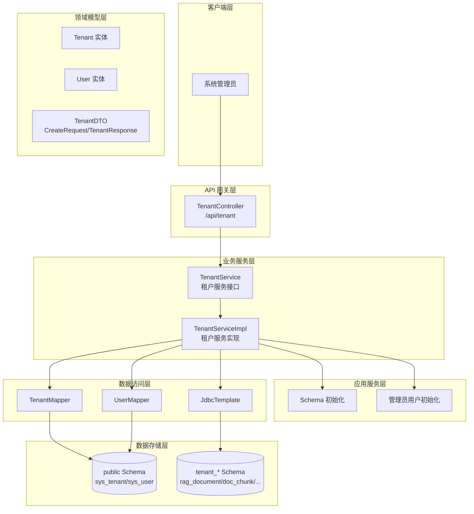
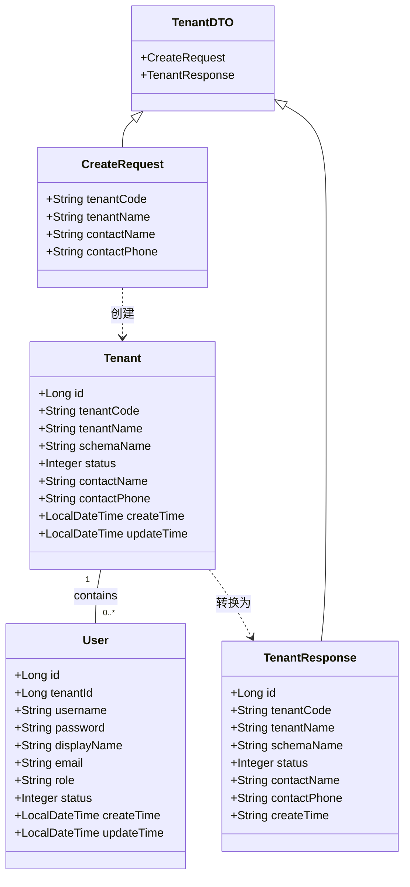
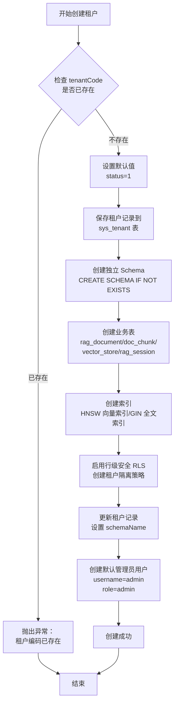

# 租户管理 API

**本文档引用的文件**
- [TenantController.java](../../../company-rag-web/src/main/java/com/company/rag/web/controller/TenantController.java)
- [Tenant.java](../../../company-rag-tenant/src/main/java/com/company/rag/tenant/model/Tenant.java)
- [TenantDTO.java](../../../company-rag-tenant/src/main/java/com/company/rag/tenant/model/dto/TenantDTO.java)
- [TenantService.java](../../../company-rag-tenant/src/main/java/com/company/rag/tenant/service/TenantService.java)
- [TenantServiceImpl.java](../../../company-rag-tenant/src/main/java/com/company/rag/tenant/service/impl/TenantServiceImpl.java)
- [User.java](../../../company-rag-tenant/src/main/java/com/company/rag/tenant/model/User.java)
- [项目概述.md](../../../.gientech/wiki/项目概述.md)

## 目录
1. [简介](#简介)
2. [项目架构概览](#项目架构概览)
3. [核心数据模型](#核心数据模型)
4. [API 端点](#api 端点)
5. [Schema 初始化逻辑](#schema 初始化逻辑)
6. [权限控制与角色管理](#权限控制与角色管理)
7. [错误处理与异常管理](#错误处理与异常管理)
8. [总结](#总结)

## 简介

- **模块定位**：租户管理模块负责企业级多租户系统的租户生命周期管理，包括租户创建、查询、列表展示以及独立的 Schema 初始化。
- **核心功能**：
  1. **租户创建**：创建租户并自动初始化独立的 PostgreSQL Schema
  2. **Schema 隔离**：为每个租户创建独立的数据库 Schema，实现物理数据隔离
  3. **默认管理员**：自动创建默认管理员用户（用户名：admin，密码：admin123）
  4. **租户查询**：支持查询租户列表和单个租户详情
- **技术架构**：基于 Spring Boot 3.4 + MyBatis-Plus，采用 Schema 隔离模式实现多租户数据隔离
- **用户角色**：系统管理员（负责租户管理）、租户管理员（管理租户内部资源）

来源：[TenantController.java](../../../company-rag-web/src/main/java/com/company/rag/web/controller/TenantController.java)(L14-L53)，[项目概述.md](../../../.gientech/wiki/项目概述.md)(L28-L29)

## 项目架构概览



**图表来源**
- [TenantController.java](../../../company-rag-web/src/main/java/com/company/rag/web/controller/TenantController.java)
- [TenantServiceImpl.java](../../../company-rag-tenant/src/main/java/com/company/rag/tenant/service/impl/TenantServiceImpl.java)

## 核心数据模型



### 关键属性说明

**Tenant 实体**（表名：`sys_tenant`）
- `id`：主键，自增 ID
- `tenantCode`：租户编码，唯一标识符，只能包含字母、数字和下划线，且不能以数字开头
- `tenantName`：租户名称，显示名称
- `schemaName`：独立 Schema 名称（Schema 隔离模式），格式为 `tenant_{tenantCode}`
- `status`：状态，0-禁用，1-启用
- `contactName`：联系人姓名
- `contactPhone`：联系人手机号
- `createTime` / `updateTime`：自动填充的时间戳

来源：[Tenant.java](../../../company-rag-tenant/src/main/java/com/company/rag/tenant/model/Tenant.java)(L11-L26)

**User 实体**（表名：`sys_user`）
- `id`：主键，自增 ID
- `tenantId`：所属租户 ID（多租户共享表，通过 tenant_id 隔离）
- `username`：用户名
- `password`：BCrypt 加密密码
- `displayName`：显示名称
- `email`：邮箱
- `role`：角色，admin / user / viewer
- `status`：状态，0-禁用，1-启用

来源：[User.java](../../../company-rag-tenant/src/main/java/com/company/rag/tenant/model/User.java)(L11-L27)

**CreateRequest 请求 DTO**
- `tenantCode`：租户编码，必填，长度 2-64，正则校验 `^[a-zA-Z_][a-zA-Z0-9_]*$`
- `tenantName`：租户名称，必填，长度 2-128
- `contactName`：联系人姓名，可选
- `contactPhone`：联系人手机号，可选，正则校验 `^1[3-9]\d{9}$`

来源：[TenantDTO.java](../../../company-rag-tenant/src/main/java/com/company/rag/tenant/model/dto/TenantDTO.java)(L17-L33)

**TenantResponse 响应 DTO**
- `id`：租户 ID
- `tenantCode`：租户编码
- `tenantName`：租户名称
- `schemaName`：Schema 名称
- `status`：状态
- `contactName`：联系人姓名
- `contactPhone`：联系人手机号
- `createTime`：创建时间

来源：[TenantDTO.java](../../../company-rag-tenant/src/main/java/com/company/rag/tenant/model/dto/TenantDTO.java)(L35-L48)

## API 端点

### 租户管理端点

#### 1. 创建租户

**HTTP 方法**: `POST`  
**端点路径**: `/api/tenant`  
**权限要求**: 系统管理员

**请求示例**:
```json
{
  "tenantCode": "company_a",
  "tenantName": "公司 A",
  "contactName": "张三",
  "contactPhone": "13800138000"
}
```

**响应示例**:
```json
{
  "code": 200,
  "message": "success",
  "data": {
    "id": 1,
    "tenantCode": "company_a",
    "tenantName": "公司 A",
    "schemaName": "tenant_company_a",
    "status": 1,
    "contactName": "张三",
    "contactPhone": "13800138000",
    "createTime": "2025-01-15T10:30:00"
  }
}
```

**业务逻辑**:
1. 校验 `tenantCode` 是否已存在
2. 设置默认状态为启用（status=1）
3. 保存租户记录到 `sys_tenant` 表
4. 创建独立 Schema（格式：`tenant_{tenantCode}`）
5. 在 Schema 中创建业务表（rag_document、doc_chunk、vector_store、rag_session）
6. 创建索引（HNSW 向量索引、GIN 全文索引等）
7. 启用行级安全（RLS）并创建租户隔离策略
8. 创建默认管理员用户（用户名：admin，密码：admin123）

来源：[TenantController.java](../../../company-rag-web/src/main/java/com/company/rag/web/controller/TenantController.java)(L23-L53)，[TenantServiceImpl.java](../../../company-rag-tenant/src/main/java/com/company/rag/tenant/service/impl/TenantServiceImpl.java)(L147-L178)

---

#### 2. 查询租户列表

**HTTP 方法**: `GET`  
**端点路径**: `/api/tenant/list`  
**权限要求**: 系统管理员

**请求参数**: 无

**响应示例**:
```json
{
  "code": 200,
  "message": "success",
  "data": [
    {
      "id": 1,
      "tenantCode": "company_a",
      "tenantName": "公司 A",
      "schemaName": "tenant_company_a",
      "status": 1,
      "contactName": "张三",
      "contactPhone": "13800138000",
      "createTime": "2025-01-15T10:30:00"
    },
    {
      "id": 2,
      "tenantCode": "company_b",
      "tenantName": "公司 B",
      "schemaName": "tenant_company_b",
      "status": 1,
      "contactName": "李四",
      "contactPhone": "13900139000",
      "createTime": "2025-01-15T11:00:00"
    }
  ]
}
```

**业务逻辑**:
1. 查询 `sys_tenant` 表所有记录
2. 按创建时间倒序排列
3. 转换为 TenantResponse DTO 列表

来源：[TenantController.java](../../../company-rag-web/src/main/java/com/company/rag/web/controller/TenantController.java)(L55-L76)，[TenantServiceImpl.java](../../../company-rag-tenant/src/main/java/com/company/rag/tenant/service/impl/TenantServiceImpl.java)(L181-L183)

---

#### 3. 查询租户详情

**HTTP 方法**: `GET`  
**端点路径**: `/api/tenant/{id}`  
**权限要求**: 系统管理员

**路径参数**:
- `id`：租户 ID（Long 类型）

**响应示例**:
```json
{
  "code": 200,
  "message": "success",
  "data": {
    "id": 1,
    "tenantCode": "company_a",
    "tenantName": "公司 A",
    "schemaName": "tenant_company_a",
    "status": 1,
    "contactName": "张三",
    "contactPhone": "13800138000",
    "createTime": "2025-01-15T10:30:00"
  }
}
```

**错误响应** (404):
```json
{
  "code": 404,
  "message": "租户不存在",
  "data": null
}
```

**业务逻辑**:
1. 根据 ID 查询租户记录
2. 若不存在，返回 404 错误
3. 转换为 TenantResponse DTO

来源：[TenantController.java](../../../company-rag-web/src/main/java/com/company/rag/web/controller/TenantController.java)(L78-L100)

---

## Schema 初始化逻辑

### Schema 创建流程



**图表来源**
- [TenantServiceImpl.java](../../../company-rag-tenant/src/main/java/com/company/rag/tenant/service/impl/TenantServiceImpl.java)(L39-L137)

### 业务表结构

在每个租户的独立 Schema 中创建以下业务表：

**rag_document** - 文档表
```sql
CREATE TABLE IF NOT EXISTS {schema}.rag_document (
    id BIGSERIAL PRIMARY KEY,
    tenant_id BIGINT NOT NULL,
    file_name VARCHAR(256) NOT NULL,
    file_type VARCHAR(32),
    file_size BIGINT,
    file_path VARCHAR(512),
    title VARCHAR(256),
    chunk_count INTEGER DEFAULT 0,
    status INTEGER DEFAULT 0,
    error_msg TEXT,
    create_time TIMESTAMP DEFAULT CURRENT_TIMESTAMP,
    update_time TIMESTAMP DEFAULT CURRENT_TIMESTAMP
);
```

**doc_chunk** - 文档切片表
```sql
CREATE TABLE IF NOT EXISTS {schema}.doc_chunk (
    id BIGSERIAL PRIMARY KEY,
    document_id BIGINT NOT NULL REFERENCES {schema}.rag_document(id) ON DELETE CASCADE,
    tenant_id BIGINT NOT NULL,
    chunk_index INTEGER NOT NULL,
    content TEXT NOT NULL,
    token_count INTEGER DEFAULT 0,
    split_strategy VARCHAR(32),
    create_time TIMESTAMP DEFAULT CURRENT_TIMESTAMP
);
```

**vector_store** - 向量存储表
```sql
CREATE TABLE IF NOT EXISTS {schema}.vector_store (
    id UUID PRIMARY KEY,
    content TEXT,
    metadata JSONB,
    embedding vector(1024)
);
```

**rag_session** - 会话记录表
```sql
CREATE TABLE IF NOT EXISTS {schema}.rag_session (
    id BIGSERIAL PRIMARY KEY,
    session_id VARCHAR(128) NOT NULL,
    tenant_id BIGINT NOT NULL,
    user_id BIGINT,
    query TEXT NOT NULL,
    answer TEXT,
    context TEXT,
    tokens_input INTEGER DEFAULT 0,
    tokens_output INTEGER DEFAULT 0,
    latency_ms INTEGER DEFAULT 0,
    create_time TIMESTAMP DEFAULT CURRENT_TIMESTAMP
);
```

来源：[TenantServiceImpl.java](../../../company-rag-tenant/src/main/java/com/company/rag/tenant/service/impl/TenantServiceImpl.java)(L51-L95)

### 索引配置

**HNSW 向量索引**（vector_store 表）
- 索引类型：HNSW（Hierarchical Navigable Small World）
- 距离算法：余弦相似度（vector_cosine_ops）
- 参数配置：m=16, ef_construction=64
- 向量维度：1024

**GIN 全文索引**
- `idx_{schema}_chunk_content_trgm`：doc_chunk.content 的三元组全文索引
- `idx_{schema}_document_title_trgm`：rag_document.title 的三元组全文索引

**普通索引**
- `idx_{schema}_doc_tenant`：rag_document.tenant_id
- `idx_{schema}_chunk_document`：doc_chunk.document_id
- `idx_{schema}_session_tenant`：rag_session(tenant_id, session_id) 联合索引

来源：[TenantServiceImpl.java](../../../company-rag-tenant/src/main/java/com/company/rag/tenant/service/impl/TenantServiceImpl.java)(L99-L112)

### 行级安全（RLS）策略

为每个业务表启用行级安全，并创建租户隔离策略：

```sql
-- 启用 RLS
ALTER TABLE {schema}.rag_document ENABLE ROW LEVEL SECURITY;
ALTER TABLE {schema}.doc_chunk ENABLE ROW LEVEL SECURITY;
ALTER TABLE {schema}.rag_session ENABLE ROW LEVEL SECURITY;

-- 创建租户隔离策略
CREATE POLICY tenant_isolation_document ON {schema}.rag_document
    USING (tenant_id = current_tenant_id() OR current_user = 'postgres');
CREATE POLICY tenant_isolation_chunk ON {schema}.doc_chunk
    USING (tenant_id = current_tenant_id() OR current_user = 'postgres');
CREATE POLICY tenant_isolation_session ON {schema}.rag_session
    USING (tenant_id = current_tenant_id() OR current_user = 'postgres');
```

**策略说明**：
- `current_tenant_id()`：自定义函数，返回当前会话的租户 ID
- `current_user = 'postgres'`：允许 postgres 超级用户绕过租户隔离（用于系统管理）

来源：[TenantServiceImpl.java](../../../company-rag-tenant/src/main/java/com/company/rag/tenant/service/impl/TenantServiceImpl.java)(L115-L130)

## 权限控制与角色管理

### 用户角色定义

| 角色 | 权限说明 | 访问范围 |
|------|---------|---------|
| admin | 租户管理员 | 管理租户内所有资源（文档、会话、用户） |
| user | 普通用户 | 上传文档、发起问答、查看自己的会话 |
| viewer | 只读用户 | 仅可查看文档和会话，不可编辑 |

来源：[User.java](../../../company-rag-tenant/src/main/java/com/company/rag/tenant/model/User.java)(L21)

### 默认管理员用户

创建租户时自动创建默认管理员用户：
- **用户名**: `admin`
- **密码**: `admin123`（BCrypt 加密存储）
- **角色**: `admin`
- **状态**: 启用（status=1）

**安全提示**：建议租户管理员首次登录后立即修改默认密码。

来源：[TenantServiceImpl.java](../../../company-rag-tenant/src/main/java/com/company/rag/tenant/service/impl/TenantServiceImpl.java)(L189-L202)

## 错误处理与异常管理

### 异常类型分类

| 异常类型 | HTTP 状态码 | 错误码 | 说明 |
|---------|-----------|-------|------|
| 参数校验失败 | 400 | 400 | 请求参数不满足校验规则 |
| 租户不存在 | 404 | 404 | 查询的租户 ID 不存在 |
| 租户编码已存在 | 500 | 500 | 创建租户时 tenantCode 重复 |
| 非法 Schema 名称 | 500 | 500 | Schema 名称不符合命名规范 |
| 创建租户失败 | 500 | 500 | Schema 初始化过程发生异常 |

### 错误响应格式

所有错误响应遵循统一格式 `R<T>`：

```json
{
  "code": 500,
  "message": "创建租户失败：非法 Schema 名称：tenant_123",
  "data": null
}
```

来源：[TenantController.java](../../../company-rag-web/src/main/java/com/company/rag/web/controller/TenantController.java)(L49-L52)

### 参数校验规则

**CreateRequest 校验规则**：

| 字段 | 校验规则 | 错误提示 |
|------|---------|---------|
| tenantCode | 必填，长度 2-64 | "租户编码不能为空" / "租户编码长度必须在 2-64 之间" |
| tenantCode | 正则 `^[a-zA-Z_][a-zA-Z0-9_]*$` | "租户编码只能包含字母、数字和下划线，且不能以数字开头" |
| tenantName | 必填，长度 2-128 | "租户名称不能为空" / "租户名称长度必须在 2-128 之间" |
| contactPhone | 可选，正则 `^1[3-9]\d{9}$` | "手机号格式不正确" |

来源：[TenantDTO.java](../../../company-rag-tenant/src/main/java/com/company/rag/tenant/model/dto/TenantDTO.java)(L20-L32)

### Schema 名称校验

为防止 SQL 注入，创建 Schema 前会校验名称合法性：

```java
if (!schemaName.matches("^[a-zA-Z_][a-zA-Z0-9_]*$")) {
    throw new BizException("非法 Schema 名称：" + schemaName);
}
```

来源：[TenantServiceImpl.java](../../../company-rag-tenant/src/main/java/com/company/rag/tenant/service/impl/TenantServiceImpl.java)(L42-L45)

## 总结

### 主要特点

1. **Schema 物理隔离**：每个租户拥有独立的 PostgreSQL Schema，数据完全隔离
2. **自动化初始化**：创建租户自动完成 Schema 创建、表结构初始化、索引创建、RLS 策略配置
3. **默认管理员**：自动创建 admin 用户，简化租户初始化流程
4. **行级安全**：通过 RLS 策略实现细粒度的租户数据访问控制
5. **HNSW 向量索引**：为向量检索提供高性能支持（m=16, ef_construction=64）

### 技术亮点

1. **事务保护**：使用 `@Transactional` 注解确保租户创建过程的原子性
2. **SQL 注入防护**：通过正则校验防止 Schema 名称被恶意注入
3. **BCrypt 加密**：默认管理员密码使用 BCrypt 加密存储
4. **级联删除**：doc_chunk 表通过外键关联 rag_document，支持级联删除
5. **三元组全文索引**：使用 GIN + gin_trgm_ops 支持模糊查询优化

### 业务价值

租户管理模块为多租户 SaaS 系统提供了坚实的基础：
- **数据隔离**：确保不同企业客户的数据完全隔离，满足合规要求
- **快速交付**：自动化初始化流程，新租户开通即享完整功能
- **安全可控**：RLS 策略 + 角色权限控制，保障数据安全
- **高性能**：HNSW 向量索引 + GIN 全文索引，支持大规模数据检索

---

**文档版本**: 1.0  
**最后更新**: 2025-01-15  
**维护团队**: CompanyRag 开发团队
