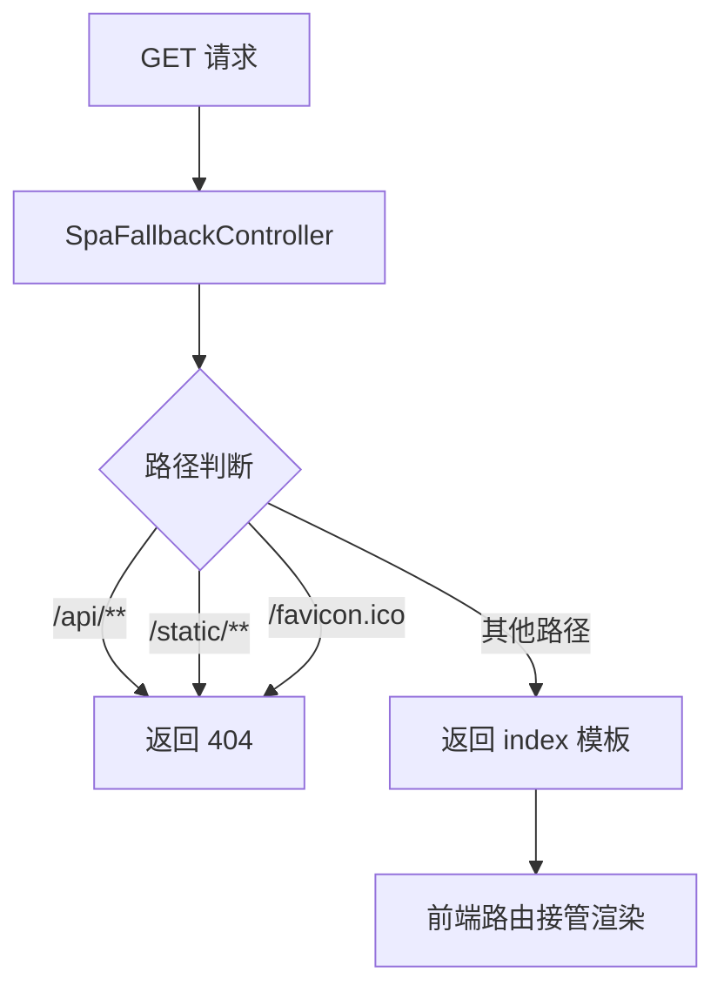
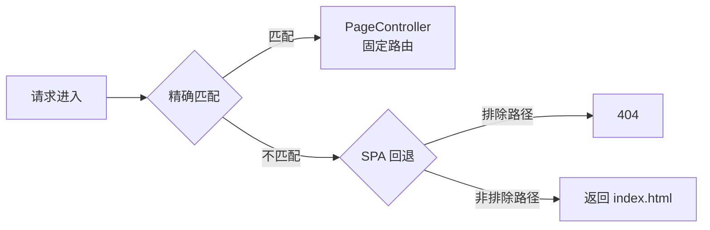

# 页面路由 API

**本文档引用的文件**
- [PageController.java](../../../company-rag-web/src/main/java/com/company/rag/web/controller/PageController.java)
- [SpaFallbackController.java](../../../company-rag-web/src/main/java/com/company/rag/web/controller/SpaFallbackController.java)
- [templates 目录](../../../company-rag-web/src/main/resources/templates/)
- [项目概述.md](../../../.gientech/wiki/项目概述.md)

## 目录
1. [简介](#简介)
2. [页面路由架构](#页面路由架构)
3. [页面路由表](#页面路由表)
4. [SPA 回退机制](#spa 回退机制)
5. [前端页面结构](#前端页面结构)
6. [总结](#总结)

## 简介

- **模块定位**：Web 层页面路由模块，负责将 URL 路径映射到 Thymeleaf 模板页面，实现前后端一体化部署。
- **核心职责**：
  1. 提供固定页面路由（首页、登录、文档管理、管理后台）
  2. 实现 SPA（单页应用）回退机制，支持前端路由跳转
  3. 排除 API 路径和静态资源，确保 REST API 正常运作
- **技术架构**：基于 Spring MVC `@Controller` + Thymeleaf 模板引擎
- **用户角色**：
  - 普通用户：访问首页、登录页、文档管理页
  - 管理员：访问管理后台页面

来源：[PageController.java](../../../company-rag-web/src/main/java/com/company/rag/web/controller/PageController.java)(L6-L31)，[项目概述.md](../../../.gientech/wiki/项目概述.md)(L100-L102)

## 页面路由架构

```mermaid
graph TB
    subgraph "客户端层"
        Browser[浏览器]
    end

    subgraph "路由处理层"
        PageCtrl[PageController<br/>固定路由]
        SpaCtrl[SpaFallbackController<br/>SPA 回退]
    end

    subgraph "模板层"
        Index[index.html<br/>首页/聊天页]
        Login[login.html<br/>登录页]
        Docs[documents.html<br/>文档管理页]
        Admin[admin.html<br/>管理后台页]
    end

    subgraph "排除路径"
        API[/api/**]
        Static[/static/**]
        Favicon[/favicon.ico]
    end

    Browser --> PageCtrl
    Browser --> SpaCtrl
    
    PageCtrl -->|"/, /index, /chat"| Index
    PageCtrl -->|"/login"| Login
    PageCtrl -->|"/documents"| Docs
    PageCtrl -->|"/admin"| Admin
    
    SpaCtrl -->|非 API/静态资源路径 | Index
    SpaCtrl -.->|排除路径 | API
    SpaCtrl -.->|排除路径 | Static
    SpaCtrl -.->|排除路径 | Favicon
```

**图表来源**
- [PageController.java](../../../company-rag-web/src/main/java/com/company/rag/web/controller/PageController.java)(L12-L30)
- [SpaFallbackController.java](../../../company-rag-web/src/main/java/com/company/rag/web/controller/SpaFallbackController.java)(L13-L23)

## 页面路由表

### 固定路由映射

| HTTP 方法 | URL 路径 | 模板名称 | 模板文件 | 说明 |
|----------|---------|---------|---------|------|
| GET | `/` | `index` | `index.html` | 首页（默认首页） |
| GET | `/index` | `index` | `index.html` | 首页（显式路径） |
| GET | `/chat` | `index` | `index.html` | 聊天页面（与首页共用模板） |
| GET | `/login` | `login` | `login.html` | 登录页面 |
| GET | `/documents` | `documents` | `documents.html` | 文档管理页面 |
| GET | `/admin` | `admin` | `admin.html` | 管理后台页面 |

**章节来源**：[PageController.java](../../../company-rag-web/src/main/java/com/company/rag/web/controller/PageController.java)(L12-L30)

### 路由实现代码

```java
@Controller
public class PageController {

    @GetMapping({"/", "/index", "/chat"})
    public String index() {
        return "index";
    }

    @GetMapping("/login")
    public String login() {
        return "login";
    }

    @GetMapping("/documents")
    public String documents() {
        return "documents";
    }

    @GetMapping("/admin")
    public String admin() {
        return "admin";
    }
}
```

来源：[PageController.java](../../../company-rag-web/src/main/java/com/company/rag/web/controller/PageController.java)(L9-L31)

## SPA 回退机制

### 设计目的

单页应用（SPA）使用前端路由（如 Vue Router）进行页面内导航时，直接访问子路由（如 `/user/profile`）会导致 404 错误。SPA 回退机制确保所有非 API、非静态资源的路径都返回 `index.html`，由前端路由接管后续渲染。

### 回退逻辑流程



**图表来源**：[SpaFallbackController.java](../../../company-rag-web/src/main/java/com/company/rag/web/controller/SpaFallbackController.java)(L13-L23)

### 排除路径规则

| 路径模式 | 处理方式 | 说明 |
|---------|---------|------|
| `/api/**` | 返回 404 | REST API 请求，不应返回页面 |
| `/static/**` | 返回 404 | 静态资源（JS/CSS/图片），由 Spring MVC 静态资源处理器接管 |
| `/favicon.ico` | 返回 404 | 网站图标请求 |
| 其他所有路径 | 返回 `index` | SPA 前端路由接管 |

### 回退控制器实现

```java
@Controller
public class SpaFallbackController {

    @GetMapping("/**")
    public String fallback(HttpServletRequest request, HttpServletResponse response) throws IOException {
        String path = request.getRequestURI();
        // 排除 API 路径和静态资源（静态资源已由 /static/** 处理，这里不会再进入，但保留以防万一）
        if (path.startsWith("/api/") || path.startsWith("/static/") || path.equals("/favicon.ico")) {
            response.sendError(HttpServletResponse.SC_NOT_FOUND);
            return null;
        }
        // 所有其他路径（包括 /、/home、/user/profile 等）返回 index 模板
        return "index";
    }
}
```

来源：[SpaFallbackController.java](../../../company-rag-web/src/main/java/com/company/rag/web/controller/SpaFallbackController.java)(L10-L24)

### 路由优先级



**路由匹配顺序**：
1. **精确匹配优先**：`PageController` 中定义的固定路由（`/`、`/login`、`/documents`、`/admin`）优先匹配
2. **通配符回退**：未匹配到固定路由的请求进入 `SpaFallbackController`
3. **排除检查**：SPA 回退控制器检查是否为 API 或静态资源路径
4. **默认返回**：非排除路径返回 `index.html`

**章节来源**：[PageController.java](../../../company-rag-web/src/main/java/com/company/rag/web/controller/PageController.java)，[SpaFallbackController.java](../../../company-rag-web/src/main/java/com/company/rag/web/controller/SpaFallbackController.java)

## 前端页面结构

### 模板文件目录

```
company-rag-web/src/main/resources/templates/
├── index.html        # 首页/聊天页模板
├── login.html        # 登录页模板
├── documents.html    # 文档管理页模板
└── admin.html        # 管理后台页模板
```

**目录来源**：[templates 目录](../../../company-rag-web/src/main/resources/templates/)

### 页面功能说明

| 页面 | 功能描述 | 技术栈 |
|-----|---------|--------|
| `index.html` | 系统首页，集成智能聊天界面，支持 RAG 问答、Agent 工具调用 | Vue3 + Element Plus（CDN 嵌入） |
| `login.html` | 用户登录页面，支持多租户认证 | Vue3 + Element Plus |
| `documents.html` | 文档管理页面，支持文档上传、解析、切分管理 | Vue3 + Element Plus |
| `admin.html` | 管理后台页面，提供租户管理、系统配置等功能 | Vue3 + Element Plus |

**技术说明**：前端页面采用 Vue3 + Element Plus 构建，通过 CDN 方式嵌入，无需独立前端构建流程，直接由 Spring Boot 提供。

来源：[项目概述.md](../../../.gientech/wiki/项目概述.md)(L42)，[README.md](../../../README.md)(L10)

## 总结

### 主要特点

1. **前后端一体化**：Thymeleaf 模板 + Vue3 CDN 嵌入，简化部署流程
2. **固定路由 + SPA 回退**：兼顾传统页面路由与现代单页应用需求
3. **API 路径自动排除**：确保 REST API 与页面路由互不干扰
4. **静态资源分离**：`/static/**` 路径由 Spring MVC 静态资源处理器接管
5. **灵活的前端路由**：支持任意前端路由路径（如 `/user/profile`）

### 技术亮点

- **双控制器协作**：`PageController` 处理固定路由，`SpaFallbackController` 处理动态路由
- **通配符映射**：`@GetMapping("/**")` 捕获所有未匹配路径
- **条件判断优化**：排除路径检查在前，避免不必要的模板渲染

### 业务价值

- **简化部署**：前后端代码打包在同一 JAR 中，无需独立部署前端服务
- **提升用户体验**：SPA 架构支持无刷新页面内导航
- **降低运维成本**：统一版本管理，避免前后端版本不一致问题

---

**文档版本**：1.0  
**最后更新**：2026-07-19
