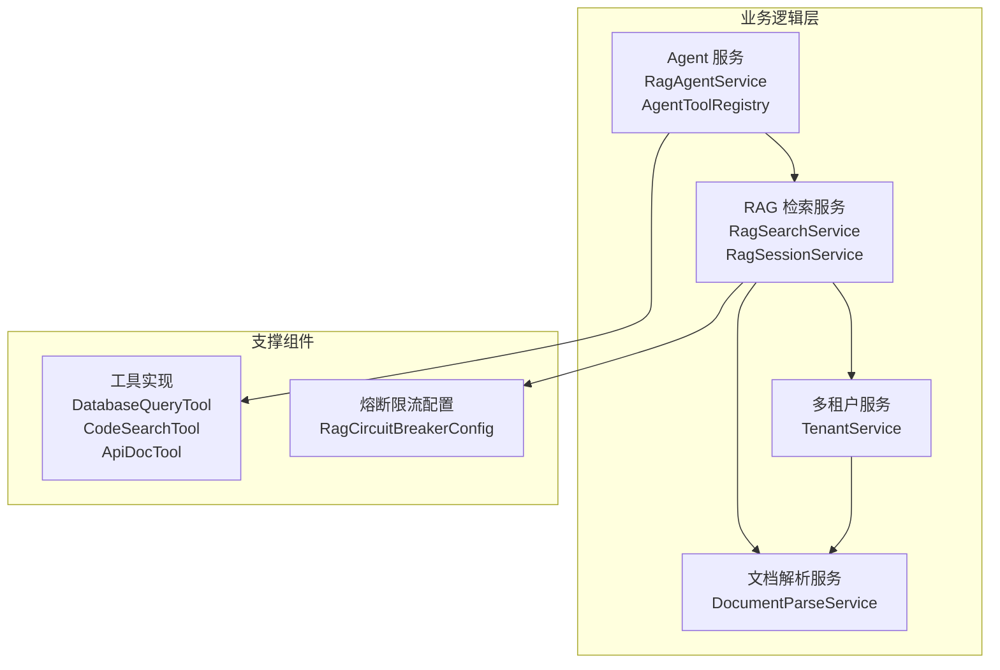
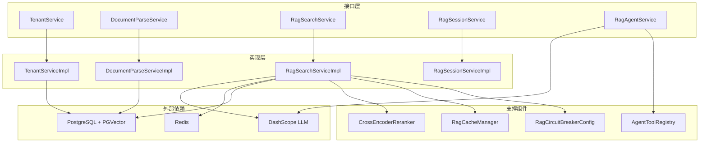
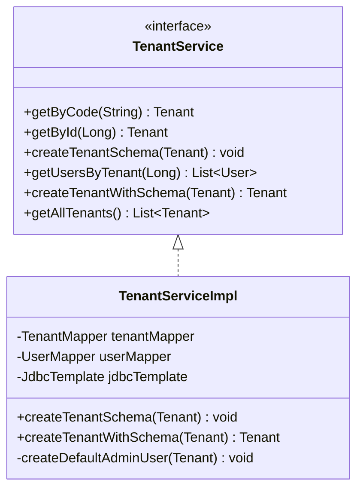
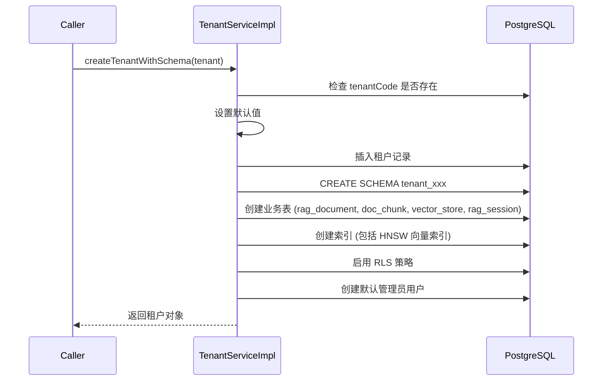
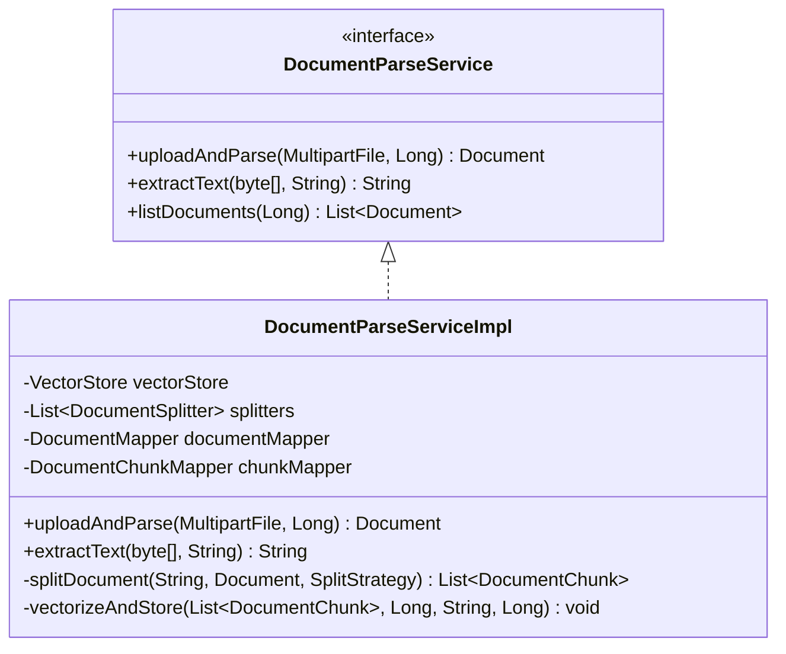
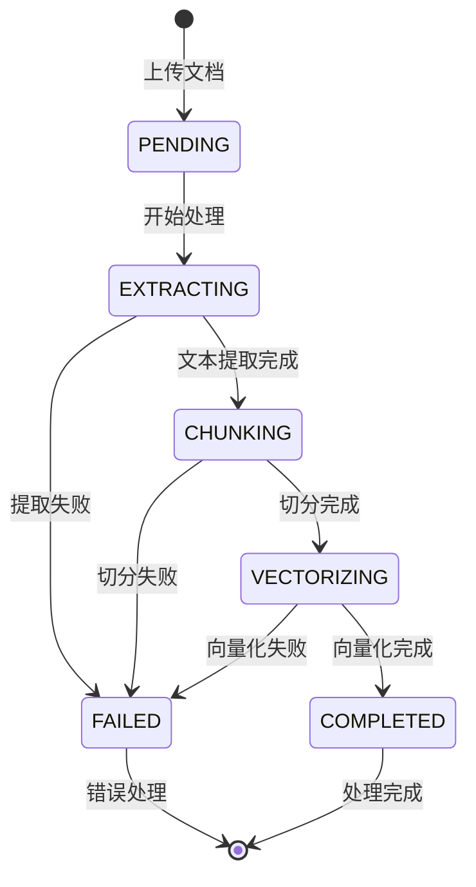
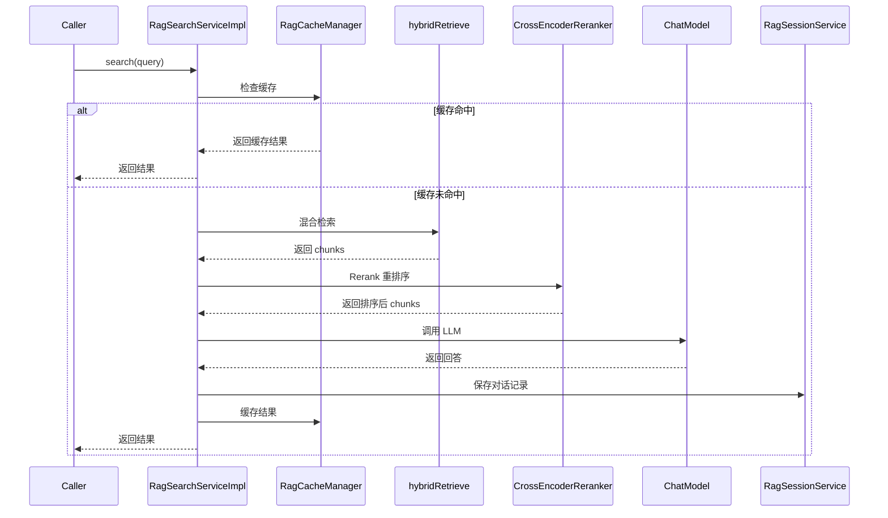
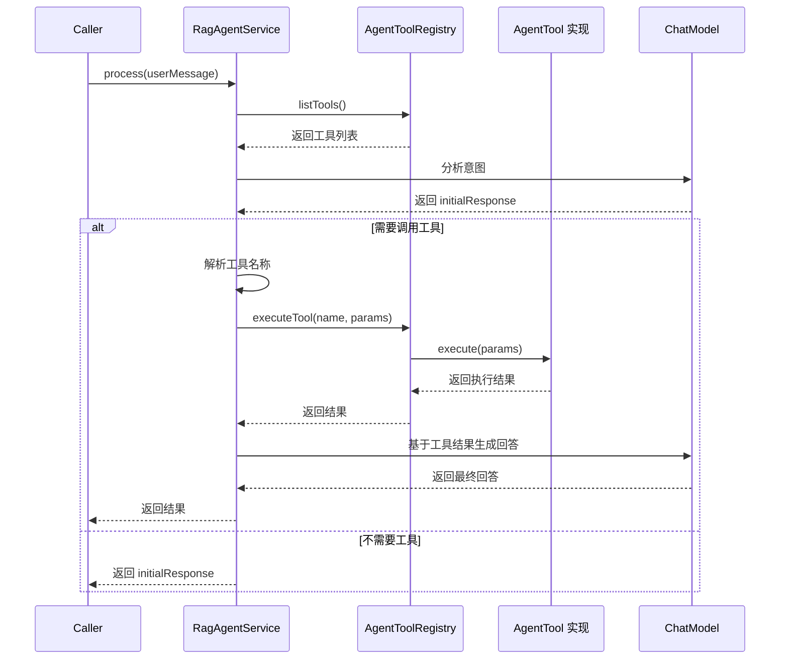
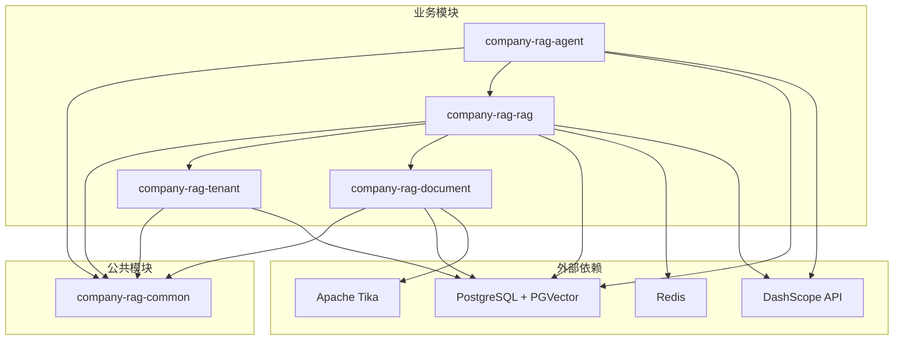

# 业务逻辑层

**本文档中引用的文件**
- [TenantService.java](../../../company-rag-tenant/src/main/java/com/company/rag/tenant/service/TenantService.java)
- [TenantServiceImpl.java](../../../company-rag-tenant/src/main/java/com/company/rag/tenant/service/impl/TenantServiceImpl.java)(L39-L137)
- [DocumentParseService.java](../../../company-rag-document/src/main/java/com/company/rag/document/service/DocumentParseService.java)
- [DocumentParseServiceImpl.java](../../../company-rag-document/src/main/java/com/company/rag/document/service/impl/DocumentParseServiceImpl.java)(L48-L98)
- [RagSearchService.java](../../../company-rag-rag/src/main/java/com/company/rag/rag/service/RagSearchService.java)
- [RagSearchServiceImpl.java](../../../company-rag-rag/src/main/java/com/company/rag/rag/service/impl/RagSearchServiceImpl.java)(L40-L109)
- [RagSessionService.java](../../../company-rag-rag/src/main/java/com/company/rag/rag/service/RagSessionService.java)
- [RagCircuitBreakerConfig.java](../../../company-rag-rag/src/main/java/com/company/rag/rag/service/RagCircuitBreakerConfig.java)
- [RagAgentService.java](../../../company-rag-agent/src/main/java/com/company/rag/agent/service/RagAgentService.java)
- [AgentTool.java](../../../company-rag-agent/src/main/java/com/company/rag/agent/tool/AgentTool.java)
- [AgentToolRegistry.java](../../../company-rag-agent/src/main/java/com/company/rag/agent/tool/AgentToolRegistry.java)
- [DatabaseQueryTool.java](../../../company-rag-agent/src/main/java/com/company/rag/agent/tool/DatabaseQueryTool.java)(L62-L91)
- [项目概述.md](../../项目概述.md)

## 目录
1. [简介](#简介)
2. [项目结构概述](#项目结构概述)
3. [核心应用服务](#核心应用服务)
4. [架构概览](#架构概览)
5. [详细组件分析](#详细组件分析)
6. [依赖关系分析](#依赖关系分析)
7. [性能考虑](#性能考虑)
8. [故障排除指南](#故障排除指南)
9. [结论](#结论)

## 简介

业务逻辑层是 CompanyRag 系统的核心处理层，负责实现企业知识库 RAG 系统的全部业务功能。该层采用模块化设计，包含四个核心业务模块：多租户管理、文档处理、RAG 检索和 Agent 工具编排。

- **核心职责**：
  - 多租户数据隔离与 Schema 管理
  - 文档解析、智能切分与向量化存储
  - 混合检索、重排序与流式回答
  - Agent 工具注册与智能调用编排

- **主要设计模式**：
  - 接口与实现分离：每个服务定义接口（如 `TenantService`、`DocumentParseService`），通过实现类（如 `TenantServiceImpl`）提供具体业务逻辑
  - 策略模式：文档切分支持三种策略（语义切分、滑动窗口、固定大小）
  - 工厂模式：`AgentToolRegistry` 统一管理工具注册与执行
  - 责任链模式：RAG 检索流程（缓存检查→混合检索→Rerank→LLM 调用）

- **业务价值**：
  - 支持企业级多租户部署，确保数据物理隔离
  - 提供完整的 RAG 全链路处理能力
  - 通过 Agent 工具扩展智能问答边界
  - 熔断限流保护确保系统稳定性

## 项目结构概述

业务逻辑层分布在四个核心模块中，各模块职责清晰、依赖关系明确：



**模块职责说明**：

| 模块 | 核心服务 | 主要职责 |
|------|---------|---------|
| company-rag-tenant | TenantService | 租户创建、Schema 隔离、用户管理 |
| company-rag-document | DocumentParseService | 文档上传、文本提取、智能切分、向量化 |
| company-rag-rag | RagSearchService、RagSessionService | 混合检索、Rerank、流式回答、会话管理 |
| company-rag-agent | RagAgentService、AgentToolRegistry | Agent 请求处理、工具注册与执行 |

## 核心应用服务

### 多租户服务 (TenantService)

**职责**：管理企业租户的生命周期，实现 Schema 级别的物理数据隔离。

**主要功能列表**：
- `getByCode(String tenantCode)`：根据租户编码查询租户信息
- `getById(Long id)`：根据 ID 查询租户信息
- `createTenantSchema(Tenant tenant)`：为租户创建独立的 PostgreSQL Schema
- `getUsersByTenant(Long tenantId)`：获取租户下的所有用户
- `createTenantWithSchema(Tenant tenant)`：创建租户并初始化 Schema 和默认管理员用户
- `getAllTenants()`：获取所有租户列表

**代码示例**：
```java
@Transactional
public void createTenantSchema(Tenant tenant) {
    String schemaName = "tenant_" + tenant.getTenantCode();
    // 校验 schema 名称合法性，防止 SQL 注入
    if (!schemaName.matches("^[a-zA-Z_][a-zA-Z0-9_]*$")) {
        throw new BizException("非法 Schema 名称：" + schemaName);
    }

    // 1. 创建独立 Schema
    jdbcTemplate.execute("CREATE SCHEMA IF NOT EXISTS " + schemaName);

    // 2. 在 Schema 中创建业务表（rag_document、doc_chunk、vector_store、rag_session）
    // 3. 创建索引（包括 HNSW 向量索引）
    // 4. 启用行级安全策略 (RLS)
    
    log.info("为租户 [{}] 创建独立 Schema 完成：{}", tenant.getTenantCode(), schemaName);
}
```

**章节来源**
- [TenantService.java](../../../company-rag-tenant/src/main/java/com/company/rag/tenant/service/TenantService.java)
- [TenantServiceImpl.java](../../../company-rag-tenant/src/main/java/com/company/rag/tenant/service/impl/TenantServiceImpl.java)(L39-L137)

### 文档解析服务 (DocumentParseService)

**职责**：处理企业文档的上传、解析、智能切分与向量化存储全流程。

**主要功能列表**：
- `uploadAndParse(MultipartFile file, Long tenantId)`：上传并解析文档
- `extractText(byte[] fileContent, String fileName)`：提取文档纯文本内容
- `listDocuments(Long tenantId)`：查询租户下所有文档列表

**处理流程**：
1. 保存文档元数据到数据库
2. 使用 Apache Tika 提取文本
3. 根据策略智能切分文档
4. 向量化并存储到 PGVector
5. 更新文档状态

**代码示例**：
```java
@Transactional(rollbackFor = Exception.class)
public Document uploadAndParse(MultipartFile file, Long tenantId) {
    Document doc = new Document();
    doc.setTenantId(tenantId);
    doc.setFileName(file.getOriginalFilename());
    doc.setStatus(0); // 待处理

    try {
        // 1. 保存文档记录获取自增 ID
        documentMapper.insert(doc);

        // 2. 提取文本
        byte[] content = file.getBytes();
        String text = extractText(content, file.getOriginalFilename());

        // 3. 智能切分
        List<DocumentChunk> chunks = splitDocument(text, doc, SplitStrategy.SEMANTIC_CHUNK);
        doc.setChunkCount(chunks.size());
        doc.setStatus(1); // 已切分

        // 4. 保存切分块到数据库
        for (DocumentChunk chunk : chunks) {
            chunkMapper.insert(chunk);
        }

        // 5. 向量化并存储到 PGVector
        vectorizeAndStore(chunks, doc.getId(), doc.getFileName(), tenantId);
        doc.setStatus(2); // 已向量化

        documentMapper.updateById(doc);
        log.info("文档处理完成 | documentId={} | chunks={}", doc.getId(), chunks.size());
    } catch (Exception e) {
        log.error("文档处理失败：{}", e.getMessage(), e);
        doc.setStatus(-1); // 失败
        doc.setErrorMsg(e.getMessage());
    }

    return doc;
}
```

**章节来源**
- [DocumentParseService.java](../../../company-rag-document/src/main/java/com/company/rag/document/service/DocumentParseService.java)
- [DocumentParseServiceImpl.java](../../../company-rag-document/src/main/java/com/company/rag/document/service/impl/DocumentParseServiceImpl.java)(L48-L98)

### RAG 检索服务 (RagSearchService)

**职责**：执行混合检索、重排序与 LLM 调用，提供流式回答能力。

**主要功能列表**：
- `search(RagQuery query)`：执行 RAG 检索（混合检索 + Rerank）
- `streamAnswer(RagQuery query)`：流式 RAG 回答
- `retrieve(RagQuery query)`：仅检索文档块（不调用 LLM）

**处理流程**：
1. 检查缓存（命中则直接返回）
2. 混合检索（向量 + 关键词）
3. Cross-Encoder Rerank 重排序
4. 构建 Prompt 并调用 LLM
5. 组装结果并缓存
6. 保存对话记录

**代码示例**：
```java
@CircuitBreaker(name = "rag", fallbackMethod = "searchFallback")
@RateLimiter(name = "rag-rate-limiter", fallbackMethod = "searchFallback")
public RagResult search(RagQuery query) {
    long start = System.currentTimeMillis();
    
    // 1. 检查缓存
    String cacheKey = buildCacheKey(query);
    RagResult cached = cacheManager.getSearchResult(cacheKey);
    if (cached != null) {
        metricsRecorder.recordCacheHit();
        return cached;
    }

    // 2. 混合检索
    List<RagResult.ChunkResult> chunks = hybridRetrieve(query);

    // 3. Rerank
    if (query.getEnableRerank() && !chunks.isEmpty()) {
        chunks = reranker.rerank(query.getQuery(), chunks, query.getRerankTopK());
    }

    // 4. 构建 Prompt 并调用 LLM
    String context = chunks.stream()
            .map(c -> "[来源:" + c.getDocumentName() + "] " + c.getContent())
            .collect(Collectors.joining("\n\n"));
    String prompt = promptTemplate.buildChatPrompt(query.getQuery(), context);
    String answer = chatModel.call(prompt);

    // 5. 组装结果并缓存
    RagResult result = new RagResult();
    result.setAnswer(answer);
    result.setChunks(chunks);
    cacheManager.putSearchResult(cacheKey, result);
    
    return result;
}
```

**章节来源**
- [RagSearchService.java](../../../company-rag-rag/src/main/java/com/company/rag/rag/service/RagSearchService.java)
- [RagSearchServiceImpl.java](../../../company-rag-rag/src/main/java/com/company/rag/rag/service/impl/RagSearchServiceImpl.java)(L40-L109)

### 会话服务 (RagSessionService)

**职责**：管理 RAG 会话生命周期，包括创建、查询、更新和删除会话。

**主要功能列表**：
- `createSession(Long tenantId, Long userId, String title)`：创建新会话
- `saveConversation(...)`：保存对话记录
- `getSessionList(...)`：获取会话列表（分页 + 搜索）
- `getSessionDetail(Long tenantId, String sessionId)`：获取会话详情
- `deleteSession(Long tenantId, String sessionId)`：软删除会话
- `updateSession(...)`：更新会话信息
- `updateSessionMeta(String sessionId, String lastQuery, int messageCount)`：异步更新会话元数据

**章节来源**
- [RagSessionService.java](../../../company-rag-rag/src/main/java/com/company/rag/rag/service/RagSessionService.java)

### Agent 服务 (RagAgentService)

**职责**：基于 Spring AI 实现智能工具调用编排，支持自然语言驱动的工具选择。

**工作流程**：
1. 用户提问 → LLM 分析意图
2. LLM 决定是否需要调用工具
3. 如果需要：选择工具 → 执行 → 将结果反馈给 LLM
4. LLM 基于工具结果生成最终回答
5. 流式返回给用户

**主要功能列表**：
- `process(String userMessage, String toolContext)`：处理 Agent 请求，自动选择工具
- `queryDatabase(String sql)`：直接调用数据库查询工具
- `searchCode(String keyword, String ext)`：直接调用代码搜索工具
- `getApiDoc(String filter)`：直接调用 API 文档工具

**代码示例**：
```java
public String process(String userMessage, String toolContext) {
    // 获取工具列表
    List<Map<String, Object>> tools = toolRegistry.listTools();
    String toolDescriptions = formatToolDescriptions(tools);

    String systemPrompt = String.format(AGENT_SYSTEM_PROMPT, toolDescriptions);

    // 第一步：让 LLM 分析是否需要工具
    String initialResponse = chatModel.call(
            new Prompt(List.of(
                    new SystemMessage(systemPrompt),
                    new UserMessage(userMessage)
            ))
    ).getResult().getOutput().getText();

    // 检查是否需要调用工具
    if (initialResponse.contains("[USE_TOOL:")) {
        String toolName = extractToolName(initialResponse);
        // 执行工具
        String toolResult = toolRegistry.executeTool(toolName, Map.of("query", userMessage));
        
        // 第二步：LLM 基于工具结果生成最终回答
        String enhancedQuery = String.format(
                "用户问题：%s\n\n工具 [%s] 返回结果:\n%s\n\n请基于以上工具结果回答用户问题。",
                userMessage, toolName, toolResult
        );
        
        return chatModel.call(new Prompt(List.of(
                new SystemMessage(systemPrompt),
                new UserMessage(enhancedQuery)
        ))).getResult().getOutput().getText();
    }
    
    return initialResponse;
}
```

**章节来源**
- [RagAgentService.java](../../../company-rag-agent/src/main/java/com/company/rag/agent/service/RagAgentService.java)

### 工具注册中心 (AgentToolRegistry)

**职责**：统一管理所有可用的 Agent 工具，提供注册、查询、执行能力。

**主要功能列表**：
- `register(AgentTool tool)`：注册工具
- `getTool(String name)`：获取工具
- `listTools()`：列出所有工具
- `executeTool(String name, Map<String, Object> params)`：执行工具
- `hasTool(String name)`：检查工具是否存在

**章节来源**
- [AgentToolRegistry.java](../../../company-rag-agent/src/main/java/com/company/rag/agent/tool/AgentToolRegistry.java)

## 架构概览

业务逻辑层采用分层架构，各服务之间通过接口进行协作：



**架构特点**：
- 接口与实现分离，便于单元测试和 Mock
- 通过配置类统一管理熔断、限流等横切关注点
- 服务间通过依赖注入协作，降低耦合度

## 详细组件分析

### 多租户模块详细分析

**类关系图**：


**Schema 创建流程**：


**章节来源**
- [TenantServiceImpl.java](../../../company-rag-tenant/src/main/java/com/company/rag/tenant/service/impl/TenantServiceImpl.java)

### 文档处理模块详细分析

**类关系图**：


**文档处理状态机**：


**章节来源**
- [DocumentParseServiceImpl.java](../../../company-rag-document/src/main/java/com/company/rag/document/service/impl/DocumentParseServiceImpl.java)

### RAG 检索模块详细分析

**服务调用时序图**：


**章节来源**
- [RagSearchServiceImpl.java](../../../company-rag-rag/src/main/java/com/company/rag/rag/service/impl/RagSearchServiceImpl.java)

### Agent 工具模块详细分析

**工具注册与执行流程**：


**DatabaseQueryTool 安全检查流程**：
```java
@Override
public String execute(Map<String, Object> params) {
    String sql = (String) params.get("sql");
    
    // 安全检查 1: 只允许 SELECT
    String upperSql = sql.trim().toUpperCase();
    if (!upperSql.startsWith("SELECT")) {
        return "错误：仅支持 SELECT 查询";
    }

    // 安全检查 2: 检查危险关键字
    if (containsDangerousKeywords(upperSql)) {
        return "错误：SQL 包含禁止的操作";
    }

    // 安全检查 3: 添加 LIMIT 限制
    if (!upperSql.contains("LIMIT")) {
        sql += " LIMIT " + Math.min(limit, MAX_ROWS);
    }

    // 执行查询
    List<Map<String, Object>> result = jdbcTemplate.queryForList(sql);
    return formatResult(result);
}
```

**章节来源**
- [AgentToolRegistry.java](../../../company-rag-agent/src/main/java/com/company/rag/agent/tool/AgentToolRegistry.java)
- [DatabaseQueryTool.java](../../../company-rag-agent/src/main/java/com/company/rag/agent/tool/DatabaseQueryTool.java)(L62-L91)

## 依赖关系分析

业务逻辑层各模块之间的依赖关系如下：



**依赖特点**：
- 所有业务模块依赖 `company-rag-common` 获取常量、异常定义和工具类
- RAG 模块依赖租户模块和文档模块，形成业务闭环
- Agent 模块依赖 RAG 模块，可复用检索能力
- 外部依赖通过接口抽象，便于 Mock 和测试

**章节来源**
- [项目概述.md](../../项目概述.md)

## 性能考虑

### 缓存策略

RAG 检索服务采用两级缓存策略：
- **一级缓存**：Redis 缓存，使用租户 ID + 查询文本作为缓存键
- **二级缓存**：热点检测，自动识别高频查询

缓存命中时直接返回结果，避免重复的检索和 LLM 调用，显著降低延迟和 Token 消耗。

### 并发控制

通过 Resilience4j 实现熔断和限流保护：

**熔断配置**：
- 失败率阈值：50%
- 滑动窗口大小：10 次调用
- 最小调用数：10 次
- 熔断后等待时间：30 秒
- 半开状态允许调用数：3 次

**限流配置**：
- 每租户每秒请求数：5 次
- 突发容量：10 次
- 超时等待时间：500ms

**超时控制**：
- LLM 调用超时：30 秒
- 流式回答超时：30 秒

### 数据访问优化

- **批量向量化**：文档切分后批量调用 Embedding 模型，减少网络往返
- **HNSW 索引**：PGVector 使用 HNSW 索引加速向量检索（m=16, ef_construction=64）
- **关键词融合**：混合检索结合向量相似度与关键词匹配，提升召回率
- **异步更新**：会话元数据采用异步批量更新，减少数据库压力

## 故障排除指南

### 常见问题及解决方案

**问题 1：创建租户失败**
- **现象**：调用 `createTenantWithSchema` 抛出异常
- **排查步骤**：
  1. 检查 PostgreSQL 连接是否正常
  2. 确认数据库用户有创建 Schema 的权限
  3. 检查 tenantCode 是否已存在
  4. 查看应用日志中的详细错误信息

**问题 2：文档解析失败**
- **现象**：文档状态为 -1，errorMsg 包含异常信息
- **排查步骤**：
  1. 检查文件大小是否超过限制
  2. 确认文件格式是否受支持（PDF/DOCX/TXT/MD/HTML）
  3. 查看 Apache Tika 是否能正确识别文件类型
  4. 检查数据库连接和事务配置

**问题 3：RAG 检索返回空结果**
- **现象**：检索结果为空或答案质量差
- **排查步骤**：
  1. 确认向量库中已有文档数据
  2. 检查 Embedding 模型配置是否正确
  3. 调整检索参数（topK、similarityThreshold）
  4. 查看检索日志确认混合检索是否正常执行

**问题 4：Agent 工具调用失败**
- **现象**：Agent 返回"工具执行失败"
- **排查步骤**：
  1. 检查工具是否已正确注册
  2. 确认工具参数格式是否符合 Schema 定义
  3. 查看工具执行日志定位具体错误
  4. 验证数据库查询工具的 SQL 是否合法

### 监控指标

通过 Actuator 端点可获取以下关键指标：
- `/actuator/health`：应用健康状态
- `/actuator/prometheus`：Prometheus 格式指标（包含 RAG 检索延迟、缓存命中率、Token 消耗等）
- `/actuator/metrics`：详细指标数据

**关键指标**：
- `rag_search_duration_seconds`：RAG 检索耗时
- `rag_cache_hit_total`：缓存命中次数
- `rag_cache_miss_total`：缓存未命中次数
- `llm_token_usage_total`：Token 使用量

**章节来源**
- [RagCircuitBreakerConfig.java](../../../company-rag-rag/src/main/java/com/company/rag/rag/service/RagCircuitBreakerConfig.java)
- [项目概述.md](../../项目概述.md)

## 结论

### 设计优势

业务逻辑层采用模块化、接口化的设计，具有以下优势：
- **职责清晰**：四个核心模块各司其职，依赖关系明确
- **易于扩展**：新增功能可通过实现接口或添加工具实现
- **可测试性强**：接口与实现分离便于单元测试和 Mock
- **工程化完善**：熔断限流、缓存策略、可观测性一应俱全

### 最佳实践

- **事务管理**：关键业务操作（如创建租户、文档处理）使用 `@Transactional` 确保数据一致性
- **异常处理**：统一使用 `BizException` 抛出业务异常，全局异常处理器捕获并转换为标准响应
- **日志记录**：关键步骤记录 INFO 级别日志，异常记录 ERROR 级别日志并包含上下文信息
- **安全检查**：对外部输入（如 SQL、Schema 名）进行严格校验，防止注入攻击

### 技术特色

- **多租户 Schema 隔离**：物理隔离 + 行级安全双重保障
- **RAG 全链路优化**：从文档切分到检索重排序的全流程优化
- **Agent 工具编排**：基于 Spring AI 的智能工具选择与执行
- **生产级工程保障**：Resilience4j 熔断限流、两级缓存、超时控制

---

**文档来源**
- 本文档基于项目实际源码生成，所有代码示例和流程描述均来自 `company-rag-tenant`、`company-rag-document`、`company-rag-rag`、`company-rag-agent` 四个模块的 service 目录。
