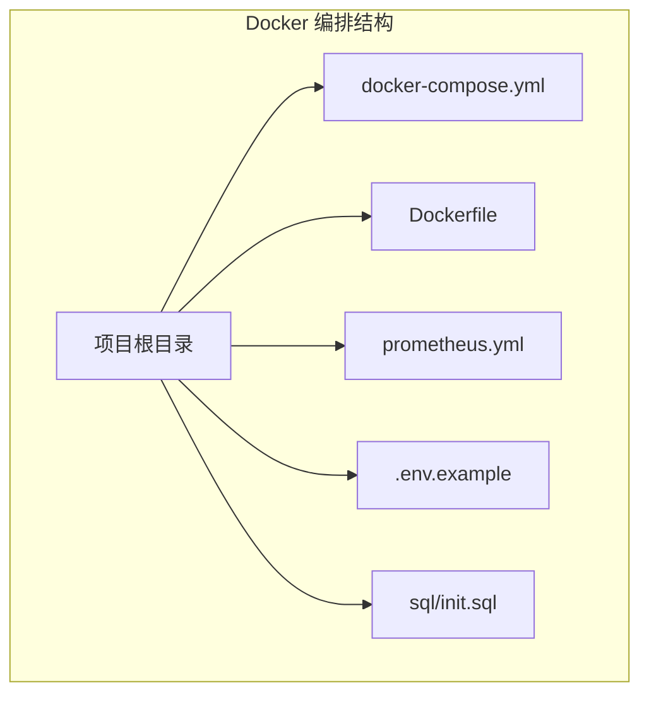
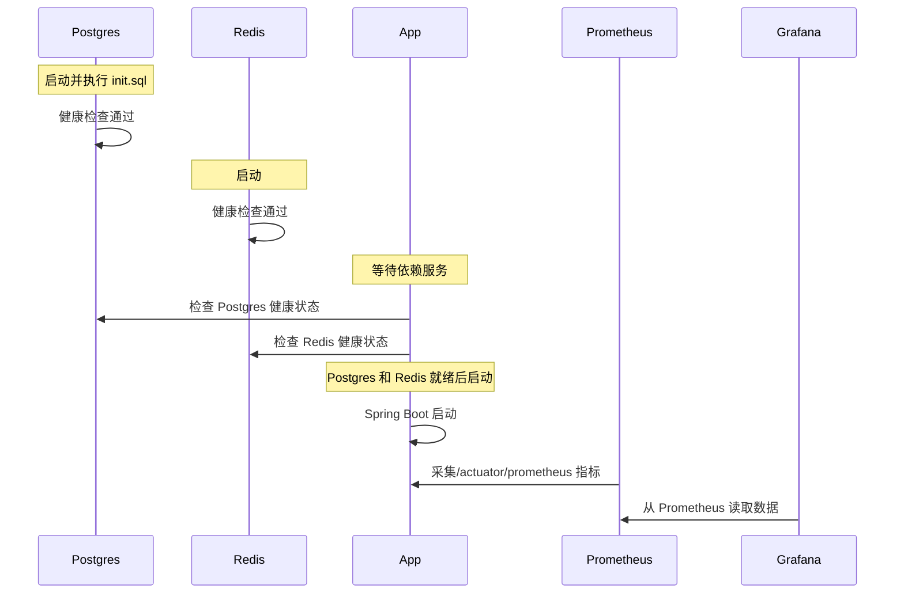
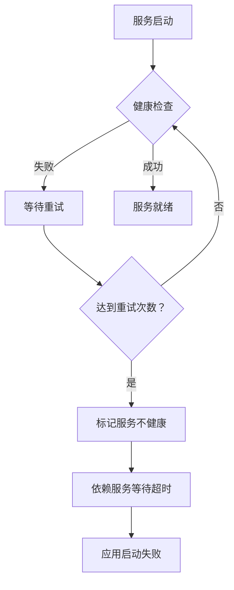

# Docker 容器编排

**本文档中引用的文件**
- [docker-compose.yml](../../../docker-compose.yml)
- [Dockerfile](../../../Dockerfile)
- [prometheus.yml](../../../prometheus.yml)
- [sql/init.sql](../../../sql/init.sql)
- [.env.example](../../../.env.example)

## 目录
1. [简介](#简介)
2. [项目结构](#项目结构)
3. [核心组件](#核心组件)
4. [架构概览](#架构概览)
5. [详细组件分析](#详细组件分析)
6. [配置参数详解](#配置参数详解)
7. [使用示例](#使用示例)
8. [监控与异常处理](#监控与异常处理)
9. [故障排除指南](#故障排除指南)
10. [总结](#总结)

## 简介

CompanyRag 项目采用 Docker Compose 进行容器化编排，实现了五个核心服务的自动化部署与管理。该编排方案基于 Docker Compose 3.8 版本，通过健康检查、依赖管理和数据卷持久化等机制，确保系统的稳定运行。

**技术选型**：
- 数据库：PostgreSQL 16 + pgvector（向量数据库扩展）
- 缓存：Redis 7（Alpine 精简版）
- 应用服务：Spring Boot 3.4 + Java 17（多阶段构建）
- 监控：Prometheus + Grafana
- 网络模式：默认桥接网络，服务间通过容器名通信

**主要特性**：
- 健康检查机制：Postgres 和 Redis 均配置了健康检查
- 依赖管理：应用服务等待数据库和缓存就绪后启动
- 数据持久化：所有关键数据均通过命名卷持久化
- 初始化脚本：Postgres 自动执行 SQL 初始化脚本

## 项目结构

Docker 容器编排主要涉及以下文件：



**图表来源**
- [docker-compose.yml](../../../docker-compose.yml)
- [Dockerfile](../../../Dockerfile)
- [prometheus.yml](../../../prometheus.yml)

## 核心组件

### Postgres 服务

PostgreSQL 16 数据库服务，集成 pgvector 向量扩展，提供向量存储和全文检索能力：

```yaml
postgres:
  image: pgvector/pgvector:pg16
  container_name: company-rag-postgres
  environment:
    POSTGRES_DB: company_rag
    POSTGRES_USER: postgres
    POSTGRES_PASSWORD: postgres
  ports:
    - "5432:5432"
  volumes:
    - pgdata:/var/lib/postgresql/data
    - ./sql/init.sql:/docker-entrypoint-initdb.d/init.sql
  healthcheck:
    test: ["CMD-SHELL", "pg_isready -U postgres"]
    interval: 5s
    timeout: 5s
    retries: 5
```

### Redis 服务

Redis 7 缓存服务，提供高速数据访问能力：

```yaml
redis:
  image: redis:7-alpine
  container_name: company-rag-redis
  ports:
    - "6379:6379"
  volumes:
    - redisdata:/data
  healthcheck:
    test: ["CMD", "redis-cli", "ping"]
    interval: 5s
    timeout: 3s
    retries: 5
```

### App 服务

Spring Boot 应用服务，采用多阶段构建优化镜像体积：

```yaml
app:
  build: .
  container_name: company-rag-app
  environment:
    SPRING_PROFILES_ACTIVE: prod
    DASHSCOPE_API_KEY: ${DASHSCOPE_API_KEY}
  ports:
    - "8080:8080"
  depends_on:
    postgres:
      condition: service_healthy
    redis:
      condition: service_healthy
  volumes:
    - uploads:/app/uploads
```

### Prometheus 服务

Prometheus 监控服务，采集应用指标数据：

```yaml
prometheus:
  image: prom/prometheus:latest
  container_name: company-rag-prometheus
  ports:
    - "9090:9090"
  volumes:
    - ./prometheus.yml:/etc/prometheus/prometheus.yml
    - promdata:/prometheus
```

### Grafana 服务

Grafana 可视化服务，展示监控仪表盘：

```yaml
grafana:
  image: grafana/grafana:latest
  container_name: company-rag-grafana
  ports:
    - "3000:3000"
  environment:
    GF_SECURITY_ADMIN_PASSWORD: admin
  volumes:
    - grafanadata:/var/lib/grafana
```

**章节来源**
- [docker-compose.yml](../../../docker-compose.yml)

## 架构概览

服务依赖关系和启动流程：



**图表来源**
- [docker-compose.yml](../../../docker-compose.yml)

## 详细组件分析

### Dockerfile 多阶段构建

构建阶段使用 Maven 镜像进行依赖下载和编译：

```dockerfile
# 构建阶段
FROM maven:3.9-eclipse-temurin-17 AS build
WORKDIR /build
COPY pom.xml .
COPY company-rag-common/pom.xml company-rag-common/
COPY company-rag-tenant/pom.xml company-rag-tenant/
COPY company-rag-document/pom.xml company-rag-document/
COPY company-rag-rag/pom.xml company-rag-rag/
COPY company-rag-agent/pom.xml company-rag-agent/
COPY company-rag-web/pom.xml company-rag-web/
COPY company-rag-bootstrap/pom.xml company-rag-bootstrap/
RUN mvn dependency:go-offline -B

COPY . .
RUN mvn package -DskipTests -B

# 运行阶段
FROM eclipse-temurin:17-jre
WORKDIR /app
COPY --from=build /build/company-rag-bootstrap/target/*.jar app.jar
EXPOSE 8080
ENTRYPOINT ["java", "-jar", "app.jar"]
```

**构建优化策略**：
1. **依赖缓存**：先复制 pom.xml 文件并下载依赖，利用 Docker 层缓存
2. **多阶段构建**：构建阶段和运行阶段分离，减少最终镜像体积
3. **JRE 精简镜像**：运行阶段使用 JRE 17 而非 JDK，减小镜像大小

**章节来源**
- [Dockerfile](../../../Dockerfile)

### 数据卷持久化

所有关键数据均通过命名卷持久化，防止容器重启后数据丢失：

| 数据卷名称 | 挂载路径 | 用途 |
|-----------|---------|------|
| pgdata | /var/lib/postgresql/data | PostgreSQL 数据库文件 |
| redisdata | /data | Redis 数据文件 |
| promdata | /prometheus | Prometheus 监控数据 |
| grafanadata | /var/lib/grafana | Grafana 配置和仪表盘 |
| uploads | /app/uploads | 应用上传文件 |

**章节来源**
- [docker-compose.yml](../../../docker-compose.yml)

## 配置参数详解

### 环境变量配置

通过 `.env` 文件注入的环境变量：

```yaml
# .env 文件内容示例
DASHSCOPE_API_KEY=your_dashscope_api_key_here
```

### 服务配置参数表

| 服务 | 参数 | 类型 | 默认值 | 描述 |
|------|------|------|--------|------|
| postgres | POSTGRES_DB | String | company_rag | 数据库名称 |
| postgres | POSTGRES_USER | String | postgres | 数据库用户名 |
| postgres | POSTGRES_PASSWORD | String | postgres | 数据库密码（生产环境需修改） |
| app | SPRING_PROFILES_ACTIVE | String | prod | Spring 激活的配置文件 |
| app | DASHSCOPE_API_KEY | String | - | 通义千问 API 密钥 |
| grafana | GF_SECURITY_ADMIN_PASSWORD | String | admin | Grafana 管理员密码 |

### 端口映射表

| 服务 | 容器端口 | 主机端口 | 用途 |
|------|---------|---------|------|
| postgres | 5432 | 5432 | PostgreSQL 数据库连接 |
| redis | 6379 | 6379 | Redis 缓存连接 |
| app | 8080 | 8080 | Spring Boot 应用服务 |
| prometheus | 9090 | 9090 | Prometheus 监控界面 |
| grafana | 3000 | 3000 | Grafana 可视化界面 |

**章节来源**
- [docker-compose.yml](../../../docker-compose.yml)
- [.env.example](../../../.env.example)

## 使用示例

### 基础启动

启动所有服务：

```bash
docker compose up -d
```

查看服务状态：

```bash
docker compose ps
```

### 查看日志

查看所有服务日志：

```bash
docker compose logs -f
```

查看特定服务日志：

```bash
docker compose logs -f app
docker compose logs -f postgres
```

### 停止服务

停止并删除容器（保留数据卷）：

```bash
docker compose down
```

停止并删除容器和数据卷（**数据会丢失**）：

```bash
docker compose down -v
```

### 重新构建应用

修改代码后重新构建并启动：

```bash
docker compose up -d --build
```

### 进入容器

进入应用容器进行调试：

```bash
docker exec -it company-rag-app bash
```

进入数据库容器：

```bash
docker exec -it company-rag-postgres psql -U postgres -d company_rag
```

**章节来源**
- [docker-compose.yml](../../../docker-compose.yml)

## 监控与异常处理

### Prometheus 监控配置

Prometheus 通过以下配置采集应用指标：

```yaml
global:
  scrape_interval: 15s
  evaluation_interval: 15s

scrape_configs:
  - job_name: 'company-rag'
    metrics_path: '/actuator/prometheus'
    static_configs:
      - targets: ['app:8080']
        labels:
          application: 'company-rag'
```

**监控指标**：
- JVM 内存使用情况
- HTTP 请求延迟和吞吐量
- 数据库连接池状态
- 向量检索性能指标

**章节来源**
- [prometheus.yml](../../../prometheus.yml)

### 健康检查机制

**Postgres 健康检查**：
- 检测命令：`pg_isready -U postgres`
- 检测间隔：5 秒
- 超时时间：5 秒
- 重试次数：5 次

**Redis 健康检查**：
- 检测命令：`redis-cli ping`
- 检测间隔：5 秒
- 超时时间：3 秒
- 重试次数：5 次

### 异常处理流程



**章节来源**
- [docker-compose.yml](../../../docker-compose.yml)

## 故障排除指南

### 常见问题及解决方案

#### 1. 应用服务启动失败

**问题现象**：
- `company-rag-app` 容器反复重启
- 日志显示 "Connection refused" 错误

**排查步骤**：
1. 检查 Postgres 和 Redis 是否健康：
   ```bash
   docker compose ps
   ```
2. 查看应用日志：
   ```bash
   docker compose logs app
   ```
3. 检查环境变量是否正确配置：
   ```bash
   docker compose config
   ```

**解决方案**：
- 确保 `.env` 文件中配置了正确的 `DASHSCOPE_API_KEY`
- 等待 Postgres 和 Redis 健康检查通过后再启动应用

#### 2. 数据库初始化失败

**问题现象**：
- 数据库表未创建
- 应用启动时报表不存在的错误

**排查步骤**：
1. 检查 init.sql 文件是否存在：
   ```bash
   ls sql/init.sql
   ```
2. 查看 Postgres 日志：
   ```bash
   docker compose logs postgres
   ```

**解决方案**：
- 确保 `sql/init.sql` 文件存在于项目根目录
- 删除数据卷并重新初始化（**注意：会丢失数据**）：
  ```bash
  docker compose down -v
  docker compose up -d
  ```

#### 3. 端口冲突

**问题现象**：
- 容器启动失败，提示 "Address already in use"

**排查步骤**：
1. 检查端口占用情况：
   ```bash
   netstat -ano | findstr :8080
   netstat -ano | findstr :5432
   ```

**解决方案**：
- 停止占用端口的其他服务
- 或修改 `docker-compose.yml` 中的端口映射

### 监控和调试

#### 启用调试日志

在 `application-prod.yml` 中配置：

```yaml
logging:
  level:
    com.company.rag: DEBUG
```

#### 监控命令

查看容器资源使用：
```bash
docker stats
```

查看网络配置：
```bash
docker network inspect company-rag_default
```

**章节来源**
- [docker-compose.yml](../../../docker-compose.yml)
- [prometheus.yml](../../../prometheus.yml)

## 性能考虑

### 镜像构建优化

1. **依赖缓存**：通过先复制 pom.xml 并下载依赖，利用 Docker 层缓存机制
2. **多阶段构建**：构建阶段和运行阶段分离，最终镜像仅包含 JRE 和 jar 包
3. **跳过测试**：构建时使用 `-DskipTests` 参数加速构建过程

### 数据库性能

1. **pgvector 索引**：使用 HNSW 索引（m=16, ef_construction=64）优化向量检索
2. **全文检索**：使用 pg_trgm 扩展支持模糊匹配
3. **连接池**：通过 HikariCP 配置合理的连接池大小

### 缓存策略

1. **Redis 持久化**：通过数据卷持久化 Redis 数据
2. **内存管理**：合理配置 Redis 内存限制，避免 OOM

## 总结

CompanyRag 的 Docker 容器编排方案具有以下核心特点：

1. **服务依赖管理**：通过 `depends_on` 和健康检查确保服务按正确顺序启动
2. **数据持久化**：所有关键数据通过命名卷持久化，防止数据丢失
3. **监控完善**：集成 Prometheus 和 Grafana，提供完整的可观测性
4. **构建优化**：多阶段构建减少镜像体积，提高部署效率
5. **健康检查**：关键服务配置健康检查，确保系统稳定性

**典型应用场景**：
- 本地开发环境快速搭建
- 测试环境自动化部署
- 生产环境容器化部署（需调整安全配置）

**安全提示**：
- 生产环境需修改默认密码（Postgres、Grafana）
- 敏感信息通过环境变量注入，不要硬编码在配置文件中
- 考虑使用 Docker Secret 管理敏感配置
