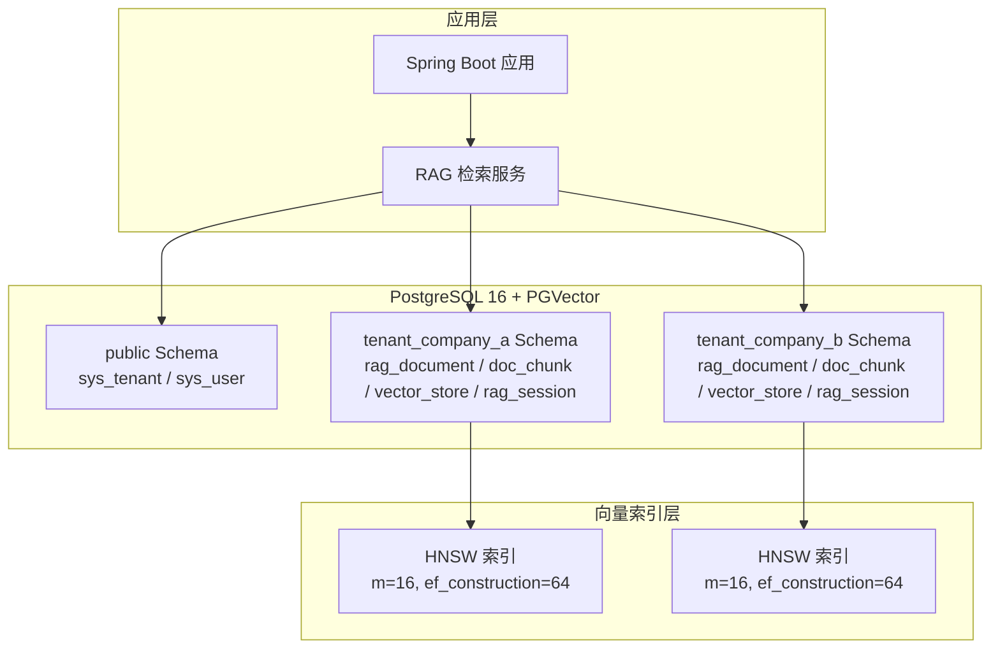
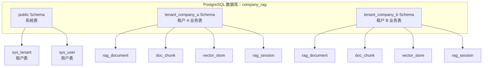

# PostgreSQL 与 PGVector

**本文档引用的文件**
- [docker-compose.yml](../../../docker-compose.yml)
- [sql/init.sql](../../../sql/init.sql)
- [application.yml](../../../company-rag-bootstrap/src/main/resources/application.yml)
- [TenantServiceImpl.java](../../../company-rag-tenant/src/main/java/com/company/rag/tenant/service/impl/TenantServiceImpl.java)
- [项目概述.md](../项目概述.md)

## 目录
1. [简介](#简介)
2. [架构概览](#架构概览)
3. [核心组件](#核心组件)
4. [详细配置分析](#详细配置分析)
5. [Schema 隔离机制](#schema 隔离机制)
6. [向量存储配置](#向量存储配置)
7. [HNSW 索引详解](#hnsw 索引详解)
8. [行级安全策略](#行级安全策略)
9. [配置参数详解](#配置参数详解)
10. [使用示例](#使用示例)
11. [故障排除指南](#故障排除指南)
12. [总结](#总结)

## 简介

CompanyRag 使用 **PostgreSQL 16 + PGVector** 作为向量数据库，提供高效的向量相似度检索能力。PGVector 是 PostgreSQL 的开源向量相似度搜索扩展，支持多种索引类型和距离算法。

**技术选型**：
- **数据库版本**：PostgreSQL 16
- **向量扩展**：PGVector（通过 `pgvector/pgvector:pg16` 镜像提供）
- **向量维度**：1024 维
- **距离算法**：COSINE_DISTANCE（余弦距离）
- **索引类型**：HNSW（Hierarchical Navigable Small World）
- **索引参数**：m = 16, ef_construction = 64

**核心特性**：
1. **高效向量检索**：HNSW 索引支持百万级向量的毫秒级检索
2. **混合查询能力**：支持向量检索与传统 SQL 条件的组合查询
3. **Schema 物理隔离**：每个租户独立 Schema，数据完全隔离
4. **行级安全**：RLS（Row Level Security）策略保障多租户数据安全
5. **全文检索增强**：集成 `pg_trgm` 扩展支持模糊匹配和关键词检索

来源：[docker-compose.yml](../../../docker-compose.yml)(L4-L20)，[application.yml](../../../company-rag-bootstrap/src/main/resources/application.yml)(L25-L30)

## 架构概览



**图表来源**
- [docker-compose.yml](../../../docker-compose.yml)
- [sql/init.sql](../../../sql/init.sql)
- [TenantServiceImpl.java](../../../company-rag-tenant/src/main/java/com/company/rag/tenant/service/impl/TenantServiceImpl.java)

## 核心组件

### PGVector 扩展

PGVector 为 PostgreSQL 提供向量数据类型和相似度检索能力：

```sql
-- 创建 vector 扩展
CREATE EXTENSION IF NOT EXISTS vector;

-- 创建 pg_trgm 扩展（用于全文检索）
CREATE EXTENSION IF NOT EXISTS pg_trgm;
```

**向量数据类型**：
- `vector(n)`：n 维向量，本项目使用 `vector(1024)`
- 支持的操作符：
  - `<->`：欧氏距离（L2）
  - `<#>`：负内积（用于最大内积搜索）
  - `<=>`：余弦距离（本项目使用）

来源：[sql/init.sql](../../../sql/init.sql)(L11-L12)

### 向量存储表

```sql
CREATE TABLE vector_store (
    id UUID PRIMARY KEY,
    content TEXT,
    metadata JSONB,
    embedding vector(1024)
);
```

**字段说明**：
| 字段 | 类型 | 描述 |
|------|------|------|
| id | UUID | 向量记录唯一标识 |
| content | TEXT | 原始文本内容 |
| metadata | JSONB | 元数据（文档 ID、切分索引等） |
| embedding | vector(1024) | 1024 维向量数据 |

来源：[sql/init.sql](../../../sql/init.sql)(L79-L84)，[TenantServiceImpl.java](../../../company-rag-tenant/src/main/java/com/company/rag/tenant/service/impl/TenantServiceImpl.java)(L76-L81)

## 详细组件分析

### Docker 容器编排

PostgreSQL 通过 Docker Compose 部署，配置如下：

```yaml
services:
  postgres:
    image: pgvector/pgvector:pg16
    container_name: company-rag-postgres
    environment:
      POSTGRES_DB: company_rag
      POSTGRES_USER: postgres
      POSTGRES_PASSWORD: postgres
    ports:
      - "5432:5432"
    volumes:
      - pgdata:/var/lib/postgresql/data
      - ./sql/init.sql:/docker-entrypoint-initdb.d/init.sql
    healthcheck:
      test: ["CMD-SHELL", "pg_isready -U postgres"]
      interval: 5s
      timeout: 5s
      retries: 5
```

**配置说明**：
- **镜像**：`pgvector/pgvector:pg16` — 预装 PGVector 扩展的 PostgreSQL 16
- **数据库名**：`company_rag`
- **端口映射**：5432（容器）→ 5432（宿主机）
- **数据持久化**：`pgdata` 卷
- **初始化脚本**：自动执行 `sql/init.sql`
- **健康检查**：每 5 秒检测数据库可用性

来源：[docker-compose.yml](../../../docker-compose.yml)(L4-L20)

### Spring AI 配置

Spring AI 1.0 通过 `application.yml` 配置 PGVector：

```yaml
spring:
  vectorstore:
    pgvector:
      index-type: HNSW
      distance-type: COSINE_DISTANCE
      dimension: 1024
      remove-existing-vector-store-table: false
```

**配置参数说明**：
| 参数 | 值 | 描述 |
|------|-----|------|
| index-type | HNSW | 索引类型（HNSW / IVFFlat） |
| distance-type | COSINE_DISTANCE | 距离算法（余弦距离） |
| dimension | 1024 | 向量维度 |
| remove-existing-vector-store-table | false | 启动时不删除已有表 |

来源：[application.yml](../../../company-rag-bootstrap/src/main/resources/application.yml)(L25-L30)

## Schema 隔离机制

### 多租户 Schema 架构

CompanyRag 采用 **Schema 物理隔离** 实现多租户：



**图表来源**
- [sql/init.sql](../../../sql/init.sql)(L14-L46)
- [TenantServiceImpl.java](../../../company-rag-tenant/src/main/java/com/company/rag/tenant/service/impl/TenantServiceImpl.java)(L40-L136)

### Schema 创建流程

创建新租户时，自动创建独立 Schema 和业务表：

```java
@Override
@Transactional
public void createTenantSchema(Tenant tenant) {
    String schemaName = "tenant_" + tenant.getTenantCode();
    
    // 1. 创建独立 Schema
    jdbcTemplate.execute("CREATE SCHEMA IF NOT EXISTS " + schemaName);
    
    // 2. 在 Schema 中创建业务表
    String createTableSql = """
        CREATE TABLE IF NOT EXISTS %s.rag_document (...);
        CREATE TABLE IF NOT EXISTS %s.doc_chunk (...);
        CREATE TABLE IF NOT EXISTS %s.vector_store (
            id UUID PRIMARY KEY,
            content TEXT,
            metadata JSONB,
            embedding vector(1024)
        );
        CREATE TABLE IF NOT EXISTS %s.rag_session (...);
        """.formatted(schemaName, schemaName, schemaName, schemaName, schemaName);
    jdbcTemplate.execute(createTableSql);
    
    // 3. 创建索引（包括 HNSW 向量索引）
    // 4. 启用 RLS 并创建策略
    // 5. 更新租户记录
}
```

来源：[TenantServiceImpl.java](../../../company-rag-tenant/src/main/java/com/company/rag/tenant/service/impl/TenantServiceImpl.java)(L40-L136)

### Schema 切换机制

应用通过 `currentSchema` 参数动态切换 Schema：

```yaml
# 生产环境配置示例
spring:
  datasource:
    url: jdbc:postgresql://postgres:5433/company_rag?currentSchema=public
```

**注意**：实际运行时，Schema 切换由 `TenantContextHelper` 在请求拦截器中动态设置，不能依赖连接 URL 的 `currentSchema` 参数。

来源：[application-prod.yml](../../../company-rag-bootstrap/src/main/resources/application-prod.yml)(L3-L4)

## 向量存储配置

### 向量表结构

每个租户 Schema 中包含 `vector_store` 表：

```sql
CREATE TABLE vector_store (
    id UUID PRIMARY KEY,          -- 向量 ID（UUID）
    content TEXT,                 -- 原始文本内容
    metadata JSONB,               -- 元数据（JSON 格式）
    embedding vector(1024)        -- 1024 维向量
);
```

### 元数据字段说明

`metadata` 字段存储与向量相关的上下文信息：

```json
{
  "document_id": 12345,           -- 文档 ID
  "chunk_index": 3,               -- 切分块索引
  "tenant_id": 1,                 -- 租户 ID
  "file_name": "技术手册.pdf",     -- 文件名
  "split_strategy": "semantic"    -- 切分策略
}
```

### 向量生成流程

1. 文档上传 → Apache Tika 解析
2. 文本切分 → 生成多个 chunk
3. 调用 Embedding API（text-embedding-v3）→ 生成 1024 维向量
4. 插入 `vector_store` 表
5. HNSW 索引自动更新

来源：[TenantServiceImpl.java](../../../company-rag-tenant/src/main/java/com/company/rag/tenant/service/impl/TenantServiceImpl.java)(L76-L81)

## HNSW 索引详解

### HNSW 索引原理

HNSW（Hierarchical Navigable Small World）是一种基于图的近似最近邻搜索算法，具有以下特点：

1. **分层结构**：上层为长距离导航层，下层为精细搜索层
2. **小世界网络**：节点间通过短路径连接，搜索效率高
3. **动态更新**：支持增量插入，无需重建索引

### 索引创建语句

```sql
CREATE INDEX idx_vector_store_embedding ON vector_store
    USING hnsw (embedding vector_cosine_ops)
    WITH (m = 16, ef_construction = 64);
```

**参数说明**：
| 参数 | 值 | 含义 | 影响 |
|------|-----|------|------|
| m | 16 | 每层最大连接数 | 越大检索越准，但内存占用越高 |
| ef_construction | 64 | 构建时的搜索范围 | 越大索引质量越高，但构建越慢 |

### 性能特征

- **检索速度**：百万级向量毫秒级返回
- **内存占用**：约为向量数据量的 1.5-2 倍
- **适用场景**：高维向量（1024 维）、大规模数据集
- **距离算法**：`vector_cosine_ops`（余弦距离）

### 索引调优建议

| 场景 | m 值 | ef_construction | 说明 |
|------|------|-----------------|------|
| 小规模（<10 万） | 8-16 | 32-64 | 快速构建，低内存 |
| 中等规模（10 万 -100 万） | 16-32 | 64-128 | 平衡性能与精度 |
| 大规模（>100 万） | 32-64 | 128-256 | 高精度检索 |

**当前配置**：m=16, ef_construction=64 — 适用于中小规模企业知识库

来源：[sql/init.sql](../../../sql/init.sql)(L85-L87)，[TenantServiceImpl.java](../../../company-rag-tenant/src/main/java/com/company/rag/tenant/service/impl/TenantServiceImpl.java)(L105-L106)

## 行级安全策略

### RLS（Row Level Security）启用

为每个租户表启用行级安全：

```sql
-- 启用 RLS
ALTER TABLE tenant_company_a.rag_document ENABLE ROW LEVEL SECURITY;
ALTER TABLE tenant_company_a.doc_chunk ENABLE ROW LEVEL SECURITY;
ALTER TABLE tenant_company_a.rag_session ENABLE ROW LEVEL SECURITY;

-- 创建 RLS 策略
CREATE POLICY tenant_isolation_document ON tenant_company_a.rag_document
    USING (tenant_id = current_tenant_id() OR current_user = 'postgres');
```

### RLS 辅助函数

```sql
-- 设置当前租户 ID
CREATE OR REPLACE FUNCTION set_tenant_id(p_tenant_id BIGINT) RETURNS VOID AS $$
BEGIN
    EXECUTE format('SET LOCAL app.tenant_id = %L', p_tenant_id);
END;
$$ LANGUAGE plpgsql;

-- 获取当前租户 ID
CREATE OR REPLACE FUNCTION current_tenant_id() RETURNS BIGINT AS $$
BEGIN
    RETURN COALESCE(current_setting('app.tenant_id', true)::BIGINT, 0);
END;
$$ LANGUAGE plpgsql STABLE;
```

**工作原理**：
1. 请求进入时，应用层调用 `set_tenant_id(tenantId)`
2. 当前事务中所有 SQL 自动携带租户过滤条件
3. RLS 策略确保只能访问当前租户的数据

来源：[sql/init.sql](../../../sql/init.sql)(L112-L148)，[TenantServiceImpl.java](../../../company-rag-tenant/src/main/java/com/company/rag/tenant/service/impl/TenantServiceImpl.java)(L114-L130)

## 配置参数详解

### 数据库连接配置

```yaml
spring:
  datasource:
    url: jdbc:postgresql://${POSTGRES_HOST:localhost}:${POSTGRES_PORT:5433}/${POSTGRES_DB:company_rag}
    username: ${POSTGRES_USER:postgres}
    password: ${POSTGRES_PASSWORD:}
    driver-class-name: org.postgresql.Driver
```

**环境变量**：
| 变量 | 默认值 | 描述 |
|------|--------|------|
| POSTGRES_HOST | localhost | PostgreSQL 主机地址 |
| POSTGRES_PORT | 5433 | PostgreSQL 端口 |
| POSTGRES_DB | company_rag | 数据库名 |
| POSTGRES_USER | postgres | 用户名 |
| POSTGRES_PASSWORD | (空) | 密码（生产环境必须设置） |

### PGVector 专用配置

```yaml
spring:
  vectorstore:
    pgvector:
      index-type: HNSW              # 索引类型
      distance-type: COSINE_DISTANCE # 距离算法
      dimension: 1024               # 向量维度
      remove-existing-vector-store-table: false  # 不删除已有表
```

### 其他相关配置

```yaml
mybatis-plus:
  configuration:
    map-underscore-to-camel-case: true  # 下划线转驼峰
    log-impl: org.apache.ibatis.logging.stdout.StdOutImpl  # SQL 日志
```

来源：[application.yml](../../../company-rag-bootstrap/src/main/resources/application.yml)(L18-L55)

## 使用示例

### 向量检索示例

```sql
-- 查询与给定向量最相似的 10 条记录
SELECT id, content, metadata, 
       1 - (embedding <=> '[0.1, 0.2, ..., 0.9]'::vector) AS similarity
FROM tenant_company_a.vector_store
ORDER BY embedding <=> '[0.1, 0.2, ..., 0.9]'::vector
LIMIT 10;
```

**说明**：
- `<=>` 为余弦距离操作符，值越小越相似
- `1 - distance` 得到相似度（0-1 之间）

### 混合检索示例

结合向量检索和关键词过滤：

```sql
-- 向量检索 + 元数据过滤
SELECT id, content, metadata,
       1 - (embedding <=> $1::vector) AS similarity
FROM tenant_company_a.vector_store
WHERE metadata->>'document_id' = '12345'
ORDER BY embedding <=> $1::vector
LIMIT 5;
```

### 全文检索示例

利用 `pg_trgm` 扩展进行模糊匹配：

```sql
-- 使用 trigram 索引进行模糊搜索
SELECT id, title, content
FROM tenant_company_a.rag_document
WHERE title ILIKE '%知识库%'
   OR content ILIKE '%知识库%';
```

来源：[TenantServiceImpl.java](../../../company-rag-tenant/src/main/java/com/company/rag/tenant/service/impl/TenantServiceImpl.java)(L102-L103)

## 故障排除指南

### 常见问题及解决方案

#### 1. PGVector 扩展未安装

**问题现象**：
```
ERROR: type "vector" does not exist
```

**排查步骤**：
1. 检查是否使用正确的镜像：`pgvector/pgvector:pg16`
2. 确认扩展已创建：`SELECT * FROM pg_extension WHERE extname = 'vector';`

**解决方案**：
```sql
CREATE EXTENSION IF NOT EXISTS vector;
```

#### 2. HNSW 索引创建失败

**问题现象**：
```
ERROR: data type vector has no default operator class for access method hnsw
```

**排查步骤**：
1. 确认 PGVector 版本支持 HNSW（v0.5.0+）
2. 检查是否指定了操作符类

**解决方案**：
```sql
-- 明确指定操作符类
CREATE INDEX idx_embedding ON vector_store
    USING hnsw (embedding vector_cosine_ops)
    WITH (m = 16, ef_construction = 64);
```

#### 3. Schema 不存在错误

**问题现象**：
```
ERROR: schema "tenant_xxx" does not exist
```

**排查步骤**：
1. 检查租户是否已初始化 Schema
2. 查看 `sys_tenant` 表中 `schema_name` 字段

**解决方案**：
```bash
# 调用租户创建 API
curl -X POST http://localhost:8080/api/tenants \
  -H "Content-Type: application/json" \
  -d '{"tenantCode": "company_a", "tenantName": "公司 A"}'
```

#### 4. RLS 策略阻止访问

**问题现象**：
```
ERROR: new row violates row-level security policy for table "rag_document"
```

**排查步骤**：
1. 检查 `app.tenant_id` 是否正确设置
2. 确认当前用户是否为 `postgres`（超级用户绕过 RLS）

**解决方案**：
```sql
-- 手动设置租户 ID
SELECT set_tenant_id(1);

-- 检查当前租户 ID
SELECT current_tenant_id();
```

### 监控和调试

#### 启用 SQL 日志

```yaml
mybatis-plus:
  configuration:
    log-impl: org.apache.ibatis.logging.stdout.StdOutImpl

logging:
  level:
    com.company.rag: DEBUG
```

#### 查看索引使用情况

```sql
-- 查看所有索引
SELECT schemaname, tablename, indexname, indexdef
FROM pg_indexes
WHERE schemaname = 'tenant_company_a';

-- 查看 HNSW 索引统计
SELECT indexname, pg_size_pretty(pg_relation_size(indexname::regclass))
FROM pg_indexes
WHERE tablename = 'vector_store';
```

#### 性能分析

```sql
-- 启用执行计划分析
EXPLAIN ANALYZE
SELECT id, content
FROM tenant_company_a.vector_store
ORDER BY embedding <=> $1::vector
LIMIT 10;
```

来源：[sql/init.sql](../../../sql/init.sql)(L138-L148)，[application.yml](../../../company-rag-bootstrap/src/main/resources/application.yml)(L86-L93)

## 总结

PostgreSQL 16 + PGVector 为 CompanyRag 提供了强大的向量存储和检索能力：

1. **HNSW 索引**：m=16, ef_construction=64，支持百万级向量毫秒级检索
2. **余弦距离**：`COSINE_DISTANCE` 算法，适合文本相似度计算
3. **Schema 隔离**：每个租户独立 Schema，数据物理隔离
4. **行级安全**：RLS 策略 + `current_tenant_id()` 函数，保障多租户数据安全
5. **混合检索**：向量检索 + 关键词过滤 + 模糊匹配（pg_trgm）
6. **容器化部署**：Docker Compose 一键部署，自动初始化

**核心价值**：
- 高性能：HNSW 索引保障检索速度
- 高安全：Schema 隔离 + RLS 双重保障
- 易扩展：支持动态创建租户 Schema
- 易维护：容器化部署 + 健康检查

来源：[docker-compose.yml](../../../docker-compose.yml)，[sql/init.sql](../../../sql/init.sql)，[TenantServiceImpl.java](../../../company-rag-tenant/src/main/java/com/company/rag/tenant/service/impl/TenantServiceImpl.java)
