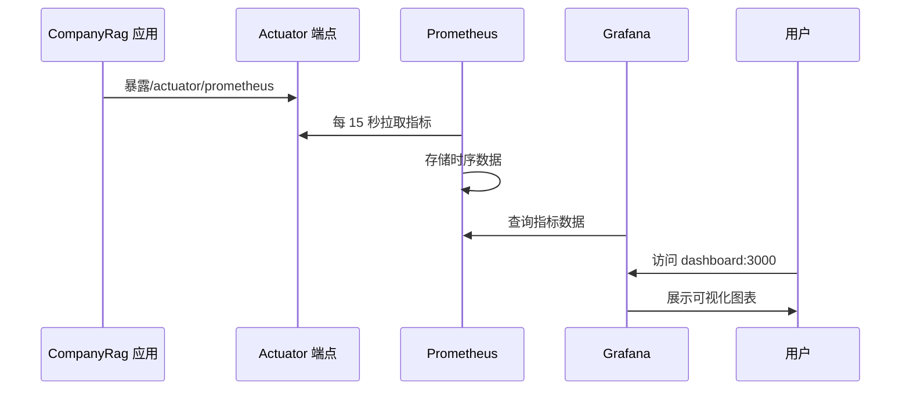

# Prometheus 与 Grafana

**本文档中引用的文件**
- [prometheus.yml](../../../prometheus.yml)
- [docker-compose.yml](../../../docker-compose.yml)
- [README.md](../../../README.md)
- [application-prod.yml](../../../company-rag-bootstrap/src/main/resources/application-prod.yml)

## 目录
1. [简介](#简介)
2. [项目结构](#项目结构)
3. [核心组件](#核心组件)
4. [架构概览](#架构概览)
5. [详细组件分析](#详细组件分析)
6. [配置参数详解](#配置参数详解)
7. [使用示例](#使用示例)
8. [监控与异常处理](#监控与异常处理)
9. [性能考虑](#性能考虑)
10. [故障排除指南](#故障排除指南)
11. [总结](#总结)

## 简介

CompanyRag 的可观测性平台基于 **Prometheus + Grafana** 构建，提供完整的监控指标采集、存储和可视化能力。系统通过 Spring Boot Actuator 暴露 Micrometer 指标，Prometheus 定期拉取并存储时序数据，Grafana 提供可视化面板展示。

**核心价值**：
- 实时监控应用健康状态（JVM、HTTP 请求、RAG 检索等）
- 追踪关键业务指标（请求数、延迟、召回率、Token 消耗）
- 快速定位性能瓶颈和异常问题
- 支持容量规划和趋势分析

**技术选型**：
- **Prometheus**：开源监控系统，拉取式指标采集
- **Grafana**：可视化平台，支持多种数据源
- **Micrometer**：应用指标埋点库，Spring Boot 集成
- **Spring Boot Actuator**：健康检查和指标暴露端点

## 项目结构

可观测性相关配置和组件分布如下：

```mermaid
graph TB
subgraph "可观测性模块结构"
A[根目录] --> B[prometheus.yml]
A --> C[docker-compose.yml]
A --> D[Actuator 端点]
A --> E[Micrometer 指标]
end

subgraph "配置层"
B --> F[采集间隔配置]
B --> G[采集目标配置]
C --> H[Prometheus 容器]
C --> I[Grafana 容器]
end

subgraph "应用层"
D --> J[/actuator/prometheus]
D --> K[/actuator/health]
E --> L[HTTP 请求指标]
E --> M[JVM 指标]
E --> N[业务指标]
end
```

**图表来源**
- [prometheus.yml](../../../prometheus.yml)
- [docker-compose.yml](../../../docker-compose.yml)
- [README.md](../../../README.md)

## 核心组件

### Prometheus Server

Prometheus 服务器负责定期拉取并存储指标数据：

```yaml
# prometheus.yml 核心配置
global:
  scrape_interval: 15s      # 全局采集间隔
  evaluation_interval: 15s  # 规则评估间隔

scrape_configs:
  - job_name: 'company-rag'
    metrics_path: '/actuator/prometheus'
    static_configs:
      - targets: ['app:8080']
        labels:
          application: 'company-rag'
```

**关键特性**：
- 15 秒采集频率，平衡实时性和存储成本
- 通过 Docker 网络访问应用端点 `app:8080`
- 使用 `/actuator/prometheus` 端点获取 Micrometer 格式指标

### Grafana Dashboard

Grafana 提供可视化面板，支持指标查询和告警：

```yaml
# docker-compose.yml 中的 Grafana 配置
grafana:
  image: grafana/grafana:latest
  container_name: company-rag-grafana
  ports:
    - "3000:3000"
  environment:
    GF_SECURITY_ADMIN_PASSWORD: admin
  volumes:
    - grafanadata:/var/lib/grafana
```

**关键特性**：
- 默认端口 3000，管理员密码 `admin`
- 数据持久化到 `grafanadata` 卷
- 需手动配置 Prometheus 数据源（http://prometheus:9090）

### Spring Boot Actuator

应用通过 Actuator 暴露监控端点：

```yaml
# 应用配置推断（基于 README 和标准实践）
management:
  endpoints:
    web:
      exposure:
        include: health,info,prometheus,metrics
  endpoint:
    health:
      show-details: always
```

**暴露端点**：
- `/actuator/health`：健康检查
- `/actuator/prometheus`：Prometheus 格式指标
- `/actuator/metrics`：原始指标数据

**章节来源**
- [prometheus.yml](../../../prometheus.yml)
- [docker-compose.yml](../../../docker-compose.yml)
- [README.md](../../../README.md)

## 架构概览

可观测性平台的数据流和组件交互如下：



**数据流说明**：
1. 应用启动后，Micrometer 自动注册 JVM、HTTP 等指标
2. Prometheus 每 15 秒从 `/actuator/prometheus` 拉取最新指标
3. 指标数据存储在 Prometheus TSDB 中
4. Grafana 连接 Prometheus 数据源，提供查询和可视化
5. 用户通过浏览器访问 Grafana 面板查看监控数据

**章节来源**
- [README.md](../../../README.md)
- [docker-compose.yml](../../../docker-compose.yml)

## 详细组件分析

### Prometheus 配置详解

**全局配置段**：

```yaml
global:
  scrape_interval: 15s      # 采集间隔，默认 15 秒
  evaluation_interval: 15s  # 告警规则评估间隔
```

**采集任务配置**：

```yaml
scrape_configs:
  - job_name: 'company-rag'
    metrics_path: '/actuator/prometheus'  # 指标端点路径
    static_configs:
      - targets: ['app:8080']              # 目标地址（Docker 网络）
        labels:
          application: 'company-rag'       # 指标标签
```

**关键参数说明**：
- `job_name`：任务标识，用于指标分组
- `metrics_path`：默认为 `/metrics`，Spring Boot 使用 `/actuator/prometheus`
- `static_configs`：静态目标配置，生产环境可替换为服务发现
- `labels`：附加到所有指标的标签，支持多维度过滤

### Docker Compose 部署配置

**Prometheus 服务**：

```yaml
prometheus:
  image: prom/prometheus:latest
  container_name: company-rag-prometheus
  ports:
    - "9090:9090"
  volumes:
    - ./prometheus.yml:/etc/prometheus/prometheus.yml
    - promdata:/prometheus
```

**配置说明**：
- 端口映射：9090（访问 Prometheus UI）
- 配置文件挂载：`./prometheus.yml` → `/etc/prometheus/prometheus.yml`
- 数据持久化：`promdata` 卷存储时序数据

**Grafana 服务**：

```yaml
grafana:
  image: grafana/grafana:latest
  container_name: company-rag-grafana
  ports:
    - "3000:3000"
  environment:
    GF_SECURITY_ADMIN_PASSWORD: admin
  volumes:
    - grafanadata:/var/lib/grafana
```

**配置说明**：
- 端口映射：3000（访问 Grafana UI）
- 管理员密码：通过环境变量 `GF_SECURITY_ADMIN_PASSWORD` 设置
- 数据持久化：`grafanadata` 卷存储 dashboard 和数据源配置

**章节来源**
- [prometheus.yml](../../../prometheus.yml)
- [docker-compose.yml](../../../docker-compose.yml)

## 配置参数详解

### Prometheus 配置参数

| 参数 | 类型 | 默认值 | 描述 |
|------|------|--------|------|
| `scrape_interval` | duration | 15s | 全局指标采集间隔 |
| `evaluation_interval` | duration | 15s | 告警规则评估间隔 |
| `job_name` | string | - | 采集任务名称 |
| `metrics_path` | string | /metrics | 指标端点路径 |
| `targets` | list | - | 采集目标地址列表 |
| `labels` | map | - | 附加到指标的标签 |

### Docker Compose 环境变量

| 环境变量 | 服务 | 默认值 | 描述 |
|----------|------|--------|------|
| `GF_SECURITY_ADMIN_PASSWORD` | grafana | admin | Grafana 管理员密码 |
| `SPRING_PROFILES_ACTIVE` | app | - | Spring 激活的 profile |
| `DASHSCOPE_API_KEY` | app | - | 通义千问 API 密钥 |

### 端口映射表

| 服务 | 容器端口 | 主机端口 | 说明 |
|------|----------|----------|------|
| Prometheus | 9090 | 9090 | Prometheus UI |
| Grafana | 3000 | 3000 | Grafana Dashboard |
| CompanyRag | 8080 | 8080 | 应用服务 |

**章节来源**
- [prometheus.yml](../../../prometheus.yml)
- [docker-compose.yml](../../../docker-compose.yml)

## 使用示例

### 启动监控服务

**方式一：单独启动 Prometheus 和 Grafana**

```bash
# 启动 Prometheus 和 Grafana（不包括应用）
docker compose up -d prometheus grafana
```

**方式二：完整部署（推荐）**

```bash
# 设置环境变量
export DASHSCOPE_API_KEY=sk-your-api-key
export SILICONFLOW_API_KEY=sk-your-siliconflow-key

# 启动所有服务
docker compose up -d
```

**验证服务状态**：

```bash
# 查看容器运行状态
docker compose ps

# 查看 Prometheus 日志
docker logs company-rag-prometheus

# 查看 Grafana 日志
docker logs company-rag-grafana
```

### 配置 Grafana 数据源

1. **访问 Grafana**：http://localhost:3000（默认账号 admin/admin）

2. **添加 Prometheus 数据源**：
   - 导航到：Configuration → Data Sources → Add data source
   - 选择：Prometheus
   - 配置 URL：`http://prometheus:9090`（Docker 网络内部地址）
   - 点击：Save & Test

3. **导入 Dashboard**：
   - 导航到：Dashboards → Import
   - 输入 ID：使用 Spring Boot 官方模板（如 10280）
   - 或手动创建自定义面板

### 查询指标示例

**PromQL 查询示例**：

```promql
# HTTP 请求速率（每秒请求数）
rate(http_server_requests_seconds_count{application="company-rag"}[1m])

# 平均响应时间
rate(http_server_requests_seconds_sum{application="company-rag"}[1m]) 
/ 
rate(http_server_requests_seconds_count{application="company-rag"}[1m])

# JVM 内存使用率
jvm_memory_used_bytes{application="company-rag", area="heap"} 
/ 
jvm_memory_max_bytes{application="company-rag", area="heap"}

# 活跃线程数
jvm_threads_live_threads{application="company-rag"}
```

**章节来源**
- [docker-compose.yml](../../../docker-compose.yml)
- [README.md](../../../README.md)

## 监控与异常处理

### 监控指标分类

**JVM 指标**：
- `jvm_memory_used_bytes`：内存使用量
- `jvm_memory_max_bytes`：内存最大值
- `jvm_threads_live_threads`：活跃线程数
- `jvm_gc_pause_seconds`：GC 暂停时间

**HTTP 请求指标**：
- `http_server_requests_seconds_count`：请求总数
- `http_server_requests_seconds_sum`：请求总耗时
- `http_server_requests_active`：活跃请求数

**应用健康指标**：
- `application_ready_time`：应用就绪时间
- `application_started_time`：应用启动时间
- `disk_free`：磁盘可用空间

### 健康检查端点

**访问健康状态**：

```bash
curl http://localhost:8080/actuator/health
```

**响应示例**：

```json
{
  "status": "UP",
  "components": {
    "db": {"status": "UP"},
    "redis": {"status": "UP"},
    "ping": {"status": "UP"}
  }
}
```

### 监控告警配置

**Prometheus 告警规则示例**（需添加到 prometheus.yml）：

```yaml
rule_files:
  - "alerts.yml"

# alerts.yml 内容示例
groups:
  - name: company-rag-alerts
    rules:
      - alert: HighErrorRate
        expr: rate(http_server_requests_seconds_count{status=~"5.."}[5m]) > 0.1
        for: 5m
        annotations:
          summary: "高错误率告警"
          description: "5 分钟错误率超过 10%"
      
      - alert: HighMemoryUsage
        expr: jvm_memory_used_bytes / jvm_memory_max_bytes > 0.9
        for: 5m
        annotations:
          summary: "高内存使用率告警"
          description: "JVM 堆内存使用率超过 90%"
```

**章节来源**
- [README.md](../../../README.md)
- [prometheus.yml](../../../prometheus.yml)

## 性能考虑

### 采集频率优化

**默认配置**：15 秒采集间隔

**调整建议**：
- 开发环境：30s（降低存储压力）
- 生产环境：15s（平衡实时性和成本）
- 高负载场景：10s（更细粒度监控）

**配置示例**：

```yaml
global:
  scrape_interval: 30s  # 开发环境降低频率
  evaluation_interval: 30s
```

### 存储容量规划

**Prometheus 存储估算**：

```
存储量 = 指标数量 × 采集频率 × 保留时间 × 压缩率
```

**默认场景**（1000 个指标，15 秒采集，保留 15 天）：
- 原始数据：约 2-3 GB
- 压缩后：约 500MB-1GB

**优化措施**：
- 配置数据保留策略（默认 15 天）
- 使用降采样（Recording Rules）减少查询计算量
- 定期清理过期数据

### 查询性能优化

**PromQL 优化建议**：
- 使用 `rate()` 而非 `increase()` 计算速率
- 避免在高基数标签上使用 `by()` 聚合
- 使用 Recording Rules 预计算复杂查询

**示例**：

```yaml
# Recording Rules 配置
groups:
  - name: company-rag-rules
    interval: 1m
    rules:
      - record: job:http_requests:rate5m
        expr: rate(http_server_requests_seconds_count[5m])
```

**章节来源**
- [prometheus.yml](../../../prometheus.yml)

## 故障排除指南

### 常见问题及解决方案

#### 1. Prometheus 无法采集指标

**问题现象**：
- Grafana 中无数据
- Prometheus Targets 页面显示 `DOWN`

**排查步骤**：
1. 检查应用是否正常启动
2. 验证 `/actuator/prometheus` 端点可访问
3. 检查 Docker 网络连通性

**解决方案**：

```bash
# 1. 查看应用日志
docker logs company-rag-app

# 2. 测试端点（从 Prometheus 容器内部）
docker exec company-rag-prometheus wget -qO- http://app:8080/actuator/prometheus

# 3. 检查 Prometheus 配置
docker exec company-rag-prometheus cat /etc/prometheus/prometheus.yml
```

#### 2. Grafana 无法连接 Prometheus

**问题现象**：
- 数据源测试失败
- Dashboard 显示 "No data"

**排查步骤**：
1. 确认 Prometheus 服务正常运行
2. 检查数据源 URL 配置
3. 验证 Docker 网络互通

**解决方案**：

```bash
# 1. 查看 Prometheus 状态
docker compose ps prometheus

# 2. 测试网络连通性
docker exec company-rag-grafana ping prometheus

# 3. 正确配置数据源 URL
# 使用 Docker 服务名：http://prometheus:9090
# 不使用 localhost 或 127.0.0.1
```

#### 3. 内存溢出告警频繁

**问题现象**：
- JVM 内存使用率持续高于 90%
- 频繁触发 GC

**排查步骤**：
1. 检查堆内存配置
2. 分析内存使用趋势
3. 查看 GC 日志

**解决方案**：

```yaml
# docker-compose.yml 中调整应用内存限制
app:
  environment:
    - JAVA_OPTS=-Xmx2g -Xms1g
  # 或添加 JVM 参数
  command: ["java", "-Xmx2g", "-jar", "app.jar"]
```

### 监控和调试

#### 启用调试日志

```yaml
# application.yml 中启用详细日志
logging:
  level:
    com.company.rag: DEBUG
    io.micrometer: DEBUG
```

#### 监控命令

```bash
# 查看所有容器状态
docker compose ps

# 查看 Prometheus 指标数量
curl http://localhost:9090/api/v1/targets

# 查询最新指标
curl -G 'http://localhost:9090/api/v1/query' --data-urlencode 'query=jvm_memory_used_bytes'

# 查看应用健康状态
curl http://localhost:8080/actuator/health
```

**章节来源**
- [docker-compose.yml](../../../docker-compose.yml)
- [prometheus.yml](../../../prometheus.yml)

## 总结

**核心特点**：

1. **标准化集成**：基于 Spring Boot Actuator + Micrometer，零代码侵入
2. **容器化部署**：Docker Compose 一键启动，配置简单
3. **完整监控链路**：从指标采集、存储到可视化的完整解决方案
4. **可扩展架构**：支持自定义指标、告警规则和 Dashboard

**应用场景**：

- **开发环境**：快速验证应用健康状态和性能表现
- **测试环境**：监控压力测试指标，识别性能瓶颈
- **生产环境**：实时监控、告警通知、容量规划

**最佳实践**：

- 合理设置采集频率，平衡实时性和存储成本
- 配置数据保留策略，定期清理过期数据
- 使用 Recording Rules 预计算复杂查询
- 为关键业务指标配置告警规则
- 定期审查和更新 Dashboard，保持可视化有效性

**章节来源**
- [README.md](../../../README.md)
- [docker-compose.yml](../../../docker-compose.yml)
- [prometheus.yml](../../../prometheus.yml)
