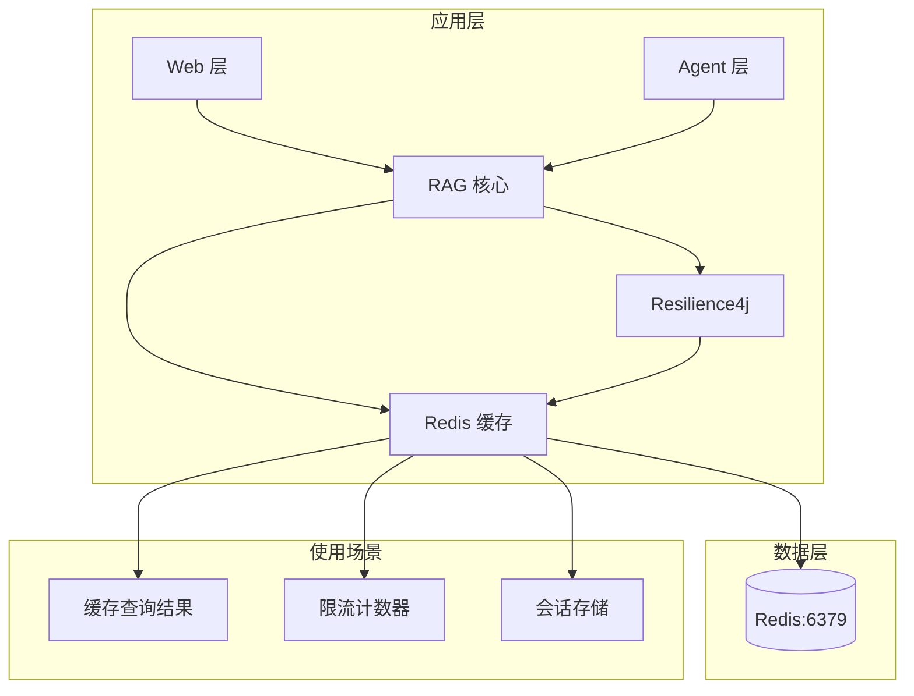

# Redis 缓存中间件

**本文档中引用的文件**
- [docker-compose.yml](../../../docker-compose.yml)
- [.env.example](../../../.env.example)
- [application.yml](../../../company-rag-bootstrap/src/main/resources/application.yml)
- [application-prod.yml](../../../company-rag-bootstrap/src/main/resources/application-prod.yml)
- [pom.xml](../../../pom.xml)
- [README.md](../../../README.md)
- [项目概述.md](../../../.gientech/wiki/项目概述.md)

## 目录
1. [简介](#简介)
2. [架构概览](#架构概览)
3. [配置参数详解](#配置参数详解)
4. [使用场景](#使用场景)
5. [Docker 部署](#docker-部署)
6. [监控与故障排除](#监控与故障排除)
7. [总结](#总结)

## 简介

Redis 是 CompanyRag 系统的核心缓存中间件，基于 Redis 7 Alpine 镜像部署，采用 Redisson 3.40.2 作为 Java 客户端。系统在缓存、限流、会话管理三个核心场景中使用 Redis，配合 Resilience4j 实现工程保障。

**核心特性**：
- **两级缓存**：Redis + 热点检测，避免重复计算
- **限流支持**：每租户每秒 10 次请求速率限制
- **会话管理**：支持多轮对话会话存储
- **熔断保护**：与 Resilience4j 集成，保护 LLM 调用

来源：[README.md](../../../README.md)(L29-L31, L81-L85)，[项目概述.md](../../../.gientech/wiki/项目概述.md)(L32, L126)

## 架构概览



**图表来源**
- [项目概述.md](../../../.gientech/wiki/项目概述.md)(L108-L154)

## 配置参数详解

### Docker Compose 配置

在 `docker-compose.yml` 中定义的 Redis 服务：

```yaml
redis:
  image: redis:7-alpine
  container_name: company-rag-redis
  ports:
    - "6379:6379"
  volumes:
    - redisdata:/data
  healthcheck:
    test: ["CMD", "redis-cli", "ping"]
    interval: 5s
    timeout: 3s
    retries: 5
```

来源：[docker-compose.yml](../../../docker-compose.yml)(L22-L33)

### 环境变量配置

在 `.env.example` 中定义的 Redis 环境变量：

| 参数 | 默认值 | 描述 |
|------|--------|------|
| `REDIS_HOST` | localhost | Redis 服务器地址 |
| `REDIS_PORT` | 6379 | Redis 端口 |
| `REDIS_PASSWORD` | your_redis_password_here | Redis 密码（已脱敏） |

来源：[.env.example](../../../.env.example)(L17-L20)

### Spring Data Redis 配置

#### 开发环境配置（application.yml）

```yaml
spring:
  data:
    redis:
      host: ${REDIS_HOST:localhost}
      port: ${REDIS_PORT:6379}
      password: ${REDIS_PASSWORD:}
      database: 0
```

来源：[application.yml](../../../company-rag-bootstrap/src/main/resources/application.yml)(L39-L45)

#### 生产环境配置（application-prod.yml）

```yaml
spring:
  data:
    redis:
      host: redis
      port: 6379
```

**注意**：生产环境使用 Docker 容器名 `redis` 作为主机地址。

来源：[application-prod.yml](../../../company-rag-bootstrap/src/main/resources/application-prod.yml)(L21-L24)

### 依赖配置

在 `pom.xml` 中管理的 Redisson 依赖：

```xml
<dependency>
  <groupId>org.redisson</groupId>
  <artifactId>redisson-spring-boot-starter</artifactId>
  <version>${redisson.version}</version>
</dependency>
```

其中 `redisson.version` 定义为 `3.40.2`。

来源：[pom.xml](../../../pom.xml)(L36, L68-L71)

## 使用场景

### 1. 两级缓存

系统采用 Redis + 热点检测的两级缓存策略，避免重复计算和 LLM 调用：

- **一级缓存**：热点数据内存缓存
- **二级缓存**：Redis 分布式缓存
- **应用场景**：RAG 检索结果缓存、向量检索结果缓存

来源：[README.md](../../../README.md)(L85, L208-L212)

### 2. 限流支持

配合 Resilience4j 实现每租户速率限制：

- **限流配置**：每租户每秒 10 次请求
- **限流周期**：1 秒刷新
- **超时等待**：500ms

```yaml
resilience4j:
  ratelimiter:
    configs:
      default:
        limit-for-period: 10
        limit-refresh-period: 1s
        timeout-duration: 500ms
```

来源：[application.yml](../../../company-rag-bootstrap/src/main/resources/application.yml)(L68-L73)，[README.md](../../../README.md)(L83-L84)

### 3. 会话管理

支持多轮对话会话存储：

- **会话元信息**：`rag_session_meta` 表
- **对话明细**：`rag_session` 表（父子结构）
- **存储策略**：首次实时落库，后续异步批量更新
- **多租户隔离**：行级安全（RLS）

来源：[README.md](../../../README.md)(L87-L91)

## Docker 部署

### 启动 Redis 服务

```bash
# 单独启动 Redis
docker compose up -d redis

# 启动全部基础设施（PostgreSQL + Redis）
docker compose up -d postgres redis
```

来源：[docker-compose.yml](../../../docker-compose.yml)(L22-L33)，[README.md](../../../README.md)(L118-L120)

### 验证 Redis 连接

```bash
# 查看容器状态
docker compose ps

# 进入 Redis 容器
docker exec -it company-rag-redis redis-cli

# 测试连接
ping
# 应返回 PONG
```

### 数据持久化

Redis 数据通过 Docker 卷 `redisdata` 持久化：

```yaml
volumes:
  redisdata:
```

数据文件存储在容器内的 `/data` 目录。

来源：[docker-compose.yml](../../../docker-compose.yml)(L28, L72)

## 监控与故障排除

### 健康检查

Redis 服务配置了健康检查：

- **检查命令**：`redis-cli ping`
- **检查间隔**：5 秒
- **超时时间**：3 秒
- **重试次数**：5 次

来源：[docker-compose.yml](../../../docker-compose.yml)(L29-L33)

### 常见问题及解决方案

#### 1. Redis 连接失败

**问题现象**：应用启动时报 Redis 连接异常

**排查步骤**：
1. 检查 Redis 容器是否运行：`docker compose ps`
2. 验证端口是否可访问：`telnet localhost 6379`
3. 检查环境变量是否正确配置
4. 查看应用日志中的 Redis 连接信息

**解决方案**：
```bash
# 重启 Redis 容器
docker compose restart redis

# 查看 Redis 日志
docker compose logs redis
```

#### 2. Redis 内存溢出

**问题现象**：Redis 内存使用率过高

**排查步骤**：
1. 连接 Redis：`docker exec -it company-rag-redis redis-cli`
2. 查看内存使用：`INFO memory`
3. 查看大键：`MEMORY DOCTOR`

**解决方案**：
- 配置 Redis 最大内存限制
- 设置合理的键过期时间（TTL）
- 清理无用缓存数据

#### 3. 限流失效

**问题现象**：租户限流未生效

**排查步骤**：
1. 检查 Resilience4j 配置是否正确加载
2. 验证 Redis 连接是否正常
3. 查看限流器指标：`/actuator/metrics`

**解决方案**：
- 确认 `application.yml` 中限流配置正确
- 重启应用重新加载配置

### 监控命令

```bash
# 查看 Redis 信息
docker exec company-rag-redis redis-cli INFO

# 监控 Redis 内存
docker exec company-rag-redis redis-cli INFO memory

# 查看连接数
docker exec company-rag-redis redis-cli INFO clients

# 查看慢查询
docker exec company-rag-redis redis-cli SLOWLOG GET 10
```

## 总结

Redis 在 CompanyRag 系统中扮演关键角色，主要特点：

1. **高性能缓存**：基于 Redis 7 Alpine，提供低延迟的分布式缓存能力
2. **多级缓存架构**：Redis + 热点检测两级缓存，减少重复计算和 LLM 调用成本
3. **限流支持**：配合 Resilience4j 实现每租户速率限制（10 次/秒）
4. **会话管理**：支持多轮对话会话存储，实现混合保存策略
5. **容器化部署**：通过 Docker Compose 一键部署，配置健康检查确保持续可用
6. **生产就绪**：开发/生产环境配置分离，支持密码认证和数据持久化

**技术栈**：
- Redis 版本：7 Alpine
- Java 客户端：Redisson 3.40.2
- 端口：6379
- 数据库：0

来源：[README.md](../../../README.md)(L99)，[pom.xml](../../../pom.xml)(L36)，[docker-compose.yml](../../../docker-compose.yml)(L22-L33)
