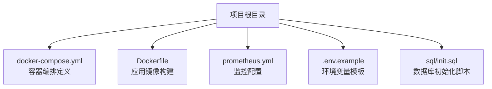
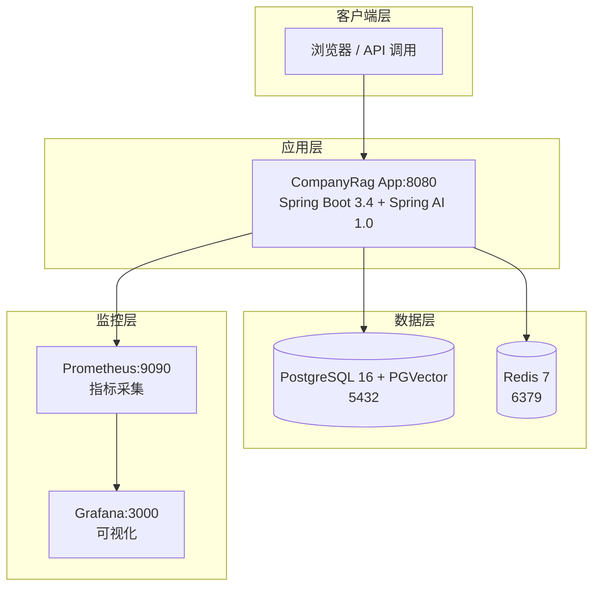
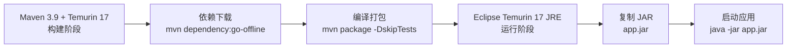
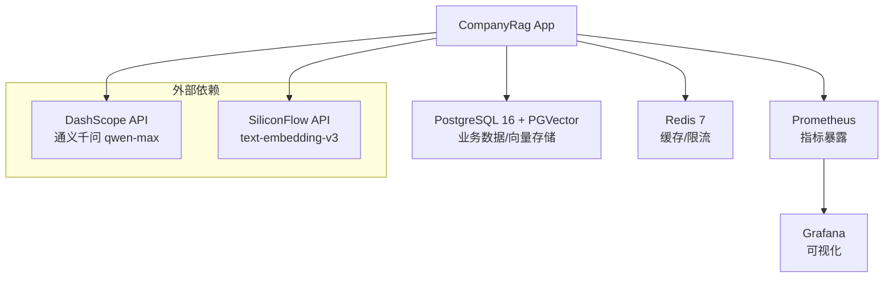

# 基础设施与中间件

**本文档引用的文件**
- [docker-compose.yml](../../../docker-compose.yml)
- [prometheus.yml](../../../prometheus.yml)
- [.env.example](../../../.env.example)
- [sql/init.sql](../../../sql/init.sql)
- [Dockerfile](../../../Dockerfile)
- [README.md](../../../README.md)

## 目录

1. [简介](#简介)
2. [项目结构](#项目结构)
3. [核心组件](#核心组件)
4. [架构概览](#架构概览)
5. [详细组件分析](#详细组件分析)
6. [依赖分析](#依赖分析)
7. [性能考虑](#性能考虑)
8. [故障排除指南](#故障排除指南)
9. [结论](#结论)

## 简介

CompanyRag 系统的基础设施层采用容器化部署架构，通过 Docker Compose 统一编排 PostgreSQL + PGVector、Redis、Prometheus、Grafana 等中间件组件，为上层应用提供数据存储、缓存加速、可观测性等核心能力。

**设计目标**：
- **容器化部署**：所有中间件通过 Docker Compose 一键启动，降低运维复杂度
- **数据隔离**：PostgreSQL Schema 物理隔离实现多租户数据安全
- **高性能检索**：PGVector HNSW 索引支持 1024 维向量余弦相似度检索
- **可观测性**：Micrometer + Prometheus + Grafana 三层监控体系
- **弹性保障**：Redis 缓存 + 熔断限流保护 LLM 调用

**关键技术栈**：
- 数据库：PostgreSQL 16 + PGVector (pgvector/pgvector:pg16)
- 缓存：Redis 7 (redis:7-alpine)
- 监控：Prometheus (prom/prometheus:latest) + Grafana (grafana/grafana:latest)
- 应用：JRE 17 + Spring Boot 3.4 (多阶段 Docker 构建)

来源：[README.md](../../../README.md)(L93-L106)，[docker-compose.yml](../../../docker-compose.yml)(L1-L75)

## 项目结构

基础设施相关配置文件位于项目根目录：



**图示来源**
- [docker-compose.yml](../../../docker-compose.yml)
- [Dockerfile](../../../Dockerfile)
- [prometheus.yml](../../../prometheus.yml)
- [.env.example](../../../.env.example)
- [sql/init.sql](../../../sql/init.sql)

## 核心组件

系统包含 5 个核心容器服务：

| 组件 | 镜像 | 端口 | 职责 |
|------|------|------|------|
| **postgres** | pgvector/pgvector:pg16 | 5432 | 业务数据 + 向量存储，HNSW 索引 |
| **redis** | redis:7-alpine | 6379 | 缓存 + 限流 + 会话管理 |
| **app** | 自定义构建 | 8080 | Spring Boot 应用 |
| **prometheus** | prom/prometheus:latest | 9090 | 指标采集与存储 |
| **grafana** | grafana/grafana:latest | 3000 | 可视化面板 |

来源：[docker-compose.yml](../../../docker-compose.yml)(L3-L75)

## 架构概览



**技术架构说明**：
1. **应用层**：Spring Boot 3.4 应用通过 Dockerfile 多阶段构建，暴露 8080 端口
2. **数据层**：PostgreSQL 16 承载业务数据与向量数据，Redis 7 提供缓存与限流能力
3. **监控层**：Prometheus 每 15 秒从 `/actuator/prometheus` 抓取指标，Grafana 提供可视化面板

**图示来源**
- [docker-compose.yml](../../../docker-compose.yml)
- [prometheus.yml](../../../prometheus.yml)

## 详细组件分析

### PostgreSQL + PGVector

**职责**：业务数据存储 + 向量相似度检索

**核心配置**：
- 镜像：`pgvector/pgvector:pg16`
- 端口：`5432:5432`
- 数据库：`company_rag`
- 用户/密码：`postgres/postgres` (生产环境需修改)
- 健康检查：`pg_isready -U postgres`

**PGVector 特性**：
- 向量维度：1024 (OpenAI 兼容 Embedding 模型)
- 索引类型：HNSW (m=16, ef_construction=64)
- 距离算法：`vector_cosine_ops` (余弦相似度)
- 扩展：`vector` + `pg_trgm` (全文检索支持)

**数据隔离策略**：
- `public` Schema：系统表 (`sys_tenant`, `sys_user`)
- `tenant_{code}` Schema：租户业务表 (`rag_document`, `doc_chunk`, `vector_store`, `rag_session`)
- 行级安全 (RLS)：通过 `current_tenant_id()` 函数实现租户隔离

来源：[docker-compose.yml](../../../docker-compose.yml)(L4-L20)，[sql/init.sql](../../../sql/init.sql)(L1-L149)，[README.md](../../../README.md)(L280-L284)

### Redis

**职责**：两级缓存 + 速率限制 + 会话管理

**核心配置**：
- 镜像：`redis:7-alpine`
- 端口：`6379:6379`
- 数据持久化：`redisdata` 卷
- 健康检查：`redis-cli ping`

**使用场景**：
- RAG 检索结果缓存（避免重复计算）
- 热点检测（减少 Redis 访问压力）
- RateLimiter 限流计数器（每租户每秒 10 次）
- 会话状态存储

来源：[docker-compose.yml](../../../docker-compose.yml)(L22-L33)，[README.md](../../../README.md)(L81-L85)

### Prometheus + Grafana

**职责**：系统监控与可视化

**Prometheus 配置** ([prometheus.yml](../../../prometheus.yml))：
```yaml
global:
  scrape_interval: 15s
  evaluation_interval: 15s

scrape_configs:
  - job_name: 'company-rag'
    metrics_path: '/actuator/prometheus'
    static_configs:
      - targets: ['app:8080']
```

**监控指标**：
- 请求数/延迟（HTTP 端点）
- RAG 检索召回率
- Token 消耗量
- CircuitBreaker 状态
- JVM 指标（内存/GC）

**Grafana 配置**：
- 端口：`3000:3000`
- 默认账号：`admin/admin`
- 数据卷：`grafanadata`

来源：[prometheus.yml](../../../prometheus.yml)(L1-L12)，[docker-compose.yml](../../../docker-compose.yml)(L51-L68)，[README.md](../../../README.md)(L76-L79)

### Docker 应用容器

**构建流程** ([Dockerfile](../../../Dockerfile))：



**多阶段构建优势**：
- 构建阶段使用完整 Maven 镜像
- 运行阶段仅包含 JRE，减小镜像体积
- 最终镜像大小约 200-300MB

**环境变量**：
- `SPRING_PROFILES_ACTIVE=prod`
- `DASHSCOPE_API_KEY` (从 .env 注入)

来源：[Dockerfile](../../../Dockerfile)(L1-L22)，[docker-compose.yml](../../../docker-compose.yml)(L35-L49)

### 环境变量配置

**配置模板** ([.env.example](../../../.env.example))：

| 变量名 | 说明 | 默认值/示例 |
|--------|------|-------------|
| `DASHSCOPE_API_KEY` | 通义千问 API 密钥 | `sk-your-api-key` |
| `SILICONFLOW_API_KEY` | 硅基流动 Embedding 密钥 | `sk-your-siliconflow-key` |
| `POSTGRES_HOST` | PostgreSQL 主机 | `localhost` |
| `POSTGRES_PORT` | PostgreSQL 端口 | `5433` |
| `POSTGRES_DB` | 数据库名 | `company_rag` |
| `REDIS_HOST` | Redis 主机 | `localhost` |
| `REDIS_PORT` | Redis 端口 | `6379` |
| `SERVER_PORT` | 应用端口 | `8080` |

**部署步骤**：
1. 复制 `.env.example` 为 `.env`
2. 修改 `DASHSCOPE_API_KEY` 和 `SILICONFLOW_API_KEY`
3. 执行 `docker compose up -d`

来源：[.env.example](../../../.env.example)(L1-L25)，[README.md](../../../README.md)(L157-L162)

## 依赖分析



**核心依赖关系**：
1. **PostgreSQL**：应用启动时自动执行 `sql/init.sql` 初始化 Schema 和表结构
2. **Redis**：应用通过 Redisson 连接，用于缓存和限流
3. **DashScope/SiliconFlow**：LLM 调用（需配置 API Key）
4. **Prometheus**：被动暴露 `/actuator/prometheus` 端点供抓取

**健康检查依赖**：
- `app` 容器依赖 `postgres` 和 `redis` 的 `service_healthy` 状态
- 确保数据库和缓存就绪后再启动应用

来源：[docker-compose.yml](../../../docker-compose.yml)(L35-L49)，[README.md](../../../README.md)(L5-L45)

## 性能考虑

### 数据库优化

**PGVector HNSW 索引参数**：
- `m = 16`：每个节点的最大连接数（平衡检索速度与内存）
- `ef_construction = 64`：构建时的搜索深度（影响索引质量）
- 索引名：`idx_vector_store_embedding`
- 距离函数：`vector_cosine_ops`

**索引创建语句**：
```sql
CREATE INDEX idx_vector_store_embedding ON vector_store
    USING hnsw (embedding vector_cosine_ops)
    WITH (m = 16, ef_construction = 64);
```

来源：[sql/init.sql](../../../sql/init.sql)(L78-L87)

### 缓存策略

**两级缓存架构**：
1. **一级缓存**：热点检测（内存级，快速判断）
2. **二级缓存**：Redis 存储检索结果（避免重复向量化与 LLM 调用）

**缓存命中场景**：
- 相同查询短时间内重复出现
- 相似文档片段的向量化结果

### 容器资源优化

**Docker Compose 优化点**：
- 使用 Alpine 基础镜像（Redis）减小体积
- 数据卷持久化（`pgdata`, `redisdata`, `promdata`, `grafanadata`）
- 健康检查确保服务依赖顺序

## 故障排除指南

### 容器启动失败

**检查步骤**：
1. 查看容器状态：`docker compose ps`
2. 查看应用日志：`docker compose logs app`
3. 验证健康检查：`docker compose exec postgres pg_isready -U postgres`

**常见问题**：
- **端口冲突**：修改 `docker-compose.yml` 中的端口映射（如 `5433:5432`）
- **API Key 缺失**：确保 `.env` 文件中配置了 `DASHSCOPE_API_KEY`
- **数据库初始化失败**：检查 `sql/init.sql` 语法和 PGVector 扩展

### Prometheus 无法抓取指标

**排查步骤**：
1. 验证 Actuator 端点：`curl http://localhost:8080/actuator/prometheus`
2. 检查 Prometheus 配置：`prometheus.yml` 中 `targets` 应为 `app:8080`（容器网络）
3. 确认应用 Profile：`SPRING_PROFILES_ACTIVE=prod` 需启用 prometheus 端点

来源：[prometheus.yml](../../../prometheus.yml)(L1-L12)，[README.md](../../../README.md)(L234-L245)

### 数据库连接问题

**常见错误**：
- `Connection refused`：PostgreSQL 容器未启动或端口映射错误
- `Extension "vector" not found`：未使用 `pgvector/pgvector` 镜像

**解决方案**：
```bash
# 重启 PostgreSQL 容器
docker compose restart postgres

# 验证 PGVector 扩展
docker compose exec postgres psql -U postgres -d company_rag -c "\dx"
```

### Redis 连接失败

**排查命令**：
```bash
# 测试 Redis 连通性
docker compose exec redis redis-cli ping

# 查看 Redis 内存使用
docker compose exec redis redis-cli info memory
```

## 结论

CompanyRag 的基础设施层通过 Docker Compose 实现了容器化、标准化的部署方案，核心特点包括：

1. **PGVector 向量检索**：PostgreSQL 16 + HNSW 索引支持高效 1024 维余弦相似度检索
2. **多租户隔离**：Schema 物理隔离 + 行级安全策略确保数据安全
3. **可观测性体系**：Prometheus + Grafana 提供完整的监控与告警能力
4. **弹性保障**：Redis 缓存 + 熔断限流保护 LLM 调用稳定性
5. **一键部署**：通过 `docker compose up -d` 快速启动全套基础设施

**部署命令**：
```bash
# 配置环境变量
export DASHSCOPE_API_KEY=sk-your-api-key
export SILICONFLOW_API_KEY=sk-your-siliconflow-key

# 启动所有服务
docker compose up -d
```

**访问地址**：
- 应用：http://localhost:8080
- Prometheus：http://localhost:9090
- Grafana：http://localhost:3000 (admin/admin)

来源：[docker-compose.yml](../../../docker-compose.yml)，[README.md](../../../README.md)(L157-L162)
