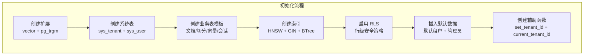
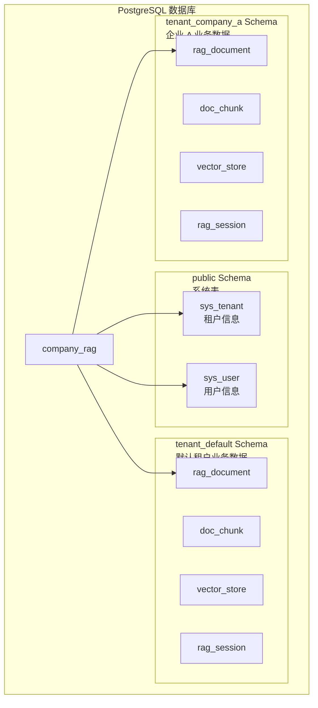

# 数据库初始化脚本

**本文档引用的文件**
- [init.sql](../../../sql/init.sql)
- [fix_set_tenant_id_function.sql](../../../sql/fix_set_tenant_id_function.sql)
- [migrate_vector_store_to_uuid.sql](../../../sql/migrate_vector_store_to_uuid.sql)
- [session-history-tables.sql](../../../sql/session-history-tables.sql)
- [项目概述.md](../项目概述.md)
- [架构总览.md](../架构总览.md)

## 目录
1. [简介](#简介)
2. [脚本概览](#脚本概览)
3. [系统表结构](#系统表结构)
4. [租户 Schema 隔离机制](#租户 schema-隔离机制)
5. [行级安全策略](#行级安全策略)
6. [向量存储配置](#向量存储配置)
7. [辅助函数](#辅助函数)
8. [会话历史表](#会话历史表)
9. [使用示例](#使用示例)
10. [故障排除](#故障排除)

## 简介

数据库初始化脚本负责创建 CompanyRag 系统所需的 PostgreSQL 数据库结构，包括：

- **系统表**：`sys_tenant`（租户表）、`sys_user`（用户表），存放于 `public` schema
- **业务表模板**：`rag_document`、`doc_chunk`、`vector_store`、`rag_session`，动态创建于各租户独立 Schema
- **行级安全（RLS）策略**：通过 `current_tenant_id()` 函数实现租户数据隔离
- **PGVector 扩展**：支持 1024 维向量的 HNSW 索引与余弦相似度检索
- **辅助函数**：`set_tenant_id()`、`current_tenant_id()` 用于 RLS 上下文管理

来源：[init.sql](../../../sql/init.sql)(L1-L149)

## 脚本概览



**图表来源**
- [init.sql](../../../sql/init.sql)(L10-L149)

## 系统表结构

### sys_tenant（租户表）

存放于 `public` schema，管理所有租户的基本信息：

```sql
CREATE TABLE IF NOT EXISTS public.sys_tenant (
    id BIGSERIAL PRIMARY KEY,
    tenant_code VARCHAR(64) NOT NULL UNIQUE,
    tenant_name VARCHAR(128) NOT NULL,
    schema_name VARCHAR(64),             -- 独立 Schema 名称
    status INTEGER DEFAULT 1,            -- 0-禁用 1-启用
    contact_name VARCHAR(64),
    contact_phone VARCHAR(20),
    create_time TIMESTAMP DEFAULT CURRENT_TIMESTAMP,
    update_time TIMESTAMP DEFAULT CURRENT_TIMESTAMP
);
```

**字段说明**

| 字段 | 类型 | 说明 |
|------|------|------|
| id | BIGSERIAL | 主键，自增 ID |
| tenant_code | VARCHAR(64) | 租户编码，唯一标识（如 `default`、`company_a`） |
| tenant_name | VARCHAR(128) | 租户名称 |
| schema_name | VARCHAR(64) | 独立 Schema 名称（如 `tenant_default`） |
| status | INTEGER | 状态：0-禁用，1-启用 |
| contact_name | VARCHAR(64) | 联系人姓名 |
| contact_phone | VARCHAR(20) | 联系电话 |

来源：[init.sql](../../../sql/init.sql)(L17-L27)

### sys_user（用户表）

存放于 `public` schema，管理系统用户及权限：

```sql
CREATE TABLE IF NOT EXISTS public.sys_user (
    id BIGSERIAL PRIMARY KEY,
    tenant_id BIGINT NOT NULL REFERENCES public.sys_tenant(id),
    username VARCHAR(64) NOT NULL,
    password VARCHAR(256) NOT NULL,
    display_name VARCHAR(128),
    email VARCHAR(128),
    role VARCHAR(32) DEFAULT 'user',     -- admin / user / viewer
    status INTEGER DEFAULT 1,
    create_time TIMESTAMP DEFAULT CURRENT_TIMESTAMP,
    update_time TIMESTAMP DEFAULT CURRENT_TIMESTAMP,
    UNIQUE(tenant_id, username)
);
```

**字段说明**

| 字段 | 类型 | 说明 |
|------|------|------|
| id | BIGSERIAL | 主键，自增 ID |
| tenant_id | BIGINT | 所属租户 ID，外键关联 `sys_tenant` |
| username | VARCHAR(64) | 登录用户名 |
| password | VARCHAR(256) | BCrypt 加密密码 |
| display_name | VARCHAR(128) | 显示名称 |
| email | VARCHAR(128) | 邮箱地址 |
| role | VARCHAR(32) | 角色：`admin` / `user` / `viewer` |
| status | INTEGER | 状态：0-禁用，1-启用 |

来源：[init.sql](../../../sql/init.sql)(L30-L42)

## 租户 Schema 隔离机制

CompanyRag 采用 **Schema 物理隔离** 实现多租户数据安全：

- **公共 Schema（public）**：存放系统级表 `sys_tenant`、`sys_user`
- **租户 Schema（tenant_{code}）**：每个租户独立的业务表（文档、切分、向量、会话）



**图表来源**
- [init.sql](../../../sql/init.sql)(L4-L8, L44-L124)
- [项目概述.md](../项目概述.md)(L28-L29)

### 业务表模板

以下表结构通过 `TenantServiceImpl.createTenantSchema()` 动态创建于各租户 Schema：

```sql
-- 文档表
CREATE TABLE rag_document (
    id BIGSERIAL PRIMARY KEY,
    tenant_id BIGINT NOT NULL,
    file_name VARCHAR(256) NOT NULL,
    file_type VARCHAR(32),
    file_size BIGINT,
    file_path VARCHAR(512),
    title VARCHAR(256),
    chunk_count INTEGER DEFAULT 0,
    status INTEGER DEFAULT 0,            -- -1 失败 0 待处理 1 已切分 2 已向量化
    error_msg TEXT,
    create_time TIMESTAMP DEFAULT CURRENT_TIMESTAMP,
    update_time TIMESTAMP DEFAULT CURRENT_TIMESTAMP
);

-- 文档切分块表
CREATE TABLE doc_chunk (
    id BIGSERIAL PRIMARY KEY,
    document_id BIGINT NOT NULL REFERENCES rag_document(id) ON DELETE CASCADE,
    tenant_id BIGINT NOT NULL,
    chunk_index INTEGER NOT NULL,
    content TEXT NOT NULL,
    token_count INTEGER DEFAULT 0,
    split_strategy VARCHAR(32),
    create_time TIMESTAMP DEFAULT CURRENT_TIMESTAMP
);

-- 向量存储表（PGVector）
CREATE TABLE vector_store (
    id UUID PRIMARY KEY,
    content TEXT,
    metadata JSONB,
    embedding vector(1024)
);

-- 会话历史表
CREATE TABLE rag_session (
    id BIGSERIAL PRIMARY KEY,
    session_id VARCHAR(128) NOT NULL,
    tenant_id BIGINT NOT NULL,
    user_id BIGINT,
    query TEXT NOT NULL,
    answer TEXT,
    context TEXT,
    tokens_input INTEGER DEFAULT 0,
    tokens_output INTEGER DEFAULT 0,
    latency_ms INTEGER DEFAULT 0,
    create_time TIMESTAMP DEFAULT CURRENT_TIMESTAMP
);
```

来源：[init.sql](../../../sql/init.sql)(L51-L102)

## 行级安全策略

### RLS 辅助函数

```sql
-- 设置租户 ID（session 级别）
CREATE OR REPLACE FUNCTION set_tenant_id(p_tenant_id BIGINT) RETURNS VOID AS $$
BEGIN
    EXECUTE format('SET app.tenant_id = %L', p_tenant_id);
END;
$$ LANGUAGE plpgsql;

-- 获取当前租户 ID
CREATE OR REPLACE FUNCTION current_tenant_id() RETURNS BIGINT AS $$
BEGIN
    RETURN COALESCE(current_setting('app.tenant_id', true)::BIGINT, 0);
END;
$$ LANGUAGE plpgsql STABLE;
```

**重要修复**：原始版本使用 `SET LOCAL` 仅在事务内生效，导致 `TenantInterceptor` 在事务外调用失败。修复后使用 `SET` 在整个 session 生效。

来源：[init.sql](../../../sql/init.sql)(L139-L149)、[fix_set_tenant_id_function.sql](../../../sql/fix_set_tenant_id_function.sql)(L1-L18)

### RLS 策略定义

```sql
-- 启用行级安全
ALTER TABLE rag_document ENABLE ROW LEVEL SECURITY;
ALTER TABLE doc_chunk ENABLE ROW LEVEL SECURITY;
ALTER TABLE rag_session ENABLE ROW LEVEL SECURITY;

-- 租户隔离策略
CREATE POLICY tenant_isolation_document ON rag_document
    USING (tenant_id = current_tenant_id() OR current_user = 'postgres');
CREATE POLICY tenant_isolation_chunk ON doc_chunk
    USING (tenant_id = current_tenant_id() OR current_user = 'postgres');
CREATE POLICY tenant_isolation_session ON rag_session
    USING (tenant_id = current_tenant_id() OR current_user = 'postgres');
```

**策略说明**
- 所有查询自动追加 `tenant_id = current_tenant_id()` 条件
- `postgres` 超级用户可访问所有数据（用于系统维护）
- 通过 `set_tenant_id()` 设置当前租户上下文

来源：[init.sql](../../../sql/init.sql)(L113-L122)

## 向量存储配置

### PGVector 扩展与索引

```sql
-- 创建扩展
CREATE EXTENSION IF NOT EXISTS vector;
CREATE EXTENSION IF NOT EXISTS pg_trgm;

-- 向量表
CREATE TABLE vector_store (
    id UUID PRIMARY KEY,
    content TEXT,
    metadata JSONB,
    embedding vector(1024)
);

-- HNSW 索引（余弦距离）
CREATE INDEX idx_vector_store_embedding ON vector_store
    USING hnsw (embedding vector_cosine_ops)
    WITH (m = 16, ef_construction = 64);
```

**配置说明**

| 参数 | 值 | 说明 |
|------|-----|------|
| 维度 | 1024 | 通义千问 `text-embedding-v3` 模型输出维度 |
| 距离算法 | `vector_cosine_ops` | 余弦相似度 |
| 索引类型 | HNSW | 高性能近似最近邻检索 |
| m | 16 | 每个节点的最大连接数 |
| ef_construction | 64 | 构建时的搜索深度 |

来源：[init.sql](../../../sql/init.sql)(L11-L12, L79-L87)、[migrate_vector_store_to_uuid.sql](../../../sql/migrate_vector_store_to_uuid.sql)(L1-L40)

### ID 类型迁移

`vector_store` 表的 ID 类型从 `BIGSERIAL` 迁移为 `UUID`，以支持 Spring AI 的 UUID 主键规范。

来源：[migrate_vector_store_to_uuid.sql](../../../sql/migrate_vector_store_to_uuid.sql)(L1-L40)

## 辅助函数

### set_tenant_id 修复说明

**问题**：`TenantInterceptor` 在事务外调用 `setTenantContext`，但 `SET LOCAL` 只在事务内生效，导致 RLS 失败。

**解决方案**：将 `SET LOCAL` 改为 `SET`，使设置在整个 session 生效。

```sql
-- 修复前（init.sql）
CREATE OR REPLACE FUNCTION set_tenant_id(p_tenant_id BIGINT) RETURNS VOID AS $$
BEGIN
    EXECUTE format('SET LOCAL app.tenant_id = %L', p_tenant_id);
END;
$$ LANGUAGE plpgsql;

-- 修复后（fix_set_tenant_id_function.sql）
CREATE OR REPLACE FUNCTION set_tenant_id(p_tenant_id BIGINT) RETURNS VOID AS $$
BEGIN
    EXECUTE format('SET app.tenant_id = %L', p_tenant_id);
END;
$$ LANGUAGE plpgsql;
```

来源：[fix_set_tenant_id_function.sql](../../../sql/fix_set_tenant_id_function.sql)(L1-L18)

## 会话历史表

### rag_session_meta（会话元信息表）

```sql
CREATE TABLE IF NOT EXISTS rag_session_meta (
    id BIGSERIAL PRIMARY KEY,
    session_id VARCHAR(128) NOT NULL UNIQUE,
    tenant_id BIGINT NOT NULL,
    user_id BIGINT NOT NULL,
    title VARCHAR(256),
    last_query TEXT,
    message_count INTEGER DEFAULT 0,
    is_deleted BOOLEAN DEFAULT FALSE,
    tags JSONB DEFAULT '[]'::jsonb,
    metadata JSONB DEFAULT '{}'::jsonb,
    create_time TIMESTAMP DEFAULT CURRENT_TIMESTAMP,
    update_time TIMESTAMP DEFAULT CURRENT_TIMESTAMP
);
```

**索引配置**

```sql
-- 复合索引（租户 + 用户 + 时间）
CREATE INDEX IF NOT EXISTS idx_session_meta_tenant_user ON rag_session_meta(tenant_id, user_id, create_time DESC);

-- 部分索引（未删除的会话）
CREATE INDEX IF NOT EXISTS idx_session_meta_deleted ON rag_session_meta(is_deleted) WHERE is_deleted = FALSE;

-- GIN 索引（标签查询）
CREATE INDEX IF NOT EXISTS idx_session_meta_tags ON rag_session_meta USING GIN(tags);

-- 全文检索索引（标题搜索）
CREATE INDEX IF NOT EXISTS idx_session_meta_title_trgm ON rag_session_meta USING GIN(title gin_trgm_ops);
```

来源：[session-history-tables.sql](../../../sql/session-history-tables.sql)(L1-L59)

## 使用示例

### 1. 执行初始化脚本

```bash
# 连接到 PostgreSQL
psql -h localhost -p 5433 -U postgres -d company_rag

# 执行初始化脚本
\i sql/init.sql

# 执行修复脚本（如已存在旧数据）
\i sql/fix_set_tenant_id_function.sql

# 执行向量表 ID 类型迁移（如需要）
\i sql/migrate_vector_store_to_uuid.sql

# 执行会话历史表迁移
\i sql/session-history-tables.sql
```

### 2. 验证系统表

```sql
-- 查看租户列表
SELECT * FROM public.sys_tenant;

-- 查看用户列表
SELECT id, username, role, status FROM public.sys_user;
```

### 3. 测试 RLS 策略

```sql
-- 设置租户上下文
SELECT set_tenant_id(1);

-- 查询当前租户的文档（自动过滤）
SELECT * FROM rag_document;

-- 验证当前租户 ID
SELECT current_tenant_id();
```

### 4. 创建新租户 Schema

```sql
-- 1. 插入新租户记录
INSERT INTO public.sys_tenant (tenant_code, tenant_name, schema_name, status)
VALUES ('company_a', '企业 A', 'tenant_company_a', 1);

-- 2. 切换到新 Schema 并创建业务表（由 TenantServiceImpl.createTenantSchema() 自动执行）
SET search_path TO tenant_company_a;

-- 执行 init.sql 中的业务表模板（L48-L124）
```

来源：[init.sql](../../../sql/init.sql)(L127-L136)

## 故障排除

### 常见问题

#### 1. PGVector 扩展未安装

**现象**：执行 `CREATE EXTENSION vector` 失败

**解决方案**：
```bash
# 安装 PGVector 扩展
apt-get install postgresql-16-pgvector

# 或从源码编译
git clone https://github.com/pgvector/pgvector
cd pgvector
make
make install
```

#### 2. RLS 策略未生效

**现象**：查询返回其他租户数据

**排查步骤**：
1. 验证 `set_tenant_id()` 已正确调用
2. 检查 `current_tenant_id()` 返回值
3. 确认 RLS 策略已启用：`SELECT tablename, rowsecurity FROM pg_tables WHERE schemaname = 'public';`
4. 验证策略定义：`SELECT * FROM pg_policies WHERE tablename = 'rag_document';`

#### 3. HNSW 索引创建失败

**现象**：`CREATE INDEX` 报错 "data type vector does not exist"

**解决方案**：
```sql
-- 确认 vector 扩展已创建
\dx

-- 如未列出 vector，重新创建
CREATE EXTENSION IF NOT EXISTS vector;
```

### 监控命令

```sql
-- 查看所有 Schema
SELECT schema_name FROM information_schema.schemata WHERE schema_name LIKE 'tenant_%';

-- 查看 RLS 策略状态
SELECT tablename, rowsecurity 
FROM pg_tables 
WHERE schemaname IN ('public') 
ORDER BY tablename;

-- 查看 HNSW 索引信息
SELECT indexname, indexdef 
FROM pg_indexes 
WHERE tablename = 'vector_store';
```

## 总结

数据库初始化脚本实现了 CompanyRag 的核心数据架构：

1. **多租户隔离**：通过 `public` schema 存放系统表，`tenant_{code}` schema 存放业务表，实现物理数据隔离
2. **行级安全**：通过 `set_tenant_id()` + `current_tenant_id()` + RLS 策略，自动过滤租户数据
3. **向量检索**：PGVector 扩展 + HNSW 索引，支持 1024 维向量的高效余弦相似度检索
4. **会话历史**：`rag_session_meta` + `rag_session` 双表设计，支持会话标签、元信息管理
5. **可维护性**：修复脚本、迁移脚本分离，便于版本升级与数据迁移

来源：[init.sql](../../../sql/init.sql)、[fix_set_tenant_id_function.sql](../../../sql/fix_set_tenant_id_function.sql)、[session-history-tables.sql](../../../sql/session-history-tables.sql)
