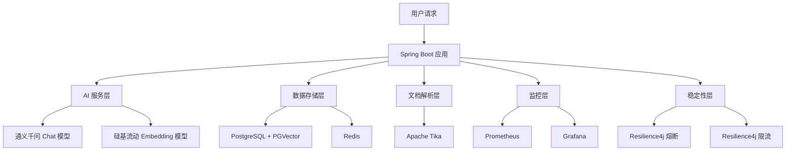
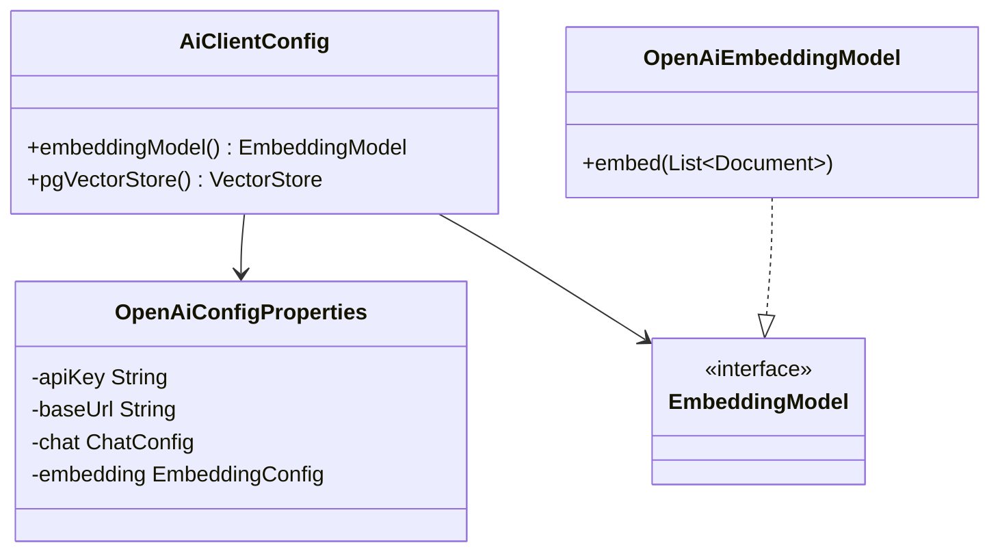
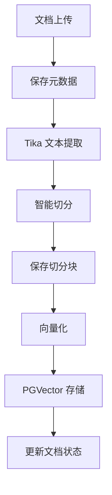
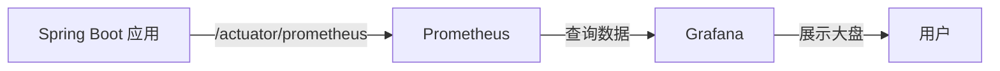
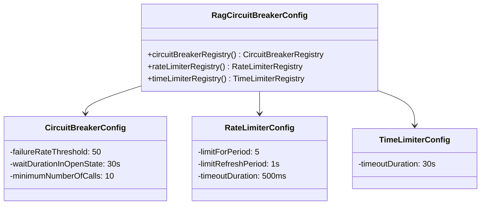

# 外部系统集成

**本文档引用文件**
- [application.yml](../../../company-rag-bootstrap/src/main/resources/application.yml)
- [application-dev.yml](../../../company-rag-bootstrap/src/main/resources/application-dev.yml)
- [AiClientConfig.java](../../../company-rag-rag/src/main/java/com/company/rag/rag/config/AiClientConfig.java)
- [RagCircuitBreakerConfig.java](../../../company-rag-rag/src/main/java/com/company/rag/rag/service/RagCircuitBreakerConfig.java)
- [DocumentParseServiceImpl.java](../../../company-rag-document/src/main/java/com/company/rag/document/service/impl/DocumentParseServiceImpl.java)
- [docker-compose.yml](../../../docker-compose.yml)
- [prometheus.yml](../../../prometheus.yml)

## 目录
1. [简介](#简介)
2. [集成架构](#集成架构)
3. [核心组件分析](#核心组件分析)
4. [配置管理](#配置管理)
5. [总结](#总结)

## 简介

本系统采用模块化架构设计，通过集成多个外部系统实现企业级 RAG（检索增强生成）能力。主要集成的外部系统包括：

- **AI 服务层**：通义千问（Chat 模型）+ 硅基流动（Embedding 模型），通过 OpenAI 兼容接口接入
- **数据存储层**：PostgreSQL 16 + PGVector（向量存储）+ Redis（缓存）
- **文档解析**：Apache Tika 3.1.0，支持多格式文档智能解析
- **监控可观测**：Prometheus + Grafana，提供指标采集与可视化
- **稳定性保障**：Resilience4j 2.2.0，提供熔断、限流、超时保护

技术实现基于 Spring AI 1.0.4 框架，通过统一的 OpenAI 兼容接口抽象，支持灵活切换不同厂商的模型服务。

## 集成架构



**Diagram sources**
- [docker-compose.yml](../../../docker-compose.yml)
- [application.yml](../../../company-rag-bootstrap/src/main/resources/application.yml)

## 核心组件分析

### AI 服务集成

系统通过 Spring AI 的 OpenAI 兼容接口集成多家厂商的模型服务，实现 Chat 和 Embedding 能力的解耦。

**功能职责**：
- Chat 模型：使用通义千问（DashScope）提供对话生成能力
- Embedding 模型：使用硅基流动（SiliconFlow）提供文本向量化能力
- 统一配置：通过 `spring.ai.openai` 前缀统一管理

**核心配置类**：
`AiClientConfig` 定义了 Embedding 模型和 VectorStore 的 Bean，支持从配置文件中读取 apiKey、baseUrl 和模型参数。



**Section sources**
- [AiClientConfig.java](../../../company-rag-rag/src/main/java/com/company/rag/rag/config/AiClientConfig.java)(L1-L252)

**配置示例**（开发环境）：
- Chat 模型：`deepseek-v4-flash`，temperature=0.7
- Embedding 模型：`BAAI/bge-large-zh-v1.5`
- API 密钥通过环境变量注入：`DASHSCOPE_API_KEY`、`SILICONFLOW_API_KEY`

### 数据存储集成

#### PostgreSQL + PGVector

**功能职责**：
- 关系型数据存储：业务数据、文档元数据、租户信息
- 向量存储：使用 PGVector 插件存储 1024 维向量
- 索引类型：HNSW（高效近似最近邻搜索）
- 距离算法：COSINE_DISTANCE（余弦相似度）

**配置参数**（来自 [application.yml](../../../company-rag-bootstrap/src/main/resources/application.yml)(L25-L30)）：
- `index-type`: HNSW
- `distance-type`: COSINE_DISTANCE
- `dimension`: 1024
- `remove-existing-vector-store-table`: false

**多租户支持**：
通过 `TenantAwareJdbcTemplate` 包装标准 JdbcTemplate，实现 schema 级别的租户隔离。向量存储表使用动态 schema 前缀替换，确保租户数据隔离。

#### Redis

**功能职责**：
- 缓存层：存储热点查询结果
- 会话管理：用户会话状态
- 限流计数：配合 Resilience4j 实现分布式限流

**配置参数**：
- 主机：`REDIS_HOST`（默认 localhost）
- 端口：`REDIS_PORT`（默认 6379）
- 密码：`REDIS_PASSWORD`（已脱敏）

### 文档解析集成

**功能职责**：
- 使用 Apache Tika 3.1.0 进行文档解析
- 支持多种文件格式自动检测与文本提取
- 完整处理流程：上传→解析→切分→向量化→存储

**核心实现类**：
`DocumentParseServiceImpl` 实现了文档处理的全流程：



**Diagram sources**
- [DocumentParseServiceImpl.java](../../../company-rag-document/src/main/java/com/company/rag/document/service/impl/DocumentParseServiceImpl.java)(L48-L98)

**Section sources**
- [DocumentParseServiceImpl.java](../../../company-rag-document/src/main/java/com/company/rag/document/service/impl/DocumentParseServiceImpl.java)(L1-L212)

**关键特性**：
- 自动文件类型检测（L104）
- UTF-8 编码优化（L122-L134）
- 异常处理与状态回滚（L89-L95）

### 监控集成（Prometheus + Grafana）

**功能职责**：
- 指标采集：通过 Spring Boot Actuator 暴露 `/actuator/prometheus` 端点
- 指标抓取：Prometheus 每 15 秒采集一次应用指标
- 可视化：Grafana 提供监控大盘

**Prometheus 配置**：
```yaml
global:
  scrape_interval: 15s
  evaluation_interval: 15s

scrape_configs:
  - job_name: 'company-rag'
    metrics_path: '/actuator/prometheus'
    static_configs:
      - targets: ['app:8080']
```

**Section sources**
- [prometheus.yml](../../../prometheus.yml)(L1-L12)

**Grafana 配置**：
- 访问端口：3000
- 默认管理员密码：`admin`（已脱敏）

**部署架构**：


**Diagram sources**
- [docker-compose.yml](../../../docker-compose.yml)(L51-L69)

### 熔断限流集成（Resilience4j）

**功能职责**：
- 保护 LLM 调用不被突发流量打垮
- 防止级联故障
- 实现租户级别的速率限制

**核心配置类**：
`RagCircuitBreakerConfig` 定义了三种保护机制：



**Section sources**
- [RagCircuitBreakerConfig.java](../../../company-rag-rag/src/main/java/com/company/rag/rag/service/RagCircuitBreakerConfig.java)(L1-L66)

**配置参数**：
- **熔断器**：失败率阈值 50%，熔断后 30 秒尝试半开，最小调用数 10 次
- **限流器**：每租户每秒 5 次 LLM 调用，突发容量 10 次，超时 500ms
- **超时器**：LLM 调用超时 30 秒

## 配置管理

### 环境变量配置表

| 配置项 | 说明 | 默认值 | 配置位置 |
|--------|------|--------|----------|
| `SERVER_PORT` | 应用服务端口 | 8080 | application.yml |
| `POSTGRES_HOST` | PostgreSQL 主机地址 | localhost | application.yml |
| `POSTGRES_PORT` | PostgreSQL 端口 | 5433 | application.yml |
| `POSTGRES_DB` | 数据库名称 | company_rag | application.yml |
| `POSTGRES_USER` | 数据库用户名 | postgres | application.yml |
| `POSTGRES_PASSWORD` | 数据库密码 | *** | application.yml |
| `REDIS_HOST` | Redis 主机地址 | localhost | application.yml |
| `REDIS_PORT` | Redis 端口 | 6379 | application.yml |
| `REDIS_PASSWORD` | Redis 密码 | *** | application-dev.yml |
| `DASHSCOPE_API_KEY` | 通义千问 API 密钥 | *** | application-dev.yml |
| `SILICONFLOW_API_KEY` | 硅基流动 API 密钥 | *** | application-dev.yml |
| `SPRING_PROFILES_ACTIVE` | 激活的 Profile | dev | application.yml |

**表格数据来源**
- [application.yml](../../../company-rag-bootstrap/src/main/resources/application.yml)(L1-L90)
- [application-dev.yml](../../../company-rag-bootstrap/src/main/resources/application-dev.yml)(L1-L29)

### 向量存储配置表

| 配置项 | 说明 | 默认值 | 配置位置 |
|--------|------|--------|----------|
| `spring.vectorstore.pgvector.index-type` | 向量索引类型 | HNSW | application.yml |
| `spring.vectorstore.pgvector.distance-type` | 距离算法 | COSINE_DISTANCE | application.yml |
| `spring.vectorstore.pgvector.dimension` | 向量维度 | 1024 | application.yml |

### 熔断限流配置表

| 配置项 | 说明 | 默认值 | 配置位置 |
|--------|------|--------|----------|
| `resilience4j.circuitbreaker.failure-rate-threshold` | 失败率阈值 | 50 | application.yml |
| `resilience4j.circuitbreaker.wait-duration-in-open-state` | 熔断等待时间 | 30s | application.yml |
| `resilience4j.circuitbreaker.minimum-number-of-calls` | 最小调用数 | 10 | application.yml |
| `resilience4j.ratelimiter.limit-for-period` | 每周期限制数 | 10 | application.yml |
| `resilience4j.ratelimiter.limit-refresh-period` | 限制刷新周期 | 1s | application.yml |

## 总结

本系统通过集成多个成熟的外部系统，构建了完整的企业级 RAG 能力：

**技术特点**：
- **模块化设计**：各外部系统职责清晰，通过 Spring AI 统一抽象
- **高可用性**：Resilience4j 提供熔断、限流、超时三重保护
- **可观测性**：Prometheus + Grafana 提供完整的监控大盘
- **多租户隔离**：通过 schema 级别隔离实现租户数据安全

**核心优势**：
- 使用 OpenAI 兼容接口，支持灵活切换模型供应商
- PGVector 提供高性能向量检索，HNSW 索引支持亿级向量
- Apache Tika 支持 100+ 文档格式自动解析
- Docker Compose 一键部署，降低运维成本

**扩展性**：
- 新增模型供应商：只需修改 `spring.ai.openai` 配置
- 扩展监控指标：通过 Micrometer 自动暴露新指标
- 水平扩展：Redis 和 PostgreSQL 均支持集群部署

---

**Diagram sources**
- [docker-compose.yml](../../../docker-compose.yml)
- [application.yml](../../../company-rag-bootstrap/src/main/resources/application.yml)
- [AiClientConfig.java](../../../company-rag-rag/src/main/java/com/company/rag/rag/config/AiClientConfig.java)
- [DocumentParseServiceImpl.java](../../../company-rag-document/src/main/java/com/company/rag/document/service/impl/DocumentParseServiceImpl.java)
- [RagCircuitBreakerConfig.java](../../../company-rag-rag/src/main/java/com/company/rag/rag/service/RagCircuitBreakerConfig.java)
- [prometheus.yml](../../../prometheus.yml)

**Section sources**
- [application.yml](../../../company-rag-bootstrap/src/main/resources/application.yml)
- [application-dev.yml](../../../company-rag-bootstrap/src/main/resources/application-dev.yml)
- [AiClientConfig.java](../../../company-rag-rag/src/main/java/com/company/rag/rag/config/AiClientConfig.java)
- [RagCircuitBreakerConfig.java](../../../company-rag-rag/src/main/java/com/company/rag/rag/service/RagCircuitBreakerConfig.java)
- [DocumentParseServiceImpl.java](../../../company-rag-document/src/main/java/com/company/rag/document/service/impl/DocumentParseServiceImpl.java)
- [docker-compose.yml](../../../docker-compose.yml)
- [prometheus.yml](../../../prometheus.yml)
