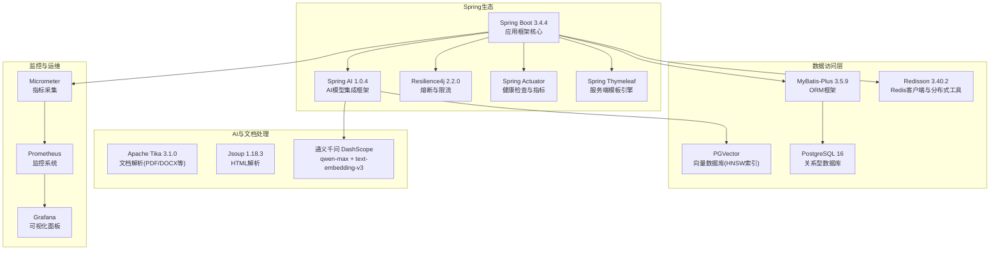
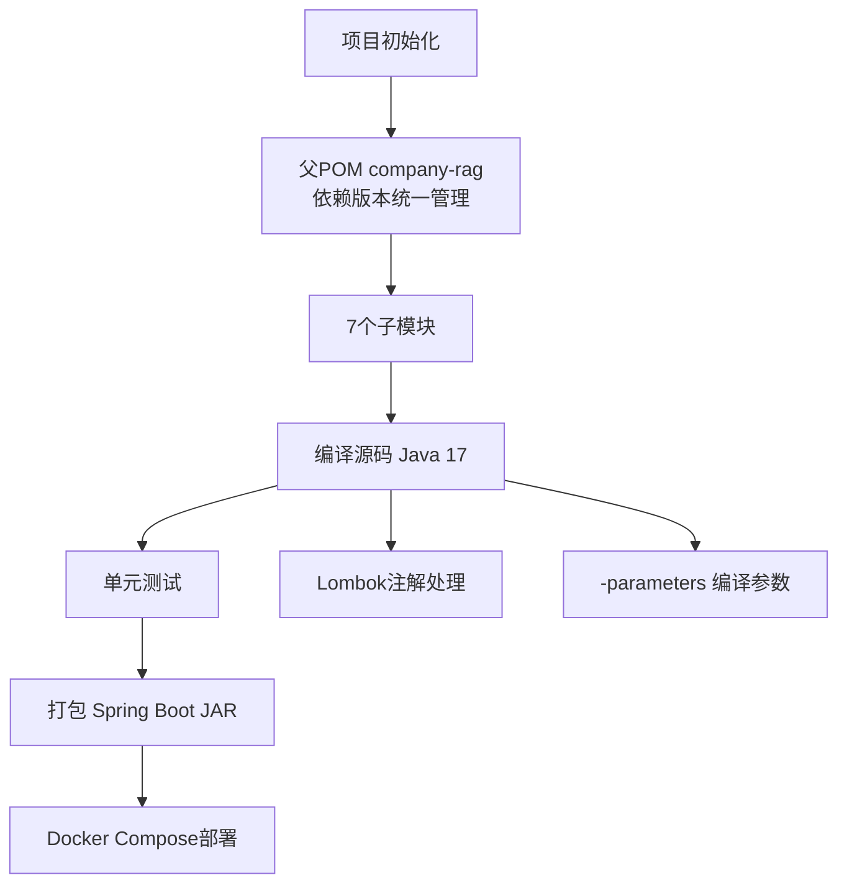
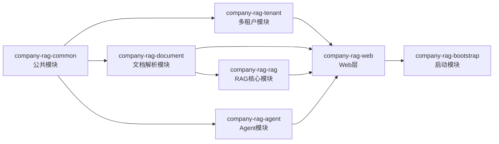
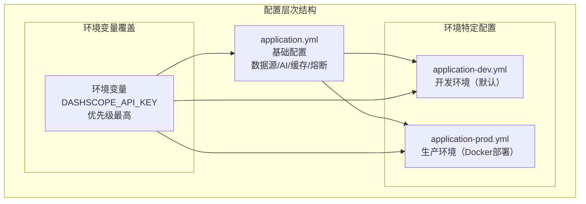

# 技术栈与依赖

**本文档中引用的文件**
- [pom.xml](../../pom.xml)(L1-L180)
- [README.md](../../README.md)(L1-L248)
- [docker-compose.yml](../../docker-compose.yml)(L1-L76)
- [application.yml](../../company-rag-bootstrap/src/main/resources/application.yml)(L1-L94)
- [bootstrap/pom.xml](../../company-rag-bootstrap/pom.xml)(L1-L58)
- [common/pom.xml](../../company-rag-common/pom.xml)(L1-L30)
- [document/pom.xml](../../company-rag-document/pom.xml)(L1-L50)
- [rag/pom.xml](../../company-rag-rag/pom.xml)(L1-L54)
- [agent/pom.xml](../../company-rag-agent/pom.xml)(L1-L38)
- [web/pom.xml](../../company-rag-web/pom.xml)(L1-L46)
- [tenant/pom.xml](../../company-rag-tenant/pom.xml)(L1-L52)

## 目录
1. [项目概述](#项目概述)
2. [核心技术栈](#核心技术栈)
3. [构建与依赖管理](#构建与依赖管理)
4. [配置管理](#配置管理)

## 项目概述

本项目是一个基于 **Spring Boot 3.4 + Spring AI 1.0** 的企业级知识库检索增强生成(RAG)系统，专门为企业知识管理场景设计。项目采用**多模块Maven架构**，支持文档解析、智能切分、向量化、混合检索、Rerank重排序与流式回答的全链路RAG能力。

> 来源：[README.md](../../README.md)(L1-L4)

### 核心特性
- **多租户架构**：Schema隔离 + 行级安全 + 三种角色权限控制
- **RAG全链路**：文档解析(Tika) → 语义切分 → 向量化(PGVector) → 混合检索 → Rerank → 流式回答(SSE)
- **Agent能力**：数据库自然语言查询、代码检索、API文档自动生成
- **可观测性**：Prometheus指标埋点 + Grafana可视化面板 + Actuator健康检查
- **工程保障**：Resilience4j熔断限流、两级缓存(Redis + 热点检测)、超时控制

> 来源：[README.md](../../README.md)(L48-L85)

## 核心技术栈

### Spring Boot + Spring AI 生态系统

**图表来源**
- [pom.xml](../../pom.xml) - 所有依赖版本管理
- [README.md](../../README.md) - 技术栈表格与架构说明

### 技术选型详解

#### Spring Boot 3.4.4
- **版本选择原因**：作为父POM提供依赖管理，基于Spring Framework 6.x，支持Java 17+，内置虚拟线程、AOT编译等新特性。
- **核心功能**：提供IoC容器、自动配置、嵌入式Web服务器、健康检查、指标采集等企业级应用基础能力。
- **应用场景**：作为整个RAG系统的应用框架，承载所有业务模块的依赖注入与配置管理。

> 来源：[pom.xml](../../pom.xml)(L7-L12)

#### Spring AI 1.0.4
- **AI模型集成**：通过OpenAI兼容模式对接通义千问DashScope API，提供ChatClient和EmbeddingClient。
- **向量数据库**：集成PGVector作为向量存储，支持HNSW索引与余弦距离计算。
- **使用场景**：文档向量化存储、语义检索、流式对话生成。

> 来源：[pom.xml](../../pom.xml)(L33)、[application.yml](../../company-rag-bootstrap/src/main/resources/application.yml)(L18-L34)

#### MyBatis-Plus 3.5.9
- **优势**：增强MyBatis，提供通用CRUD、分页插件、租户拦截器、乐观锁等开箱即用功能。
- **使用场景**：所有业务数据的ORM映射，配合多租户模块实现行级安全。
- **配置特点**：开启驼峰映射、自动ID策略、逻辑删除（deleted字段）、控制台SQL日志。

> 来源：[pom.xml](../../pom.xml)(L58-L66)、[application.yml](../../company-rag-bootstrap/src/main/resources/application.yml)(L51-L61)

#### Redisson 3.40.2
- **缓存策略**：作为分布式缓存客户端，支持热点数据缓存、分布式限流、分布式锁。
- **数据结构**：支持String、Hash、List、Set、SortedSet、BloomFilter等丰富数据结构。
- **应用场景**：RAG结果缓存、会话管理、每租户速率限制、分布式锁。

> 来源：[pom.xml](../../pom.xml)(L67-L71)

#### Resilience4j 2.2.0
- **熔断机制**：CircuitBreaker保护LLM调用，滑动窗口10次请求，50%失败率触发熔断，30秒恢复时间。
- **限流控制**：RateLimiter每租户每秒10次请求，超时500ms。
- **使用场景**：保护外部AI API调用，防止因API异常导致级联故障。

> 来源：[pom.xml](../../pom.xml)(L72-L76)、[application.yml](../../company-rag-bootstrap/src/main/resources/application.yml)(L64-L77)

#### Apache Tika 3.1.0
- **文档解析**：自动识别PDF、DOCX、TXT、Markdown、HTML等多种文档格式。
- **使用场景**：知识库文档上传后的自动解析与文本提取。
- **配合工具**：Jsoup 1.18.3用于HTML文档的精细解析与处理。

> 来源：[pom.xml](../../pom.xml)(L77-L91)

**章节来源**
- [pom.xml](../../pom.xml) - 依赖版本管理
- [application.yml](../../company-rag-bootstrap/src/main/resources/application.yml) - 框架配置详情
- [README.md](../../README.md) - 技术栈表格与特性描述

## 构建与依赖管理

### Maven构建系统

项目采用 **Apache Maven** 作为构建工具，JDK版本为 **17**，配合 **Maven Wrapper**（由IDE自动管理）确保构建环境的一致性。父POM使用 `<dependencyManagement>` 统一管理所有依赖版本。

**图表来源**
- [pom.xml](../../pom.xml)(L1-L180) - 完整构建配置

### 依赖管理策略

#### 核心依赖版本
- **JDK 17**（长期支持版本，支持Records、Sealed Classes、Pattern Matching等新特性）
- **Spring Boot 3.4.4**（Spring官方最新稳定版）
- **Spring AI 1.0.4**（Spring AI正式发布版）
- **MyBatis-Plus 3.5.9**（支持Spring Boot 3.x）
- **Redisson 3.40.2**（支持Spring Boot 3 Starter）
- **Resilience4j 2.2.0**（支持Spring Boot 3）
- **Apache Tika 3.1.0**（最新稳定版）
- **Jsoup 1.18.3**（HTML解析库）

#### 模块依赖关系

**章节来源**
- [pom.xml](../../pom.xml) - 版本与模块定义
- 各子模块pom.xml - 模块间依赖关系

## 配置管理

### 配置文件结构

项目采用 **Spring Boot 多环境配置** 风格，通过 `spring.profiles.active` 切换环境。当前工程包含开发环境配置（默认）和Docker Compose部署的生产环境配置。

**图表来源**
- [application.yml](../../company-rag-bootstrap/src/main/resources/application.yml) - 基础配置
- [docker-compose.yml](../../docker-compose.yml) - 生产环境变量配置

### 环境配置详解

#### 基础配置（application.yml）
- **服务器端口**：8080
- **数据源**：PostgreSQL连接（Hikari连接池，search_path初始化）
- **AI模型**：DashScope OpenAI兼容模式，qwen-max对话模型，text-embedding-v3向量模型
- **向量存储**：PGVector，HNSW索引，余弦距离，1024维度
- **Redis缓存**：localhost:6379，密码认证
- **文件上传**：单文件最大50MB，总请求最大100MB
- **MyBatis-Plus**：驼峰映射、自动ID、逻辑删除
- **Resilience4j**：熔断器（滑动窗口10次，50%失败率，30秒恢复）、限流器（每秒10次，超时500ms）
- **Actuator**：暴露health、info、prometheus、metrics端点
- **日志**：com.company.rag包DEBUG级别

> 来源：[application.yml](../../company-rag-bootstrap/src/main/resources/application.yml)(L1-L94)

#### 生产环境配置（Docker Compose）
- **数据库**：PostgreSQL 16 + PGVector（pgvector/pgvector:pg16镜像）
- **缓存**：Redis 7-alpine
- **AI密钥**：通过环境变量 `DASHSCOPE_API_KEY` 注入
- **监控**：Prometheus（端口9090）+ Grafana（端口3000，默认密码admin）

> 来源：[docker-compose.yml](../../docker-compose.yml)(L1-L76)

#### 配置加载优先级
1. 环境变量（最高优先级）
2. 环境特定配置文件（application-{profile}.yml）
3. 基础配置文件（application.yml）
4. 默认值（最低优先级）

**章节来源**
- [application.yml](../../company-rag-bootstrap/src/main/resources/application.yml) - 完整配置详情
- [docker-compose.yml](../../docker-compose.yml) - 基础设施与生产配置