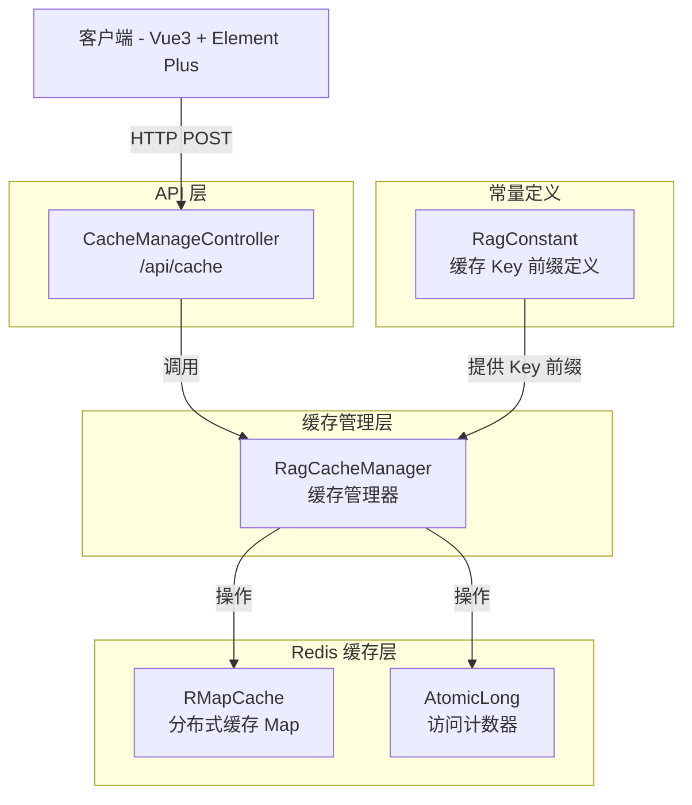

# CacheManageController（缓存管理控制器）

**本文档中引用的文件**
- [CacheManageController.java](../../../company-rag-web/src/main/java/com/company/rag/web/controller/CacheManageController.java)
- [RagCacheManager.java](../../../company-rag-rag/src/main/java/com/company/rag/rag/cache/RagCacheManager.java)
- [RagConstant.java](../../../company-rag-common/src/main/java/com/company/rag/common/constant/RagConstant.java)

## 目录
1. [简介](#简介)
2. [系统架构](#系统架构)
3. [API 接口列表](#api 接口列表)
4. [请求/响应模型](#请求响应模型)
5. [错误处理](#错误处理)
6. [实现细节](#实现细节)

## 简介

CacheManageController 是缓存管理控制器，提供 RAG 检索结果的缓存管理功能，支持租户级缓存失效和全量缓存清理。

**主要功能**：
- **清空指定租户缓存**：失效特定租户的所有检索结果缓存
- **清空所有缓存**：失效系统中的全部 RAG 缓存
- **热点缓存识别**：自动识别高频访问的缓存项并延长 TTL
- **文档级缓存失效**：当文档向量变更时主动失效相关缓存

**技术特性**：
- 基于 Redis + Redisson RMapCache 实现
- 支持 TTL（Time To Live）过期策略
- 热点缓存自动延长过期时间
- 多租户缓存隔离
- 统一响应格式 `R<T>`
- 审计日志支持

**路径**: `/api/cache`

**权限要求**: 管理员角色（`ROLE_ADMIN`）

## 系统架构



**架构说明**：
- **API 层**：`CacheManageController` 负责接收 HTTP 请求，调用缓存管理器并封装响应
- **缓存管理层**：`RagCacheManager` 实现缓存的存取、失效和热点识别逻辑
- **Redis 缓存层**：使用 Redisson 的 `RMapCache` 提供分布式缓存能力，支持 TTL 和原子计数
- **常量定义**：`RagConstant` 定义缓存 Key 的前缀，确保命名规范统一

## API 接口列表

### 1. 清空指定租户缓存

**端点**: `POST /api/cache/clear`

**权限**: 管理员（`hasRole('ADMIN')`）

**请求头**:
| 参数 | 类型 | 必填 | 说明 |
|------|------|------|------|
| Content-Type | String | 是 | application/x-www-form-urlencoded |
| X-Tenant-Id | Long | 否 | 租户 ID（从请求头或参数获取） |

**请求参数**:
| 参数 | 类型 | 必填 | 说明 |
|------|------|------|------|
| tenantId | Long | 是 | 租户 ID |

**请求示例**:
```bash
curl -X POST 'http://localhost:8080/api/cache/clear?tenantId=1001' \
  -H 'Content-Type: application/x-www-form-urlencoded'
```

**响应** (`R<Void>`):
```json
{
  "code": 200,
  "message": "success",
  "data": null
}
```

**实现逻辑**：
1. 接收租户 ID 参数
2. 调用 `RagCacheManager.invalidateByTenant(tenantId)`
3. 使用 SCAN 模式匹配并删除所有以 `company:rag:vector:{tenantId}:` 开头的缓存 Key
4. 记录删除的缓存数量日志
5. 记录审计日志（动作类型：`CLEAR_CACHE`）

**来源**: [CacheManageController.java](../../../company-rag-web/src/main/java/com/company/rag/web/controller/CacheManageController.java)(L23-L29)

---

### 2. 清空所有缓存

**端点**: `POST /api/cache/clearAll`

**权限**: 管理员（`hasRole('ADMIN')`）

**请求头**:
| 参数 | 类型 | 必填 | 说明 |
|------|------|------|------|
| Content-Type | String | 否 | application/x-www-form-urlencoded |

**请求体**: 无

**请求示例**:
```bash
curl -X POST 'http://localhost:8080/api/cache/clearAll'
```

**响应** (`R<Void>`):
```json
{
  "code": 200,
  "message": "success",
  "data": null
}
```

**实现逻辑**：
1. 调用 `RagCacheManager.clearAll()`
2. 清空整个 RMapCache
3. 记录清理日志
4. 记录审计日志（动作类型：`CLEAR_ALL_CACHE`）

**来源**: [CacheManageController.java](../../../company-rag-web/src/main/java/com/company/rag/web/controller/CacheManageController.java)(L34-L40)

## 请求/响应模型

### 统一响应格式 R<T>

所有接口统一返回 `R<T>` 格式：

```json
{
  "code": 200,      // 状态码：200=成功，其他=失败
  "message": "success",  // 响应消息
  "data": null   // 响应数据（泛型，清空操作返回 null）
}
```

### 审计日志

所有缓存管理接口均配置审计日志：

| 接口 | 审计动作类型 | 审计目标类型 | 审计详情 |
|------|-------------|-------------|----------|
| 清空租户缓存 | `CLEAR_CACHE` | `cache` | `'清空租户缓存：tenantId=' + #tenantId` |
| 清空所有缓存 | `CLEAR_ALL_CACHE` | `cache` | `'清空所有缓存'` |

**说明**：审计日志通过 `@AuditLog` 注解自动记录，用于后续审计追踪和合规检查。

### 缓存 Key 格式

```
company:rag:vector:{tenantId}:{query}
```

**说明**：
- `company:rag:vector:`：固定前缀，来源于 `RagConstant.CACHE_DOC_VECTOR`
- `{tenantId}`：租户 ID，实现多租户隔离
- `{query}`：用户查询内容的哈希或原文

### TTL 策略

| 缓存类型 | TTL 时长 | 触发条件 |
|----------|---------|----------|
| 普通缓存 | 5 分钟 | 命中次数 ≤ 3 |
| 热点缓存 | 30 分钟 | 命中次数 > 3 |

### 热点识别机制

- **访问计数**：每次读取缓存时增加访问计数
- **热点阈值**：命中次数 > 3 即判定为热点
- **自动延长**：热点缓存 TTL 自动延长至 30 分钟
- **计数存储**：使用 Redis AtomicLong 存储访问计数

## 错误处理

### 异常类型

| 异常场景 | HTTP 状态码 | 响应示例 |
|----------|------------|----------|
| 租户 ID 缺失 | 400 | `{"code": 400, "message": "缺少租户标识"}` |
| Redis 连接失败 | 500 | `{"code": 500, "message": "缓存服务不可用"}` |
| 参数格式错误 | 400 | `{"code": 400, "message": "参数格式错误"}` |
| 服务器内部错误 | 500 | `{"code": 500, "message": "服务器内部错误"}` |

### 错误处理策略

1. **参数校验**：在 Controller 层进行基础校验（如 tenantId 必填）
2. **异常捕获**：在 `RagCacheManager` 内部捕获异常并记录日志
3. **优雅降级**：缓存失效失败不影响主业务流程
4. **日志记录**：所有异常均记录详细日志，便于问题排查

## 实现细节

### 依赖注入

```java
@RestController
@RequestMapping("/api/cache")
@RequiredArgsConstructor
public class CacheManageController {

    private final RagCacheManager cacheManager;
    
    // ... 接口方法
}
```

**来源**: [CacheManageController.java](../../../company-rag-web/src/main/java/com/company/rag/web/controller/CacheManageController.java)(L13-L18)

### 租户缓存失效实现

```java
public void invalidateByTenant(Long tenantId) {
    RMapCache<String, RagResult> cache = getCache();
    // Cache key 格式：company:rag:vector:{tenantId}:{query}
    String prefix = RagConstant.CACHE_DOC_VECTOR + tenantId + ":";

    try {
        int deletedCount = 0;
        for (String key : cache.keySet()) {
            if (key.startsWith(prefix)) {
                cache.remove(key);
                deletedCount++;
            }
        }

        log.info("失效租户缓存成功 | tenantId={} | deletedCount={}", tenantId, deletedCount);
    } catch (Exception e) {
        log.error("失效租户缓存失败 | tenantId={} | error={}", tenantId, e.getMessage());
    }
}
```

**实现要点**：
- 使用 `keySet()` 迭代所有缓存 Key
- 通过 `startsWith()` 前缀匹配实现租户隔离
- 捕获异常并记录日志，确保不影响主流程
- 记录删除的缓存数量，便于监控和审计

**来源**: [RagCacheManager.java](../../../company-rag-rag/src/main/java/com/company/rag/rag/cache/RagCacheManager.java)(L72-L90)

### 清空所有缓存实现

```java
public void clearAll() {
    getCache().clear();
    log.info("已清空所有 RAG 缓存");
}
```

**实现要点**：
- 直接调用 `RMapCache.clear()` 清空整个缓存
- 操作简单高效，但会影响所有租户
- 通常用于系统维护或紧急情况

**来源**: [RagCacheManager.java](../../../company-rag-rag/src/main/java/com/company/rag/rag/cache/RagCacheManager.java)(L95-L98)

### 热点缓存识别实现

```java
private boolean isHotKey(String cacheKey) {
    String countKey = RagConstant.CACHE_RATE_LIMIT + "hot:" + cacheKey;
    Long count = redissonClient.getAtomicLong(countKey).get();
    return count != null && count > 3;
}

public void incrementAccessCount(String cacheKey) {
    String countKey = RagConstant.CACHE_RATE_LIMIT + "hot:" + cacheKey;
    redissonClient.getAtomicLong(countKey).incrementAndGet();
}
```

**实现要点**：
- 使用独立的计数 Key 存储访问次数
- 计数 Key 前缀：`company:rag:ratelimit:hot:`
- 阈值设定为 3 次，超过即判定为热点
- 热点缓存 TTL 延长至 30 分钟（普通缓存为 5 分钟）

**来源**: [RagCacheManager.java](../../../company-rag-rag/src/main/java/com/company/rag/rag/cache/RagCacheManager.java)(L103-L115)

### 缓存存取流程

```java
// 获取缓存的检索结果
public RagResult getSearchResult(String cacheKey) {
    RMapCache<String, RagResult> cache = getCache();
    RagResult result = cache.get(cacheKey);
    if (result != null) {
        // 每次读取增加访问计数，用于热点判断
        incrementAccessCount(cacheKey);
    }
    return result;
}

// 缓存检索结果
public void putSearchResult(String cacheKey, RagResult result) {
    RMapCache<String, RagResult> cache = getCache();
    // 判断是否为热点（命中次数 > 3），延长 TTL
    boolean isHot = isHotKey(cacheKey);
    long ttl = isHot ? HOT_TTL_MINUTES : DEFAULT_TTL_MINUTES;
    cache.put(cacheKey, result, ttl, TimeUnit.MINUTES);
    if (isHot) {
        log.debug("热点缓存延长 TTL: key={}", cacheKey);
    }
}
```

**来源**: [RagCacheManager.java](../../../company-rag-rag/src/main/java/com/company/rag/rag/cache/RagCacheManager.java)(L44-L66)

### Redisson RMapCache 特性

**RMapCache 优势**：
- **分布式缓存**：支持集群部署，多节点共享缓存
- **TTL 支持**：可为每个 Key 单独设置过期时间
- **原子操作**：支持原子计数、原子更新
- **高性
- 能**：基于 Redis，读写性能优异
- **持久化**：支持 RDB/AOF 持久化策略

**缓存容量管理**：
- 默认无容量限制，依赖 Redis 内存大小
- 可通过 Redis LRU/LFU 策略自动淘汰
- 建议监控 Redis 内存使用率，设置合理告警

### 使用场景

| 场景 | 推荐接口 | 说明 |
|------|---------|------|
| 租户数据变更 | `/api/cache/clear?tenantId={id}` | 租户文档更新后失效相关缓存 |
| 系统维护 | `/api/cache/clearAll` | 定期清理或紧急清理全部缓存 |
| 向量模型升级 | `/api/cache/clearAll` | 模型变更后所有向量缓存失效 |
| 单个文档更新 | 文档管理接口内部调用 | 文档级缓存失效（自动触发） |

---

**文档更新时间**: 2026-08-26  
**基于代码版本**: 最新实现（热点识别 + TTL 策略 + 审计日志）
