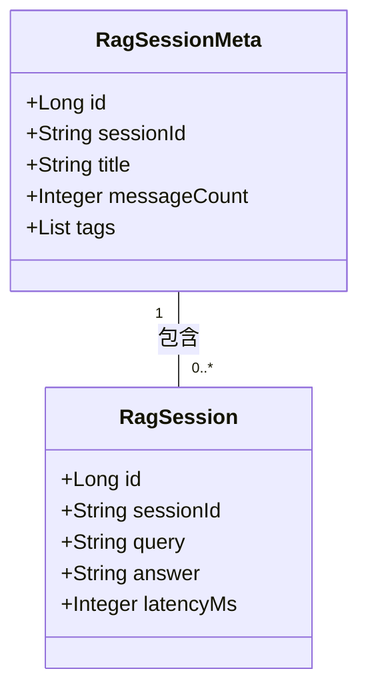

# 会话管理接口

**本文档中引用的文件**
- [SessionController.java](../../../company-rag-web/src/main/java/com/company/rag/web/controller/SessionController.java)
- [SessionCreateRequest.java](../../../company-rag-web/src/main/java/com/company/rag/web/model/SessionCreateRequest.java)
- [SessionUpdateRequest.java](../../../company-rag-web/src/main/java/com/company/rag/web/model/SessionUpdateRequest.java)
- [RagSession.java](../../../company-rag-rag/src/main/java/com/company/rag/rag/entity/RagSession.java)
- [RagSessionMeta.java](../../../company-rag-rag/src/main/java/com/company/rag/rag/entity/RagSessionMeta.java)
- [RagSessionService.java](../../../company-rag-rag/src/main/java/com/company/rag/rag/service/RagSessionService.java)
- [RagSessionServiceImpl.java](../../../company-rag-rag/src/main/java/com/company/rag/rag/service/impl/RagSessionServiceImpl.java)

## 目录
1. [简介](#简介)
2. [系统架构](#系统架构)
3. [数据模型](#数据模型)
4. [API 接口列表](#api 接口列表)
5. [请求/响应模型](#请求响应模型)
6. [分页与搜索](#分页与搜索)
7. [错误处理](#错误处理)
8. [实现细节](#实现细节)

## 简介

会话管理接口提供完整的 RAG 对话会话管理功能，支持：

- **创建新会话**：初始化对话会话，生成唯一会话 ID
- **会话列表查询**：支持分页、关键词搜索和标签过滤
- **会话详情查看**：获取完整对话历史记录
- **会话更新**：修改会话标题和标签
- **软删除会话**：逻辑删除会话，保留审计数据

**技术特性**：
- 基于 Spring Boot 3.4 + MyBatis-Plus 3.5.9
- RESTful API 设计风格
- 多租户隔离（通过 `X-Tenant-Id` 请求头）
- 统一响应格式 `R<T>`

## 系统架构

```mermaid
graph TB
    Client[客户端 - Vue3 + Element Plus]
    
    subgraph API 层
        SessionController[SessionController<br/>/api/session]
    end
    
    subgraph 服务层
        RagSessionService[RagSessionService<br/>会话服务接口]
        RagSessionServiceImpl[RagSessionServiceImpl<br/>会话服务实现]
    end
    
    subgraph 数据模型层
        RagSessionMeta[RagSessionMeta<br/>会话元信息]
        RagSession[RagSession<br/>对话明细]
    end
    
    subgraph 数据访问层
        SessionMetaMapper[RagSessionMetaMapper]
        SessionMapper[RagSessionMapper]
    end
    
    subgraph 数据库层
        PostgreSQL[(PostgreSQL + PGVector<br/>rag_session_meta / rag_session)]
    end
    
    Client -->|HTTP REST API| SessionController
    SessionController -->|调用 | RagSessionService
    RagSessionService <|-- RagSessionServiceImpl
    RagSessionServiceImpl -->|操作 | RagSessionMeta
    RagSessionServiceImpl -->|操作 | RagSession
    RagSessionMeta -->|持久化 | SessionMetaMapper
    RagSession -->|持久化 | SessionMapper
    SessionMetaMapper -->|CRUD| PostgreSQL
    SessionMapper -->|CRUD| PostgreSQL
```

**架构说明**：
- **API 层**：`SessionController` 负责接收 HTTP 请求，参数校验和响应封装
- **服务层**：`RagSessionService` 接口定义业务逻辑，`RagSessionServiceImpl` 实现具体业务
- **数据模型层**：采用父子结构设计，`RagSessionMeta` 存储会话元信息，`RagSession` 存储对话明细
- **数据访问层**：基于 MyBatis-Plus 的 Mapper 接口，支持 CRUD 操作
- **数据库层**：PostgreSQL 16 + PGVector，支持 JSONB 字段和行级安全策略

## 数据模型

### RagSessionMeta（会话元信息）

| 字段 | 类型 | 说明 | 来源 |
|------|------|------|------|
| id | Long | 主键 ID，自增 | L20 |
| sessionId | String | 会话唯一标识（UUID） | L23 |
| tenantId | Long | 租户 ID，多租户隔离 | L25 |
| userId | Long | 用户 ID | L27 |
| title | String | 会话标题，默认"新会话" | L29 |
| lastQuery | String | 最后一次查询内容 | L31 |
| messageCount | Integer | 消息数量 | L33 |
| isDeleted | Boolean | 软删除标记 | L35 |
| tags | List<String> | 标签集合（JSONB） | L40-41 |
| metadata | Map<String, Object> | 扩展元数据（JSONB） | L46-47 |
| createTime | LocalDateTime | 创建时间 | L49 |
| updateTime | LocalDateTime | 更新时间 | L51 |

### RagSession（对话明细）

| 字段 | 类型 | 说明 | 来源 |
|------|------|------|------|
| id | Long | 主键 ID，自增 | L16 |
| sessionId | String | 关联的会话 ID | L19 |
| tenantId | Long | 租户 ID | L21 |
| userId | Long | 用户 ID | L23 |
| query | String | 用户查询内容 | L25 |
| answer | String | AI 回答内容 | L27 |
| context | String | 检索到的上下文 | L29 |
| tokensInput | Integer | 输入 Token 数 | L31 |
| tokensOutput | Integer | 输出 Token 数 | L33 |
| latencyMs | Integer | 响应延迟（毫秒） | L35 |
| createTime | LocalDateTime | 创建时间 | L37 |

### 数据关系



**说明**：一个会话元信息对应多条对话明细记录，通过 `sessionId` 关联。

## API 接口列表

### 1. 创建会话

**端点**: `POST /api/session`

**请求头**:
| 参数 | 类型 | 必填 | 说明 |
|------|------|------|------|
| X-Tenant-Id | Long | 是 | 租户 ID |

**请求体** (`SessionCreateRequest`):
```json
{
  "title": "技术咨询会话"
}
```

| 字段 | 类型 | 必填 | 说明 |
|------|------|------|------|
| title | String | 否 | 会话标题，默认"新会话" |

**响应** (`R<RagSessionMeta>`):
```json
{
  "code": 200,
  "message": "success",
  "data": {
    "id": 1,
    "sessionId": "sess_abc123",
    "tenantId": 1001,
    "userId": 1,
    "title": "技术咨询会话",
    "messageCount": 0,
    "isDeleted": false,
    "createTime": "2026-08-08T10:30:00",
    "updateTime": "2026-08-08T10:30:00"
  }
}
```

**实现逻辑**：
1. 生成 UUID 作为 sessionId（去掉横杠）
2. 创建 `RagSessionMeta` 记录，初始化字段
3. 插入数据库
4. 返回会话元信息

**来源**: [SessionController.java](../../../company-rag-web/src/main/java/com/company/rag/web/controller/SessionController.java)(L28-L36)

---

### 2. 获取会话列表

**端点**: `GET /api/session/list`

**请求头**:
| 参数 | 类型 | 必填 | 说明 |
|------|------|------|------|
| X-Tenant-Id | Long | 是 | 租户 ID |

**请求参数**:
| 参数 | 类型 | 必填 | 默认值 | 说明 |
|------|------|------|--------|------|
| keyword | String | 否 | - | 关键词搜索（标题/最后查询） |
| tags | List<String> | 否 | - | 标签过滤，支持多标签 |
| page | int | 否 | 1 | 页码，从 1 开始 |
| size | int | 否 | 20 | 每页大小 |

**响应** (`R<Page<RagSessionMeta>>`):
```json
{
  "code": 200,
  "message": "success",
  "data": {
    "records": [
      {
        "id": 1,
        "sessionId": "sess_abc123",
        "title": "技术咨询会话",
        "lastQuery": "如何配置 PGVector?",
        "messageCount": 5,
        "tags": ["技术", "数据库"],
        "createTime": "2026-08-08T10:30:00"
      }
    ],
    "total": 1,
    "size": 20,
    "current": 1,
    "pages": 1
  }
}
```

**实现逻辑**：
1. 计算分页偏移量：`offset = (page - 1) * size`
2. 调用 Mapper 查询会话列表（支持关键词和标签过滤）
3. 调用 Mapper 统计总记录数
4. 封装为 MyBatis-Plus Page 对象返回

**来源**: [SessionController.java](../../../company-rag-web/src/main/java/com/company/rag/web/controller/SessionController.java)(L41-L51)

---

### 3. 获取会话详情

**端点**: `GET /api/session/{sessionId}`

**路径参数**:
| 参数 | 类型 | 必填 | 说明 |
|------|------|------|------|
| sessionId | String | 是 | 会话唯一标识 |

**请求头**:
| 参数 | 类型 | 必填 | 说明 |
|------|------|------|------|
| X-Tenant-Id | Long | 是 | 租户 ID |

**响应** (`R<List<RagSession>>`):
```json
{
  "code": 200,
  "message": "success",
  "data": [
    {
      "id": 1,
      "sessionId": "sess_abc123",
      "query": "如何配置 PGVector?",
      "answer": "PGVector 配置需要在 PostgreSQL 中启用 vector 扩展...",
      "context": "检索自：docs/pgvector-setup.md",
      "tokensInput": 150,
      "tokensOutput": 320,
      "latencyMs": 1200,
      "createTime": "2026-08-08T10:35:00"
    },
    {
      "id": 2,
      "sessionId": "sess_abc123",
      "query": "HNSW 索引参数如何调优？",
      "answer": "HNSW 索引的关键参数包括 M、efConstruction...",
      "latencyMs": 1500,
      "createTime": "2026-08-08T10:40:00"
    }
  ]
}
```

**实现逻辑**：
1. 根据 tenantId 和 sessionId 查询对话明细
2. 按创建时间升序排列
3. 返回完整的对话历史记录

**来源**: [SessionController.java](../../../company-rag-web/src/main/java/com/company/rag/web/controller/SessionController.java)(L56-L61)

---

### 4. 删除会话

**端点**: `DELETE /api/session/{sessionId}`

**路径参数**:
| 参数 | 类型 | 必填 | 说明 |
|------|------|------|------|
| sessionId | String | 是 | 会话唯一标识 |

**请求头**:
| 参数 | 类型 | 必填 | 说明 |
|------|------|------|------|
| X-Tenant-Id | Long | 是 | 租户 ID |

**响应** (`R<Void>`):
```json
{
  "code": 200,
  "message": "success",
  "data": null
}
```

**说明**: 采用软删除策略，仅将 `isDeleted` 标记设为 `true`，不物理删除数据。

**实现逻辑**：
1. 查询会话元信息
2. 设置 `isDeleted = true`
3. 更新 `updateTime`
4. 保存回数据库

**来源**: [SessionController.java](../../../company-rag-web/src/main/java/com/company/rag/web/controller/SessionController.java)(L66-L71)

---

### 5. 更新会话信息

**端点**: `PUT /api/session/{sessionId}`

**路径参数**:
| 参数 | 类型 | 必填 | 说明 |
|------|------|------|------|
| sessionId | String | 是 | 会话唯一标识 |

**请求头**:
| 参数 | 类型 | 必填 | 说明 |
|------|------|------|------|
| X-Tenant-Id | Long | 是 | 租户 ID |

**请求体** (`SessionUpdateRequest`):
```json
{
  "title": "更新后的会话标题",
  "tags": ["技术", "数据库", "向量检索"]
}
```

| 字段 | 类型 | 必填 | 说明 |
|------|------|------|------|
| title | String | 否 | 会话标题 |
| tags | List<String> | 否 | 标签集合 |

**响应** (`R<Void>`):
```json
{
  "code": 200,
  "message": "success",
  "data": null
}
```

**实现逻辑**：
1. 查询会话元信息
2. 如果 title 不为 null，更新标题
3. 如果 tags 不为 null，更新标签
4. 更新 `updateTime`
5. 保存回数据库

**来源**: [SessionController.java](../../../company-rag-web/src/main/java/com/company/rag/web/controller/SessionController.java)(L76-L82)

## 请求/响应模型

### SessionCreateRequest

```java
@Data
public class SessionCreateRequest {
    private String title;  // 会话标题，可选
}
```

**来源**: [SessionCreateRequest.java](../../../company-rag-web/src/main/java/com/company/rag/web/model/SessionCreateRequest.java)

### SessionUpdateRequest

```java
@Data
public class SessionUpdateRequest {
    private String title;        // 会话标题，可选
    private List<String> tags;   // 标签集合，可选
}
```

**来源**: [SessionUpdateRequest.java](../../../company-rag-web/src/main/java/com/company/rag/web/model/SessionUpdateRequest.java)

### 统一响应格式 R<T>

所有接口统一返回 `R<T>` 格式：

```json
{
  "code": 200,      // 状态码：200=成功，其他=失败
  "message": "success",  // 响应消息
  "data": { ... }   // 响应数据（泛型）
}
```

## 分页与搜索

### 分页参数

| 参数 | 默认值 | 说明 |
|------|--------|------|
| page | 1 | 页码，从 1 开始 |
| size | 20 | 每页大小 |

### 搜索功能

**关键词搜索**：
- 支持模糊匹配 `title` 和 `lastQuery` 字段
- 使用 SQL LIKE 操作：`title LIKE '%keyword%' OR last_query LIKE '%keyword%'`

**标签过滤**：
- 支持多标签筛选
- 使用 PostgreSQL JSONB 操作符：`tags ?| #{tags}`
- 匹配任一标签即返回

### 排序规则

- 默认按 `create_time DESC` 降序排列
- 最新创建的会话排在前面

### 数据隔离

- **租户隔离**：自动追加 `tenant_id = ?` 条件
- **用户隔离**：自动追加 `user_id = ?` 条件
- **软删除过滤**：自动追加 `is_deleted = FALSE` 条件

## 错误处理

### 异常类型

| 异常场景 | HTTP 状态码 | 响应示例 |
|----------|------------|----------|
| 租户 ID 缺失 | 400 | `{"code": 400, "message": "缺少租户标识"}` |
| 会话不存在 | 404 | `{"code": 404, "message": "会话不存在"}` |
| 无权访问 | 403 | `{"code": 403, "message": "无权访问该会话"}` |
| 参数校验失败 | 400 | `{"code": 400, "message": "参数格式错误"}` |
| 服务器内部错误 | 500 | `{"code": 500, "message": "服务器内部错误"}` |

### 错误处理策略

1. **参数校验**：在 Controller 层进行基础校验
2. **业务异常**：Service 层抛出具体业务异常
3. **全局异常处理**：通过 `@RestControllerAdvice` 统一处理
4. **日志记录**：关键错误记录详细日志

## 实现细节

### 会话标题自动更新

在 `RagSessionServiceImpl.saveConversation()` 方法中实现了智能标题更新逻辑：

```java
// 检查会话是否存在，不存在则创建
RagSessionMeta meta = sessionMetaMapper.selectOne(
    new LambdaQueryWrapper<RagSessionMeta>()
        .eq(RagSessionMeta::getSessionId, sessionId)
);

if (meta == null) {
    log.warn("会话不存在，自动创建 | sessionId={}", sessionId);
    // 使用用户问题作为标题创建会话
    createSession(tenantId, userId, query);
} else {
    // 如果是首次聊天（消息数为 0），且当前标题为"新会话"，则更新为问题内容
    if (meta.getMessageCount() == 0 && "新会话".equals(meta.getTitle())) {
        meta.setTitle(query);
        sessionMetaMapper.updateById(meta);
        log.info("更新会话标题为首次提问 | sessionId={} title={}", sessionId, query);
    }
}
```

**逻辑说明**：
- 当会话不存在时，自动创建新会话并使用用户问题作为标题
- 当会话存在且为首次聊天（消息数为 0）且当前标题为"新会话"时，自动将标题更新为用户的首次提问内容
- 确保会话标题能够准确反映对话主题，无需用户手动设置

**来源**: [RagSessionServiceImpl.java](../../../company-rag-rag/src/main/java/com/company/rag/rag/service/impl/RagSessionServiceImpl.java)(L76-L93)

### 异步批量更新机制

会话元数据（消息数、最后查询）采用异步批量更新策略：

```java
private static class SessionCounter {
    int count = 0;
    String lastQuery;
    LocalDateTime lastUpdateTime = LocalDateTime.now();

    synchronized void increment(String query) {
        count++;
        lastQuery = query;
        lastUpdateTime = LocalDateTime.now();
    }
}

private void updateSessionMetaAsync(String sessionId, String lastQuery) {
    SessionCounter counter = sessionCounters.computeIfAbsent(sessionId, k -> new SessionCounter());
    counter.increment(lastQuery);

    // 每 5 次对话或超过 5 分钟更新一次数据库
    if (counter.count >= 5 ||
            Duration.between(counter.lastUpdateTime, LocalDateTime.now()).toMinutes() >= 5) {
        updateSessionMeta(sessionId, counter.lastQuery, counter.count);
        sessionCounters.remove(sessionId);
    }
}
```

**更新触发条件**：
- 每 5 次对话
- 或超过 5 分钟未活动

**优势**：
- 减少频繁的数据库写操作
- 提升系统整体性能
- 降低数据库负载

**来源**: [RagSessionServiceImpl.java](../../../company-rag-rag/src/main/java/com/company/rag/rag/service/impl/RagSessionServiceImpl.java)(L38-L126)

### UUID 生成策略

会话 ID 使用 UUID 生成，去掉横杠：

```java
String sessionId = UUID.randomUUID().toString().replace("-", "");
```

**特点**：
- 全局唯一性保证
- 无规律性，防止猜测
- 32 位字符串，便于存储和传输

---

**文档更新时间**: 2026-08-08  
**基于代码版本**: 最新实现（包含异步批量更新和智能标题更新）
