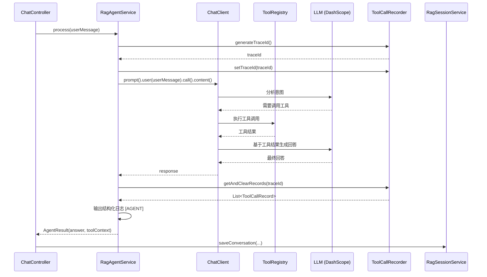

# 对话接口

**本文档中引用的文件**
- [ChatController.java](../../../company-rag-web/src/main/java/com/company/rag/web/controller/ChatController.java)
- [ChatRequest.java](../../../company-rag-rag/src/main/java/com/company/rag/rag/response/ChatRequest.java)
- [ChatResponse.java](../../../company-rag-rag/src/main/java/com/company/rag/rag/response/ChatResponse.java)
- [ChatMetrics.java](../../../company-rag-rag/src/main/java/com/company/rag/rag/response/ChatMetrics.java)
- [DebugInfo.java](../../../company-rag-rag/src/main/java/com/company/rag/rag/response/DebugInfo.java)
- [RagQuery.java](../../../company-rag-rag/src/main/java/com/company/rag/rag/model/RagQuery.java)
- [RagResult.java](../../../company-rag-rag/src/main/java/com/company/rag/rag/model/RagResult.java)
- [AgentResult.java](../../../company-rag-agent/src/main/java/com/company/rag/agent/service/AgentResult.java)
- [RagAgentService.java](../../../company-rag-agent/src/main/java/com/company/rag/agent/service/RagAgentService.java)
- [IntentType.java](../../../company-rag-rag/src/main/java/com/company/rag/rag/router/IntentType.java)

## 目录
1. [简介](#简介)
2. [系统架构](#系统架构)
3. [数据模型](#数据模型)
4. [API 接口列表](#api 接口列表)
5. [请求/响应模型](#请求响应模型)
6. [Agent 工具编排](#agent 工具编排)
7. [错误处理](#错误处理)
8. [实现细节](#实现细节)

## 简介

对话接口提供统一的智能对话入口，基于 Spring AI 实现 Agent 编排模式，支持：

- **统一对话入口**：整合原有 AgentController 和 RagController，使用 Agent 模式
- **智能意图识别**：LLM 自动分析用户意图，决定调用何种工具
- **多工具编排**：支持文档检索、数据库查询、代码搜索等多种工具
- **会话管理**：自动保存对话历史，支持会话上下文关联
- **多租户隔离**：通过 `X-Tenant-Id` 请求头实现租户数据隔离

**技术特性**：
- 基于 Spring Boot 3.4 + Spring AI 1.0.4（DashScope 通义千问）
- RESTful API 设计风格
- Agent 编排模式（Function Calling）
- 统一响应格式 `R<T>`
- 可解释性日志（traceId 关联工具调用链）

## 系统架构

```mermaid
graph TB
    Client[客户端 - Vue3 + Element Plus]
    
    subgraph API 层
        ChatController[ChatController<br/>/api/chat<br/>/api/rag/search]
    end
    
    subgraph 服务层
        RagAgentService[RagAgentService<br/>Agent 编排服务]
        RagSearchService[RagSearchService<br/>RAG 检索服务]
        RagSessionService[RagSessionService<br/>会话管理服务]
    end
    
    subgraph 工具层
        AgentToolRegistry[AgentToolRegistry<br/>工具注册中心]
        DatabaseQueryTool[DatabaseQueryTool<br/>数据库查询]
        CodeSearchTool[CodeSearchTool<br/>代码搜索]
        ApiDocTool[ApiDocTool<br/>API 文档]
    end
    
    subgraph 数据模型层
        ChatRequest[ChatRequest<br/>聊天请求]
        ChatResponse[ChatResponse<br/>聊天响应]
        RagQuery[RagQuery<br/>RAG 查询]
        RagResult[RagResult<br/>RAG 结果]
        AgentResult[AgentResult<br/>Agent 结果]
    end
    
    subgraph 外部服务
        DashScope[DashScope 通义千问<br/>ChatModel]
        PostgreSQL[(PostgreSQL + PGVector)]
    end
    
    Client -->|HTTP REST API| ChatController
    ChatController -->|调用 | RagAgentService
    ChatController -->|调用 (Deprecated)| RagSearchService
    ChatController -->|保存会话 | RagSessionService
    RagAgentService -->|使用 | AgentToolRegistry
    RagAgentService -->|调用 | DashScope
    AgentToolRegistry -->|注册 | DatabaseQueryTool
    AgentToolRegistry -->|注册 | CodeSearchTool
    AgentToolRegistry -->|注册 | ApiDocTool
    RagSearchService -->|检索 | PostgreSQL
```

**架构说明**：
- **API 层**：`ChatController` 负责接收 HTTP 请求，统一处理租户 ID 和用户 ID，调用后端服务
- **服务层**：
  - `RagAgentService`：基于 Spring AI ChatClient 实现 Agent 编排，LLM 自动决定工具调用
  - `RagSearchService`：保留的独立 RAG 检索入口（已标记为 Deprecated）
  - `RagSessionService`：负责会话保存和管理
- **工具层**：各种专业工具实现具体功能，由 AgentToolRegistry 统一管理
- **数据模型层**：定义请求/响应数据结构
- **外部服务**：DashScope 通义千问提供 LLM 能力，PostgreSQL 存储文档和会话数据

## 数据模型

### ChatRequest（聊天请求）

| 字段 | 类型 | 必填 | 默认值 | 说明 | 来源 |
|------|------|------|--------|------|------|
| query | String | 是 | - | 用户查询内容 | L20 |
| sessionId | String | 否 | - | 会话 ID | L25 |
| tenantId | Long | 否 | - | 租户 ID | L30 |
| userId | Long | 否 | - | 用户 ID | L35 |
| topK | Integer | 否 | 10 | 返回结果数量 | L40 |
| enableRerank | Boolean | 否 | true | 是否启用 Rerank | L45 |
| includeDebug | Boolean | 否 | false | 是否包含调试信息 | L50 |
| mode | String | 否 | - | 模式（search/chat/agent） | L55 |

**来源**: [ChatRequest.java](../../../company-rag-rag/src/main/java/com/company/rag/rag/response/ChatRequest.java)

### ChatResponse（聊天响应）

| 字段 | 类型 | 说明 | 来源 |
|------|------|------|------|
| answer | String | AI 生成的回答 | L22 |
| sources | List<String> | 引用来源列表 | L27 |
| metrics | ChatMetrics | 性能指标 | L32 |
| debug | DebugInfo | 调试信息（可选） | L37 |

**来源**: [ChatResponse.java](../../../company-rag-rag/src/main/java/com/company/rag/rag/response/ChatResponse.java)

### ChatMetrics（性能指标）

| 字段 | 类型 | 说明 | 来源 |
|------|------|------|------|
| totalMs | long | 总耗时（毫秒） | L21 |
| tokens | int | Token 使用情况 | L26 |
| intent | IntentType | 识别出的意图类型 | L31 |
| routePath | String | 路由路径 | L36 |

**来源**: [ChatMetrics.java](../../../company-rag-rag/src/main/java/com/company/rag/rag/response/ChatMetrics.java)

### DebugInfo（调试信息）

| 字段 | 类型 | 说明 | 来源 |
|------|------|------|------|
| intent | IntentType | 识别出的意图类型 | L23 |
| recognizeSource | String | 识别来源（如：llm、rule、model） | L28 |
| confidence | Double | 置信度（0.0 - 1.0） | L33 |
| toolUsed | String | 使用的工具 | L38 |
| routePath | String | 路由路径 | L43 |
| sources | List<String> | 检索到的来源列表 | L48 |

**来源**: [DebugInfo.java](../../../company-rag-rag/src/main/java/com/company/rag/rag/response/DebugInfo.java)

### IntentType（意图类型）

```java
public enum IntentType {
    DOCUMENT,    // 文档检索意图
    DATABASE,    // 数据库查询意图
    CODE,        // 代码查询意图
    CHAT         // 普通聊天意图
}
```

**来源**: [IntentType.java](../../../company-rag-rag/src/main/java/com/company/rag/rag/router/IntentType.java)

### RagQuery（RAG 查询参数 - Deprecated）

| 字段 | 类型 | 默认值 | 说明 | 来源 |
|------|------|--------|------|------|
| tenantId | Long | - | 租户 ID | L12 |
| query | String | - | 用户问题 | L13 |
| documentIds | List<String> | - | 限定文档范围（可选） | L14 |
| topK | Integer | 10 | 检索返回条数 | L15 |
| rerankTopK | Integer | 5 | Rerank 后保留条数 | L16 |
| vectorWeight | Double | 0.5 | 向量检索权重（混合检索用） | L17 |
| keywordWeight | Double | 0.5 | 关键词检索权重 | L18 |
| enableRerank | Boolean | true | 是否启用 Rerank | L19 |
| userId | Long | - | 用户 ID | L20 |
| stream | Boolean | false | 是否流式 | L21 |
| sessionId | String | - | 会话 ID（用于对话历史） | L22 |
| retrievalStrategy | String | "HYBRID" | 检索策略（HYBRID/VECTOR_ONLY/FULLTEXT_ONLY） | L30 |
| fusionTopK | Integer | 50 | 融合后进入 Rerank 的候选数 | L35 |
| scoreThreshold | Double | 0.3 | 分数阈值 | L40 |

**来源**: [RagQuery.java](../../../company-rag-rag/src/main/java/com/company/rag/rag/model/RagQuery.java)

### RagResult（RAG 检索结果 - Deprecated）

| 字段 | 类型 | 说明 | 来源 |
|------|------|------|------|
| answer | String | LLM 生成的回答 | L12 |
| chunks | List<ChunkResult> | 引用的文档块 | L13 |
| sessions | List<String> | 引用来源 | L14 |
| sessionId | String | 会话 ID | L15 |
| metrics | Metrics | 性能指标 | L16 |

**ChunkResult 内部类**：
| 字段 | 类型 | 说明 |
|------|------|------|
| chunkId | String | 文档块 ID |
| documentId | Long | 关联的文档 ID |
| documentName | String | 文档名称 |
| content | String | 文档块内容 |
| vectorScore | Double | 向量检索得分 |
| keywordScore | Double | 关键词检索得分 |
| rerankScore | Double | Rerank 得分 |
| finalScore | Double | 最终得分 |
| chunkIndex | Integer | 块索引 |

**Metrics 内部类**：
| 字段 | 类型 | 说明 |
|------|------|------|
| retrievalMs | long | 检索耗时 |
| rerankMs | long | 重排序耗时 |
| llmMs | long | LLM 调用耗时 |
| totalMs | long | 总耗时 |
| inputTokens | int | 输入 Token 数 |
| outputTokens | int | 输出 Token 数 |
| recallRate | double | 召回率 |

**来源**: [RagResult.java](../../../company-rag-rag/src/main/java/com/company/rag/rag/model/RagResult.java)

### AgentResult（Agent 处理结果）

| 字段 | 类型 | 说明 | 来源 |
|------|------|------|------|
| answer | String | Agent 生成的回答 | L17 |
| toolContext | String | 工具上下文信息（如调用了什么工具） | L22 |

**来源**: [AgentResult.java](../../../company-rag-agent/src/main/java/com/company/rag/agent/service/AgentResult.java)

## API 接口列表

### 1. 统一对话接口（推荐）

**端点**: `POST /api/chat`

**请求头**:
| 参数 | 类型 | 必填 | 说明 |
|------|------|------|------|
| X-Tenant-Id | Long | 否 | 租户 ID（可选，也可在请求体中传递） |

**请求体** (`ChatRequest`):
```json
{
  "query": "如何配置 PGVector 索引？",
  "sessionId": "sess_abc123",
  "tenantId": 1001,
  "userId": 1,
  "topK": 10,
  "enableRerank": true,
  "includeDebug": false,
  "mode": "agent"
}
```

**响应** (`R<ChatResponse>`):
```json
{
  "code": 200,
  "message": "success",
  "data": {
    "answer": "PGVector 索引配置需要在 PostgreSQL 中启用 vector 扩展，并设置 HNSW 索引参数...",
    "sources": ["docs/pgvector-setup.md", "docs/hnsw-tuning.md"],
    "metrics": {
      "totalMs": 1500,
      "tokens": 350,
      "intent": "DOCUMENT",
      "routePath": "agent -> document_search"
    },
    "debug": {
      "intent": "DOCUMENT",
      "recognizeSource": "llm",
      "confidence": 0.92,
      "toolUsed": "document_search",
      "routePath": "agent -> document_search",
      "sources": ["docs/pgvector-setup.md"]
    }
  }
}
```

**实现逻辑**：
1. 从请求头或请求体获取 tenantId
2. 从 SecurityContext 获取当前用户 ID
3. 调用 RagAgentService.process() 处理请求（Agent 模式）
4. 如果 sessionId 不为空，保存会话和聊天记录
5. 封装 ChatResponse 并返回

**来源**: [ChatController.java](../../../company-rag-web/src/main/java/com/company/rag/web/controller/ChatController.java)(L38-L82)

---

### 2. RAG 检索接口（Deprecated）

**端点**: `POST /api/rag/search`

**说明**: 此接口已标记为 `@Deprecated`，仅供现有前端使用，推荐使用 `/api/chat` 接口。

**请求头**:
| 参数 | 类型 | 必填 | 说明 |
|------|------|------|------|
| X-Tenant-Id | Long | 否 | 租户 ID（可选，也可在请求体中传递） |

**请求体** (`RagQuery`):
```json
{
  "query": "如何配置 PGVector 索引？",
  "tenantId": 1001,
  "documentIds": ["doc_001", "doc_002"],
  "topK": 10,
  "rerankTopK": 5,
  "vectorWeight": 0.5,
  "keywordWeight": 0.5,
  "enableRerank": true,
  "userId": 1,
  "stream": false,
  "sessionId": "sess_abc123",
  "retrievalStrategy": "HYBRID",
  "fusionTopK": 50,
  "scoreThreshold": 0.3
}
```

**响应** (`R<RagResult>`):
```json
{
  "code": 200,
  "message": "success",
  "data": {
    "answer": "PGVector 索引配置需要在 PostgreSQL 中启用 vector 扩展...",
    "chunks": [
      {
        "chunkId": "chunk_001",
        "documentId": 1,
        "documentName": "PGVector 配置指南.md",
        "content": "PGVector 配置步骤...",
        "vectorScore": 0.85,
        "keywordScore": 0.72,
        "rerankScore": 0.88,
        "finalScore": 0.86,
        "chunkIndex": 3
      }
    ],
    "sessions": ["docs/pgvector-setup.md"],
    "sessionId": "sess_abc123",
    "metrics": {
      "retrievalMs": 120,
      "rerankMs": 80,
      "llmMs": 1200,
      "totalMs": 1400,
      "inputTokens": 300,
      "outputTokens": 250,
      "recallRate": 0.85
    }
  }
}
```

**实现逻辑**：
1. 从请求头或请求体获取 tenantId
2. 调用 RagSearchService.search() 执行 RAG 检索
3. 返回 RagResult 结果

**来源**: [ChatController.java](../../../company-rag-web/src/main/java/com/company/rag/web/controller/ChatController.java)(L91-L105)

## 请求/响应模型

### 统一响应格式 R<T>

所有接口统一返回 `R<T>` 格式：

```json
{
  "code": 200,      // 状态码：200=成功，其他=失败
  "message": "success",  // 响应消息
  "data": { ... }   // 响应数据（泛型）
}
```

### 请求参数获取策略

**租户 ID 获取**：
1. 优先从请求体 `tenantId` 字段获取
2. 如果请求体中没有，从请求头 `X-Tenant-Id` 获取
3. 如果都没有，使用默认值（根据业务场景）

**用户 ID 获取**：
1. 优先从请求体 `userId` 字段获取
2. 如果请求体中没有，从 SecurityContext 获取当前登录用户
3. 如果都没有，使用默认值（根据业务场景）

## Agent 工具编排

### RagAgentService 工作流程



### Agent 模式特点

1. **自动意图识别**：LLM 自动分析用户问题，决定是否需要调用工具
2. **工具自动编排**：根据意图自动选择合适的工具
3. **可解释性日志**：
   - 每次请求生成唯一的 traceId
   - 记录所有工具调用的详细信息（名称、耗时、状态）
   - 请求完成后输出结构化日志：`[AGENT] traceId={}, tools=[{}], total={}ms`

### 注册的工具类型

- **DatabaseQueryTool**：数据库查询工具
- **CodeSearchTool**：代码搜索工具
- **ApiDocTool**：API 文档查询工具

**来源**: [RagAgentService.java](../../../company-rag-agent/src/main/java/com/company/rag/agent/service/RagAgentService.java)(L83-L115)

## 错误处理

### 异常类型

| 异常场景 | HTTP 状态码 | 响应示例 |
|----------|------------|----------|
| 参数校验失败 | 400 | `{"code": 400, "message": "参数格式错误"}` |
| 租户 ID 缺失 | 400 | `{"code": 400, "message": "缺少租户标识"}` |
| 无权访问 | 403 | `{"code": 403, "message": "无权访问"}` |
| 服务器内部错误 | 500 | `{"code": 500, "message": "服务器内部错误"}` |
| LLM 调用失败 | 500 | `{"code": 500, "message": "抱歉，系统繁忙，请稍后重试。"}` |

### 错误处理策略

1. **参数校验**：在 Controller 层进行基础校验
2. **业务异常**：Service 层抛出具体业务异常
3. **全局异常处理**：通过 `@RestControllerAdvice` 统一处理
4. **日志记录**：关键错误记录详细日志（包含 traceId）

## 实现细节

### 租户 ID 和用户 ID 获取逻辑

```java
// 如果请求体中没有设置 tenantId，从请求头获取
if (request.getTenantId() == null && tenantId != null) {
    request.setTenantId(tenantId);
}

// 从 SecurityContext 获取当前用户 ID
if (request.getUserId() == null) {
    Object principal = SecurityContextHolder.getContext().getAuthentication().getPrincipal();
    if (principal instanceof SecurityUser) {
        request.setUserId(((SecurityUser) principal).getUserId());
    }
}
```

**来源**: [ChatController.java](../../../company-rag-web/src/main/java/com/company/rag/web/controller/ChatController.java)(L44-L55)

### Agent 处理流程与日志记录

```java
public AgentResult process(String userMessage) {
    // 生成 traceId 并设置到当前线程
    String traceId = recorder.generateTraceId();
    recorder.setTraceId(traceId);
    long requestStart = System.currentTimeMillis();
    
    log.info("[AGENT] traceId={}, userMsg=\"{}\"", traceId, userMessage);
    
    try {
        // ChatClient 自动处理工具调用（Function Calling）
        String response = chatClient.prompt()
                .user(userMessage)
                .call()
                .content();
        
        // 聚合工具调用记录，输出结构化日志
        long totalMs = System.currentTimeMillis() - requestStart;
        List<ToolCallRecord> records = recorder.getAndClearRecords(traceId);
        String toolsSummary = records.stream()
                .map(r -> String.format("%s(%dms,%s)", r.getToolName(), r.getDurationMs(), r.getStatus()))
                .collect(Collectors.joining(", "));
        log.info("[AGENT] traceId={}, tools=[{}], total={}ms", traceId, toolsSummary, totalMs);
        
        return new AgentResult(response != null ? response : "", null);
        
    } catch (Exception e) {
        long totalMs = System.currentTimeMillis() - requestStart;
        log.error("[AGENT] traceId={}, total={}ms, error={}", traceId, totalMs, e.getMessage(), e);
        return new AgentResult("抱歉，系统繁忙，请稍后重试。", "error:" + e.getMessage());
    } finally {
        recorder.clearTraceId();
    }
}
```

**日志输出示例**：
```
[AGENT] traceId=abc123, userMsg="如何配置 PGVector 索引？"
[AGENT] traceId=abc123, tools=[document_search(120ms,SUCCESS), code_search(80ms,SUCCESS)], total=1500ms
```

**来源**: [RagAgentService.java](../../../company-rag-agent/src/main/java/com/company/rag/agent/service/RagAgentService.java)(L83-L115)

### 会话保存逻辑

```java
// 保存会话和聊天记录（包含自动重命名逻辑）
if (request.getSessionId() != null) {
    ragSessionService.saveConversation(
            request.getTenantId() != null ? request.getTenantId() : 1L,
            request.getSessionId(),
            request.getUserId(),
            request.getQuery(),
            result.getAnswer(),
            result.getToolContext(),
            null, null, null
    );
}
```

**说明**：
- 如果请求中包含 sessionId，则保存对话记录
- 如果 tenantId 为空，使用默认值 1L
- RagSessionService.saveConversation() 方法内部实现了智能标题更新逻辑（首次聊天自动更新标题）

**来源**: [ChatController.java](../../../company-rag-web/src/main/java/com/company/rag/web/controller/ChatController.java)(L61-L71)

---

**文档更新时间**: 2026-08-08  
**基于代码版本**: 最新实现（Agent 编排模式 + 可解释性日志）
