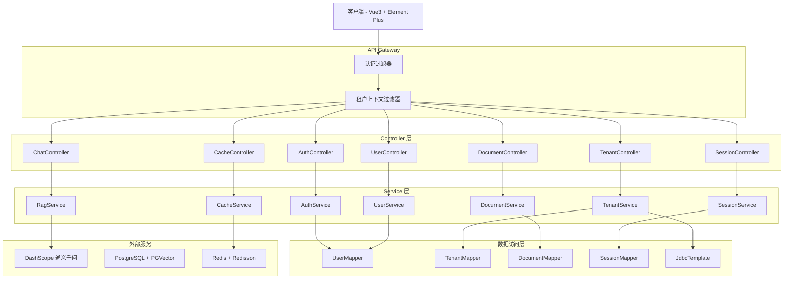
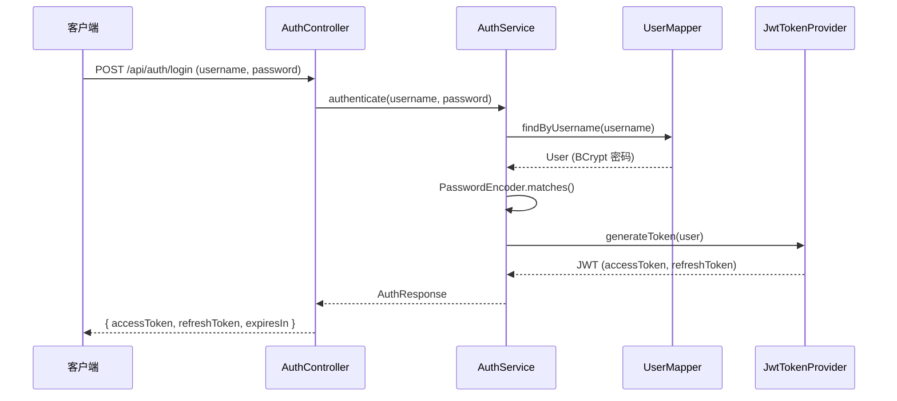
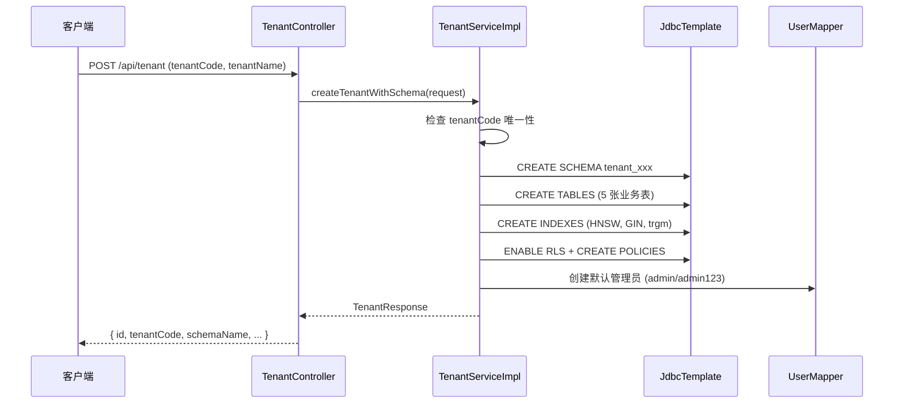
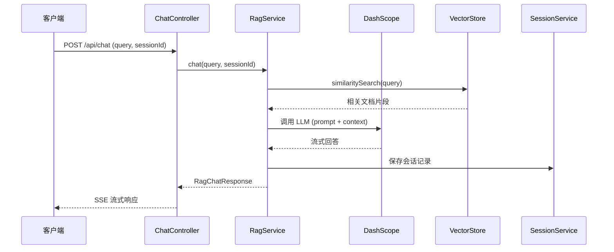

# 接口参考总览

本文档是 CompanyRag 企业知识库 RAG 系统的接口参考总览，提供所有 REST API 的统一索引和快速导航。

## 文档导航

### 核心业务接口

| 模块 | 端点前缀 | 说明 | 文档链接 |
|------|----------|------|----------|
| 认证 | `/api/auth/**` | 登录、登出、令牌刷新 | [认证接口.md](./认证接口.md) |
| 租户管理 | `/api/tenant/**` | 租户 CRUD、Schema 隔离初始化 | [租户管理接口.md](./租户管理接口.md) |
| 用户管理 | `/api/user/**` | 用户 CRUD、多租户关联、角色管理 | [用户管理接口.md](./用户管理接口.md) |
| 文档管理 | `/api/document/**` | 文档上传、解析、向量化 | [文档管理接口.md](./文档管理接口.md) |
| 对话接口 | `/api/chat` | RAG 智能问答、Agent 编排 | [对话接口.md](./对话接口.md) |
| 会话管理 | `/api/session/**` | 会话元数据、历史记录 | [会话管理接口.md](./会话管理接口.md) |
| 缓存管理 | `/api/cache/**` | 向量缓存清理 | [缓存管理接口.md](./缓存管理接口.md) |

### 页面路由

| 路由 | 说明 | 文档链接 |
|------|------|----------|
| `/` | 首页（SPA 兜底） | [页面路由.md](./页面路由.md) |
| `/chat` | 对话页面 | [页面路由.md](./页面路由.md) |
| `/login` | 登录页面 | [页面路由.md](./页面路由.md) |
| `/documents` | 文档管理页面 | [页面路由.md](./页面路由.md) |
| `/admin` | 管理后台页面 | [页面路由.md](./页面路由.md) |

## 系统架构概览



## 通用特性

### 统一响应格式

所有 API 接口统一返回 `R<T>` 格式：

```json
{
  "code": 200,      // 状态码：200=成功，其他=失败
  "message": "success",  // 响应消息
  "data": { ... }   // 响应数据（泛型）
}
```

### 多租户隔离

- **请求头**: `X-Tenant-Id`（可选，从登录上下文自动获取）
- **隔离策略**: PostgreSQL Schema 隔离 + 行级安全（RLS）
- **Schema 命名**: `tenant_{tenantCode}`

### 认证与授权

- **认证方式**: JWT 双令牌（Access Token 2h, Refresh Token 7d）
- **公开接口**: `/api/auth/**`, 静态资源，Swagger, Actuator
- **受保护接口**: `/api/user/**`, `/api/tenant/**`, `/api/document/**`, `/api/rag/**`, `/api/session/**`, `/api/cache/**`
- **角色**: `admin`（管理员）, `user`（普通用户）, `viewer`（只读用户）

### 错误处理

| HTTP 状态码 | 说明 | 触发场景 |
|------------|------|----------|
| 200 | 成功 | 请求成功处理 |
| 400 | 请求错误 | 参数校验失败、业务规则违反 |
| 401 | 未认证 | 缺少或无效的 JWT 令牌 |
| 403 | 无权访问 | 角色权限不足 |
| 404 | 资源不存在 | 查询的资源不存在 |
| 500 | 服务器错误 | 系统异常、数据库错误 |

### 审计日志

关键操作（创建/更新/删除）通过 `@AuditLog` 注解记录审计日志：

- **创建用户**: `CREATE_USER`
- **更新用户**: `UPDATE_USER`
- **删除用户**: `DELETE_USER`
- **创建租户**: `CREATE_TENANT`
- **删除租户**: `DELETE_TENANT`

## 技术栈

| 组件 | 技术 | 版本 |
|------|------|------|
| 后端框架 | Spring Boot | 3.4.4 |
| AI 框架 | Spring AI | 1.0.4 |
| 数据库 | PostgreSQL + PGVector | 16 |
| 缓存 | Redis + Redisson | 3.40.2 |
| ORM | MyBatis-Plus | 3.5.9 |
| 文档解析 | Apache Tika | 3.1.0 |
| 熔断限流 | Resilience4j | 2.2.0 |
| 可观测性 | Micrometer + Prometheus + Grafana | - |
| 部署 | Docker Compose | - |

## 快速开始

### 1. 认证流程



### 2. 租户初始化流程



### 3. RAG 对话流程



## 文档更新记录

| 更新日期 | 更新内容 | 作者 |
|----------|----------|------|
| 2026-08-08 | 初始版本，整合 8 个接口文档 | 系统生成 |

## 相关文档

- [项目 README](../../README.md)
- [系统架构设计](../../ARCHITECTURE.md)
- [API 契约规范](../../.gientech/harness/api-contracts.md)
- [编码规范](../../.gientech/harness/conventions.md)

---

**文档更新时间**: 2026-08-08  
**基于代码版本**: 最新实现
