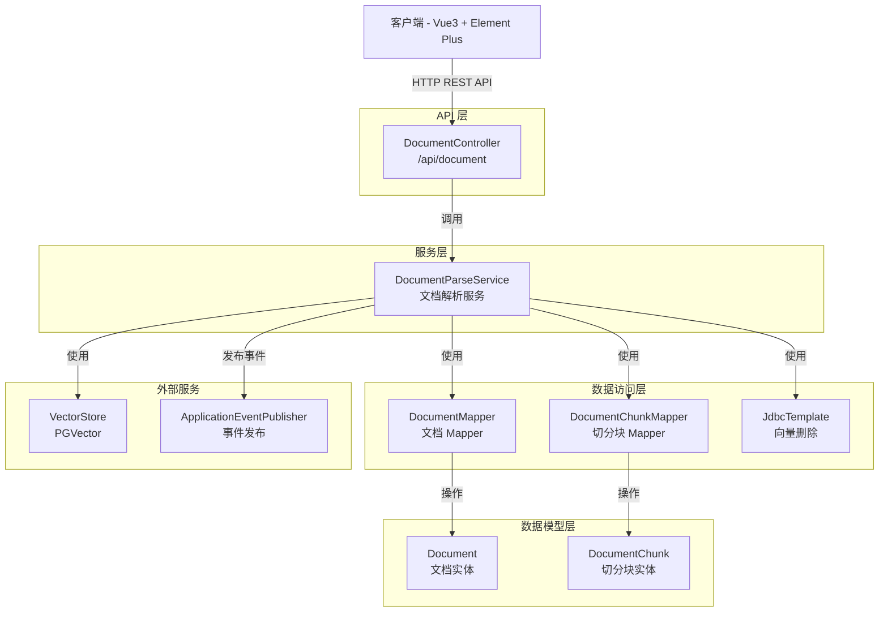
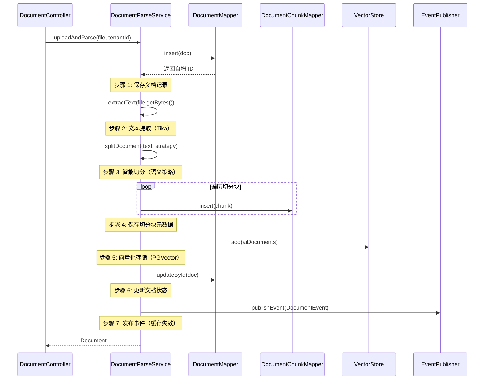

# 文档管理接口

**本文档中引用的文件**
- [DocumentController.java](../../../company-rag-web/src/main/java/com/company/rag/web/controller/DocumentController.java)
- [Document.java](../../../company-rag-document/src/main/java/com/company/rag/document/entity/Document.java)
- [DocumentChunk.java](../../../company-rag-document/src/main/java/com/company/rag/document/entity/DocumentChunk.java)
- [DocumentParseService.java](../../../company-rag-document/src/main/java/com/company/rag/document/service/DocumentParseService.java)
- [DocumentParseServiceImpl.java](../../../company-rag-document/src/main/java/com/company/rag/document/service/impl/DocumentParseServiceImpl.java)

## 目录
1. [简介](#简介)
2. [系统架构](#系统架构)
3. [数据模型](#数据模型)
4. [API 接口列表](#api 接口列表)
5. [请求/响应模型](#请求响应模型)
6. [文档处理流程](#文档处理流程)
7. [错误处理](#错误处理)
8. [实现细节](#实现细节)

## 简介

文档管理接口提供文档的上传、解析、列表查询和删除功能，支持多种文档格式的自动解析和智能切分，实现向量化存储。主要特性包括：

- **多格式支持**：PDF、DOCX、TXT、MD、HTML 等格式
- **智能切分**：基于语义的文档切分策略
- **向量化存储**：自动调用 Embedding 模型并向量化存储到 PGVector
- **多租户隔离**：通过租户上下文实现数据隔离
- **事务保护**：完整的上传、解析、存储流程事务管理
- **事件驱动**：发布文档事件触发缓存失效

**技术特性**：
- 基于 Spring Boot 3.4 + Spring AI 1.0.4
- Apache Tika 3.1.0 文档解析
- PGVector 向量存储（HNSW 索引，1024 维，余弦距离）
- MyBatis-Plus 3.5.9 数据访问
- 统一响应格式 `R<T>`

## 系统架构



**架构说明**：
- **API 层**：`DocumentController` 负责接收 HTTP 请求，处理文件上传、列表查询和删除操作
- **服务层**：`DocumentParseService` 实现文档解析、切分、向量化的完整流程
- **数据访问层**：`DocumentMapper` 和 `DocumentChunkMapper` 负责数据库操作，`JdbcTemplate` 用于删除向量数据
- **数据模型层**：`Document` 和 `DocumentChunk` 分别表示文档元数据和切分块
- **外部服务**：`VectorStore` 提供向量化存储能力，`ApplicationEventPublisher` 发布文档事件

## 数据模型

### Document（文档实体）

| 字段 | 类型 | 说明 | 来源 |
|------|------|------|------|
| id | Long | 文档 ID（自增主键） | L15 |
| tenantId | Long | 租户 ID | L16 |
| fileName | String | 文件名称 | L17 |
| fileType | String | 文件类型（pdf/docx/txt/md/html） | L18 |
| fileSize | Long | 文件大小（字节） | L19 |
| filePath | String | 存储路径 | L20 |
| title | String | 文档标题 | L21 |
| chunkCount | Integer | 切分后的块数 | L22 |
| status | Integer | 状态（0-待处理 1-处理中 2-已完成 3-失败） | L23 |
| errorMsg | String | 错误信息 | L24 |
| createTime | LocalDateTime | 创建时间 | L26 |
| updateTime | LocalDateTime | 更新时间 | L28 |

**来源**: [Document.java](../../../company-rag-document/src/main/java/com/company/rag/document/entity/Document.java)

### DocumentChunk（文档切分块）

| 字段 | 类型 | 说明 | 来源 |
|------|------|------|------|
| id | Long | 切分块 ID（自增主键） | L15 |
| documentId | Long | 关联的文档 ID | L16 |
| tenantId | Long | 租户 ID | L17 |
| chunkIndex | Integer | 块序号 | L18 |
| content | String | 块文本内容 | L19 |
| tokenCount | Integer | Token 数（用于成本统计） | L20 |
| splitStrategy | String | 切分策略名称 | L21 |
| createTime | LocalDateTime | 创建时间 | L23 |

**来源**: [DocumentChunk.java](../../../company-rag-document/src/main/java/com/company/rag/document/entity/DocumentChunk.java)

## API 接口列表

### 1. 上传文档

**端点**: `POST /api/document/upload`

**权限**: `ADMIN` 或 `USER`（`VIEWER` 无权限）

**请求头**:
| 参数 | 类型 | 必填 | 说明 |
|------|------|------|------|
| Content-Type | String | 是 | multipart/form-data |
| X-Tenant-Id | Long | 否 | 租户 ID（从上下文获取） |

**请求体** (multipart/form-data):
| 参数 | 类型 | 必填 | 说明 |
|------|------|------|------|
| file | MultipartFile | 是 | 要上传的文件 |

**响应** (`R<Document>`):
```json
{
  "code": 200,
  "message": "success",
  "data": {
    "id": 1,
    "tenantId": 1001,
    "fileName": "产品手册.pdf",
    "fileType": "pdf",
    "fileSize": 102400,
    "filePath": "/uploads/2026/08/08/product-manual.pdf",
    "title": "产品手册",
    "chunkCount": 15,
    "status": 2,
    "errorMsg": null,
    "createTime": "2026-08-08T10:30:00",
    "updateTime": "2026-08-08T10:30:05"
  }
}
```

**实现逻辑**：
1. 从租户上下文获取租户 ID（由 `TenantInterceptor` 设置）
2. 创建 `Document` 对象，设置初始状态为"待处理"（status=0）
3. 保存文档记录到数据库，获取自增 ID
4. 使用 Apache Tika 提取文本内容
5. 使用语义切分策略进行智能切分
6. 保存切分块元数据到 `doc_chunk` 表
7. 调用 `VectorStore.add()` 向量化存储到 PGVector
8. 更新文档状态为"已完成"（status=2）
9. 发布 `DocumentEvent` 事件（类型：`ADDED`）触发缓存失效

**来源**: [DocumentController.java](../../../company-rag-web/src/main/java/com/company/rag/web/controller/DocumentController.java)(L28-L38)

---

### 2. 查询文档列表

**端点**: `GET /api/document/list`

**权限**: 所有登录用户

**请求头**:
| 参数 | 类型 | 必填 | 说明 |
|------|------|------|------|
| X-Tenant-Id | Long | 否 | 租户 ID（从上下文获取） |

**响应** (`R<List<Document>>`):
```json
{
  "code": 200,
  "message": "success",
  "data": [
    {
      "id": 1,
      "tenantId": 1001,
      "fileName": "产品手册.pdf",
      "fileType": "pdf",
      "fileSize": 102400,
      "chunkCount": 15,
      "status": 2,
      "createTime": "2026-08-08T10:30:00",
      "updateTime": "2026-08-08T10:30:05"
    },
    {
      "id": 2,
      "tenantId": 1001,
      "fileName": "技术文档.md",
      "fileType": "md",
      "fileSize": 5120,
      "chunkCount": 8,
      "status": 2,
      "createTime": "2026-08-08T09:15:00",
      "updateTime": "2026-08-08T09:15:03"
    }
  ]
}
```

**实现逻辑**：
1. 从租户上下文获取租户 ID
2. 调用 `DocumentMapper.selectList()` 查询租户下所有文档
3. 按创建时间倒序排列

**来源**: [DocumentController.java](../../../company-rag-web/src/main/java/com/company/rag/web/controller/DocumentController.java)(L40-L48)

---

### 3. 删除文档

**端点**: `DELETE /api/document/{id}`

**权限**: `ADMIN` 或 `USER`（`VIEWER` 无权限）

**请求头**:
| 参数 | 类型 | 必填 | 说明 |
|------|------|------|------|
| X-Tenant-Id | Long | 否 | 租户 ID（从上下文获取） |

**路径参数**:
| 参数 | 类型 | 必填 | 说明 |
|------|------|------|------|
| id | Long | 是 | 文档 ID |

**响应** (`R<Void>`):
```json
{
  "code": 200,
  "message": "success",
  "data": null
}
```

**实现逻辑**：
1. 从租户上下文获取租户 ID
2. 删除向量数据（从 `vector_store` 表删除 `metadata->>'documentId' = ?` 的记录）
3. 删除切分块元数据（从 `doc_chunk` 表删除 `document_id = ?` 的记录）
4. 删除文档记录（从 `rag_document` 表删除）
5. 发布 `DocumentEvent` 事件（类型：`DELETED`）触发缓存失效
6. 记录审计日志（通过 `@AuditLog` 注解）

**来源**: [DocumentController.java](../../../company-rag-web/src/main/java/com/company/rag/web/controller/DocumentController.java)(L53-L63)

## 请求/响应模型

### 统一响应格式 R<T>

所有接口统一返回 `R<T>` 格式：

```json
{
  "code": 200,      // 状态码：200=成功，其他=失败
  "message": "success",  // 响应消息
  "data": { ... }   // 响应数据（泛型）
}
```

### 租户 ID 获取策略

1. 优先从 `TenantContext` 获取（由 `TenantInterceptor` 从请求头 `X-Tenant-Id` 设置）
2. 如果上下文为空，使用默认值 `1L`（用于开发环境）

### 文档状态说明

| 状态码 | 说明 | 触发时机 |
|--------|------|----------|
| 0 | 待处理 | 文档上传后初始状态 |
| 1 | 处理中（已切分） | 文本提取和切分完成后 |
| 2 | 已完成（已向量化） | 向量化存储完成后 |
| 3 或 -1 | 失败 | 处理过程中发生异常 |

## 文档处理流程

### 完整处理流程



### 向量化存储细节

```java
/**
 * 向量化并存储到 PGVector
 * 
 * 注意：Spring AI 的 PgVectorStore 要求 Document ID 必须是 UUID 格式
 * chunk.getId() 是数据库自增 ID，仅用于数据库内部关联查询
 * 向量化时使用 UUID.randomUUID() 生成独立的向量存储 ID
 */
private void vectorizeAndStore(List<DocumentChunk> chunks, Long documentId, String documentName, Long tenantId) {
    List<org.springframework.ai.document.Document> aiDocuments = new ArrayList<>();

    for (DocumentChunk chunk : chunks) {
        // 构建元数据，包含文档名称便于检索时展示来源
        Map<String, Object> metadata = new HashMap<>();
        metadata.put("documentId", documentId);
        metadata.put("tenantId", tenantId);
        metadata.put("documentName", documentName != null ? documentName : "未知");
        metadata.put("chunkIndex", chunk.getChunkIndex());
        metadata.put("chunkId", chunk.getId());

        // 创建 Spring AI Document
        // 注意：必须使用 UUID 格式，因为 Spring AI 的 PgVectorStore 要求 ID 符合 UUID 规范
        // chunk.getId() 是数据库自增 ID，仅用于数据库内部关联，不直接用于向量存储 ID
        org.springframework.ai.document.Document aiDoc = new org.springframework.ai.document.Document(
            UUID.randomUUID().toString(),  // 生成 UUID 作为向量存储 ID
            chunk.getContent(),
            metadata
        );
        aiDocuments.add(aiDoc);
    }

    // 批量向量化并存储
    vectorStore.add(aiDocuments);
    log.info("向量化存储完成 | documentId={} | count={}", documentId, aiDocuments.size());
}
```

**来源**: [DocumentParseServiceImpl.java](../../../company-rag-document/src/main/java/com/company/rag/document/service/impl/DocumentParseServiceImpl.java)(L213-L239)

## 错误处理

### 异常类型

| 异常场景 | HTTP 状态码 | 响应示例 |
|----------|------------|----------|
| 参数校验失败 | 400 | `{"code": 400, "message": "参数格式错误"}` |
| 租户 ID 缺失 | 400 | `{"code": 400, "message": "缺少租户标识"}` |
| 无权访问 | 403 | `{"code": 403, "message": "无权访问"}` |
| 文件上传失败 | 500 | `{"code": 500, "message": "文件上传失败"}` |
| 文档解析失败 | 500 | `{"code": 500, "message": "文档解析失败：..."}` |
| 向量化失败 | 500 | `{"code": 500, "message": "向量化失败"}` |

### 错误处理策略

1. **事务回滚**：`uploadAndParse()` 方法使用 `@Transactional` 注解，任何步骤失败都会回滚
2. **状态记录**：即使异常被捕获，也会尝试更新文档状态为"失败"（status=-1）并记录错误信息
3. **日志记录**：关键错误记录详细日志，包括文件名、异常信息等
4. **全局异常处理**：通过 `@RestControllerAdvice` 统一处理未捕获的异常

## 实现细节

### 文本提取逻辑

```java
@Override
public String extractText(byte[] fileContent, String fileName) {
    try {
        // Tika 自动检测文件类型并提取文本
        String text = tika.parseToString(new java.io.ByteArrayInputStream(fileContent));
        
        // 诊断日志：记录提取的文本长度
        log.info("文本提取完成 | 文件名={} | 原始文件大小={} bytes | 提取文本长度={} characters", 
                fileName, fileContent.length, text.length());
        
        // 对于 TXT 文件，检查是否可能截断
        if (fileName != null && fileName.toLowerCase().endsWith(".txt")) {
            // 计算提取率（文本长度/文件大小），TXT 文件通常提取率应该在 80% 以上
            double extractRate = fileContent.length > 0 ? (double) text.length() / fileContent.length : 0;
            
            // 如果提取率过低，可能是编码问题导致截断
            if (extractRate < 0.8) {
                log.warn("检测到 TXT 文件可能未完全提取 | 文件大小={} bytes | 文本长度={} characters | 提取率={:.2%} | 尝试使用 UTF-8 直接读取", 
                        fileContent.length, text.length(), extractRate);
                
                // 尝试使用 UTF-8 直接读取
                try {
                    String utf8Text = new String(fileContent, java.nio.charset.StandardCharsets.UTF_8);
                    if (utf8Text.length() > text.length()) {
                        log.info("UTF-8 直接读取成功 | 长度={} characters | 提取率={:.2%}，使用 UTF-8 结果", 
                                utf8Text.length(), (double) utf8Text.length() / fileContent.length);
                        return utf8Text;
                    } else {
                        log.info("UTF-8 直接读取未改善结果 | UTF-8 长度={} characters", utf8Text.length());
                    }
                } catch (Exception e) {
                    log.warn("UTF-8 直接读取失败，使用 Tika 结果", e);
                }
            }
        }
        
        return text;
    } catch (TikaException | IOException e) {
        log.error("文档解析失败：{}", fileName, e);
        throw new RuntimeException("文档解析失败：" + e.getMessage());
    }
}
```

**来源**: [DocumentParseServiceImpl.java](../../../company-rag-document/src/main/java/com/company/rag/document/service/impl/DocumentParseServiceImpl.java)(L107-L149)

### 删除文档逻辑

```java
@Override
@Transactional(rollbackFor = Exception.class)
public void deleteDocument(Long id, Long tenantId) {
    // 1. 删除向量数据（vector_store 表的 metadata 中存了 documentId）
    String sql = "DELETE FROM vector_store WHERE metadata->>'documentId' = ?";
    int deletedVectors = jdbcTemplate.update(sql, String.valueOf(id));
    log.info("删除向量数据 | documentId={} | count={}", id, deletedVectors);

    // 2. 删除 chunk 记录
    int deletedChunks = chunkMapper.delete(
        new com.baomidou.mybatisplus.core.conditions.query.QueryWrapper<DocumentChunk>()
            .eq("document_id", id)
    );
    log.info("删除 chunk 记录 | documentId={} | count={}", id, deletedChunks);

    // 3. 删除文档记录
    documentMapper.deleteById(id);
    log.info("删除文档记录 | documentId={}", id);
    // 发布文档事件触发缓存失效
    eventPublisher.publishEvent(new DocumentEvent(this, tenantId, id, DocumentEventType.DELETED));
}
```

**来源**: [DocumentParseServiceImpl.java](../../../company-rag-document/src/main/java/com/company/rag/document/service/impl/DocumentParseServiceImpl.java)(L160-L180)

### 权限控制

```java
/**
 * 上传文档（admin 和 user 可操作，viewer 不可）
 */
@PostMapping("/upload")
@PreAuthorize("hasAnyRole('ADMIN', 'USER')")
public R<Document> upload(@RequestParam("file") MultipartFile file) {
    // ...
}

/**
 * 删除文档（admin 和 user 可操作，viewer 不可）
 */
@DeleteMapping("/{id}")
@PreAuthorize("hasAnyRole('ADMIN', 'USER')")
@AuditLog(actionType = "DELETE_DOCUMENT", targetType = "document", targetId = "#id", detail = "'删除文档：ID=' + #id")
public R<Void> delete(@PathVariable Long id) {
    // ...
}
```

**说明**：
- 上传和删除操作需要 `ADMIN` 或 `USER` 角色
- `VIEWER` 角色只能查询文档列表
- 删除操作会记录审计日志

**来源**: [DocumentController.java](../../../company-rag-web/src/main/java/com/company/rag/web/controller/DocumentController.java)(L28-L38, L53-L63)

---

**文档更新时间**: 2026-08-08  
**基于代码版本**: 最新实现（Apache Tika 解析 + 语义切分 + PGVector 向量化）
