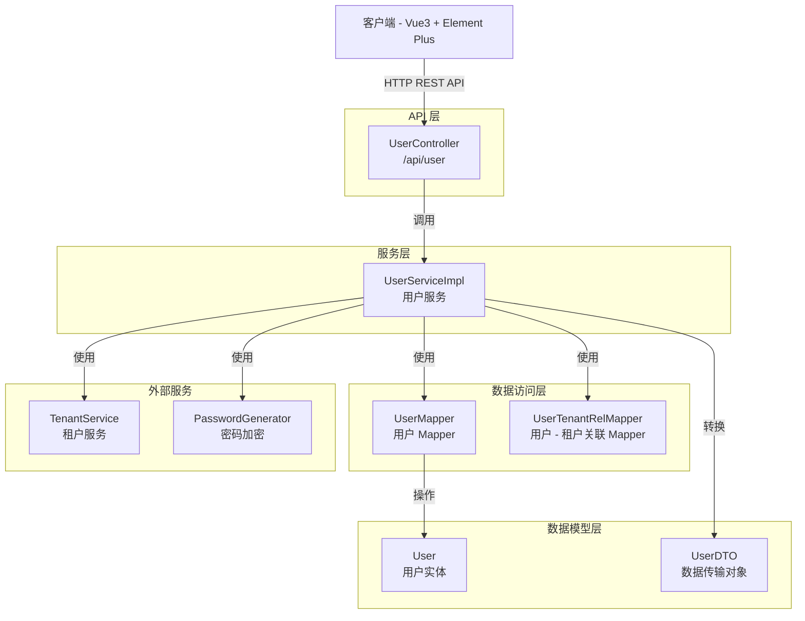
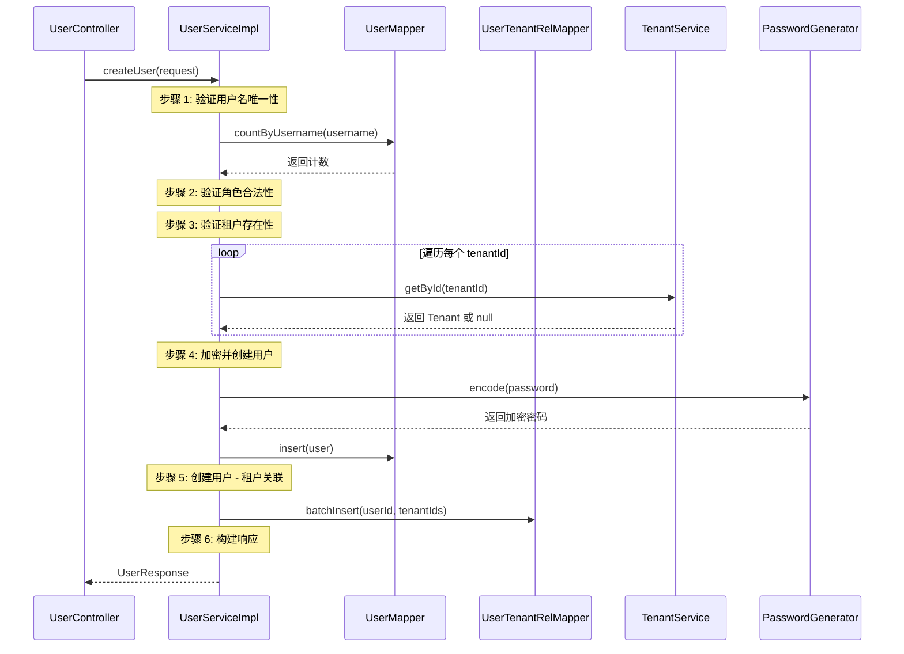
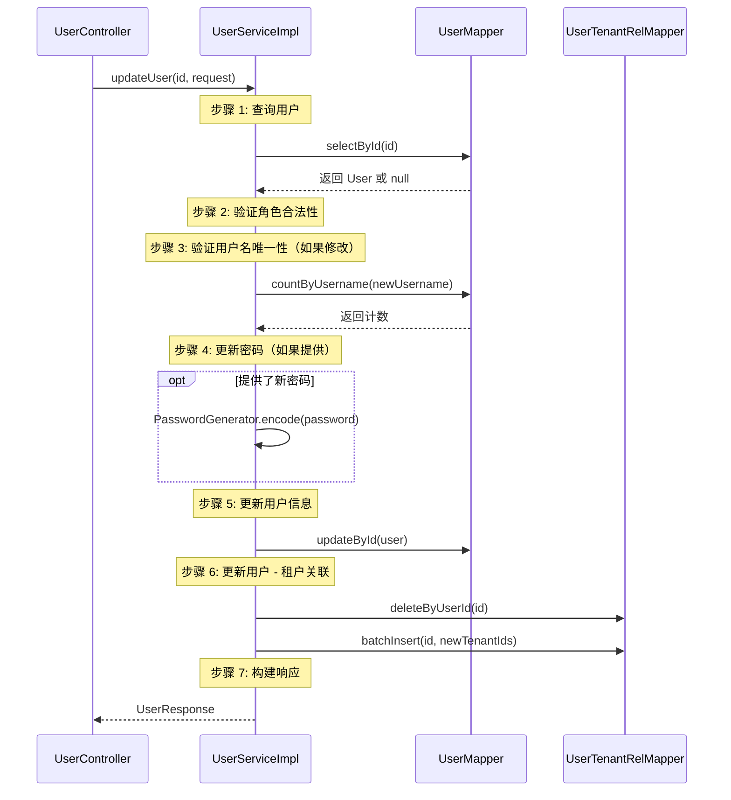

# 用户管理接口

**本文档中引用的文件**
- [UserController.java](../../../company-rag-web/src/main/java/com/company/rag/web/controller/UserController.java)
- [UserDTO.java](../../../company-rag-common/src/main/java/com/company/rag/common/model/UserDTO.java)
- [UserServiceImpl.java](../../../company-rag-tenant/src/main/java/com/company/rag/tenant/service/impl/UserServiceImpl.java)
- [User.java](../../../company-rag-tenant/src/main/java/com/company/rag/tenant/model/User.java)
- [UserMapper.java](../../../company-rag-tenant/src/main/java/com/company/rag/tenant/mapper/UserMapper.java)

## 目录
1. [简介](#简介)
2. [系统架构](#系统架构)
3. [数据模型](#数据模型)
4. [API 接口列表](#api 接口列表)
5. [请求/响应模型](#请求响应模型)
6. [业务逻辑流程](#业务逻辑流程)
7. [错误处理](#错误处理)
8. [实现细节](#实现细节)

## 简介

用户管理接口提供用户的创建、查询、更新和删除功能，支持多租户关联管理。主要特性包括：

- **多角色支持**：admin（管理员）、user（普通用户）、viewer（只读用户）三种角色
- **多租户关联**：用户可以关联多个租户，实现跨租户访问
- **密码加密**：使用 BCrypt 加密存储密码
- **审计日志**：关键操作（创建/更新/删除）记录审计日志
- **事务保护**：用户创建、更新、删除操作使用事务保证数据一致性
- **参数校验**：使用 Jakarta Validation 进行请求参数校验

**技术特性**：
- 基于 Spring Boot 3.4 + Spring Security 6
- MyBatis-Plus 3.5.9 数据访问
- BCrypt 密码加密
- 统一响应格式 `R<T>`
- 多租户 Schema 隔离

## 系统架构



**架构说明**：
- **API 层**：`UserController` 负责接收 HTTP 请求，处理用户相关的 CRUD 操作
- **服务层**：`UserServiceImpl` 实现用户管理业务逻辑，包括验证、加密、关联维护
- **数据访问层**：`UserMapper` 负责用户数据持久化，`UserTenantRelMapper` 维护用户 - 租户关联
- **数据模型层**：`User` 表示用户实体，`UserDTO` 提供请求/响应数据传输对象
- **外部服务**：`TenantService` 验证租户存在性，`PasswordGenerator` 提供密码加密功能

## 数据模型

### User（用户实体）

| 字段 | 类型 | 说明 | 来源 |
|------|------|------|------|
| id | Long | 用户 ID（自增主键） | L15 |
| username | String | 用户名（唯一） | L16 |
| password | String | BCrypt 加密密码 | L17 |
| displayName | String | 显示名 | L18 |
| email | String | 邮箱 | L19 |
| role | String | 角色（admin/user/viewer） | L20 |
| status | Integer | 状态（1-启用，其他 - 禁用） | L21 |
| createTime | LocalDateTime | 创建时间 | L23 |
| updateTime | LocalDateTime | 更新时间 | L25 |

**来源**: [User.java](../../../company-rag-tenant/src/main/java/com/company/rag/tenant/model/User.java)

### UserDTO.CreateRequest（创建用户请求）

| 字段 | 类型 | 必填 | 校验规则 | 说明 |
|------|------|------|----------|------|
| username | String | 是 | @NotBlank, @Size(3-50) | 用户名 |
| password | String | 是 | @NotBlank, @Size(6-100) | 密码 |
| displayName | String | 是 | @NotBlank, @Size(max=100) | 显示名 |
| email | String | 否 | @Email, @Size(max=100) | 邮箱 |
| role | String | 是 | @NotBlank | 角色（admin/user/viewer） |
| tenantIds | List<Long> | 是 | @NotEmpty | 关联的租户 ID 列表 |

**来源**: [UserDTO.java](../../../company-rag-common/src/main/java/com/company/rag/common/model/UserDTO.java)(L20-L42)

### UserDTO.UpdateRequest（更新用户请求）

| 字段 | 类型 | 必填 | 校验规则 | 说明 |
|------|------|------|----------|------|
| username | String | 否 | @Size(max=50) | 用户名（留空表示不修改） |
| password | String | 否 | @Size(max=100) | 密码（留空表示不修改） |
| displayName | String | 否 | @Size(max=100) | 显示名 |
| email | String | 否 | @Email, @Size(max=100) | 邮箱 |
| role | String | 是 | @NotBlank | 角色（admin/user/viewer） |
| tenantIds | List<Long> | 是 | @NotEmpty | 关联的租户 ID 列表 |

**来源**: [UserDTO.java](../../../company-rag-common/src/main/java/com/company/rag/common/model/UserDTO.java)(L48-L67)

### UserDTO.UserResponse（用户响应）

| 字段 | 类型 | 说明 |
|------|------|------|
| id | Long | 用户 ID |
| username | String | 用户名 |
| displayName | String | 显示名 |
| email | String | 邮箱 |
| role | String | 角色 |
| status | Integer | 状态 |
| tenantIds | List<Long> | 关联的租户 ID 列表 |
| tenantNames | List<String> | 关联的租户名称列表 |
| createTime | String | 创建时间（格式化字符串） |

**来源**: [UserDTO.java](../../../company-rag-common/src/main/java/com/company/rag/common/model/UserDTO.java)(L73-L83)

### UserDTO.UserDetailResponse（用户详情响应）

| 字段 | 类型 | 说明 |
|------|------|------|
| id | Long | 用户 ID |
| username | String | 用户名 |
| displayName | String | 显示名 |
| email | String | 邮箱 |
| role | String | 角色 |
| status | Integer | 状态 |
| tenantIds | List<Long> | 关联的租户 ID 列表 |
| createTime | String | 创建时间（格式化字符串） |
| updateTime | String | 更新时间（格式化字符串） |

**来源**: [UserDTO.java](../../../company-rag-common/src/main/java/com/company/rag/common/model/UserDTO.java)(L89-L99)

## API 接口列表

### 1. 创建用户

**端点**: `POST /api/user`

**权限**: `ADMIN` 角色

**请求头**:
| 参数 | 类型 | 必填 | 说明 |
|------|------|------|------|
| Content-Type | String | 是 | application/json |
| X-Tenant-Id | Long | 否 | 租户 ID（从上下文获取） |

**请求体** (`CreateRequest`):
```json
{
  "username": "zhangsan",
  "password": "123456",
  "displayName": "张三",
  "email": "zhangsan@example.com",
  "role": "user",
  "tenantIds": [1, 2]
}
```

**响应** (`R<UserResponse>`):
```json
{
  "code": 200,
  "message": "success",
  "data": {
    "id": 1,
    "username": "zhangsan",
    "displayName": "张三",
    "email": "zhangsan@example.com",
    "role": "user",
    "status": 1,
    "tenantIds": [1, 2],
    "tenantNames": ["租户 A", "租户 B"],
    "createTime": "2026-08-08 10:30:00"
  }
}
```

**实现逻辑**：
1. 验证用户名唯一性（调用 `UserMapper.countByUsername`）
2. 验证角色合法性（必须是 admin/user/viewer）
3. 验证所有租户 ID 存在性（调用 `TenantService.getById`）
4. 使用 BCrypt 加密密码
5. 创建用户记录，设置默认状态为启用（status=1）
6. 批量插入用户 - 租户关联记录
7. 构建响应对象（包含租户 ID 和租户名称）

**来源**: [UserController.java](../../../company-rag-web/src/main/java/com/company/rag/web/controller/UserController.java)(L29-L45), [UserServiceImpl.java](../../../company-rag-tenant/src/main/java/com/company/rag/tenant/service/impl/UserServiceImpl.java)(L38-L83)

---

### 2. 查询用户列表

**端点**: `GET /api/user/list`

**权限**: 所有登录用户

**请求参数**:
| 参数 | 类型 | 必填 | 说明 |
|------|------|------|------|
| role | String | 否 | 按角色筛选 |
| tenantId | Long | 否 | 按租户 ID 筛选（优先使用此条件） |
| status | Integer | 否 | 按状态筛选 |
| username | String | 否 | 按用户名模糊查询 |

**响应** (`R<List<UserResponse>>`):
```json
{
  "code": 200,
  "message": "success",
  "data": [
    {
      "id": 1,
      "username": "zhangsan",
      "displayName": "张三",
      "email": "zhangsan@example.com",
      "role": "user",
      "status": 1,
      "tenantIds": [1, 2],
      "tenantNames": ["租户 A", "租户 B"],
      "createTime": "2026-08-08 10:30:00"
    },
    {
      "id": 2,
      "username": "lisi",
      "displayName": "李四",
      "email": "lisi@example.com",
      "role": "admin",
      "status": 1,
      "tenantIds": [1],
      "tenantNames": ["租户 A"],
      "createTime": "2026-08-08 09:15:00"
    }
  ]
}
```

**实现逻辑**：
1. 如果指定了 `tenantId`，调用 `UserMapper.findByTenantId` 按租户查询
2. 否则构建动态查询条件（role、status、username）
3. 为每个用户查询关联的租户 ID 和租户名称
4. 返回用户列表

**来源**: [UserController.java](../../../company-rag-web/src/main/java/com/company/rag/web/controller/UserController.java)(L50-L65), [UserServiceImpl.java](../../../company-rag-tenant/src/main/java/com/company/rag/tenant/service/impl/UserServiceImpl.java)(L85-L115)

---

### 3. 查询用户详情

**端点**: `GET /api/user/{id}`

**权限**: 所有登录用户

**路径参数**:
| 参数 | 类型 | 必填 | 说明 |
|------|------|------|------|
| id | Long | 是 | 用户 ID |

**响应** (`R<UserDetailResponse>`):
```json
{
  "code": 200,
  "message": "success",
  "data": {
    "id": 1,
    "username": "zhangsan",
    "displayName": "张三",
    "email": "zhangsan@example.com",
    "role": "user",
    "status": 1,
    "tenantIds": [1, 2],
    "createTime": "2026-08-08 10:30:00",
    "updateTime": "2026-08-08 10:30:00"
  }
}
```

**实现逻辑**：
1. 根据 ID 查询用户（调用 `UserMapper.selectById`）
2. 如果用户不存在，返回 404
3. 查询用户关联的所有租户 ID
4. 构建详情响应对象（包含 createTime 和 updateTime）

**来源**: [UserController.java](../../../company-rag-web/src/main/java/com/company/rag/web/controller/UserController.java)(L70-L83), [UserServiceImpl.java](../../../company-rag-tenant/src/main/java/com/company/rag/tenant/service/impl/UserServiceImpl.java)(L117-L142)

---

### 4. 更新用户

**端点**: `PUT /api/user/{id}`

**权限**: `ADMIN` 角色

**路径参数**:
| 参数 | 类型 | 必填 | 说明 |
|------|------|------|------|
| id | Long | 是 | 用户 ID |

**请求体** (`UpdateRequest`):
```json
{
  "username": "zhangsan_updated",
  "password": "",
  "displayName": "张三（更新）",
  "email": "zhangsan_updated@example.com",
  "role": "admin",
  "tenantIds": [1, 3]
}
```

**响应** (`R<UserResponse>`):
```json
{
  "code": 200,
  "message": "success",
  "data": {
    "id": 1,
    "username": "zhangsan_updated",
    "displayName": "张三（更新）",
    "email": "zhangsan_updated@example.com",
    "role": "admin",
    "status": 1,
    "tenantIds": [1, 3],
    "tenantNames": ["租户 A", "租户 C"],
    "createTime": "2026-08-08 10:30:00"
  }
}
```

**实现逻辑**：
1. 查询用户是否存在
2. 验证角色合法性
3. 如果修改了用户名，验证新用户名唯一性
4. 如果提供了密码，使用 BCrypt 重新加密
5. 更新用户信息
6. 删除旧的用户 - 租户关联，插入新的关联
7. 构建响应对象

**注意**: `password` 字段留空表示不修改密码。

**来源**: [UserController.java](../../../company-rag-web/src/main/java/com/company/rag/web/controller/UserController.java)(L88-L105), [UserServiceImpl.java](../../../company-rag-tenant/src/main/java/com/company/rag/tenant/service/impl/UserServiceImpl.java)(L144-L190)

---

### 5. 删除用户

**端点**: `DELETE /api/user/{id}`

**权限**: `ADMIN` 角色

**路径参数**:
| 参数 | 类型 | 必填 | 说明 |
|------|------|------|------|
| id | Long | 是 | 用户 ID |

**响应** (`R<Boolean>`):
```json
{
  "code": 200,
  "message": "success",
  "data": true
}
```

**实现逻辑**：
1. 查询用户是否存在
2. 如果不存在，返回 404
3. 删除用户 - 租户关联记录
4. 删除用户记录
5. 返回 true 表示删除成功

**来源**: [UserController.java](../../../company-rag-web/src/main/java/com/company/rag/web/controller/UserController.java)(L110-L126), [UserServiceImpl.java](../../../company-rag-tenant/src/main/java/com/company/rag/tenant/service/impl/UserServiceImpl.java)(L192-L212)

## 请求/响应模型

### 统一响应格式 R<T>

所有接口统一返回 `R<T>` 格式：

```json
{
  "code": 200,      // 状态码：200=成功，其他=失败
  "message": "success",  // 响应消息
  "data": { ... }   // 响应数据（泛型）
}
```

### 角色说明

| 角色 | 说明 | 权限范围 |
|------|------|----------|
| admin | 管理员 | 可以创建/更新/删除用户，管理所有租户 |
| user | 普通用户 | 可以查询用户列表和详情，不能修改用户 |
| viewer | 只读用户 | 只能查询用户列表和详情，不能修改用户 |

### 状态说明

| 状态码 | 说明 | 触发时机 |
|--------|------|----------|
| 1 | 启用 | 用户创建时默认状态，或管理员手动启用 |
| 其他 | 禁用 | 管理员手动禁用 |

## 业务逻辑流程

### 创建用户流程



### 更新用户流程



## 错误处理

### 异常类型

| 异常场景 | HTTP 状态码 | 响应示例 |
|----------|------------|----------|
| 参数校验失败 | 400 | `{"code": 400, "message": "用户名不能为空"}` |
| 用户名已存在 | 400 | `{"code": 400, "message": "用户名已存在：zhangsan"}` |
| 无效角色 | 400 | `{"code": 400, "message": "无效的角色：invalid"}` |
| 租户不存在 | 400 | `{"code": 400, "message": "租户不存在：999"}` |
| 用户不存在 | 404 | `{"code": 404, "message": "用户不存在"}` |
| 无权访问 | 403 | `{"code": 403, "message": "Access Denied"}` |
| 系统异常 | 500 | `{"code": 500, "message": "创建用户失败：..."}` |

### 错误处理策略

1. **参数校验**：使用 `@Validated` 注解触发 Jakarta Validation 校验
2. **业务异常**：使用 `IllegalArgumentException` 抛出业务错误，Controller 捕获后返回 400
3. **事务回滚**：`@Transactional(rollbackFor = Exception.class)` 保证操作原子性
4. **日志记录**：关键操作和异常记录详细日志
5. **全局异常处理**：通过 `@RestControllerAdvice` 统一处理未捕获的异常

## 实现细节

### 密码加密

```java
/**
 * 密码加密使用 BCrypt 算法
 * 
 * 来源：PasswordGenerator.java
 */
public static String encode(String rawPassword) {
    return BCrypt.hashpw(rawPassword, BCrypt.gensalt());
}

/**
 * 创建用户时加密密码
 * 
 * 来源：UserServiceImpl.java (L65)
 */
user.setPassword(PasswordGenerator.encode(request.getPassword()));
```

### 用户 - 租户关联维护

```java
/**
 * 用户 - 租户关联表：sys_user_tenant_rel
 * 
 * 字段：
 * - user_id: 用户 ID
 * - tenant_id: 租户 ID
 * 
 * 批量插入关联记录
 * 来源：UserServiceImpl.java (L77)
 */
userTenantRelMapper.batchInsert(user.getId(), request.getTenantIds());

/**
 * 更新用户时先删除旧关联再插入新关联
 * 来源：UserServiceImpl.java (L184-L185)
 */
userTenantRelMapper.deleteByUserId(id);
userTenantRelMapper.batchInsert(id, request.getTenantIds());
```

### 查询租户信息

```java
/**
 * 构建用户响应时查询关联的租户信息
 * 
 * 来源：UserServiceImpl.java (L236-L240)
 */
List<Long> tenantIds = userTenantRelMapper.findTenantIdsByUserId(user.getId());
List<String> tenantNames = userTenantRelMapper.findTenantNamesByUserId(user.getId());

response.setTenantIds(tenantIds);
response.setTenantNames(tenantNames);
```

### 审计日志

```java
/**
 * 创建用户 - 记录审计日志
 * 来源：UserController.java (L31-L32)
 */
@AuditLog(actionType = "CREATE_USER", targetType = "user", 
          detail = "'创建用户：' + #request.username")

/**
 * 更新用户 - 记录审计日志
 * 来源：UserController.java (L90-L91)
 */
@AuditLog(actionType = "UPDATE_USER", targetType = "user", 
          targetId = "#id", detail = "'更新用户：ID=' + #id")

/**
 * 删除用户 - 记录审计日志
 * 来源：UserController.java (L112-L113)
 */
@AuditLog(actionType = "DELETE_USER", targetType = "user", 
          targetId = "#id", detail = "'删除用户：ID=' + #id")
```

---

**文档更新时间**: 2026-08-08  
**基于代码版本**: 最新实现（BCrypt 加密 + 多租户关联 + 审计日志）
