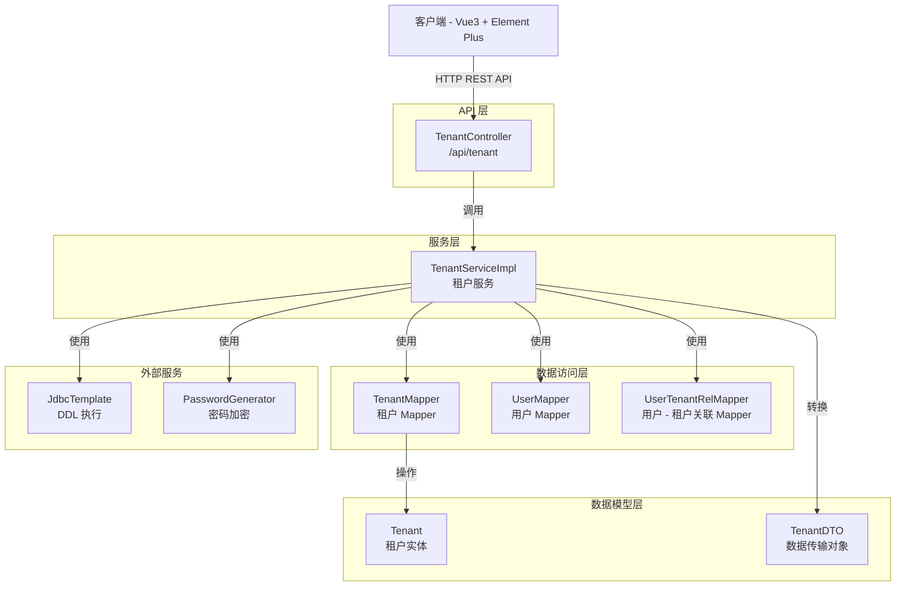
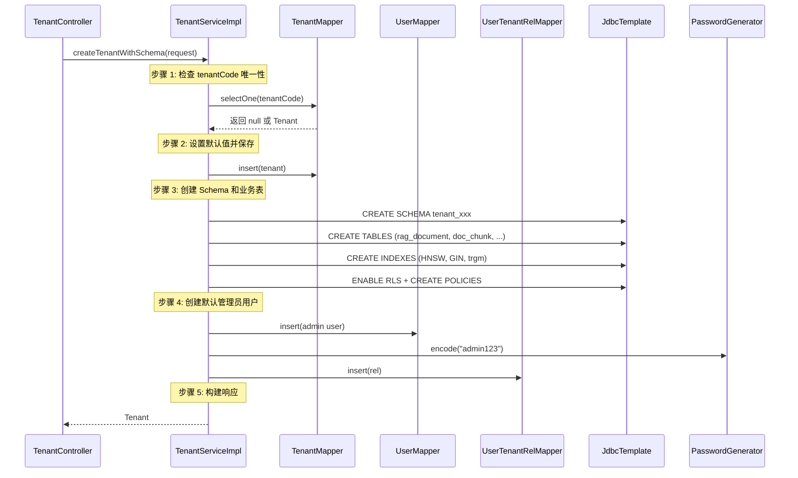
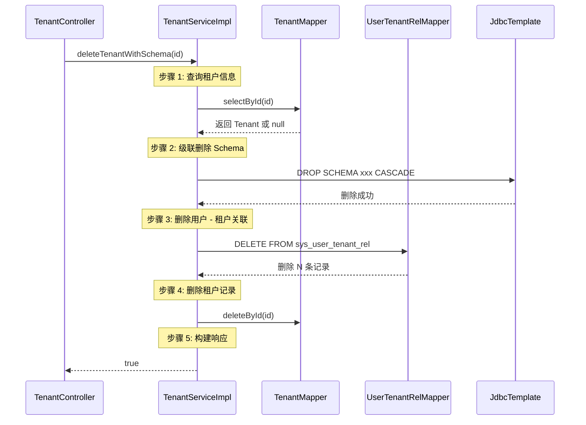

# 租户管理接口

**本文档中引用的文件**
- [TenantController.java](../../company-rag-web/src/main/java/com/company/rag/web/controller/TenantController.java)
- [TenantDTO.java](../../company-rag-tenant/src/main/java/com/company/rag/tenant/model/dto/TenantDTO.java)
- [Tenant.java](../../company-rag-tenant/src/main/java/com/company/rag/tenant/model/Tenant.java)
- [TenantService.java](../../company-rag-tenant/src/main/java/com/company/rag/tenant/service/TenantService.java)
- [TenantServiceImpl.java](../../company-rag-tenant/src/main/java/com/company/rag/tenant/service/impl/TenantServiceImpl.java)
- [TenantMapper.java](../../company-rag-tenant/src/main/java/com/company/rag/tenant/mapper/TenantMapper.java)

## 目录
1. [简介](#简介)
2. [系统架构](#系统架构)
3. [数据模型](#数据模型)
4. [API 接口列表](#api 接口列表)
5. [请求/响应模型](#请求响应模型)
6. [业务逻辑流程](#业务逻辑流程)
7. [错误处理](#错误处理)
8. [实现细节](#实现细节)

## 简介

租户管理接口提供多租户系统中租户的创建、查询和删除功能，支持 Schema 隔离和行级安全（RLS）。主要特性包括：

- **Schema 隔离**：为每个租户创建独立的 PostgreSQL Schema，实现数据物理隔离
- **自动初始化**：创建租户时自动初始化 Schema、业务表和 RLS 策略
- **默认管理员**：自动创建默认管理员用户（用户名：admin，密码：admin123）
- **行级安全**：启用 RLS 策略，确保租户间数据访问隔离
- **全文检索支持**：自动配置 tsvector、GIN 索引和触发器
- **审计日志**：关键操作（创建/删除）记录审计日志
- **事务保护**：租户创建和删除操作使用事务保证数据一致性
- **参数校验**：使用 Jakarta Validation 进行请求参数校验

**技术特性**：
- 基于 Spring Boot 3.4 + Spring Security 6
- PostgreSQL 16 + PGVector（HNSW 索引，1024 维，余弦距离）
- MyBatis-Plus 3.5.9 数据访问
- JdbcTemplate 执行 DDL 操作
- 统一响应格式 `R<T>`
- BCrypt 密码加密

## 系统架构



**架构说明**：
- **API 层**：`TenantController` 负责接收 HTTP 请求，处理租户相关的 CRUD 操作
- **服务层**：`TenantServiceImpl` 实现租户管理业务逻辑，包括 Schema 创建、表初始化、RLS 配置
- **数据访问层**：`TenantMapper` 负责租户数据持久化，`UserMapper` 和 `UserTenantRelMapper` 协助初始化
- **数据模型层**：`Tenant` 表示租户实体，`TenantDTO` 提供请求/响应数据传输对象
- **外部服务**：`JdbcTemplate` 执行 DDL 语句，`PasswordGenerator` 加密默认管理员密码

## 数据模型

### Tenant（租户实体）

| 字段 | 类型 | 说明 | 来源 |
|------|------|------|------|
| id | Long | 租户 ID（自增主键） | L15 |
| tenantCode | String | 租户编码（唯一标识） | L16 |
| tenantName | String | 租户名称 | L17 |
| schemaName | String | 独立 Schema 名称（Schema 隔离模式） | L18 |
| status | Integer | 状态（0-禁用，1-启用） | L19 |
| contactName | String | 联系人姓名 | L20 |
| contactPhone | String | 联系人电话 | L21 |
| createTime | LocalDateTime | 创建时间 | L23 |
| updateTime | LocalDateTime | 更新时间 | L25 |

**来源**: [Tenant.java](../../company-rag-tenant/src/main/java/com/company/rag/tenant/model/Tenant.java)

### TenantDTO.CreateRequest（创建租户请求）

| 字段 | 类型 | 必填 | 校验规则 | 说明 |
|------|------|------|----------|------|
| tenantCode | String | 是 | @NotBlank, @Size(2-64), @Pattern | 租户编码（只能包含字母、数字和下划线，且不能以数字开头） |
| tenantName | String | 是 | @NotBlank, @Size(2-128) | 租户名称 |
| contactName | String | 否 | - | 联系人姓名 |
| contactPhone | String | 否 | @Pattern(^1[3-9]\d{9}$) | 联系人手机号 |

**来源**: [TenantDTO.java](../../company-rag-tenant/src/main/java/com/company/rag/tenant/model/dto/TenantDTO.java)(L18-L33)

### TenantDTO.TenantResponse（租户响应）

| 字段 | 类型 | 说明 |
|------|------|------|
| id | Long | 租户 ID |
| tenantCode | String | 租户编码 |
| tenantName | String | 租户名称 |
| schemaName | String | Schema 名称 |
| status | Integer | 状态 |
| contactName | String | 联系人姓名 |
| contactPhone | String | 联系人电话 |
| createTime | String | 创建时间（格式化字符串） |

**来源**: [TenantDTO.java](../../company-rag-tenant/src/main/java/com/company/rag/tenant/model/dto/TenantDTO.java)(L38-L48)

## API 接口列表

### 1. 创建租户

**端点**: `POST /api/tenant`

**权限**: `ADMIN` 角色

**请求头**:
| 参数 | 类型 | 必填 | 说明 |
|------|------|------|------|
| Content-Type | String | 是 | application/json |
| X-Tenant-Id | Long | 否 | 租户 ID（从上下文获取） |

**请求体** (`CreateRequest`):
```json
{
  "tenantCode": "company1",
  "tenantName": "示例公司",
  "contactName": "张三",
  "contactPhone": "13800138000"
}
```

**响应** (`R<TenantResponse>`):
```json
{
  "code": 200,
  "message": "success",
  "data": {
    "id": 1,
    "tenantCode": "company1",
    "tenantName": "示例公司",
    "schemaName": "tenant_company1",
    "status": 1,
    "contactName": "张三",
    "contactPhone": "13800138000",
    "createTime": "2026-08-08 10:30:00"
  }
}
```

**实现逻辑**：
1. 检查 tenantCode 唯一性（调用 `TenantMapper.selectOne`）
2. 设置默认状态为启用（status=1）
3. 保存租户记录（调用 `TenantMapper.insert`）
4. 创建独立 Schema（调用 `createTenantSchema`）
   - 执行 `CREATE SCHEMA IF NOT EXISTS tenant_xxx`
   - 创建业务表：rag_document, doc_chunk, vector_store, rag_session, rag_session_meta
   - 创建索引：HNSW 向量索引、GIN 全文检索索引、trgm 模糊匹配索引
   - 初始化全文检索：tsvector 列、触发器、pg_trgm 扩展
   - 启用 RLS 并创建租户隔离策略
5. 创建默认管理员用户（用户名：admin，密码：admin123）
6. 建立用户 - 租户关联记录
7. 构建响应对象

**来源**: [TenantController.java](../../company-rag-web/src/main/java/com/company/rag/web/controller/TenantController.java)(L28-L57), [TenantServiceImpl.java](../../company-rag-tenant/src/main/java/com/company/rag/tenant/service/impl/TenantServiceImpl.java)(L202-L234)

---

### 2. 查询租户列表

**端点**: `GET /api/tenant/list`

**权限**: 所有登录用户（admin 用户可以看到所有租户，普通用户只能看到关联的租户）

**响应** (`R<List<TenantResponse>>`):
```json
{
  "code": 200,
  "message": "success",
  "data": [
    {
      "id": 1,
      "tenantCode": "company1",
      "tenantName": "示例公司",
      "schemaName": "tenant_company1",
      "status": 1,
      "contactName": "张三",
      "contactPhone": "13800138000",
      "createTime": "2026-08-08 10:30:00"
    },
    {
      "id": 2,
      "tenantCode": "company2",
      "tenantName": "测试公司",
      "schemaName": "tenant_company2",
      "status": 1,
      "contactName": "李四",
      "contactPhone": "13900139000",
      "createTime": "2026-08-08 09:15:00"
    }
  ]
}
```

**实现逻辑**：
1. 获取当前登录用户（从 SecurityContextHolder）
2. 如果用户未认证，返回空列表
3. 如果用户角色为 admin，返回所有租户（调用 `getAllTenants`）
4. 普通用户只能看到其关联的租户（从 SecurityUser.getTenantIds() 获取）
5. 构建响应列表

**来源**: [TenantController.java](../../company-rag-web/src/main/java/com/company/rag/web/controller/TenantController.java)(L64-L83), [TenantServiceImpl.java](../../company-rag-tenant/src/main/java/com/company/rag/tenant/service/impl/TenantServiceImpl.java)(L241-L272)

---

### 3. 查询租户详情

**端点**: `GET /api/tenant/{id}`

**权限**: 所有登录用户

**路径参数**:
| 参数 | 类型 | 必填 | 说明 |
|------|------|------|------|
| id | Long | 是 | 租户 ID |

**响应** (`R<TenantResponse>`):
```json
{
  "code": 200,
  "message": "success",
  "data": {
    "id": 1,
    "tenantCode": "company1",
    "tenantName": "示例公司",
    "schemaName": "tenant_company1",
    "status": 1,
    "contactName": "张三",
    "contactPhone": "13800138000",
    "createTime": "2026-08-08 10:30:00"
  }
}
```

**实现逻辑**：
1. 根据 ID 查询租户（调用 `TenantMapper.selectById`）
2. 如果租户不存在，返回 404
3. 构建详情响应对象

**来源**: [TenantController.java](../../company-rag-web/src/main/java/com/company/rag/web/controller/TenantController.java)(L88-L107), [TenantServiceImpl.java](../../company-rag-tenant/src/main/java/com/company/rag/tenant/service/impl/TenantServiceImpl.java)(L39-L42)

---

### 4. 删除租户

**端点**: `DELETE /api/tenant/{id}`

**权限**: `ADMIN` 角色

**路径参数**:
| 参数 | 类型 | 必填 | 说明 |
|------|------|------|------|
| id | Long | 是 | 租户 ID |

**响应** (`R<Boolean>`):
```json
{
  "code": 200,
  "message": "success",
  "data": true
}
```

**实现逻辑**：
1. 查询租户信息（调用 `TenantMapper.selectById`）
2. 如果租户不存在或 Schema 名称为空，返回 false
3. 级联删除 Schema（执行 `DROP SCHEMA IF EXISTS xxx CASCADE`）
4. 删除用户 - 租户关联记录（使用 JdbcTemplate 绕过 MyBatis-Plus 多租户拦截器）
5. 删除租户记录
6. 返回 true 表示删除成功

**注意**: 此操作会级联删除 Schema 下的所有表和数据，不可恢复。

**来源**: [TenantController.java](../../company-rag-web/src/main/java/com/company/rag/web/controller/TenantController.java)(L112-L125), [TenantServiceImpl.java](../../company-rag-tenant/src/main/java/com/company/rag/tenant/service/impl/TenantServiceImpl.java)(L274-L311)

## 请求/响应模型

### 统一响应格式 R<T>

所有接口统一返回 `R<T>` 格式：

```json
{
  "code": 200,      // 状态码：200=成功，其他=失败
  "message": "success",  // 响应消息
  "data": { ... }   // 响应数据（泛型）
}
```

### 租户编码规则

| 规则 | 说明 |
|------|------|
| 长度 | 2-64 个字符 |
| 字符合法性 | 只能包含字母、数字和下划线 |
| 开头限制 | 不能以数字开头 |
| 正则表达式 | `^[a-zA-Z_][a-zA-Z0-9_]*$` |

### 状态说明

| 状态码 | 说明 | 触发时机 |
|--------|------|----------|
| 1 | 启用 | 租户创建时默认状态 |
| 0 | 禁用 | 预留（当前版本未实现禁用功能） |

## 业务逻辑流程

### 创建租户流程



### 删除租户流程



## 错误处理

### 异常类型

| 异常场景 | HTTP 状态码 | 响应示例 |
|----------|------------|----------|
| 参数校验失败 | 400 | `{"code": 400, "message": "租户编码不能为空"}` |
| 租户编码已存在 | 400 | `{"code": 400, "message": "租户编码已存在：company1"}` |
| 非法 Schema 名称 | 400 | `{"code": 400, "message": "非法 Schema 名称：tenant_123"}` |
| 租户不存在 | 404 | `{"code": 404, "message": "租户不存在"}` |
| 无权访问 | 403 | `{"code": 403, "message": "Access Denied"}` |
| 系统异常 | 500 | `{"code": 500, "message": "创建租户失败：..."}` |

### 错误处理策略

1. **参数校验**：使用 `@Validated` 注解触发 Jakarta Validation 校验
2. **业务异常**：使用 `BizException` 抛出业务错误，Controller 捕获后返回 400
3. **事务回滚**：`@Transactional(rollbackFor = Exception.class)` 保证操作原子性
4. **日志记录**：关键操作和异常记录详细日志
5. **全局异常处理**：通过 `@RestControllerAdvice` 统一处理未捕获的异常

## 实现细节

### Schema 隔离

```java
/**
 * 为每个租户创建独立的 PostgreSQL Schema
 * Schema 命名规则：tenant_{tenantCode}
 * 
 * 来源：TenantServiceImpl.java (L47-L54)
 */
String schemaName = "tenant_" + tenant.getTenantCode();
// 校验 schema 名称合法性，防止 SQL 注入
if (!schemaName.matches("^[a-zA-Z_][a-zA-Z0-9_]*$")) {
    throw new BizException("非法 Schema 名称：" + schemaName);
}
jdbcTemplate.execute("CREATE SCHEMA IF NOT EXISTS " + schemaName);
```

### 业务表初始化

```java
/**
 * 在租户 Schema 中创建 5 张业务表：
 * - rag_document: 文档管理
 * - doc_chunk: 文档切片
 * - vector_store: 向量存储（PGVector）
 * - rag_session: 会话记录
 * - rag_session_meta: 会话元数据
 * 
 * 来源：TenantServiceImpl.java (L57-L116)
 */
String createTableSql = """
    CREATE TABLE IF NOT EXISTS %s.rag_document (...);
    CREATE TABLE IF NOT EXISTS %s.doc_chunk (...);
    CREATE TABLE IF NOT EXISTS %s.vector_store (...);
    CREATE TABLE IF NOT EXISTS %s.rag_session (...);
    CREATE TABLE IF NOT EXISTS %s.rag_session_meta (...);
    """.formatted(schemaName, schemaName, schemaName, schemaName, schemaName);
jdbcTemplate.execute(createTableSql);
```

### 向量索引配置

```java
/**
 * 创建 HNSW 向量索引，用于近似最近邻搜索（ANN）
 * - 向量维度：1024
 * - 距离算法：余弦相似度（vector_cosine_ops）
 * - m = 16: 每个节点的最大连接数
 * - ef_construction = 64: 构建时的搜索深度
 * 
 * 来源：TenantServiceImpl.java (L125-L126)
 */
CREATE INDEX IF NOT EXISTS idx_%s_vector_store_embedding ON %s.vector_store
    USING hnsw (embedding vector_cosine_ops) WITH (m = 16, ef_construction = 64);
```

### 行级安全（RLS）

```java
/**
 * 启用 RLS 并创建租户隔离策略
 * 确保每个租户只能访问自己的数据
 * 
 * 来源：TenantServiceImpl.java (L164-L183)
 */
ALTER TABLE %s.rag_document ENABLE ROW LEVEL SECURITY;
CREATE POLICY tenant_isolation_document ON %s.rag_document
    USING (tenant_id = current_tenant_id() OR current_user = 'postgres');
```

### 默认管理员用户

```java
/**
 * 创建默认管理员用户
 * 用户名：admin
 * 密码：admin123（BCrypt 加密）
 * 
 * 来源：TenantServiceImpl.java (L317-L336)
 */
User adminUser = new User();
adminUser.setUsername("admin");
adminUser.setPassword("$2a$10$N.ZOn9G6/YLFixAOPMg/h.z7pCu6v2XyFDtC4q.jeeGm/TEZyj3C6");
adminUser.setDisplayName("管理员");
adminUser.setRole("admin");
adminUser.setStatus(1);
userMapper.insert(adminUser);
```

### 审计日志

```java
/**
 * 创建租户 - 记录审计日志
 * 来源：TenantController.java (L30)
 */
@AuditLog(actionType = "CREATE_TENANT", targetType = "tenant", 
          detail = "'创建租户：' + #request.tenantCode")

/**
 * 删除租户 - 记录审计日志
 * 来源：TenantController.java (L114)
 */
@AuditLog(actionType = "DELETE_TENANT", targetType = "tenant", 
          targetId = "#id", detail = "'删除租户：ID=' + #id")
```

---

**文档更新时间**: 2026-08-08  
**基于代码版本**: 最新实现（Schema 隔离 + RLS + 自动初始化）
