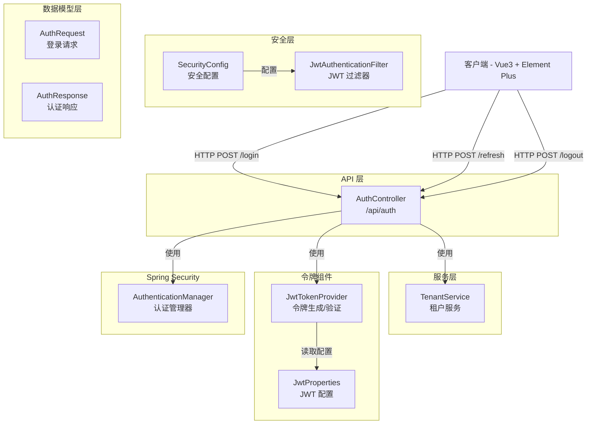
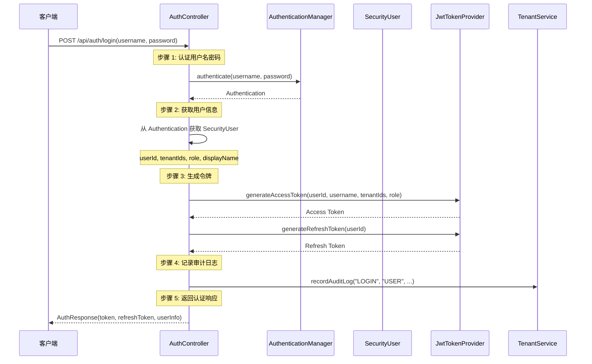
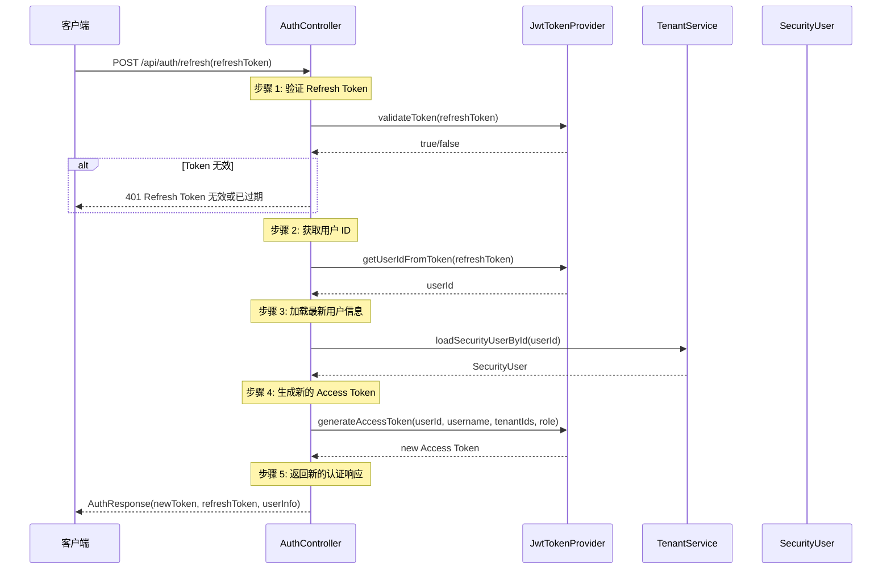
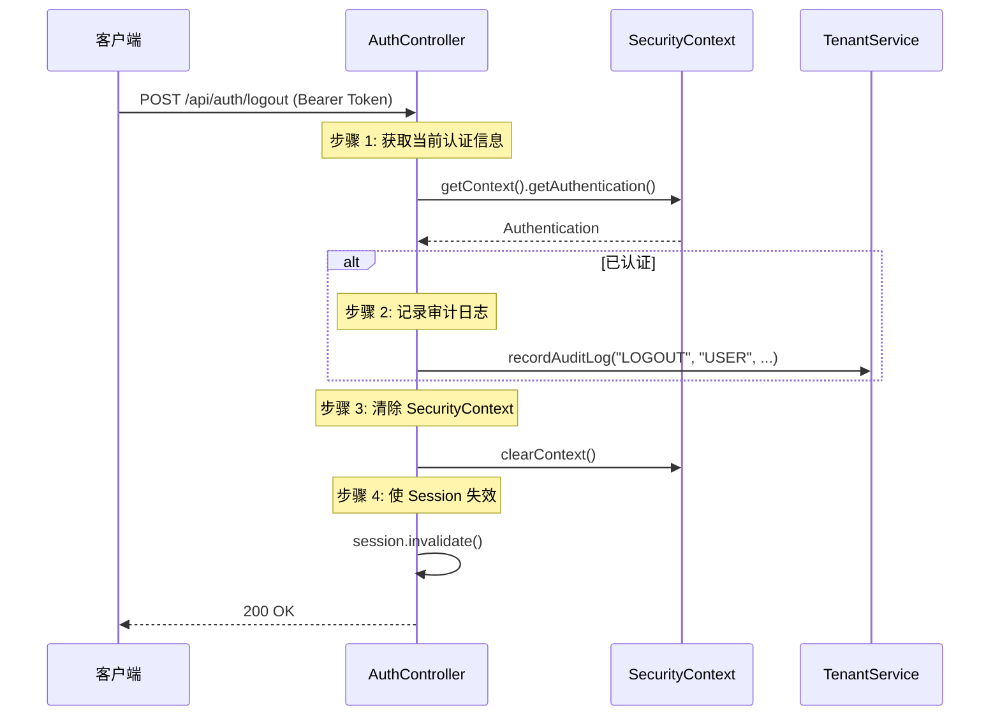

# 认证接口

**本文档中引用的文件**
- [AuthController.java](../../../company-rag-web/src/main/java/com/company/rag/web/controller/AuthController.java)
- [AuthRequest.java](../../../company-rag-web/src/main/java/com/company/rag/web/model/AuthRequest.java)
- [AuthResponse.java](../../../company-rag-web/src/main/java/com/company/rag/web/model/AuthResponse.java)
- [JwtTokenProvider.java](../../../company-rag-common/src/main/java/com/company/rag/common/security/JwtTokenProvider.java)
- [JwtProperties.java](../../../company-rag-common/src/main/java/com/company/rag/common/security/JwtProperties.java)
- [SecurityConfig.java](../../../company-rag-bootstrap/src/main/java/com/company/rag/bootstrap/config/SecurityConfig.java)

## 目录
1. [简介](#简介)
2. [系统架构](#系统架构)
3. [数据模型](#数据模型)
4. [API 接口列表](#api 接口列表)
5. [请求/响应模型](#请求响应模型)
6. [业务逻辑流程](#业务逻辑流程)
7. [错误处理](#错误处理)
8. [实现细节](#实现细节)

## 简介

认证接口提供用户登录、令牌刷新和登出功能，支持基于 JWT 的无状态认证和多租户访问。主要特性包括：

- **双令牌机制**：Access Token + Refresh Token 分离，提升安全性
- **多租户支持**：Access Token 携带用户可访问的所有租户 ID 列表
- **无状态会话**：基于 JWT 实现无状态认证，支持水平扩展
- **自动刷新**：Refresh Token 用于在 Access Token 过期后获取新的令牌
- **安全存储**：JWT 签名密钥通过环境变量注入
- **审计日志**：登录/登出操作记录审计日志

**技术特性**：
- 基于 Spring Boot 3.4 + Spring Security 6
- JWT (JJWT) 令牌生成与验证
- Access Token 有效期 2 小时（7200000 毫秒）
- Refresh Token 有效期 7 天（604800000 毫秒）
- 统一响应格式 `R<T>`
- 多租户 Schema 隔离

## 系统架构



**架构说明**：
- **API 层**：`AuthController` 负责接收认证相关的 HTTP 请求，处理登录、刷新令牌、登出操作
- **安全层**：`SecurityConfig` 配置安全过滤链，`JwtAuthenticationFilter` 拦截请求验证 JWT
- **服务层**：`TenantService` 提供用户加载和审计日志记录功能
- **令牌组件**：`JwtTokenProvider` 负责 JWT 的生成、解析和验证，`JwtProperties` 提供配置属性
- **数据模型层**：`AuthRequest` 和 `AuthResponse` 提供请求/响应数据传输对象
- **Spring Security**：`AuthenticationManager` 处理用户名密码认证

## 数据模型

### AuthRequest（登录请求）

| 字段 | 类型 | 必填 | 校验规则 | 说明 |
|------|------|------|----------|------|
| username | String | 是 | @NotBlank | 用户名 |
| password | String | 是 | @NotBlank | 密码 |

**来源**: [AuthRequest.java](../../../company-rag-web/src/main/java/com/company/rag/web/model/AuthRequest.java)

### AuthResponse（认证响应）

| 字段 | 类型 | 说明 |
|------|------|------|
| token | String | Access Token（JWT 格式） |
| refreshToken | String | Refresh Token（JWT 格式） |
| expireIn | long | Access Token 有效期（毫秒），默认 7200000（2 小时） |
| userId | Long | 用户 ID |
| tenantIds | List<Long> | 可访问的租户 ID 列表 |
| currentTenantId | Long | 当前租户 ID（默认选第一个） |
| role | String | 用户角色（admin/user/viewer） |
| displayName | String | 用户显示名 |

**来源**: [AuthResponse.java](../../../company-rag-web/src/main/java/com/company/rag/web/model/AuthResponse.java)

### JwtProperties（JWT 配置属性）

| 字段 | 类型 | 默认值 | 说明 |
|------|------|--------|------|
| secret | String | - | JWT 签名密钥（通过环境变量 JWT_SECRET 注入） |
| accessTokenExpiration | long | 7200000L | Access Token 有效期（毫秒），默认 2 小时 |
| refreshTokenExpiration | long | 604800000L | Refresh Token 有效期（毫秒），默认 7 天 |

**来源**: [JwtProperties.java](../../../company-rag-common/src/main/java/com/company/rag/common/security/JwtProperties.java)

## API 接口列表

### 1. 用户登录

**端点**: `POST /api/auth/login`

**权限**: 公开（无需认证）

**请求头**:
| 参数 | 类型 | 必填 | 说明 |
|------|------|------|------|
| Content-Type | String | 是 | application/json |
| X-Tenant-Id | Long | 否 | 租户 ID（可选，登录时指定） |

**请求体** (`AuthRequest`):
```json
{
  "username": "admin",
  "password": "admin123"
}
```

**响应** (`R<AuthResponse>`):
```json
{
  "code": 200,
  "message": "success",
  "data": {
    "token": "eyJhbGciOiJIUzI1NiJ9.eyJzdWIiOiIxIiwidXNlcm5hbWUiOiJhZG1pbiIsInRlbmFudElkcyI6WzFdLCJyb2xlIjoiYWRtaW4iLCJpYXQiOjE2OTM4ODgwMDAsImV4cCI6MTY5Mzg5NTIwMH0.xxx",
    "refreshToken": "eyJhbGciOiJIUzI1NiJ9.eyJzdWIiOiIxIiwidHlwZSI6InJlZnJlc2giLCJpYXQiOjE2OTM4ODgwMDAsImV4cCI6MTY5NDQ5MjgwMH0.yyy",
    "expireIn": 7200000,
    "userId": 1,
    "tenantIds": [1, 2],
    "currentTenantId": 1,
    "role": "admin",
    "displayName": "管理员"
  }
}
```

**实现逻辑**：
1. 使用 `AuthenticationManager` 认证用户名密码
2. 从认证结果中获取 `SecurityUser`，提取用户 ID、租户 ID 列表、角色
3. 使用 `JwtTokenProvider` 生成 Access Token（携带 userId、username、tenantIds、role）
4. 生成 Refresh Token（仅携带 userId）
5. 调用 `TenantService.recordAuditLog` 记录登录审计日志
6. 构建认证响应并返回

**来源**: [AuthController.java](../../../company-rag-web/src/main/java/com/company/rag/web/controller/AuthController.java)(L49-L98)

---

### 2. 刷新令牌

**端点**: `POST /api/auth/refresh`

**权限**: 公开（无需认证）

**请求头**:
| 参数 | 类型 | 必填 | 说明 |
|------|------|------|------|
| Content-Type | String | 是 | application/json |

**请求体** (`RefreshTokenRequest`):
```json
{
  "refreshToken": "eyJhbGciOiJIUzI1NiJ9.eyJzdWIiOiIxIiwidHlwZSI6InJlZnJlc2giLCJpYXQiOjE2OTM4ODgwMDAsImV4cCI6MTY5NDQ5MjgwMH0.yyy"
}
```

**响应** (`R<AuthResponse>`):
```json
{
  "code": 200,
  "message": "success",
  "data": {
    "token": "eyJhbGciOiJIUzI1NiJ9.eyJzdWIiOiIxIiwidXNlcm5hbWUiOiJhZG1pbiIsInRlbmFudElkcyI6WzFdLCJyb2xlIjoiYWRtaW4iLCJpYXQiOjE2OTM4OTUyMDAsImV4cCI6MTY5MzkwMjQwMH0.zzz",
    "refreshToken": "eyJhbGciOiJIUzI1NiJ9.eyJzdWIiOiIxIiwidHlwZSI6InJlZnJlc2giLCJpYXQiOjE2OTM4ODgwMDAsImV4cCI6MTY5NDQ5MjgwMH0.yyy",
    "expireIn": 7200000,
    "userId": 1,
    "tenantIds": [1, 2],
    "currentTenantId": 1,
    "role": "admin",
    "displayName": "管理员"
  }
}
```

**实现逻辑**：
1. 验证 Refresh Token 的有效性（调用 `JwtTokenProvider.validateToken`）
2. 从 Refresh Token 中获取用户 ID
3. 根据用户 ID 加载最新的用户信息（调用 `TenantService.loadSecurityUserById`）
4. 使用最新的用户信息生成新的 Access Token
5. 返回原来的 Refresh Token（可继续使用直到过期）
6. 构建认证响应并返回

**来源**: [AuthController.java](../../../company-rag-web/src/main/java/com/company/rag/web/controller/AuthController.java)(L106-L161)

---

### 3. 用户登出

**端点**: `POST /api/auth/logout`

**权限**: 已认证用户

**请求头**:
| 参数 | 类型 | 必填 | 说明 |
|------|------|------|------|
| Authorization | String | 是 | Bearer {Access Token} |

**响应** (`R<Void>`):
```json
{
  "code": 200,
  "message": "success",
  "data": null
}
```

**实现逻辑**：
1. 从 `SecurityContext` 获取当前认证信息
2. 如果是 `SecurityUser`，提取用户 ID 和用户名
3. 调用 `TenantService.recordAuditLog` 记录登出审计日志
4. 清除 `SecurityContext`
5. 使 Session 失效（如果存在）
6. 返回成功响应

**来源**: [AuthController.java](../../../company-rag-web/src/main/java/com/company/rag/web/controller/AuthController.java)(L169-L200)

## 请求/响应模型

### 统一响应格式 R<T>

所有接口统一返回 `R<T>` 格式：

```json
{
  "code": 200,      // 状态码：200=成功，其他=失败
  "message": "success",  // 响应消息
  "data": { ... }   // 响应数据（泛型）
}
```

### JWT 令牌结构

#### Access Token Payload

```json
{
  "sub": "1",                    // 用户 ID（字符串）
  "username": "admin",           // 用户名
  "tenantIds": [1, 2],          // 可访问的租户 ID 列表
  "role": "admin",              // 用户角色
  "iat": 1693888000,            // 签发时间（Unix 时间戳）
  "exp": 1693895200             // 过期时间（Unix 时间戳）
}
```

#### Refresh Token Payload

```json
{
  "sub": "1",                    // 用户 ID（字符串）
  "type": "refresh",            // 令牌类型
  "iat": 1693888000,            // 签发时间（Unix 时间戳）
  "exp": 1694492800             // 过期时间（Unix 时间戳）
}
```

### 角色说明

| 角色 | 说明 | 权限范围 |
|------|------|----------|
| admin | 管理员 | 可以创建/更新/删除用户，管理所有租户 |
| user | 普通用户 | 可以使用 RAG 功能，管理自己的文档 |
| viewer | 只读用户 | 只能查询和对话，不能修改数据 |

### 安全配置

**公开接口**（无需认证）：
- `/api/auth/**` - 所有认证相关接口
- `/`、`/login`、`/index` - 登录页面和首页
- `/static/**`、`/public/**`、`/assets/**` - 静态资源
- `/swagger-ui/**`、`/v3/api-docs/**` - Swagger 文档
- `/actuator/**`、`/health`、`/metrics` - 监控端点

**受保护接口**（需要 JWT 认证）：
- `/api/user/**` - 用户管理
- `/api/tenant/**` - 租户管理
- `/api/document/**` - 文档管理
- `/api/rag/**` - RAG 对话
- `/api/session/**` - 会话管理
- `/api/cache/**` - 缓存管理

**来源**: [SecurityConfig.java](../../../company-rag-bootstrap/src/main/java/com/company/rag/bootstrap/config/SecurityConfig.java)(L63-L97)

## 业务逻辑流程

### 登录流程



### 刷新令牌流程



### 登出流程



## 错误处理

### 异常类型

| 异常场景 | HTTP 状态码 | 响应示例 |
|----------|------------|----------|
| 用户名或密码错误 | 401 | `{"code": 401, "message": "用户名或密码错误"}` |
| Refresh Token 无效 | 401 | `{"code": 401, "message": "Refresh Token 无效或已过期"}` |
| 用户不存在 | 404 | `{"code": 404, "message": "用户不存在"}` |
| 未认证或 Token 无效 | 401 | `{"code": 401, "message": "未认证或 Token 无效"}` |
| 权限不足 | 403 | `{"code": 403, "message": "权限不足"}` |
| 系统异常 | 500 | `{"code": 500, "message": "登出失败：..."}` |

### 错误处理策略

1. **认证失败**：登录时用户名或密码错误，返回 401
2. **令牌验证**：Refresh Token 无效或过期时返回 401
3. **用户不存在**：刷新令牌时用户已被删除，返回 404
4. **异常捕获**：Controller 中使用 try-catch 捕获异常，返回友好的错误消息
5. **日志记录**：所有失败操作记录详细日志，便于排查问题

## 实现细节

### JWT 令牌生成

```java
/**
 * 生成 Access Token（携带 userId、username、tenantIds、role）
 * 
 * 来源：JwtTokenProvider.java (L25-L38)
 */
public String generateAccessToken(Long userId, String username, List<Long> tenantIds, String role) {
    Date now = new Date();
    Date expiryDate = new Date(now.getTime() + jwtProperties.getAccessTokenExpiration());

    return Jwts.builder()
            .subject(String.valueOf(userId))
            .claim("username", username)
            .claim("tenantIds", tenantIds != null ? tenantIds : Collections.emptyList())
            .claim("role", role)
            .issuedAt(now)
            .expiration(expiryDate)
            .signWith(getSigningKey())
            .compact();
}
```

### JWT 令牌验证

```java
/**
 * 验证 Token 有效性
 * 
 * 来源：JwtTokenProvider.java (L96-L104)
 */
public boolean validateToken(String token) {
    try {
        parseToken(token);
        return true;
    } catch (JwtException | IllegalArgumentException e) {
        log.warn("JWT 校验失败：{}", e.getMessage());
        return false;
    }
}

/**
 * 解析 Token
 * 
 * 来源：JwtTokenProvider.java (L106-L112)
 */
private Claims parseToken(String token) {
    return Jwts.parser()
            .verifyWith(getSigningKey())
            .build()
            .parseSignedClaims(token)
            .getPayload();
}
```

### 从 Token 中提取信息

```java
/**
 * 从 Token 中获取用户 ID
 * 
 * 来源：JwtTokenProvider.java (L53-L56)
 */
public Long getUserIdFromToken(String token) {
    Claims claims = parseToken(token);
    return Long.valueOf(claims.getSubject());
}

/**
 * 从 Token 中获取可访问的租户 ID 列表
 * 
 * 来源：JwtTokenProvider.java (L69-L80)
 */
@SuppressWarnings("unchecked")
public List<Long> getTenantIdsFromToken(String token) {
    Claims claims = parseToken(token);
    Object obj = claims.get("tenantIds");
    if (obj instanceof List) {
        List<?> rawList = (List<?>) obj;
        return rawList.stream()
                .map(v -> v instanceof Number ? ((Number) v).longValue() : Long.valueOf(v.toString()))
                .toList();
    }
    return Collections.emptyList();
}
```

### 安全配置

```java
/**
 * 配置安全过滤链
 * 
 * 来源：SecurityConfig.java (L52-L122)
 */
@Bean
public SecurityFilterChain securityFilterChain(HttpSecurity http) throws Exception {
    http
        // 禁用 CSRF（无状态 API 不需要）
        .csrf(AbstractHttpConfigurer::disable)
        
        // 配置会话管理为无状态
        .sessionManagement(session -> 
            session.sessionCreationPolicy(SessionCreationPolicy.STATELESS))
        
        // 配置请求授权规则
        .authorizeHttpRequests(auth -> auth
            // 放行认证相关接口
            .requestMatchers(new AntPathRequestMatcher("/api/auth/**", HttpMethod.POST.name())).permitAll()
            .requestMatchers(new AntPathRequestMatcher("/api/auth/**", HttpMethod.GET.name())).permitAll()
            
            // 放行登录页面和首页
            .requestMatchers(new AntPathRequestMatcher("/")).permitAll()
            .requestMatchers(new AntPathRequestMatcher("/login")).permitAll()
            .requestMatchers(new AntPathRequestMatcher("/index")).permitAll()
            
            // 放行静态资源
            .requestMatchers(new AntPathRequestMatcher("/static/**")).permitAll()
            .requestMatchers(new AntPathRequestMatcher("/public/**")).permitAll()
            .requestMatchers(new AntPathRequestMatcher("/assets/**")).permitAll()
            .requestMatchers(new AntPathRequestMatcher("/*.js")).permitAll()
            .requestMatchers(new AntPathRequestMatcher("/*.css")).permitAll()
            .requestMatchers(new AntPathRequestMatcher("/*.html")).permitAll()
            .requestMatchers(new AntPathRequestMatcher("/*.ico")).permitAll()
            
            // 放行 Swagger UI 和 API 文档
            .requestMatchers("/swagger-ui/**", "/swagger-ui.html", "/v3/api-docs/**", "/swagger-resources/**", "/webjars/**").permitAll()
            
            // 放行测试端点
            .requestMatchers("/test/**").permitAll()
            
            // 放行错误页面
            .requestMatchers("/error").permitAll()
            
            // 放行健康检查和监控端点
            .requestMatchers(new AntPathRequestMatcher("/actuator/**")).permitAll()
            .requestMatchers(new AntPathRequestMatcher("/health")).permitAll()
            .requestMatchers(new AntPathRequestMatcher("/metrics")).permitAll()
            
            // 其他所有请求需要认证
            .anyRequest().authenticated()
        )
        
        // 配置异常处理
        .exceptionHandling(exception -> exception
            // 401 未认证
            .authenticationEntryPoint((request, response, authException) -> {
                log.warn("认证失败：URI={}, Method={}, Message={}", request.getRequestURI(), request.getMethod(), authException.getMessage());
                response.setStatus(401);
                response.setContentType("application/json;charset=UTF-8");
                response.getWriter().write("{\"code\":401,\"message\":\"未认证或 Token 无效\"}");
            })
            // 403 未授权
            .accessDeniedHandler((request, response, accessDeniedException) -> {
                log.warn("访问被拒绝：{}", accessDeniedException.getMessage());
                response.setStatus(403);
                response.setContentType("application/json;charset=UTF-8");
                response.getWriter().write("{\"code\":403,\"message\":\"权限不足\"}");
            })
        )
        
        // 添加 JWT 认证过滤器（在用户名密码认证过滤器之前执行）
        .addFilterBefore(jwtAuthenticationFilter, UsernamePasswordAuthenticationFilter.class);
    
    return http.build();
}
```

### 审计日志

```java
/**
 * 登录 - 记录审计日志
 * 来源：AuthController.java (L74-L75)
 */
tenantService.recordAuditLog("LOGIN", "USER", String.valueOf(userId), 
        "用户登录成功：" + request.getUsername());

/**
 * 登出 - 记录审计日志
 * 来源：AuthController.java (L180-L181)
 */
tenantService.recordAuditLog("LOGOUT", "USER", String.valueOf(userId),
        "用户登出：" + securityUser.getUsername());
```

---

**文档更新时间**: 2026-08-08  
**基于代码版本**: 最新实现（JWT 双令牌 + 多租户支持 + 审计日志）
