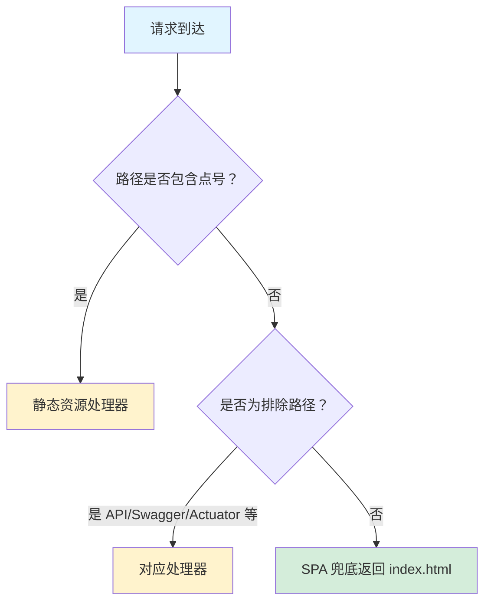

# 页面路由

本文档描述 CompanyRag 系统的前端页面路由配置和 SPA（单页应用）兜底机制。

## 1. 路由概述

系统采用 **Spring MVC + Thymeleaf** 的前后端一体化架构，结合 SPA 兜底机制，支持传统服务端渲染和现代单页应用的混合模式。

## 2. 页面路由配置

### 2.1 核心路由控制器

路由定义位于 [`PageController.java`](../../company-rag-web/src/main/java/com/company/rag/web/controller/PageController.java)，负责处理所有前端页面请求。

### 2.2 路由映射表

| 请求路径 | 模板文件 | 页面说明 |
|---------|---------|---------|
| `/` | `index.html` | 首页（默认） |
| `/index` | `index.html` | 首页 |
| `/chat` | `index.html` | 聊天对话页（与首页共用模板） |
| `/login` | `login.html` | 用户登录页 |
| `/documents` | `documents.html` | 文档管理页 |
| `/admin` | `admin.html` | 管理后台页 |

### 2.3 路由代码示例

```java
@Controller
public class PageController {

    @GetMapping({"/", "/index", "/chat"})
    public String index() {
        return "index";
    }

    @GetMapping("/login")
    public String login() {
        return "login";
    }

    @GetMapping("/documents")
    public String documents() {
        return "documents";
    }

    @GetMapping("/admin")
    public String admin() {
        return "admin";
    }
}
```

> 来源：[`PageController.java`](../../company-rag-web/src/main/java/com/company/rag/web/controller/PageController.java)(L12-L30)

## 3. SPA 兜底机制

### 3.1 兜底控制器

为了支持前端路由（如 Vue Router、React Router 的 History 模式），系统配置了 [`SpaFallbackController.java`](../../company-rag-web/src/main/java/com/company/rag/web/controller/SpaFallbackController.java) 作为所有未知路径的兜底处理器。

### 3.2 匹配规则

SPA 兜底控制器使用正则表达式 `{path:[^\\.]*}` 进行路径匹配：

- **匹配**：不包含点号 (`.`) 的路径（即非静态资源路径）
- **不匹配**：包含点号的路径（如 `.js`、`.css`、`.png` 等静态资源）

### 3.3 排除路径

以下路径不会被 SPA 兜底拦截，而是交由对应的处理器处理：

| 排除路径 | 用途 |
|---------|------|
| `/api/**` | REST API 接口 |
| `/swagger-ui/**` | Swagger UI 文档 |
| `/v3/api-docs/**` | OpenAPI 规范文档 |
| `/webjars/**` | WebJars 静态资源 |
| `/actuator/**` | Spring Boot Actuator 监控端点 |
| `/favicon.ico` | 网站图标 |
| `/error` | 错误处理页面 |

### 3.4 兜底逻辑

```java
@GetMapping("/{path:[^\\\\.]*}")
public String fallback(HttpServletRequest request, HttpServletResponse response) {
    String path = request.getRequestURI();
    
    // 排除 API 路径
    if (path.startsWith("/api/")) {
        return null;
    }
    
    // 排除 Swagger UI 和 API 文档路径
    if (path.startsWith("/swagger-ui") || path.startsWith("/v3/api-docs")) {
        return null;
    }
    
    // 排除 WebJars 静态资源
    if (path.startsWith("/webjars/")) {
        return null;
    }
    
    // 排除 Actuator 监控端点
    if (path.startsWith("/actuator/")) {
        return null;
    }
    
    // 排除 favicon 和 error 路径
    if (path.equals("/favicon.ico") || path.equals("/error")) {
        return null;
    }
    
    // 所有其他路径返回 index 模板（SPA 兜底）
    return "index";
}
```

> 来源：[`SpaFallbackController.java`](../../company-rag-web/src/main/java/com/company/rag/web/controller/SpaFallbackController.java)(L20-L51)

## 4. 模板文件

所有页面模板位于 [`company-rag-web/src/main/resources/templates/`](../../company-rag-web/src/main/resources/templates/) 目录：

```
templates/
├── admin.html          # 管理后台页面
├── documents.html      # 文档管理页面
├── index.html          # 首页/聊天页面
└── login.html          # 登录页面
```

## 5. 路由处理流程



## 6. 前端路由注意事项

1. **History 模式支持**：前端使用 History 模式时，刷新页面会请求后端，SPA 兜底机制确保返回 `index.html`，由前端路由接管。

2. **API 路径隔离**：所有 API 请求应以 `/api/` 开头，避免被 SPA 兜底拦截。

3. **静态资源**：`.js`、`.css`、`.png` 等带扩展名的文件由静态资源处理器直接返回。

4. **404 处理**：前端路由应自行处理无效路径，后端仅负责返回 `index.html`。

## 7. 相关文件

- 路由控制器：[`PageController.java`](../../company-rag-web/src/main/java/com/company/rag/web/controller/PageController.java)
- SPA 兜底控制器：[`SpaFallbackController.java`](../../company-rag-web/src/main/java/com/company/rag/web/controller/SpaFallbackController.java)
- 页面模板目录：[`company-rag-web/src/main/resources/templates/`](../../company-rag-web/src/main/resources/templates/)
- Web MVC 配置：[`WebMvcConfig.java`](../../company-rag-web/src/main/java/com/company/rag/web/config/WebMvcConfig.java)
