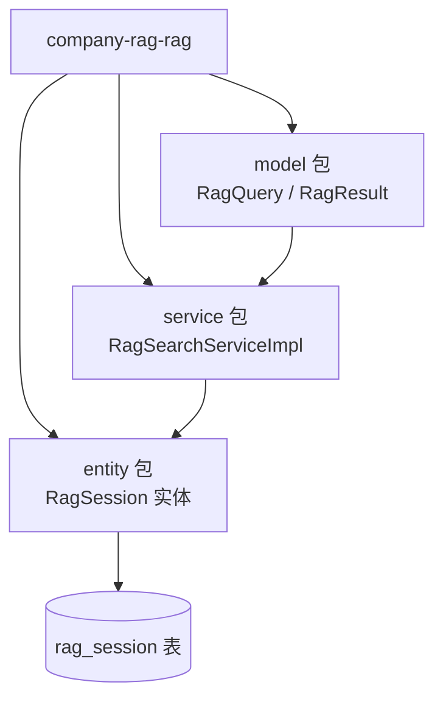
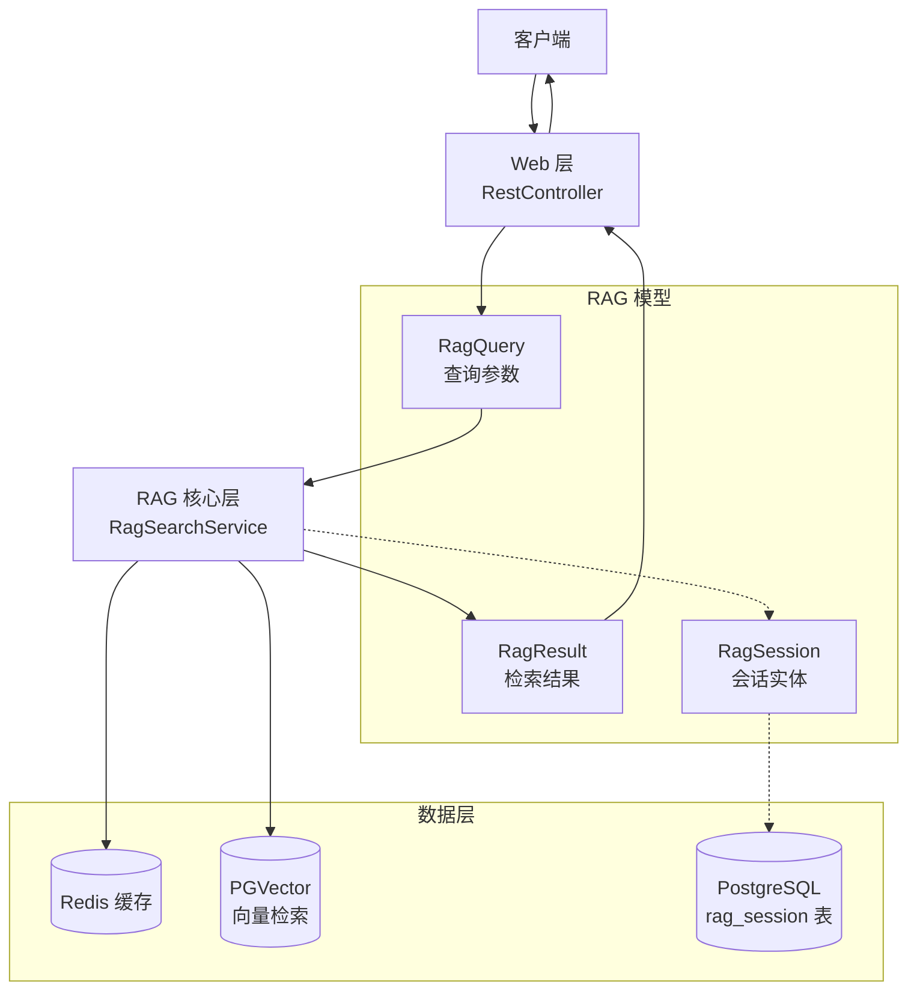
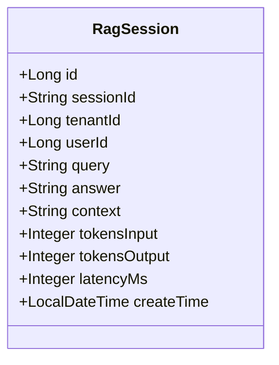
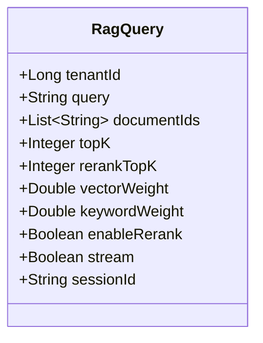
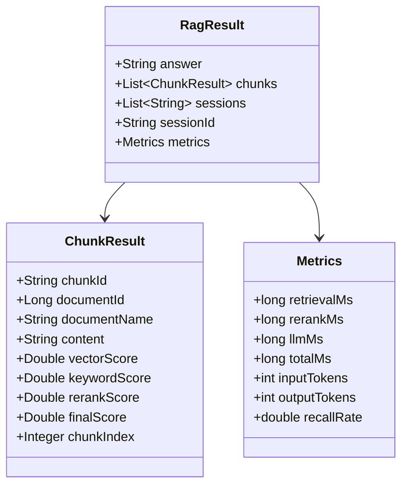
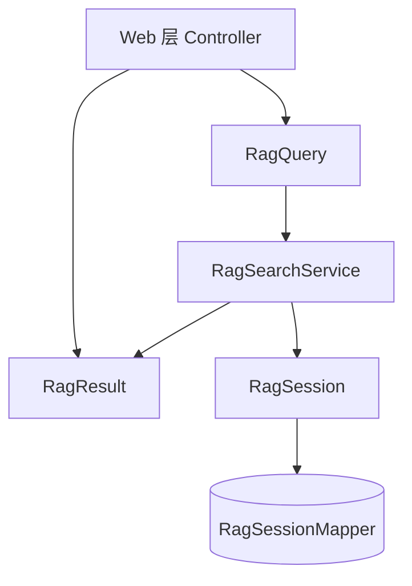
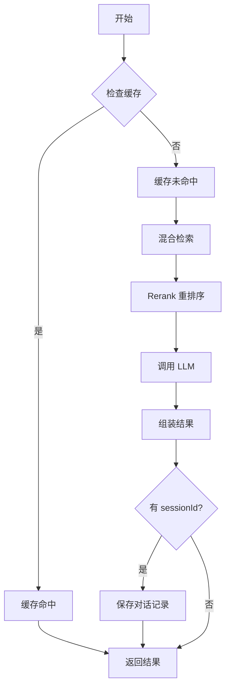
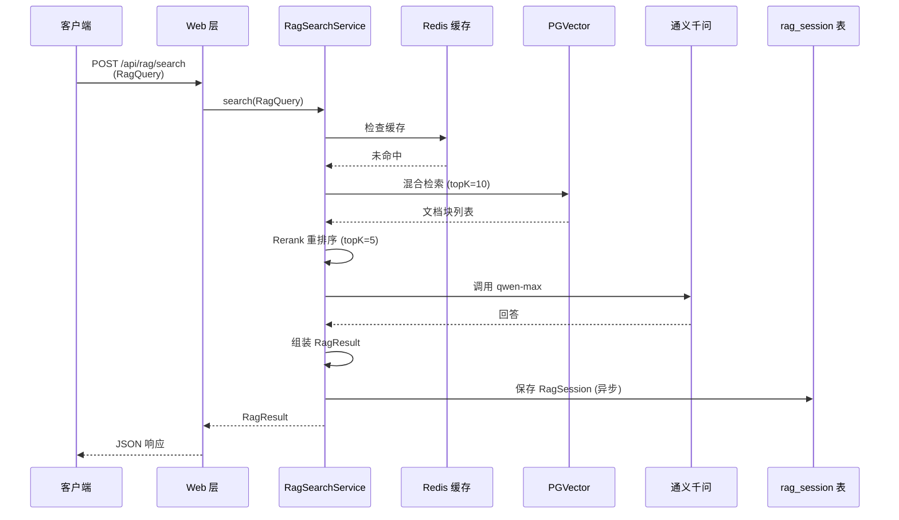

# RAG 模型 (RagModel)

**本文档引用的文件**
- [RagSession.java](../../company-rag-rag/src/main/java/com/company/rag/rag/entity/RagSession.java)
- [RagQuery.java](../../company-rag-rag/src/main/java/com/company/rag/rag/model/RagQuery.java)
- [RagResult.java](../../company-rag-rag/src/main/java/com/company/rag/rag/model/RagResult.java)
- [RagSearchServiceImpl.java](../../company-rag-rag/src/main/java/com/company/rag/rag/service/impl/RagSearchServiceImpl.java)
- [项目概述.md](../项目概述.md)

## 目录
1. [简介](#简介)
2. [项目结构](#项目结构)
3. [核心组件](#核心组件)
4. [架构概述](#架构概述)
5. [详细组件分析](#详细组件分析)
6. [依赖分析](#依赖分析)
7. [数据库表结构](#数据库表结构)
8. [业务规则](#业务规则)
9. [使用示例](#使用示例)
10. [性能考虑](#性能考虑)
11. [结论](#结论)

## 简介

RAG 模型是 CompanyRag 系统中用于检索增强生成 (Retrieval-Augmented Generation) 的核心数据模型体系，涵盖会话实体、查询参数、检索结果三大核心组件。

- **RagSession**：RAG 会话明细实体，用于持久化存储用户问答记录，包含问题、答案、上下文、Token 消耗与延迟等指标。来源：[RagSession.java](../../company-rag-rag/src/main/java/com/company/rag/rag/entity/RagSession.java)(L9-L38)
- **RagQuery**：RAG 查询参数对象，封装检索请求的所有配置项，支持混合检索权重、Rerank 开关、流式输出等高级功能。来源：[RagQuery.java](../../company-rag-rag/src/main/java/com/company/rag/rag/model/RagQuery.java)(L7-L22)
- **RagResult**：RAG 检索结果对象，包含 LLM 生成的回答、引用的文档块列表、来源说明与性能指标。来源：[RagResult.java](../../company-rag-rag/src/main/java/com/company/rag/rag/model/RagResult.java)(L7-L42)

**本章来源** - [RagSession.java](../../company-rag-rag/src/main/java/com/company/rag/rag/entity/RagSession.java)、[RagQuery.java](../../company-rag-rag/src/main/java/com/company/rag/rag/model/RagQuery.java)、[RagResult.java](../../company-rag-rag/src/main/java/com/company/rag/rag/model/RagResult.java)

## 项目结构

RAG 模型相关代码位于 `company-rag-rag` 模块中，按职责分为三个子包：



**图示来源** - 根据 `company-rag-rag/src/main/java/com/company/rag/rag/` 目录结构整理

**包结构说明**：

| 包路径 | 职责 | 核心类 |
|--------|------|--------|
| `com.company.rag.rag.entity` | 数据库实体映射 | RagSession |
| `com.company.rag.rag.model` | 数据传输对象 (DTO) | RagQuery, RagResult |
| `com.company.rag.rag.service` | 检索服务实现 | RagSearchServiceImpl |

**本章来源** - [项目概述.md](../项目概述.md)(L46-L78)、[RagSearchServiceImpl.java](../../company-rag-rag/src/main/java/com/company/rag/rag/service/impl/RagSearchServiceImpl.java)(L1-L40)

## 核心组件

### RagSession（会话实体）

持久化存储 RAG 会话记录，对应数据库表 `rag_session`。

**核心字段**：
- `id`：主键 ID（自增）
- `sessionId`：会话标识符
- `tenantId`：租户 ID（多租户隔离）
- `userId`：用户 ID
- `query`：用户问题
- `answer`：LLM 生成的回答
- `context`：检索到的上下文片段
- `tokensInput` / `tokensOutput`：输入/输出 Token 数
- `latencyMs`：请求延迟（毫秒）
- `createTime`：创建时间

来源：[RagSession.java](../../company-rag-rag/src/main/java/com/company/rag/rag/entity/RagSession.java)(L16-L37)

### RagQuery（查询参数）

封装 RAG 检索请求的所有配置项。

**核心字段**：
- `tenantId`：租户 ID
- `query`：用户问题
- `documentIds`：限定文档范围（可选）
- `topK`：检索返回条数（默认 10）
- `rerankTopK`：Rerank 后保留条数（默认 5）
- `vectorWeight` / `keywordWeight`：向量/关键词检索权重（默认各 0.5）
- `enableRerank`：是否启用 Rerank（默认 true）
- `stream`：是否流式输出
- `sessionId`：会话 ID（用于对话历史）

来源：[RagQuery.java](../../company-rag-rag/src/main/java/com/company/rag/rag/model/RagQuery.java)(L12-L21)

### RagResult（检索结果）

封装 RAG 检索的完整结果，包含回答、引用块与性能指标。

**核心字段**：
- `answer`：LLM 生成的回答
- `chunks`：引用的文档块列表（ChunkResult 类型）
- `sessions`：引用来源说明列表
- `sessionId`：会话 ID
- `metrics`：性能指标（Metrics 类型）

**ChunkResult 内部类字段**：
- `chunkId`：文档块 ID
- `documentId` / `documentName`：文档 ID 与名称
- `content`：文档块内容
- `vectorScore` / `keywordScore` / `rerankScore` / `finalScore`：各阶段检索得分
- `chunkIndex`：文档块索引

**Metrics 内部类字段**：
- `retrievalMs` / `rerankMs` / `llmMs` / `totalMs`：各阶段耗时
- `inputTokens` / `outputTokens`：Token 消耗
- `recallRate`：召回率

来源：[RagResult.java](../../company-rag-rag/src/main/java/com/company/rag/rag/model/RagResult.java)(L12-L40)

**本章来源** - [RagSession.java](../../company-rag-rag/src/main/java/com/company/rag/rag/entity/RagSession.java)、[RagQuery.java](../../company-rag-rag/src/main/java/com/company/rag/rag/model/RagQuery.java)、[RagResult.java](../../company-rag-rag/src/main/java/com/company/rag/rag/model/RagResult.java)

## 架构概述

RAG 模型在系统中的分层位置与数据流转：



**图示来源** - 根据 [RagSearchServiceImpl.java](../../company-rag-rag/src/main/java/com/company/rag/rag/service/impl/RagSearchServiceImpl.java)(L40-L108) 与 [项目概述.md](../项目概述.md)(L104-L156) 整理

**RAG 全链路流程**：
1. 客户端发起查询请求 → Web 层接收并构建 `RagQuery`
2. RAG 核心层执行检索（缓存检查 → 混合检索 → Rerank → LLM 调用）
3. 生成 `RagResult` 并返回
4. 如有 `sessionId`，异步保存对话记录到 `RagSession` 表

## 详细组件分析

### RagSession 实体类图



**图示来源** - [RagSession.java](../../company-rag-rag/src/main/java/com/company/rag/rag/entity/RagSession.java)(L14-L37)

### RagQuery 参数类图



**图示来源** - [RagQuery.java](../../company-rag-rag/src/main/java/com/company/rag/rag/model/RagQuery.java)(L11-L21)

### RagResult 结果类图



**图示来源** - [RagResult.java](../../company-rag-rag/src/main/java/com/company/rag/rag/model/RagResult.java)(L11-L40)

### 实体字段表格

#### RagSession 字段定义

| 字段名 | 类型 | 描述 |
|--------|------|------|
| id | Long | 主键 ID（自增） |
| sessionId | String | 会话标识符 |
| tenantId | Long | 租户 ID（多租户隔离） |
| userId | Long | 用户 ID |
| query | String | 用户问题 |
| answer | String | LLM 生成的回答 |
| context | String | 检索到的上下文片段 |
| tokensInput | Integer | 输入 Token 数 |
| tokensOutput | Integer | 输出 Token 数 |
| latencyMs | Integer | 请求延迟（毫秒） |
| createTime | LocalDateTime | 创建时间 |

#### RagQuery 字段定义

| 字段名 | 类型 | 描述 |
|--------|------|------|
| tenantId | Long | 租户 ID |
| query | String | 用户问题 |
| documentIds | List~String~ | 限定文档范围（可选） |
| topK | Integer | 检索返回条数（默认 10） |
| rerankTopK | Integer | Rerank 后保留条数（默认 5） |
| vectorWeight | Double | 向量检索权重（默认 0.5） |
| keywordWeight | Double | 关键词检索权重（默认 0.5） |
| enableRerank | Boolean | 是否启用 Rerank（默认 true） |
| stream | Boolean | 是否流式输出 |
| sessionId | String | 会话 ID（用于对话历史） |

#### RagResult 字段定义

| 字段名 | 类型 | 描述 |
|--------|------|------|
| answer | String | LLM 生成的回答 |
| chunks | List~ChunkResult~ | 引用的文档块列表 |
| sessions | List~String~ | 引用来源说明列表 |
| sessionId | String | 会话 ID |
| metrics | Metrics | 性能指标 |

#### ChunkResult 字段定义

| 字段名 | 类型 | 描述 |
|--------|------|------|
| chunkId | String | 文档块 ID |
| documentId | Long | 文档 ID |
| documentName | String | 文档名称 |
| content | String | 文档块内容 |
| vectorScore | Double | 向量检索得分 |
| keywordScore | Double | 关键词检索得分 |
| rerankScore | Double | Rerank 得分 |
| finalScore | Double | 最终得分 |
| chunkIndex | Integer | 文档块索引 |

#### Metrics 字段定义

| 字段名 | 类型 | 描述 |
|--------|------|------|
| retrievalMs | long | 检索耗时 |
| rerankMs | long | 重排序耗时 |
| llmMs | long | LLM 调用耗时 |
| totalMs | long | 总耗时 |
| inputTokens | int | 输入 Token 数 |
| outputTokens | int | 输出 Token 数 |
| recallRate | double | 召回率 |

**本章来源** - [RagSession.java](../../company-rag-rag/src/main/java/com/company/rag/rag/entity/RagSession.java)、[RagQuery.java](../../company-rag-rag/src/main/java/com/company/rag/rag/model/RagQuery.java)、[RagResult.java](../../company-rag-rag/src/main/java/com/company/rag/rag/model/RagResult.java)

## 依赖分析

RAG 模型各组件间的依赖关系：



**图示来源** - 根据 [RagSearchServiceImpl.java](../../company-rag-rag/src/main/java/com/company/rag/rag/service/impl/RagSearchServiceImpl.java)(L27-L108) 整理

**依赖关系说明**：
- `RagQuery` 作为输入参数，由 Web 层传递给 `RagSearchService`
- `RagResult` 作为输出结果，由 `RagSearchService` 返回给 Web 层
- `RagSession` 由 `RagSearchService` 在服务层调用 `RagSessionService` 进行持久化
- 三者通过 `sessionId` 关联，形成完整的会话链路

## 数据库表结构

### rag_session 表

```sql
CREATE TABLE rag_session (
    id BIGSERIAL PRIMARY KEY,                    -- 主键 ID（自增）
    session_id VARCHAR(64) NOT NULL,             -- 会话标识符
    tenant_id BIGINT NOT NULL,                   -- 租户 ID（多租户隔离）
    user_id BIGINT,                              -- 用户 ID
    query TEXT NOT NULL,                         -- 用户问题
    answer TEXT,                                 -- LLM 生成的回答
    context TEXT,                                -- 检索到的上下文片段
    tokens_input INTEGER,                        -- 输入 Token 数
    tokens_output INTEGER,                       -- 输出 Token 数
    latency_ms INTEGER,                          -- 请求延迟（毫秒）
    create_time TIMESTAMP NOT NULL DEFAULT NOW() -- 创建时间
);

-- 索引
CREATE INDEX idx_rag_session_session_id ON rag_session(session_id);
CREATE INDEX idx_rag_session_tenant_id ON rag_session(tenant_id);
CREATE INDEX idx_rag_session_create_time ON rag_session(create_time);
```

**图示来源** - 根据 [RagSession.java](../../company-rag-rag/src/main/java/com/company/rag/rag/entity/RagSession.java)(L16-L37) 推断

## 业务规则

### 会话记录保存规则

- **触发条件**：当 `RagQuery.sessionId` 不为空时，异步保存对话记录
- **保存内容**：租户 ID、会话 ID、用户 ID、问题、答案、上下文、Token 数、延迟
- **异常处理**：保存失败仅记录警告日志，不影响主流程

来源：[RagSearchServiceImpl.java](../../company-rag-rag/src/main/java/com/company/rag/rag/service/impl/RagSearchServiceImpl.java)(L90-L101)

### 检索流程规则



**图示来源** - 根据 [RagSearchServiceImpl.java](../../company-rag-rag/src/main/java/com/company/rag/rag/service/impl/RagSearchServiceImpl.java)(L43-L108) 整理

**本章来源** - [RagSearchServiceImpl.java](../../company-rag-rag/src/main/java/com/company/rag/rag/service/impl/RagSearchServiceImpl.java)

## 使用示例

### 典型调用时序图



**图示来源** - 根据 [RagSearchServiceImpl.java](../../company-rag-rag/src/main/java/com/company/rag/rag/service/impl/RagSearchServiceImpl.java)(L43-L108) 与 [项目概述.md](../项目概述.md)(L156) 整理

### 请求示例

```json
{
  "tenantId": 1,
  "query": "如何使用 RAG 进行文档检索？",
  "documentIds": ["doc-001", "doc-002"],
  "topK": 10,
  "rerankTopK": 5,
  "vectorWeight": 0.5,
  "keywordWeight": 0.5,
  "enableRerank": true,
  "stream": false,
  "sessionId": "session-20260719-001"
}
```

### 响应示例

```json
{
  "answer": "RAG（检索增强生成）是一种结合检索与生成的技术...",
  "chunks": [
    {
      "chunkId": "chunk-001",
      "documentId": 1,
      "documentName": "RAG 技术白皮书.pdf",
      "content": "RAG 技术通过检索相关文档块...",
      "vectorScore": 0.92,
      "keywordScore": 0.85,
      "rerankScore": 0.89,
      "finalScore": 0.88,
      "chunkIndex": 3
    }
  ],
  "sessions": ["RAG 技术白皮书.pdf (第 3 段)"],
  "sessionId": "session-20260719-001",
  "metrics": {
    "retrievalMs": 120,
    "rerankMs": 45,
    "llmMs": 800,
    "totalMs": 965,
    "inputTokens": 512,
    "outputTokens": 256,
    "recallRate": 0.85
  }
}
```

**本章来源** - [RagQuery.java](../../company-rag-rag/src/main/java/com/company/rag/rag/model/RagQuery.java)、[RagResult.java](../../company-rag-rag/src/main/java/com/company/rag/rag/model/RagResult.java)、[RagSearchServiceImpl.java](../../company-rag-rag/src/main/java/com/company/rag/rag/service/impl/RagSearchServiceImpl.java)

## 性能考虑

### 检索优化策略

1. **混合检索**：向量检索 + 关键词检索加权融合，提升召回率
   - 默认权重：向量 0.5 + 关键词 0.5
   - 可根据场景调整权重比例

2. **Rerank 重排序**：Cross-Encoder 精排 Top-K，准确率提升 15-30%
   - 默认启用，可通过 `enableRerank=false` 关闭
   - Rerank 耗时约 40-60ms（见 [RagSearchServiceImpl.java](../../company-rag-rag/src/main/java/com/company/rag/rag/service/impl/RagSearchServiceImpl.java)(L60-L64)）

3. **两级缓存**：
   - Redis 缓存：避免重复计算
   - 热点检测：自动识别高频查询

4. **动态 Top-K**：根据查询复杂度调整检索数量
   - 默认 `topK=10`，`rerankTopK=5`

来源：[项目概述.md](../项目概述.md)(L205-L225)、[RagSearchServiceImpl.java](../../company-rag-rag/src/main/java/com/company/rag/rag/service/impl/RagSearchServiceImpl.java)(L45-L64)

### 性能指标监控

通过 `RagResult.Metrics` 可监控以下关键指标：

| 指标 | 说明 | 优化目标 |
|------|------|----------|
| retrievalMs | 检索耗时 | < 200ms |
| rerankMs | 重排序耗时 | < 100ms |
| llmMs | LLM 调用耗时 | < 1000ms |
| totalMs | 总耗时 | < 1500ms |
| recallRate | 召回率 | > 0.8 |
| inputTokens/outputTokens | Token 消耗 | 根据业务优化 |

**本章来源** - [RagResult.java](../../company-rag-rag/src/main/java/com/company/rag/rag/model/RagResult.java)(L32-L40)、[项目概述.md](../项目概述.md)(L205-L225)

## 结论

RAG 模型是 CompanyRag 系统的核心数据模型体系，具有以下设计特点：

1. **职责清晰**：`RagQuery`（输入）→ `RagResult`（输出）→ `RagSession`（持久化），三者各司其职
2. **完整链路**：覆盖从查询参数到检索结果再到会话记录的全生命周期
3. **可观测性**：内置性能指标（耗时、Token 消耗、召回率），便于监控与优化
4. **多租户支持**：通过 `tenantId` 实现租户级数据隔离
5. **灵活配置**：支持混合检索权重、Rerank 开关、流式输出等高级功能

RAG 模型的设计体现了 CompanyRag 作为企业级 RAG 系统的核心价值：**高效、可观测、可扩展**。

**本章来源** - [RagSession.java](../../company-rag-rag/src/main/java/com/company/rag/rag/entity/RagSession.java)、[RagQuery.java](../../company-rag-rag/src/main/java/com/company/rag/rag/model/RagQuery.java)、[RagResult.java](../../company-rag-rag/src/main/java/com/company/rag/rag/model/RagResult.java)、[项目概述.md](../项目概述.md)
