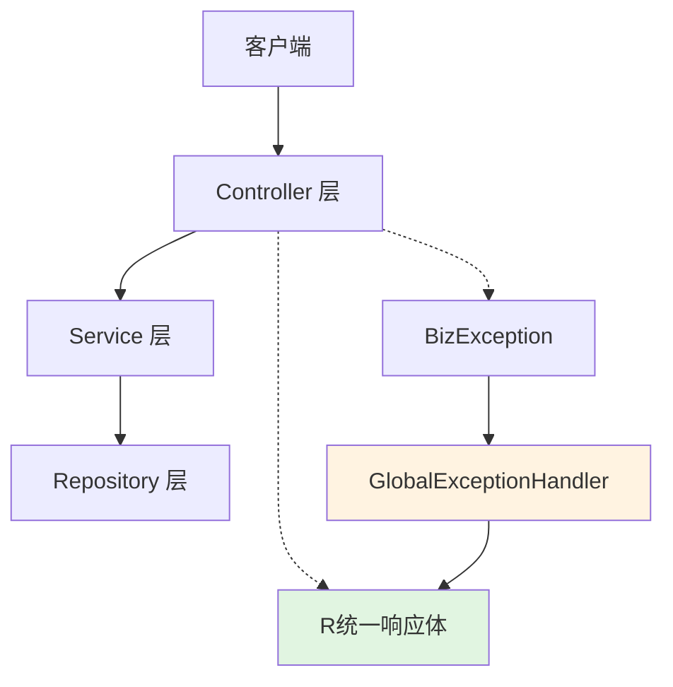
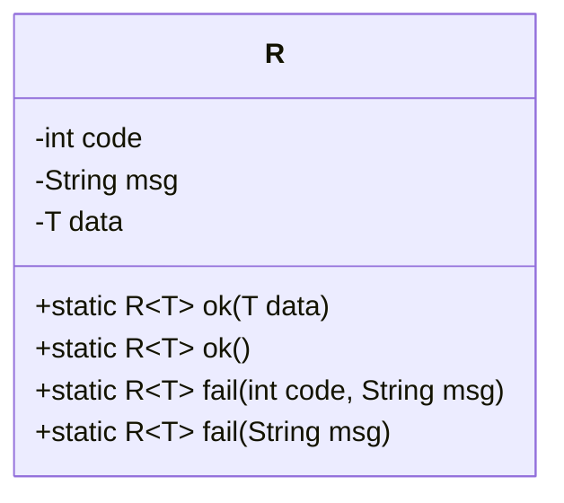
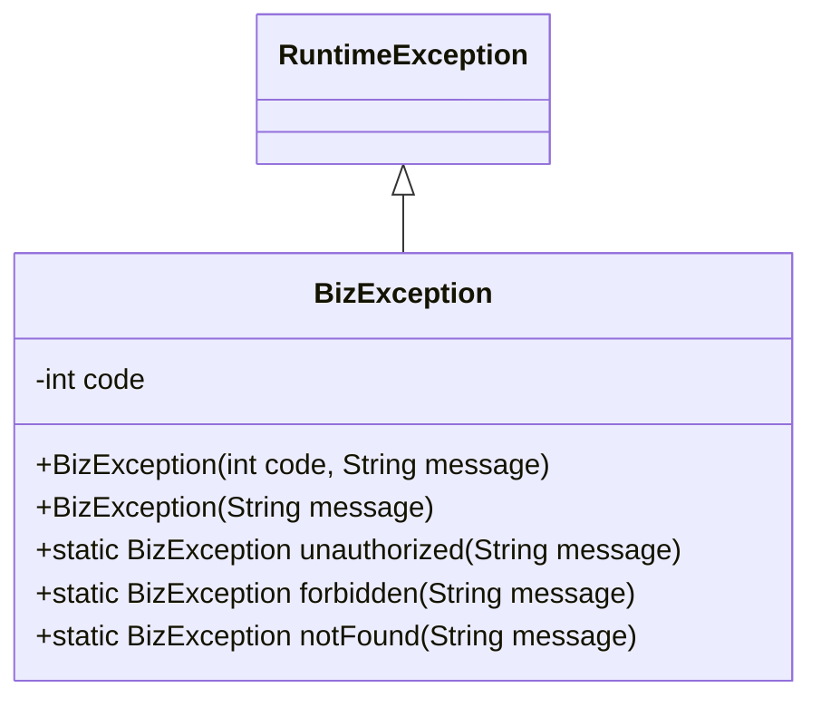
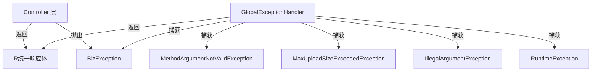
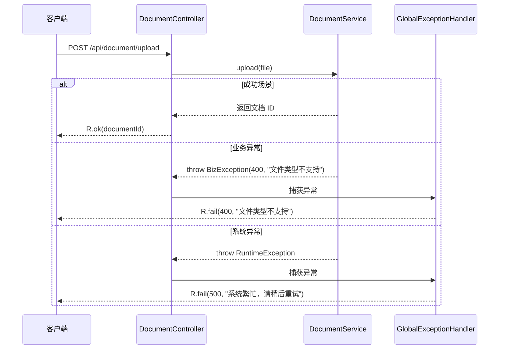

# 公共模型 (Common Model)

**本文档引用的文件**
- [R.java](../../../company-rag-common/src/main/java/com/company/rag/common/model/R.java)
- [BizException.java](../../../company-rag-common/src/main/java/com/company/rag/common/exception/BizException.java)
- [GlobalExceptionHandler.java](../../../company-rag-common/src/main/java/com/company/rag/common/exception/GlobalExceptionHandler.java)
- [RagConstant.java](../../../company-rag-common/src/main/java/com/company/rag/common/constant/RagConstant.java)

## 目录
1. [简介](#简介)
2. [项目结构](#项目结构)
3. [核心组件](#核心组件)
4. [架构概述](#架构概述)
5. [详细组件分析](#详细组件分析)
6. [依赖分析](#依赖分析)
7. [业务规则](#业务规则)
8. [使用示例](#使用示例)
9. [结论](#结论)

## 简介

公共模型模块提供了企业级 RAG 系统的统一响应体标准和异常处理机制，确保所有 API 接口返回一致的数据格式。

**核心功能**：
- **统一响应体 `R<T>`**：所有 REST API 的标准响应格式，包含状态码、消息和数据载荷
- **业务异常 `BizException`**：支持 HTTP 状态码的业务异常基类
- **全局异常处理器**：统一捕获并转换各类异常为标准响应格式

**本节来源** - [R.java](../../../company-rag-common/src/main/java/com/company/rag/common/model/R.java)(L1-L36)

## 项目结构

```
company-rag-common/
└── src/main/java/com/company/rag/common/
    ├── model/
    │   └── R.java                    # 统一响应体
    ├── exception/
    │   ├── BizException.java         # 业务异常类
    │   └── GlobalExceptionHandler.java # 全局异常处理器
    ├── constant/
    │   └── RagConstant.java          # 系统常量
    └── util/                         # 工具类（如有）
```

**图示来源** - 基于实际目录结构生成

## 核心组件

| 组件名称 | 文件路径 | 作用 |
|---------|---------|------|
| `R<T>` | `model/R.java` | 统一响应体，泛型设计支持任意数据类型 |
| `BizException` | `exception/BizException.java` | 业务异常基类，支持自定义状态码 |
| `GlobalExceptionHandler` | `exception/GlobalExceptionHandler.java` | 全局异常处理器，统一返回格式 |
| `RagConstant` | `constant/RagConstant.java` | 系统全局常量定义 |

**章节来源** - [R.java](../../../company-rag-common/src/main/java/com/company/rag/common/model/R.java)、[BizException.java](../../../company-rag-common/src/main/java/com/company/rag/common/exception/BizException.java)

## 架构概述



**图示来源** - 基于 [GlobalExceptionHandler.java](../../../company-rag-common/src/main/java/com/company/rag/common/exception/GlobalExceptionHandler.java)(L20-L86) 绘制

## 详细组件分析

### 统一响应体 R<T>

**实体字段表格**

| 字段名 | 类型 | 描述 |
|-------|------|------|
| code | int | 响应状态码，200 表示成功，其他表示失败 |
| msg | String | 响应消息，成功时为"success"，失败时为错误描述 |
| data | T | 泛型数据载荷，成功时返回业务数据，失败时为 null |

**静态方法**

| 方法签名 | 描述 | 默认值 |
|---------|------|-------|
| `ok(T data)` | 成功响应，带数据 | code=200, msg="success" |
| `ok()` | 成功响应，无数据 | code=200, msg="success", data=null |
| `fail(int code, String msg)` | 失败响应，自定义状态码和消息 | data=null |
| `fail(String msg)` | 失败响应，默认状态码 400 | code=400, data=null |

**类图**



**图示来源** - [R.java](../../../company-rag-common/src/main/java/com/company/rag/common/model/R.java)(L8-L35)

### 业务异常 BizException

**实体字段表格**

| 字段名 | 类型 | 描述 |
|-------|------|------|
| code | int | HTTP 状态码，默认 400 |

**构造方法**

| 构造方法 | 描述 |
|---------|------|
| `BizException(int code, String message)` | 自定义状态码和消息 |
| `BizException(String message)` | 默认状态码 400 |

**静态工厂方法**

| 方法 | 状态码 | 用途 |
|-----|-------|------|
| `unauthorized(String message)` | 401 | 未授权 |
| `forbidden(String message)` | 403 | 禁止访问 |
| `notFound(String message)` | 404 | 资源不存在 |

**类图**



**图示来源** - [BizException.java](../../../company-rag-common/src/main/java/com/company/rag/common/exception/BizException.java)(L8-L33)

## 依赖分析



**图示来源** - 基于 [GlobalExceptionHandler.java](../../../company-rag-common/src/main/java/com/company/rag/common/exception/GlobalExceptionHandler.java)(L27-L85) 绘制

## 业务规则

**异常处理规则**：
- **业务异常**：`BizException` 直接转换为 `R.fail(code, msg)`，记录 WARN 日志
- **参数校验异常**：`MethodArgumentNotValidException` 返回 400，合并所有字段错误信息
- **文件大小超限**：`MaxUploadSizeExceededException` 返回 400，提示"文件大小超过限制"
- **非法参数**：`IllegalArgumentException` 返回 400，记录请求路径和错误信息
- **运行时异常**：`RuntimeException` 返回 500，记录 ERROR 日志和堆栈，对用户隐藏详细信息
- **兜底处理**：其他 `Exception` 返回 500，提示"系统异常，请联系管理员"

**状态码规范**：
- **200**：请求成功
- **400**：客户端错误（参数校验失败、非法参数、文件超限）
- **401**：未授权
- **403**：禁止访问
- **404**：资源不存在
- **500**：服务器内部错误

**业务流程图**

```mermaid
flowchart TD
    A[客户端请求] --> B[Controller 层]
    B --> C{是否抛出异常？}
    C -->|否 | D[返回 R.ok(data)]
    C -->|是 | E[GlobalExceptionHandler]
    
    E --> F{异常类型？}
    F -->|BizException| G[R.fail(code, msg)]
    F -->|ValidationEx| H[R.fail(400, 字段错误信息)]
    F -->|FileSizeEx| I[R.fail(400, 文件大小超限)]
    F -->|IllegalArgEx| J[R.fail(400, 参数错误)]
    F -->|RuntimeEx| K[R.fail(500, 系统繁忙)]
    F -->|Other Ex| L[R.fail(500, 系统异常)]
    
    G --> M[返回客户端]
    H --> M
    I --> M
    J --> M
    K --> M
    L --> M
    D --> M
```

**图示来源** - 基于 [GlobalExceptionHandler.java](../../../company-rag-common/src/main/java/com/company/rag/common/exception/GlobalExceptionHandler.java) 绘制

## 使用示例

**Controller 层标准用法**



**图示来源** - 基于 [R.java](../../../company-rag-common/src/main/java/com/company/rag/common/model/R.java) 和 [GlobalExceptionHandler.java](../../../company-rag-common/src/main/java/com/company/rag/common/exception/GlobalExceptionHandler.java) 绘制

**代码示例**

```java
// Controller 成功返回
@RestController
public class DocumentController {
    @PostMapping("/document")
    public R<Long> createDocument(@RequestBody DocumentDTO dto) {
        Long id = documentService.create(dto);
        return R.ok(id);  // 返回：{"code":200,"msg":"success","data":123}
    }
    
    // Controller 抛出业务异常
    @GetMapping("/document/{id}")
    public R<Document> getDocument(@PathVariable Long id) {
        if (id <= 0) {
            throw new BizException(400, "文档 ID 无效");
        }
        Document doc = documentService.getById(id);
        if (doc == null) {
            throw BizException.notFound("文档不存在");
        }
        return R.ok(doc);
    }
}
```

**章节来源** - [R.java](../../../company-rag-common/src/main/java/com/company/rag/common/model/R.java)(L14-L35)

## 结论

公共模型模块通过 `R<T>` 统一响应体和 `GlobalExceptionHandler` 全局异常处理器，实现了企业级 API 的标准化响应格式。

**设计特点**：
- **泛型设计**：`R<T>` 支持任意数据类型，灵活适配各种业务场景
- **语义化方法**：`ok()` 和 `fail()` 静态方法提供清晰的语义表达
- **异常分级**：业务异常与系统异常分离处理，敏感信息不暴露给客户端
- **日志分级**：业务异常记录 WARN，系统异常记录 ERROR 并保存堆栈
- **统一出口**：所有 Controller 方法返回统一格式，降低前端解析复杂度

**在系统中的价值**：
- 确保所有 API 接口返回格式一致，提升前端开发效率
- 通过异常处理器自动转换，减少样板代码
- 日志分级记录，便于问题排查和安全审计
- 符合 RESTful API 设计规范，提升系统可维护性

---

**本文档引用的文件**
- [R.java](../../../company-rag-common/src/main/java/com/company/rag/common/model/R.java)
- [BizException.java](../../../company-rag-common/src/main/java/com/company/rag/common/exception/BizException.java)
- [GlobalExceptionHandler.java](../../../company-rag-common/src/main/java/com/company/rag/common/exception/GlobalExceptionHandler.java)
- [RagConstant.java](../../../company-rag-common/src/main/java/com/company/rag/common/constant/RagConstant.java)
