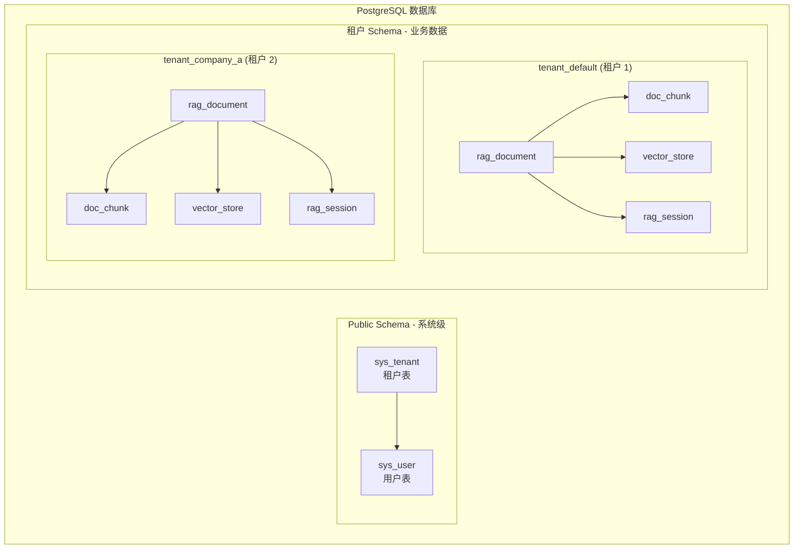
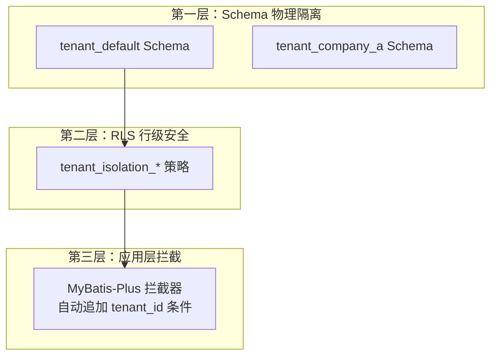

# 数据库 Schema 与迁移 (Database Schema & Migration)

**本文档引用的文件**
- [sql/init.sql](../../../sql/init.sql)
- [Document.java](../../../company-rag-document/src/main/java/com/company/rag/document/entity/Document.java)
- [DocumentChunk.java](../../../company-rag-document/src/main/java/com/company/rag/document/entity/DocumentChunk.java)
- [RagSession.java](../../../company-rag-rag/src/main/java/com/company/rag/rag/entity/RagSession.java)
- [项目概述.md](../../../.gientech/wiki/项目概述.md)

## 目录
1. [简介](#简介)
2. [Schema 设计架构](#schema 设计架构)
3. [系统表结构 (Public Schema)](#系统表结构-public-schema)
4. [业务表结构 (租户 Schema)](#业务表结构租户-schema)
5. [向量存储配置](#向量存储配置)
6. [索引策略](#索引策略)
7. [行级安全策略](#行级安全策略)
8. [租户隔离机制](#租户隔离机制)
9. [数据库初始化流程](#数据库初始化流程)
10. [结论](#结论)

## 简介

CompanyRag 采用 **PostgreSQL 16 + PGVector** 作为数据存储方案，通过 **Schema 物理隔离** 实现多租户数据隔离。数据库设计遵循以下核心原则：

- **Public Schema**：仅存放系统级表（租户、用户），所有租户共享
- **租户独立 Schema**：每个租户拥有独立的业务 Schema（如 `tenant_default`、`tenant_company_a`），存放文档、向量、会话等业务数据
- **行级安全（RLS）**：在租户 Schema 内通过 RLS 策略进一步保障租户数据隔离
- **向量存储**：使用 PGVector 扩展，1024 维向量，HNSW 索引，余弦距离算法

**本节来源** - [sql/init.sql](../../../sql/init.sql)(L1-L20)

## Schema 设计架构

系统采用 **两级隔离架构**：



**图示来源** - [sql/init.sql](../../../sql/init.sql)(L4-L8)

### Schema 隔离策略

| 层级 | Schema 名称 | 存放内容 | 访问权限 |
|------|------------|---------|---------|
| 系统层 | `public` | `sys_tenant`、`sys_user` | 所有认证用户 |
| 租户层 | `tenant_{code}` | `rag_document`、`doc_chunk`、`vector_store`、`rag_session` | 仅该租户用户 |

**本节来源** - [sql/init.sql](../../../sql/init.sql)(L4-L8)

## 系统表结构 (Public Schema)

### sys_tenant - 租户表

存储租户基本信息，所有租户共享此表。

```sql
CREATE TABLE IF NOT EXISTS public.sys_tenant (
    id BIGSERIAL PRIMARY KEY,
    tenant_code VARCHAR(64) NOT NULL UNIQUE,      -- 租户编码（唯一标识）
    tenant_name VARCHAR(128) NOT NULL,            -- 租户名称
    schema_name VARCHAR(64),                       -- 独立 Schema 名称（如 tenant_default）
    status INTEGER DEFAULT 1,                      -- 0-禁用 1-启用
    contact_name VARCHAR(64),                      -- 联系人姓名
    contact_phone VARCHAR(20),                     -- 联系电话
    create_time TIMESTAMP DEFAULT CURRENT_TIMESTAMP,
    update_time TIMESTAMP DEFAULT CURRENT_TIMESTAMP
);
```

| 字段名 | 类型 | 约束 | 描述 |
|-------|------|------|------|
| id | BIGSERIAL | PRIMARY KEY | 自增主键 |
| tenant_code | VARCHAR(64) | NOT NULL UNIQUE | 租户编码，用于标识租户 |
| tenant_name | VARCHAR(128) | NOT NULL | 租户名称 |
| schema_name | VARCHAR(64) | - | 租户独立 Schema 名称 |
| status | INTEGER | DEFAULT 1 | 状态：0-禁用，1-启用 |
| contact_name | VARCHAR(64) | - | 联系人姓名 |
| contact_phone | VARCHAR(20) | - | 联系电话 |
| create_time | TIMESTAMP | DEFAULT CURRENT_TIMESTAMP | 创建时间 |
| update_time | TIMESTAMP | DEFAULT CURRENT_TIMESTAMP | 更新时间 |

**本节来源** - [sql/init.sql](../../../sql/init.sql)(L17-L27)

### sys_user - 用户表

存储用户信息，支持多租户用户隔离。

```sql
CREATE TABLE IF NOT EXISTS public.sys_user (
    id BIGSERIAL PRIMARY KEY,
    tenant_id BIGINT NOT NULL REFERENCES public.sys_tenant(id),
    username VARCHAR(64) NOT NULL,
    password VARCHAR(256) NOT NULL,                -- BCrypt 加密
    display_name VARCHAR(128),
    email VARCHAR(128),
    role VARCHAR(32) DEFAULT 'user',               -- admin / user / viewer
    status INTEGER DEFAULT 1,
    create_time TIMESTAMP DEFAULT CURRENT_TIMESTAMP,
    update_time TIMESTAMP DEFAULT CURRENT_TIMESTAMP,
    UNIQUE(tenant_id, username)
);
```

| 字段名 | 类型 | 约束 | 描述 |
|-------|------|------|------|
| id | BIGSERIAL | PRIMARY KEY | 自增主键 |
| tenant_id | BIGINT | NOT NULL, FK | 所属租户 ID |
| username | VARCHAR(64) | NOT NULL | 用户名（租户内唯一） |
| password | VARCHAR(256) | NOT NULL | 密码（BCrypt 加密） |
| display_name | VARCHAR(128) | - | 显示名称 |
| email | VARCHAR(128) | - | 邮箱 |
| role | VARCHAR(32) | DEFAULT 'user' | 角色：admin / user / viewer |
| status | INTEGER | DEFAULT 1 | 状态：0-禁用，1-启用 |
| create_time | TIMESTAMP | DEFAULT CURRENT_TIMESTAMP | 创建时间 |
| update_time | TIMESTAMP | DEFAULT CURRENT_TIMESTAMP | 更新时间 |

**唯一约束**：`(tenant_id, username)` - 同一租户内用户名唯一

**本节来源** - [sql/init.sql](../../../sql/init.sql)(L30-L42)

## 业务表结构 (租户 Schema)

以下表在每个租户的独立 Schema 中创建（如 `tenant_default`、`tenant_company_a`）。

### rag_document - 文档表

存储文档元数据信息。

```sql
CREATE TABLE rag_document (
    id BIGSERIAL PRIMARY KEY,
    tenant_id BIGINT NOT NULL,
    file_name VARCHAR(256) NOT NULL,
    file_type VARCHAR(32),                          -- pdf / docx / txt / md / html
    file_size BIGINT,
    file_path VARCHAR(512),                         -- 存储路径
    title VARCHAR(256),
    chunk_count INTEGER DEFAULT 0,                  -- 切分后的块数
    status INTEGER DEFAULT 0,                       -- -1 失败 0 待处理 1 已切分 2 已向量化
    error_msg TEXT,
    create_time TIMESTAMP DEFAULT CURRENT_TIMESTAMP,
    update_time TIMESTAMP DEFAULT CURRENT_TIMESTAMP
);
```

| 字段名 | 类型 | 约束 | 描述 |
|-------|------|------|------|
| id | BIGSERIAL | PRIMARY KEY | 自增主键 |
| tenant_id | BIGINT | NOT NULL | 租户 ID（行级安全隔离） |
| file_name | VARCHAR(256) | NOT NULL | 文件名 |
| file_type | VARCHAR(32) | - | 文件类型：pdf/docx/txt/md/html |
| file_size | BIGINT | - | 文件大小（字节） |
| file_path | VARCHAR(512) | - | 存储路径 |
| title | VARCHAR(256) | - | 文档标题 |
| chunk_count | INTEGER | DEFAULT 0 | 切分后的块数 |
| status | INTEGER | DEFAULT 0 | 状态：-1 失败，0 待处理，1 已切分，2 已向量化 |
| error_msg | TEXT | - | 错误信息 |
| create_time | TIMESTAMP | DEFAULT CURRENT_TIMESTAMP | 创建时间 |
| update_time | TIMESTAMP | DEFAULT CURRENT_TIMESTAMP | 更新时间 |

**实体类映射**：[Document.java](../../../company-rag-document/src/main/java/com/company/rag/document/entity/Document.java)

**本节来源** - [sql/init.sql](../../../sql/init.sql)(L51-L64)

### doc_chunk - 文档切分块表

存储文档切分后的文本块。

```sql
CREATE TABLE doc_chunk (
    id BIGSERIAL PRIMARY KEY,
    document_id BIGINT NOT NULL REFERENCES rag_document(id) ON DELETE CASCADE,
    tenant_id BIGINT NOT NULL,
    chunk_index INTEGER NOT NULL,                   -- 块序号
    content TEXT NOT NULL,                          -- 块文本内容
    token_count INTEGER DEFAULT 0,                  -- Token 数（用于成本统计）
    split_strategy VARCHAR(32),                     -- 切分策略名称
    create_time TIMESTAMP DEFAULT CURRENT_TIMESTAMP
);
```

| 字段名 | 类型 | 约束 | 描述 |
|-------|------|------|------|
| id | BIGSERIAL | PRIMARY KEY | 自增主键 |
| document_id | BIGINT | NOT NULL, FK | 所属文档 ID（级联删除） |
| tenant_id | BIGINT | NOT NULL | 租户 ID（行级安全隔离） |
| chunk_index | INTEGER | NOT NULL | 块序号 |
| content | TEXT | NOT NULL | 块文本内容 |
| token_count | INTEGER | DEFAULT 0 | Token 数（用于成本统计） |
| split_strategy | VARCHAR(32) | - | 切分策略：语义切分/滑动窗口/固定大小 |
| create_time | TIMESTAMP | DEFAULT CURRENT_TIMESTAMP | 创建时间 |

**实体类映射**：[DocumentChunk.java](../../../company-rag-document/src/main/java/com/company/rag/document/entity/DocumentChunk.java)

**本节来源** - [sql/init.sql](../../../sql/init.sql)(L67-L76)

### rag_session - 会话历史表

存储用户问答会话记录。

```sql
CREATE TABLE rag_session (
    id BIGSERIAL PRIMARY KEY,
    session_id VARCHAR(128) NOT NULL,
    tenant_id BIGINT NOT NULL,
    user_id BIGINT,
    query TEXT NOT NULL,                            -- 用户问题
    answer TEXT,                                    -- AI 回答
    context TEXT,                                   -- 检索上下文
    tokens_input INTEGER DEFAULT 0,                 -- 输入 Token 数
    tokens_output INTEGER DEFAULT 0,                -- 输出 Token 数
    latency_ms INTEGER DEFAULT 0,                   -- 响应延迟（毫秒）
    create_time TIMESTAMP DEFAULT CURRENT_TIMESTAMP
);
```

| 字段名 | 类型 | 约束 | 描述 |
|-------|------|------|------|
| id | BIGSERIAL | PRIMARY KEY | 自增主键 |
| session_id | VARCHAR(128) | NOT NULL | 会话 ID |
| tenant_id | BIGINT | NOT NULL | 租户 ID（行级安全隔离） |
| user_id | BIGINT | - | 用户 ID |
| query | TEXT | NOT NULL | 用户问题 |
| answer | TEXT | - | AI 回答 |
| context | TEXT | - | 检索上下文（用于追溯） |
| tokens_input | INTEGER | DEFAULT 0 | 输入 Token 数 |
| tokens_output | INTEGER | DEFAULT 0 | 输出 Token 数 |
| latency_ms | INTEGER | DEFAULT 0 | 响应延迟（毫秒） |
| create_time | TIMESTAMP | DEFAULT CURRENT_TIMESTAMP | 创建时间 |

**实体类映射**：[RagSession.java](../../../company-rag-rag/src/main/java/com/company/rag/rag/entity/RagSession.java)

**本节来源** - [sql/init.sql](../../../sql/init.sql)(L90-L102)

## 向量存储配置

使用 **PGVector** 扩展存储文档向量，支持高效的相似度检索。

```sql
-- 创建扩展
CREATE EXTENSION IF NOT EXISTS vector;

-- 向量存储表
CREATE TABLE vector_store (
    id UUID PRIMARY KEY,
    content TEXT,
    metadata JSONB,
    embedding vector(1024)                          -- 1024 维向量
);

-- HNSW 索引（余弦距离）
CREATE INDEX idx_vector_store_embedding ON vector_store
    USING hnsw (embedding vector_cosine_ops)
    WITH (m = 16, ef_construction = 64);
```

### 向量配置参数

| 参数 | 值 | 说明 |
|------|-----|------|
| 向量维度 | 1024 | 使用 `text-embedding-v3` 模型 |
| 距离算法 | `vector_cosine_ops` | 余弦相似度（COSINE_DISTANCE） |
| 索引类型 | HNSW | 高效近似最近邻检索 |
| m | 16 | 每个节点的最大连接数 |
| ef_construction | 64 | 构建时的搜索深度 |

**本节来源** - [sql/init.sql](../../../sql/init.sql)(L11-L12, L79-L87)

## 索引策略

系统采用 **多类型索引组合** 优化查询性能：

### 1. 向量索引（HNSW）

```sql
CREATE INDEX idx_vector_store_embedding ON vector_store
    USING hnsw (embedding vector_cosine_ops)
    WITH (m = 16, ef_construction = 64);
```

- **用途**：向量相似度检索（Top-K 检索）
- **算法**：HNSW（Hierarchical Navigable Small World）
- **距离函数**：`vector_cosine_ops` - 余弦相似度

### 2. 全文搜索索引（GIN + pg_trgm）

```sql
-- 文档内容模糊搜索
CREATE INDEX idx_chunk_content_trgm ON doc_chunk 
    USING gin (content gin_trgm_ops);

-- 文档标题模糊搜索
CREATE INDEX idx_document_title_trgm ON rag_document 
    USING gin (title gin_trgm_ops);
```

- **用途**：关键词模糊匹配、全文搜索
- **算法**：GIN + Trigram（三元组）
- **依赖扩展**：`pg_trgm`

### 3. 租户隔离索引

```sql
-- 文档表租户索引
CREATE INDEX idx_doc_tenant ON rag_document(tenant_id);

-- 切分块表租户 + 文档复合索引
CREATE INDEX idx_chunk_document_tenant ON doc_chunk(tenant_id, document_id);

-- 会话表租户 + 会话 ID 复合索引
CREATE INDEX idx_session_tenant ON rag_session(tenant_id, session_id);
```

- **用途**：加速租户数据过滤、支持行级安全策略
- **复合索引**：`(tenant_id, document_id)` - 覆盖租户内文档查询

### 4. 外键索引

```sql
-- 切分块关联文档
CREATE INDEX idx_chunk_document ON doc_chunk(document_id);
```

**本节来源** - [sql/init.sql](../../../sql/init.sql)(L85-L110)

## 行级安全策略

通过 **PostgreSQL RLS（Row Level Security）** 实现租户内数据隔离：

### 启用 RLS

```sql
ALTER TABLE rag_document ENABLE ROW LEVEL SECURITY;
ALTER TABLE doc_chunk ENABLE ROW LEVEL SECURITY;
ALTER TABLE rag_session ENABLE ROW LEVEL SECURITY;
```

### 租户隔离策略

```sql
-- 文档表租户隔离
CREATE POLICY tenant_isolation_document ON rag_document
    USING (tenant_id = current_tenant_id() OR current_user = 'postgres');

-- 切分块表租户隔离
CREATE POLICY tenant_isolation_chunk ON doc_chunk
    USING (tenant_id = current_tenant_id() OR current_user = 'postgres');

-- 会话表租户隔离
CREATE POLICY tenant_isolation_session ON rag_session
    USING (tenant_id = current_tenant_id() OR current_user = 'postgres');
```

**策略说明**：
- 每行数据只能被 `tenant_id` 等于当前租户 ID 的用户访问
- `postgres` 超级用户不受限制
- `current_tenant_id()` 通过 PostgreSQL 本地变量 `app.tenant_id` 获取

### RLS 辅助函数

```sql
-- 设置当前租户 ID（在事务内生效）
CREATE OR REPLACE FUNCTION set_tenant_id(p_tenant_id BIGINT) RETURNS VOID AS $$
BEGIN
    EXECUTE format('SET LOCAL app.tenant_id = %L', p_tenant_id);
END;
$$ LANGUAGE plpgsql;

-- 获取当前租户 ID
CREATE OR REPLACE FUNCTION current_tenant_id() RETURNS BIGINT AS $$
BEGIN
    RETURN COALESCE(current_setting('app.tenant_id', true)::BIGINT, 0);
END;
$$ LANGUAGE plpgsql STABLE;
```

**使用方式**：
1. 应用层在查询前调用 `set_tenant_id(tenantId)`
2. PostgreSQL 在事务内设置 `app.tenant_id` 本地变量
3. RLS 策略通过 `current_tenant_id()` 读取该变量进行过滤

**本节来源** - [sql/init.sql](../../../sql/init.sql)(L112-L149)

## 租户隔离机制

系统采用 **三层隔离机制** 保障多租户数据安全：



**图示来源** - [项目概述.md](../../../.gientech/wiki/项目概述.md)(L184-L188)

### 隔离层级说明

| 层级 | 机制 | 实现方式 | 防护范围 |
|------|------|---------|---------|
| 第一层 | Schema 物理隔离 | 每个租户独立 Schema | 租户间数据完全隔离 |
| 第二层 | RLS 行级安全 | PostgreSQL 策略函数 | 同一 Schema 内租户隔离 |
| 第三层 | 应用层拦截 | MyBatis-Plus 拦截器 | 自动追加 `tenant_id` 条件 |

**本节来源** - [项目概述.md](../../../.gientech/wiki/项目概述.md)(L184-L188)

## 数据库初始化流程

### 1. 扩展创建

```sql
CREATE EXTENSION IF NOT EXISTS vector;      -- PGVector 向量存储
CREATE EXTENSION IF NOT EXISTS pg_trgm;     -- 三元组模糊搜索
```

### 2. 系统表创建（Public Schema）

```sql
-- 租户表
CREATE TABLE IF NOT EXISTS public.sys_tenant (...);

-- 用户表
CREATE TABLE IF NOT EXISTS public.sys_user (...);
```

### 3. 默认数据初始化

```sql
-- 默认租户
INSERT INTO public.sys_tenant (tenant_code, tenant_name, status)
VALUES ('default', '默认租户', 1)
ON CONFLICT (tenant_code) DO NOTHING;

UPDATE public.sys_tenant SET schema_name = 'tenant_default' 
WHERE tenant_code = 'default';

-- 默认管理员用户（密码：admin123，BCrypt 加密）
INSERT INTO public.sys_user (tenant_id, username, password, display_name, role)
VALUES (1, 'admin', '$2a$10$N.ZOn9G6/YLFixAOPMg/h.z7pCu6v2XyFDtC4q.jeeGm/TEZyj3C6', 
        '管理员', 'admin')
ON CONFLICT DO NOTHING;
```

### 4. 租户 Schema 动态创建

业务表模板在 `sql/init.sql` 中以注释形式存放（L48-L124），由应用层 `TenantServiceImpl.createTenantSchema()` 方法在租户创建时动态执行：

```sql
/* 业务表模板开始 */
CREATE TABLE rag_document (...);
CREATE TABLE doc_chunk (...);
CREATE TABLE vector_store (...);
CREATE TABLE rag_session (...);
/* 创建索引、启用 RLS、创建策略 */
/* 业务表模板结束 */
```

**本节来源** - [sql/init.sql](../../../sql/init.sql)(L126-L149)

## 结论

CompanyRag 的数据库设计具有以下特点：

### 1. 多租户隔离
- **Schema 物理隔离**：每个租户独立 Schema，数据完全隔离
- **行级安全（RLS）**：在租户 Schema 内通过 RLS 策略进一步保障隔离
- **应用层拦截**：MyBatis-Plus 自动追加 `tenant_id` 条件

### 2. 向量检索优化
- **PGVector 扩展**：1024 维向量存储
- **HNSW 索引**：高效近似最近邻检索
- **余弦相似度**：`vector_cosine_ops` 距离算法

### 3. 全文搜索能力
- **pg_trgm 扩展**：三元组模糊匹配
- **GIN 索引**：加速 `LIKE '%keyword%'` 查询
- **混合检索**：向量检索 + 关键词检索融合

### 4. 可观测性支持
- **会话记录表**：记录每次问答的 query、answer、context、tokens、latency
- **成本统计**：通过 `tokens_input` 和 `tokens_output` 统计 API 消耗

### 5. 数据安全
- **级联删除**：`doc_chunk.document_id` 外键级联删除
- **状态管理**：`rag_document.status` 跟踪文档处理流程
- **错误追溯**：`error_msg` 字段记录处理失败原因

**本节来源** - [sql/init.sql](../../../sql/init.sql)(全文)
