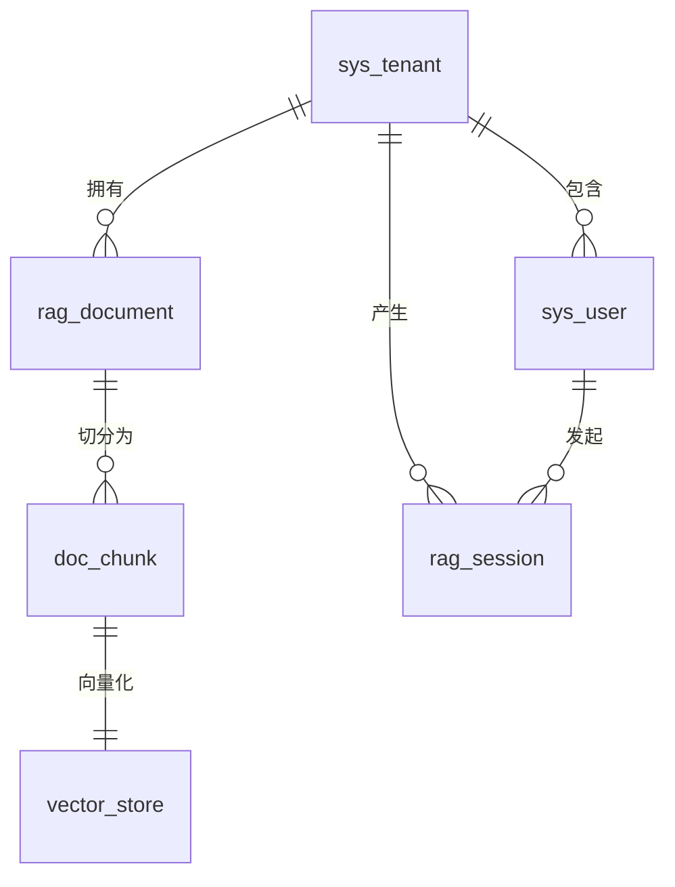

# 数据模型

**本文档引用的文件**
- [Tenant.java](../../../company-rag-tenant/src/main/java/com/company/rag/tenant/model/Tenant.java)
- [User.java](../../../company-rag-tenant/src/main/java/com/company/rag/tenant/model/User.java)
- [Document.java](../../../company-rag-document/src/main/java/com/company/rag/document/entity/Document.java)
- [RagSession.java](../../../company-rag-rag/src/main/java/com/company/rag/rag/entity/RagSession.java)
- [init.sql](../../../sql/init.sql)
- [项目概述.md](../../../.gientech/wiki/项目概述.md)
- [架构总览.md](../../../.gientech/wiki/架构总览.md)

## 目录
1. [引言](#引言)
2. [核心领域实体](#核心领域实体)
   1. [租户模型](#租户模型)
   2. [文档模型](#文档模型)
   3. [RAG 模型](#rag 模型)
   4. [公共模型](#公共模型)
3. [实体关系](#实体关系)
4. [数据库 Schema 概览](#数据库 schema 概览)
5. [数据验证与业务规则](#数据验证与业务规则)
6. [数据访问模式与性能考虑](#数据访问模式与性能考虑)
7. [结论](#结论)

## 引言

### 文档目的与范围

本文档描述 CompanyRag 企业知识库 RAG 系统的完整数据模型架构，涵盖租户模型、文档模型、RAG 模型和公共模型四大领域。系统采用 PostgreSQL 16 + PGVector 作为数据存储方案，通过 Schema 物理隔离实现多租户数据隔离。

### 系统概述

CompanyRag 是一个基于 Spring Boot 3.4 + Spring AI 1.0 的企业级检索增强生成系统，支持文档解析、智能切分、向量化存储、混合检索、重排序与流式回答等完整 RAG 链路。数据模型设计遵循以下核心原则：

1. **多租户隔离**：Schema 物理隔离 + 行级安全（RLS），支持 admin/user/viewer 三种角色
2. **向量存储优化**：PGVector 扩展，HNSW 索引，1024 维向量，余弦距离算法
3. **全文检索增强**：pg_trgm 扩展支持模糊匹配，GIN 索引加速关键词检索
4. **审计字段统一**：所有实体包含创建时间、更新时间等审计字段

### 主要实体简介

| 实体类别 | 实体名称 | 对应表名 | 所属 Schema |
|---------|---------|---------|------------|
| 租户模型 | Tenant | sys_tenant | public |
| 租户模型 | User | sys_user | public |
| 文档模型 | Document | rag_document | tenant_{code} |
| 文档模型 | DocChunk | doc_chunk | tenant_{code} |
| RAG 模型 | VectorStore | vector_store | tenant_{code} |
| RAG 模型 | RagSession | rag_session | tenant_{code} |

### 文档结构说明

本文档按照四大领域模型组织：租户模型（多租户架构核心）、文档模型（知识入库流程）、RAG 模型（检索与会话）、公共模型（跨领域通用设计）。每个实体包含字段定义、索引设计、数据访问模式说明。

## 核心领域实体

### 租户模型

租户模型位于 `public` Schema，负责管理系统级租户信息和用户账户，实现多租户架构的基础数据隔离。

#### Tenant（租户）

**用途与业务含义**：租户实体对应 `sys_tenant` 表，每个租户代表一个独立的企业或组织，拥有独立的 Schema 空间用于存储业务数据。来源：[Tenant.java](../../../company-rag-tenant/src/main/java/com/company/rag/tenant/model/Tenant.java)

**字段定义与约束**
- **id** (BIGINT): 主键，自增序列
- **tenant_code** (VARCHAR(64)): 租户编码，唯一标识，NOT NULL UNIQUE
- **tenant_name** (VARCHAR(128)): 租户名称，NOT NULL
- **schema_name** (VARCHAR(64)): 独立 Schema 名称（Schema 隔离模式）
- **status** (INTEGER): 状态，0-禁用 1-启用，DEFAULT 1
- **contact_name** (VARCHAR(64)): 联系人姓名
- **contact_phone** (VARCHAR(20)): 联系电话
- **create_time** (TIMESTAMP): 创建时间，DEFAULT CURRENT_TIMESTAMP
- **update_time** (TIMESTAMP): 更新时间，DEFAULT CURRENT_TIMESTAMP

**索引：**
- 主键索引：`PRIMARY KEY (id)`
- 唯一索引：`UNIQUE (tenant_code)`

**数据访问：**
- Repository 模式：通过 MyBatis-Plus 的 BaseMapper<Tenant> 实现 CRUD
- 服务层：`TenantService` 负责租户管理业务逻辑
- 主要操作：创建租户、启用/禁用租户、分配 Schema

#### User（用户）

**用途与业务含义**：用户实体对应 `sys_user` 表，多租户共享表结构，通过 `tenant_id` 字段实现逻辑隔离。来源：[User.java](../../../company-rag-tenant/src/main/java/com/company/rag/tenant/model/User.java)

**字段定义与约束**
- **id** (BIGINT): 主键，自增序列
- **tenant_id** (BIGINT): 租户 ID，外键引用 `sys_tenant(id)`，NOT NULL
- **username** (VARCHAR(64)): 用户名，NOT NULL
- **password** (VARCHAR(256)): 密码（BCrypt 加密），NOT NULL
- **display_name** (VARCHAR(128)): 显示名称
- **email** (VARCHAR(128)): 邮箱地址
- **role** (VARCHAR(32)): 角色，admin / user / viewer，DEFAULT 'user'
- **status** (INTEGER): 状态，DEFAULT 1
- **create_time** (TIMESTAMP): 创建时间，DEFAULT CURRENT_TIMESTAMP
- **update_time** (TIMESTAMP): 更新时间，DEFAULT CURRENT_TIMESTAMP

**索引：**
- 主键索引：`PRIMARY KEY (id)`
- 唯一索引：`UNIQUE(tenant_id, username)`
- 普通索引：`INDEX idx_user_tenant ON sys_user(tenant_id)`

**数据访问：**
- Repository 模式：通过 MyBatis-Plus 的 BaseMapper<User> 实现 CRUD
- 服务层：`UserService` 负责用户管理、权限验证
- 主要操作：创建用户、登录认证、角色分配、权限检查

### 文档模型

文档模型位于各租户独立的 `tenant_{code}` Schema，负责管理知识文档的全生命周期，包括上传、解析、切分、向量化等流程。

#### Document（文档）

**用途与业务含义**：文档实体对应 `rag_document` 表，记录上传文档的元数据信息和处理状态。来源：[Document.java](../../../company-rag-document/src/main/java/com/company/rag/document/entity/Document.java)、[init.sql](../../../sql/init.sql)

**字段定义与约束**
- **id** (BIGINT): 主键，自增序列
- **tenant_id** (BIGINT): 租户 ID，NOT NULL
- **file_name** (VARCHAR(256)): 原始文件名，NOT NULL
- **file_type** (VARCHAR(32)): 文件类型，pdf / docx / txt / md / html
- **file_size** (BIGINT): 文件大小（字节）
- **file_path** (VARCHAR(512)): 存储路径
- **title** (VARCHAR(256)): 文档标题
- **chunk_count** (INTEGER): 切分后的块数，DEFAULT 0
- **status** (INTEGER): 处理状态，-1-失败 0-待处理 1-已切分 2-已向量，DEFAULT 0
- **error_msg** (TEXT): 错误信息
- **create_time** (TIMESTAMP): 创建时间，DEFAULT CURRENT_TIMESTAMP
- **update_time** (TIMESTAMP): 更新时间，DEFAULT CURRENT_TIMESTAMP

**索引：**
- 主键索引：`PRIMARY KEY (id)`
- 普通索引：`INDEX idx_doc_tenant ON rag_document(tenant_id)`
- GIN 索引：`INDEX idx_document_title_trgm ON rag_document USING gin (title gin_trgm_ops)`（模糊搜索）

**数据访问：**
- Repository 模式：通过 MyBatis-Plus 的 BaseMapper<Document> 实现 CRUD
- 服务层：`DocumentService` 负责文档上传、解析、状态管理
- 主要操作：上传文档、触发解析、查询文档列表、删除文档

#### DocChunk（文档切分块）

**用途与业务含义**：文档切分块实体对应 `doc_chunk` 表，存储文档经过语义切分后的文本块，是向量化和检索的基本单位。来源：[init.sql](../../../sql/init.sql)

**字段定义与约束**
- **id** (BIGINT): 主键，自增序列
- **document_id** (BIGINT): 所属文档 ID，外键引用 `rag_document(id) ON DELETE CASCADE`，NOT NULL
- **tenant_id** (BIGINT): 租户 ID，NOT NULL
- **chunk_index** (INTEGER): 切分块索引，NOT NULL
- **content** (TEXT): 切分块文本内容，NOT NULL
- **token_count** (INTEGER): Token 数量，DEFAULT 0
- **split_strategy** (VARCHAR(32)): 切分策略，semantic / sliding / fixed
- **create_time** (TIMESTAMP): 创建时间，DEFAULT CURRENT_TIMESTAMP

**索引：**
- 主键索引：`PRIMARY KEY (id)`
- 普通索引：`INDEX idx_chunk_document ON doc_chunk(document_id)`
- 复合索引：`INDEX idx_chunk_document_tenant ON doc_chunk(tenant_id, document_id)`
- GIN 索引：`INDEX idx_chunk_content_trgm ON doc_chunk USING gin (content gin_trgm_ops)`（全文检索）

**数据访问：**
- Repository 模式：通过 MyBatis-Plus 的 BaseMapper<DocChunk> 实现 CRUD
- 服务层：`DocumentSplitService` 负责切分策略执行
- 主要操作：按文档查询切分块、按内容检索、批量插入

### RAG 模型

RAG 模型位于各租户独立的 `tenant_{code}` Schema，负责管理向量存储、检索会话和问答历史。

#### VectorStore（向量存储）

**用途与业务含义**：向量存储实体对应 `vector_store` 表，使用 PGVector 扩展存储文档切分块的向量表示，支持高效的相似度检索。来源：[init.sql](../../../sql/init.sql)

**字段定义与约束**
- **id** (UUID): 主键，UUID 类型
- **content** (TEXT): 原始文本内容（冗余存储，便于返回）
- **metadata** (JSONB): 元数据信息（文档 ID、切分索引、租户 ID 等）
- **embedding** (vector(1024)): 1024 维向量，使用 `text-embedding-v3` 模型生成

**索引：**
- 主键索引：`PRIMARY KEY (id)`
- HNSW 索引：`INDEX idx_vector_store_embedding ON vector_store USING hnsw (embedding vector_cosine_ops) WITH (m = 16, ef_construction = 64)`

**数据访问：**
- 访问方式：Spring AI VectorStore 接口
- 主要操作：相似度搜索（cosine distance）、批量插入向量、删除向量
- 性能参数：HNSW 索引 m=16, ef_construction=64，平衡检索速度与准确率

#### RagSession（RAG 会话）

**用途与业务含义**：RAG 会话实体对应 `rag_session` 表，记录用户与系统的问答交互历史，用于会话上下文管理和效果分析。来源：[RagSession.java](../../../company-rag-rag/src/main/java/com/company/rag/rag/entity/RagSession.java)、[init.sql](../../../sql/init.sql)

**字段定义与约束**
- **id** (BIGINT): 主键，自增序列
- **session_id** (VARCHAR(128)): 会话 ID，NOT NULL
- **tenant_id** (BIGINT): 租户 ID，NOT NULL
- **user_id** (BIGINT): 用户 ID
- **query** (TEXT): 用户提问内容，NOT NULL
- **answer** (TEXT): 模型回答内容
- **context** (TEXT): 检索到的上下文（用于溯源）
- **tokens_input** (INTEGER): 输入 Token 数，DEFAULT 0
- **tokens_output** (INTEGER): 输出 Token 数，DEFAULT 0
- **latency_ms** (INTEGER): 响应延迟（毫秒），DEFAULT 0
- **create_time** (TIMESTAMP): 创建时间，DEFAULT CURRENT_TIMESTAMP

**索引：**
- 主键索引：`PRIMARY KEY (id)`
- 复合索引：`INDEX idx_session_tenant ON rag_session(tenant_id, session_id)`

**数据访问：**
- Repository 模式：通过 MyBatis-Plus 的 BaseMapper<RagSession> 实现 CRUD
- 服务层：`RagSessionService` 负责会话管理、历史记录查询
- 主要操作：创建会话、追加问答记录、查询历史会话、统计指标

### 公共模型

公共模型指跨所有领域实体的通用设计规范和字段约定。

#### 审计字段规范

所有实体表都包含以下审计字段，用于数据追踪和版本管理：

- **create_time** (TIMESTAMP): 记录创建时间，DEFAULT CURRENT_TIMESTAMP
- **update_time** (TIMESTAMP): 记录最后更新时间，DEFAULT CURRENT_TIMESTAMP（部分表包含）

来源：[init.sql](../../../sql/init.sql) 中所有表定义

#### 租户隔离字段

所有业务表（位于 `tenant_{code}` Schema）都包含：

- **tenant_id** (BIGINT): 租户 ID，用于行级安全策略（RLS）

来源：[init.sql](../../../sql/init.sql) 业务表模板

## 实体关系

### 关系概述

系统实体关系设计遵循以下原则：

1. **租户 - 用户一对多**：一个租户可包含多个用户
2. **租户 - 文档一对多**：一个租户可上传多个文档
3. **文档 - 切分块一对多**：一个文档切分为多个块
4. **切分块 - 向量一对一**：每个切分块对应一个向量（冗余存储）
5. **租户 - 会话一对多**：一个租户可产生多个会话记录

### ER 图



### 外键约束说明

| 外键 | 引用表 | 约束类型 | 删除行为 |
|-----|--------|---------|---------|
| sys_user.tenant_id | sys_tenant.id | NOT NULL | RESTRICT |
| rag_document.tenant_id | sys_tenant.id | NOT NULL | RESTRICT |
| doc_chunk.document_id | rag_document.id | NOT NULL | CASCADE |
| doc_chunk.tenant_id | sys_tenant.id | NOT NULL | RESTRICT |
| rag_session.tenant_id | sys_tenant.id | NOT NULL | RESTRICT |
| rag_session.user_id | sys_user.id | NULL | SET NULL |

来源：[init.sql](../../../sql/init.sql)

## 数据库 Schema 概览

### Schema 架构设计

系统采用 PostgreSQL Schema 实现多租户物理隔离：

1. **public Schema**：存放系统级表（租户、用户）
2. **tenant_{code} Schema**：每个租户独立的业务 Schema，包含文档、切分块、向量、会话表

来源：[init.sql](../../../sql/init.sql) 设计说明

### 表数量统计

| Schema 类型 | 表数量 | 表名列表 |
|------------|-------|---------|
| public | 2 | sys_tenant, sys_user |
| tenant_{code} | 4 | rag_document, doc_chunk, vector_store, rag_session |
| 总计 | 6（每租户） | - |

### 扩展依赖

系统依赖以下 PostgreSQL 扩展：

- **vector**：PGVector 扩展，提供向量存储和相似度检索能力
- **pg_trgm**：三元组扩展，提供模糊匹配和全文检索能力

来源：[init.sql](../../../sql/init.sql) L11-L12

### 行级安全策略（RLS）

所有业务表启用行级安全，通过 `current_tenant_id()` 函数实现租户隔离：

```sql
ALTER TABLE rag_document ENABLE ROW LEVEL SECURITY;
ALTER TABLE doc_chunk ENABLE ROW LEVEL SECURITY;
ALTER TABLE rag_session ENABLE ROW LEVEL SECURITY;

CREATE POLICY tenant_isolation_document ON rag_document
    USING (tenant_id = current_tenant_id() OR current_user = 'postgres');
```

来源：[init.sql](../../../sql/init.sql) L112-L122

### 数据库迁移脚本

初始化脚本位于 `sql/init.sql`，包含：
- 扩展创建
- public Schema 表定义
- 业务表模板（用于动态创建租户 Schema）
- 索引定义
- RLS 策略定义
- 默认数据插入（默认租户、管理员用户）
- RLS 辅助函数（`set_tenant_id`、`current_tenant_id`）

来源：[init.sql](../../../sql/init.sql)

## 数据验证与业务规则

### 字段级验证规则

#### 必填字段
- **Tenant**: tenant_code, tenant_name
- **User**: tenant_id, username, password
- **Document**: tenant_id, file_name
- **DocChunk**: document_id, tenant_id, chunk_index, content
- **VectorStore**: embedding
- **RagSession**: session_id, tenant_id, query

#### 数据格式要求
- **tenant_code**: 字母数字组合，最大 64 字符
- **username**: 字母数字下划线，最大 64 字符
- **email**: 标准邮箱格式，最大 128 字符
- **file_type**: 枚举值 pdf/docx/txt/md/html
- **role**: 枚举值 admin/user/viewer

#### 长度限制
- **file_name**: VARCHAR(256)
- **file_path**: VARCHAR(512)
- **content**: TEXT（无限制）
- **embedding**: vector(1024) 固定 1024 维

### 实体级业务规则

#### 唯一性约束
- **Tenant**: tenant_code 全局唯一
- **User**: (tenant_id, username) 组合唯一
- **DocChunk**: (document_id, chunk_index) 组合唯一（隐含）

#### 状态转换规则
**Document 状态机**：
```
0-待处理 → 1-处理中 → 2-已完成
                ↘ 3-失败
```
- 状态 0（待处理）：文档上传完成，等待解析
- 状态 1（处理中）：正在解析或切分
- 状态 2（已完成）：解析、切分、向量化全部完成
- 状态 3（失败）：处理失败，error_msg 记录原因

来源：[Document.java](../../../company-rag-document/src/main/java/com/company/rag/document/entity/Document.java) L23

#### 关联数据完整性规则
- 删除文档时，级联删除对应的切分块（`ON DELETE CASCADE`）
- 删除租户时，禁止删除（RESTRICT），需先清理所有关联数据

### 跨实体业务规则

#### 级联操作规则
- **文档删除**：删除 Document 时，自动删除所有关联的 DocChunk 和 VectorStore 记录
- **租户禁用**：禁用 Tenant 时，自动禁用该租户下所有 User

#### 引用完整性约束
- 所有业务表的 tenant_id 必须存在于 sys_tenant 表
- DocChunk 的 document_id 必须存在于 rag_document 表
- RagSession 的 user_id（可选）必须存在于 sys_user 表

## 数据访问模式与性能考虑

### 查询优化

#### 常用查询模式
1. **租户隔离查询**：所有查询自动附加 `tenant_id = ?` 条件（MyBatis-Plus 拦截器）
2. **向量相似度检索**：`ORDER BY embedding <-> ? LIMIT topK`（HNSW 索引）
3. **关键词模糊搜索**：`WHERE content ILIKE '%keyword%'`（GIN trgm 索引）
4. **文档列表分页**：`WHERE tenant_id = ? ORDER BY create_time DESC LIMIT ? OFFSET ?`

#### 索引使用建议
- **向量检索**：使用 HNSW 索引，设置 `ef_search` 参数平衡速度与准确率
- **模糊搜索**：使用 GIN trgm 索引，适用于 `LIKE '%keyword%'` 查询
- **复合查询**：优先使用 (tenant_id, xxx) 复合索引

#### 分页策略
- 文档列表、会话历史采用游标分页（基于 create_time）
- 向量检索结果采用 LIMIT topK（通常 topK=10）

### 缓存策略

#### 可缓存数据类型
- **热点文档元数据**：Redis 缓存，TTL 30 分钟
- **RAG 问答结果**：Redis 缓存（query 为 key），TTL 24 小时
- **用户会话信息**：Redis 缓存，TTL 2 小时

来源：[项目概述.md](../../../.gientech/wiki/项目概述.md) L209-L211

#### 缓存失效策略
- 文档更新/删除时，清除对应缓存
- 用户权限变更时，清除用户相关缓存
- 使用 Redisson 实现分布式锁，防止缓存击穿

### 并发控制

#### 乐观锁/悲观锁使用场景
- **乐观锁**：Document 状态更新（version 字段，MyBatis-Plus 自动管理）
- **悲观锁**：租户 Schema 创建（分布式锁，防止重复创建）

#### 事务隔离级别
- 默认使用 PostgreSQL 的 READ COMMITTED 隔离级别
- 文档解析流程使用 REPEATABLE READ，确保切分一致性
- 跨表操作（如创建租户 + 创建 Schema）使用显式事务

### 性能优化实践

1. **批量插入**：DocChunk 和 VectorStore 采用批量插入（每批次 100 条）
2. **异步处理**：文档解析、向量化采用异步任务（@Async）
3. **连接池优化**：HikariCP 配置最大连接数 20，最小空闲连接数 5
4. **向量索引参数**：HNSW m=16, ef_construction=64，平衡内存与检索速度

来源：[项目概述.md](../../../.gientech/wiki/项目概述.md) L194-L202

## 结论

### 数据模型核心特点

CompanyRag 的数据模型设计具有以下核心特点：

1. **多租户物理隔离**：通过 PostgreSQL Schema 实现租户间数据完全隔离，配合行级安全策略（RLS）提供双重保障
2. **向量化原生支持**：PGVector 扩展提供 1024 维向量存储，HNSW 索引支持高效相似度检索
3. **全文检索增强**：pg_trgm 扩展 + GIN 索引支持模糊匹配和关键词检索
4. **审计追踪完善**：所有实体包含时间戳字段，支持数据变更追踪
5. **级联关系清晰**：文档→切分块→向量的级联删除关系明确，避免脏数据

### 扩展性考虑

数据模型设计预留了以下扩展点：

1. **新文件类型**：file_type 字段支持扩展新的文档格式
2. **切分策略**：split_strategy 字段支持多种切分算法并存
3. **多模型支持**：VectorStore 的 metadata 字段（JSONB）可存储不同 embedding 模型的元数据
4. **多角色权限**：role 字段支持扩展新的用户角色

### 维护建议

1. **定期清理**：定期归档历史会话记录（rag_session），控制表大小
2. **索引维护**：定期执行 `REINDEX` 和 `VACUUM ANALYZE` 维护索引性能
3. **向量索引调优**：根据数据量调整 HNSW 参数（m, ef_construction, ef_search）
4. **监控告警**：通过 Prometheus 监控慢查询、连接池使用率、向量检索延迟

### 相关文档链接

- [租户模型.md](./租户模型.md) — 租户模型详细说明
- [文档模型.md](./文档模型.md) — 文档模型详细说明
- [RAG 模型.md](./RAG 模型.md) — RAG 模型详细说明
- [数据库 Schema 与迁移.md](./数据库 Schema 与迁移.md) — Schema 设计与迁移脚本说明
- [架构总览.md](../../../.gientech/wiki/架构总览.md) — 系统架构总览
- [项目概述.md](../../../.gientech/wiki/项目概述.md) — 项目整体介绍

---

*文档版本：1.0 | 最后更新：2026-07-19*
