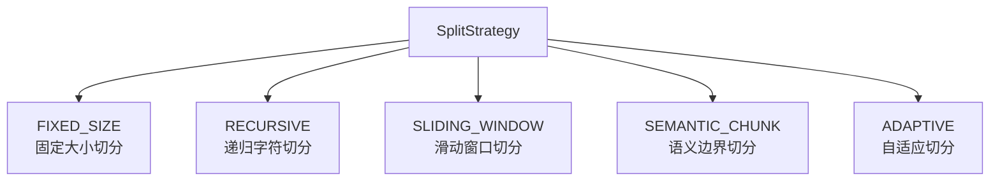
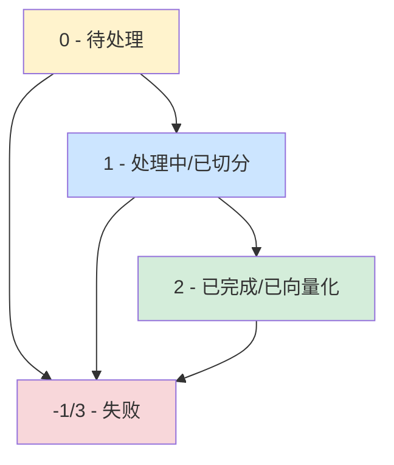
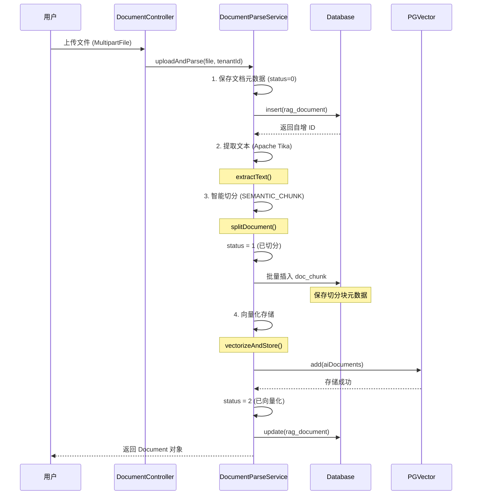

# 文档模型 (Document Model)

**本文档引用的文件**
- [Document.java](../../../company-rag-document/src/main/java/com/company/rag/document/entity/Document.java)
- [DocumentChunk.java](../../../company-rag-document/src/main/java/com/company/rag/document/entity/DocumentChunk.java)
- [SplitStrategy.java](../../../company-rag-document/src/main/java/com/company/rag/document/splitter/SplitStrategy.java)
- [DocumentParseServiceImpl.java](../../../company-rag-document/src/main/java/com/company/rag/document/service/impl/DocumentParseServiceImpl.java)
- [init.sql](../../../sql/init.sql)

## 目录
1. [简介](#简介)
2. [核心实体](#核心实体)
3. [切分策略](#切分策略)
4. [状态流转](#状态流转)
5. [数据库表结构](#数据库表结构)
6. [业务流程](#业务流程)

## 简介

文档模型是 CompanyRAG 系统的核心数据模型，负责管理企业文档的上传、解析、切分、向量化存储等全生命周期。该模型包含两个核心实体：

- **Document（文档元数据）**：存储文档的基本信息、处理状态和统计信息
- **DocumentChunk（文档切分块）**：存储文档切分后的文本块及其元数据

文档处理完整流程：文档上传 → 文本提取 → 智能切分 → 保存切分块 → 向量化存储 → 更新状态。

**本节来源** - [DocumentParseServiceImpl.java](../../../company-rag-document/src/main/java/com/company/rag/document/service/impl/DocumentParseServiceImpl.java)(L26-L36)

## 核心实体

### Document 实体

文档元数据实体，对应数据库表 `rag_document`。

| 字段名 | 类型 | 描述 |
|-------|------|------|
| id | Long | 主键，自增 |
| tenantId | Long | 租户 ID（多租户隔离） |
| fileName | String | 原始文件名 |
| fileType | String | 文件类型（pdf/docx/txt/md/html） |
| fileSize | Long | 文件大小（字节） |
| filePath | String | 存储路径 |
| title | String | 文档标题 |
| chunkCount | Integer | 切分后的块数 |
| status | Integer | 处理状态（见状态流转章节） |
| errorMsg | String | 失败时的错误信息 |
| createTime | LocalDateTime | 创建时间 |
| updateTime | LocalDateTime | 更新时间 |

**本节来源** - [Document.java](../../../company-rag-document/src/main/java/com/company/rag/document/entity/Document.java)(L1-L29)

### DocumentChunk 实体

文档切分块实体，对应数据库表 `doc_chunk`。

| 字段名 | 类型 | 描述 |
|-------|------|------|
| id | Long | 主键，自增 |
| documentId | Long | 关联的文档 ID（外键） |
| tenantId | Long | 租户 ID（多租户隔离） |
| chunkIndex | Integer | 块序号（从 0 开始） |
| content | String | 块文本内容（TEXT 类型） |
| tokenCount | Integer | Token 数量（用于成本统计） |
| splitStrategy | String | 使用的切分策略名称 |
| createTime | LocalDateTime | 创建时间 |

**本节来源** - [DocumentChunk.java](../../../company-rag-document/src/main/java/com/company/rag/document/entity/DocumentChunk.java)(L1-L24)

### 实体关系

- **一对多关系**：一个 Document 对应多个 DocumentChunk
- **租户隔离**：两个实体都包含 `tenantId` 字段，通过行级安全策略（RLS）实现数据隔离
- **级联删除**：`doc_chunk.document_id` 外键设置 `ON DELETE CASCADE`，删除文档时自动删除关联的切分块

## 切分策略

系统支持 5 种文档切分策略，通过 `SplitStrategy` 枚举定义。



**图示来源** - [SplitStrategy.java](../../../company-rag-document/src/main/java/com/company/rag/document/splitter/SplitStrategy.java)(L6-L12)

### 策略详解

#### 1. FIXED_SIZE（固定大小切分）

按固定字符数切分，无重叠。实现简单，适合对上下文要求不高的场景。

- **特点**：基础方案，按固定字符数切分
- **安全限制**：400 字符 < 512 tokens，防止 token 超限
- **Token 估算**：中文约 1.5 字/token，英文约 4 字符/token

**本节来源** - [FixedSizeSplitter.java](../../../company-rag-document/src/main/java/com/company/rag/document/splitter/FixedSizeSplitter.java)(L9-L57)

#### 2. SLIDING_WINDOW（滑动窗口切分）

通过重叠窗口保留上下文边界信息，减少信息断裂。继承自 FixedSizeSplitter。

- **特点**：带重叠的改进方案
- **重叠量**：默认 64 字符
- **句子边界**：优先在 `.!?\n\r` 处断开，保持语义完整

**本节来源** - [SlidingWindowSplitter.java](../../../company-rag-document/src/main/java/com/company/rag/document/splitter/SlidingWindowSplitter.java)(L9-L72)

#### 3. SEMANTIC_CHUNK（语义边界切分）

按 Markdown 标题、段落、代码块等语义边界递归切分（RSE 风格 - Recursive Semantic Embedding）。

- **特点**：保留文档层级结构，提升检索相关性
- **两阶段切分**：
  1. 第一阶段：按语义边界粗切（标题、代码块、空行分隔的段落）
  2. 第二阶段：对过长的段落实行滑动窗口细切
- **安全边界**：在句子边界处断开，确保不超过最大字符数限制

**本节来源** - [SemanticChunkSplitter.java](../../../company-rag-document/src/main/java/com/company/rag/document/splitter/SemanticChunkSplitter.java)(L11-L181)

#### 4. RECURSIVE（递归字符切分）

按字符递归切分，在固定大小切分基础上增加递归逻辑。

#### 5. ADAPTIVE（自适应切分）

根据内容类型自动选择切分策略。

### 切分器接口

所有切分器实现 `DocumentSplitter` 接口：

```java
public interface DocumentSplitter {
    /**
     * 将文本切分为块
     * @param text 原始文本
     * @param chunkSize 块大小（字符数或 Token 数）
     * @param chunkOverlap 块重叠
     * @return 切分结果
     */
    List<DocumentChunk> split(String text, int chunkSize, int chunkOverlap);
    
    /**
     * 获取切分策略
     */
    SplitStrategy getStrategy();
}
```

**本节来源** - [DocumentSplitter.java](../../../company-rag-document/src/main/java/com/company/rag/document/splitter/DocumentSplitter.java)(L6-L24)

### 默认配置

系统默认使用 **SEMANTIC_CHUNK（语义边界切分）** 策略：

- **Chunk 大小**：512 字符
- **重叠大小**：64 字符
- **安全限制**：单个 chunk 不超过 400 字符（防止 token 超限）

**本节来源** - [DocumentParseServiceImpl.java](../../../company-rag-document/src/main/java/com/company/rag/document/service/impl/DocumentParseServiceImpl.java)(L156-L175)

## 状态流转

文档处理状态通过 `status` 字段管理，完整状态机如下：



### 状态说明

| 状态码 | 状态名称 | 说明 |
|-------|---------|------|
| 0 | 待处理 | 文档已上传，等待处理 |
| 1 | 处理中/已切分 | 文档正在处理或已完成切分 |
| 2 | 已完成/已向量化 | 文档已完成向量化存储 |
| -1/3 | 失败 | 处理失败，errorMsg 记录错误信息 |

**本节来源** - [Document.java](../../../company-rag-document/src/main/java/com/company/rag/document/entity/Document.java)(L23)

### 状态流转过程

1. **上传阶段**：`status = 0`（待处理）
2. **文本提取**：`status = 0` → 保持待处理
3. **文档切分**：`status = 0` → `status = 1`（已切分）
4. **向量化存储**：`status = 1` → `status = 2`（已向量化）
5. **异常处理**：任意阶段失败 → `status = -1`，记录 errorMsg

**本节来源** - [DocumentParseServiceImpl.java](../../../company-rag-document/src/main/java/com/company/rag/document/service/impl/DocumentParseServiceImpl.java)(L50-L98)

## 数据库表结构

### rag_document 表

```sql
CREATE TABLE rag_document (
    id BIGSERIAL PRIMARY KEY,
    tenant_id BIGINT NOT NULL,
    file_name VARCHAR(256) NOT NULL,
    file_type VARCHAR(32),
    file_size BIGINT,
    file_path VARCHAR(512),
    title VARCHAR(256),
    chunk_count INTEGER DEFAULT 0,
    status INTEGER DEFAULT 0,            -- -1 失败 0 待处理 1 已切分 2 已向量化
    error_msg TEXT,
    create_time TIMESTAMP DEFAULT CURRENT_TIMESTAMP,
    update_time TIMESTAMP DEFAULT CURRENT_TIMESTAMP
);
```

**索引**：
- `idx_doc_tenant ON rag_document(tenant_id)` - 租户查询优化
- `idx_document_title_trgm` - 标题全文检索（GIN 索引）

**行级安全策略**：
```sql
ALTER TABLE rag_document ENABLE ROW LEVEL SECURITY;
CREATE POLICY tenant_isolation_document ON rag_document
    USING (tenant_id = current_tenant_id() OR current_user = 'postgres');
```

**本节来源** - [init.sql](../../../sql/init.sql)(L50-L64, L105, L110, L113-L118)

### doc_chunk 表

```sql
CREATE TABLE doc_chunk (
    id BIGSERIAL PRIMARY KEY,
    document_id BIGINT NOT NULL REFERENCES rag_document(id) ON DELETE CASCADE,
    tenant_id BIGINT NOT NULL,
    chunk_index INTEGER NOT NULL,
    content TEXT NOT NULL,
    token_count INTEGER DEFAULT 0,
    split_strategy VARCHAR(32),
    create_time TIMESTAMP DEFAULT CURRENT_TIMESTAMP
);
```

**索引**：
- `idx_chunk_document ON doc_chunk(document_id)` - 文档关联查询
- `idx_chunk_document_tenant ON doc_chunk(tenant_id, document_id)` - 租户 + 文档联合查询
- `idx_chunk_content_trgm` - 内容全文检索（GIN 索引）

**行级安全策略**：
```sql
ALTER TABLE doc_chunk ENABLE ROW LEVEL SECURITY;
CREATE POLICY tenant_isolation_chunk ON doc_chunk
    USING (tenant_id = current_tenant_id() OR current_user = 'postgres');
```

**本节来源** - [init.sql](../../../sql/init.sql)(L66-L76, L106-L107, L109, L114, L119-L120)

### vector_store 表（PGVector）

```sql
CREATE TABLE vector_store (
    id UUID PRIMARY KEY,
    content TEXT,
    metadata JSONB,
    embedding vector(1024)
);
CREATE INDEX idx_vector_store_embedding ON vector_store
    USING hnsw (embedding vector_cosine_ops)
    WITH (m = 16, ef_construction = 64);
```

**元数据字段**：
- `documentId`：关联的文档 ID
- `tenantId`：租户 ID
- `documentName`：文档名称
- `chunkIndex`：块序号
- `chunkId`：切分块的数据库 ID

**本节来源** - [init.sql](../../../sql/init.sql)(L78-L87)

## 业务流程

### 文档上传与处理流程



**图示来源** - [DocumentParseServiceImpl.java](../../../company-rag-document/src/main/java/com/company/rag/document/service/impl/DocumentParseServiceImpl.java)(L48-L98)

### 关键实现细节

#### 1. 事务管理

使用 `@Transactional(rollbackFor = Exception.class)` 确保文档处理全过程的原子性。

#### 2. 文本提取

使用 Apache Tika 自动检测文件类型并提取文本，支持 PDF、DOCX、TXT、MD、HTML 等格式。

对于 TXT 文件，增加提取率检测：如果提取率 < 80%，尝试使用 UTF-8 直接读取。

**本节来源** - [DocumentParseServiceImpl.java](../../../company-rag-document/src/main/java/com/company/rag/document/service/impl/DocumentParseServiceImpl.java)(L101-L142)

#### 3. 向量化 ID 生成

Spring AI 的 PgVectorStore 要求 Document ID 必须是 UUID 格式：

- 使用 `UUID.randomUUID()` 生成独立的向量存储 ID
- `chunk.getId()` 是数据库自增 ID，仅用于数据库内部关联查询

**本节来源** - [DocumentParseServiceImpl.java](../../../company-rag-document/src/main/java/com/company/rag/document/service/impl/DocumentParseServiceImpl.java)(L184-L210)

#### 4. Token 估算

采用混合估算策略：
- 中文字符：约 1.5 字/token
- ASCII 字符：约 4 字符/token

公式：`tokens = chineseCount / 1.5 + asciiCount / 4.0 + 1`

**本节来源** - [FixedSizeSplitter.java](../../../company-rag-document/src/main/java/com/company/rag/document/splitter/FixedSizeSplitter.java)(L47-L56)

## 结论

文档模型是 CompanyRAG 系统的核心数据模型，具有以下设计特点：

1. **双实体设计**：Document 管理元数据，DocumentChunk 管理切分内容，职责清晰
2. **多租户隔离**：通过 `tenant_id` 字段和行级安全策略实现物理隔离
3. **灵活切分**：支持 5 种切分策略，默认使用语义边界切分提升检索质量
4. **状态机管理**：清晰的状态流转机制，支持失败重试和错误追踪
5. **向量混合存储**：PGVector 存储向量，关系表存储元数据，兼顾检索性能和查询灵活性

该模型为企业级 RAG 系统提供了可靠的文档管理基础，支持大规模文档的智能处理和检索。
