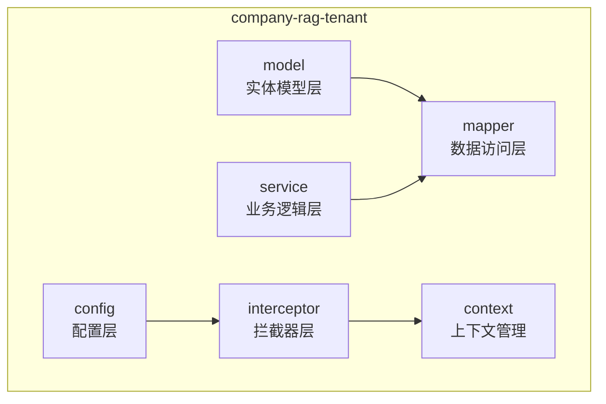
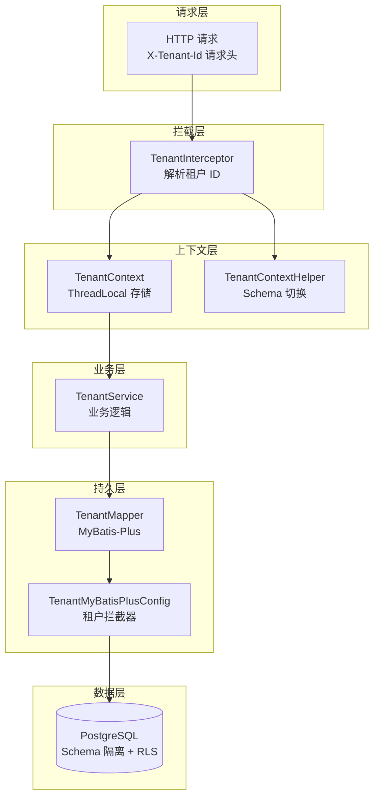
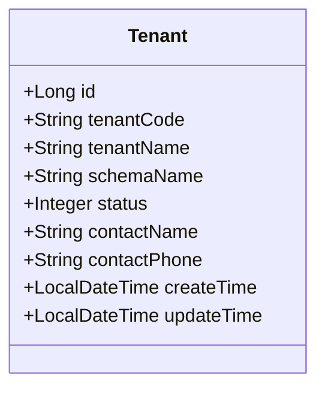
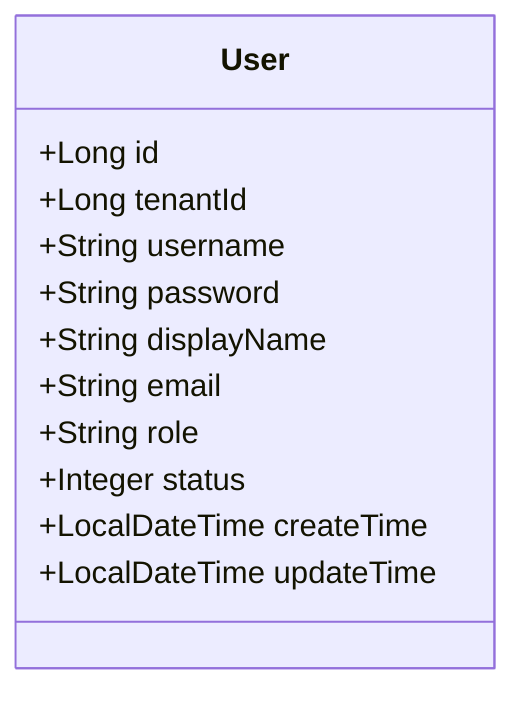
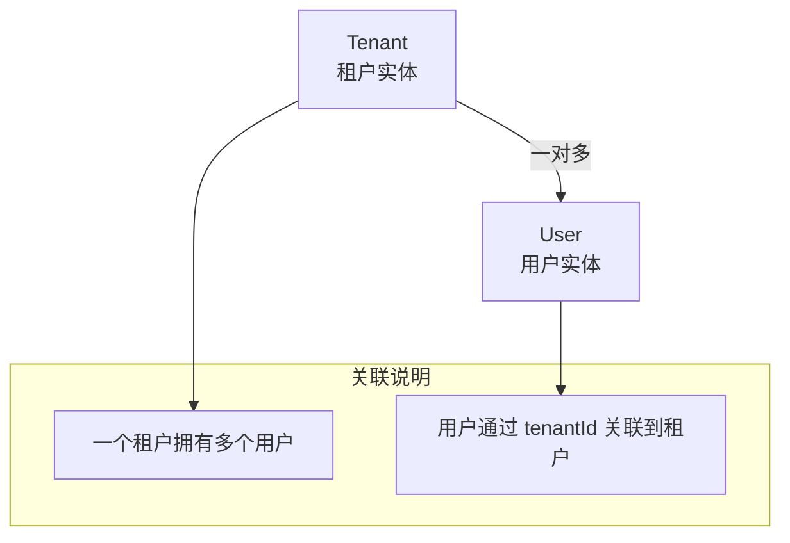
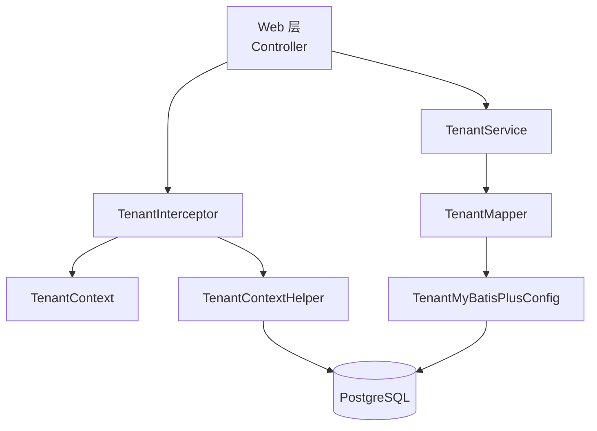
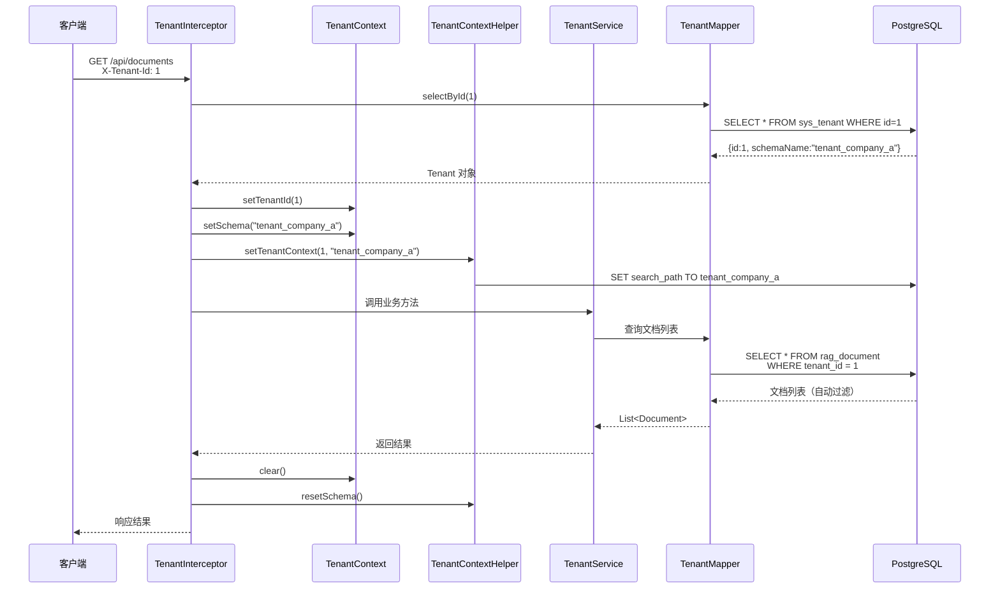

# 租户模型 (Tenant Model)

**本文档引用的文件**
- [Tenant.java](../../../company-rag-tenant/src/main/java/com/company/rag/tenant/model/Tenant.java)
- [User.java](../../../company-rag-tenant/src/main/java/com/company/rag/tenant/model/User.java)
- [TenantDTO.java](../../../company-rag-tenant/src/main/java/com/company/rag/tenant/model/dto/TenantDTO.java)
- [TenantService.java](../../../company-rag-tenant/src/main/java/com/company/rag/tenant/service/TenantService.java)
- [TenantMapper.java](../../../company-rag-tenant/src/main/java/com/company/rag/tenant/mapper/TenantMapper.java)
- [TenantContext.java](../../../company-rag-tenant/src/main/java/com/company/rag/tenant/context/TenantContext.java)
- [TenantInterceptor.java](../../../company-rag-tenant/src/main/java/com/company/rag/tenant/interceptor/TenantInterceptor.java)
- [TenantMyBatisPlusConfig.java](../../../company-rag-tenant/src/main/java/com/company/rag/tenant/config/TenantMyBatisPlusConfig.java)
- [项目概述.md](./项目概述.md)

## 目录
1. [简介](#简介)
2. [项目结构](#项目结构)
3. [核心组件](#核心组件)
4. [架构概述](#架构概述)
5. [详细组件分析](#详细组件分析)
6. [依赖分析](#依赖分析)
7. [数据库表结构](#数据库表结构)
8. [业务规则](#业务规则)
9. [使用示例](#使用示例)
10. [性能考虑](#性能考虑)
11. [结论](#结论)

## 简介

租户模型是 CompanyRag 企业知识库 RAG 系统的核心基础模块，负责实现多租户数据隔离与权限管理。

- **核心作用**：
  - 提供租户（Tenant）和用户（User）两大实体的数据模型定义
  - 实现 Schema 物理隔离 + 行级安全（RLS）的双重隔离机制
  - 支持 admin、user、viewer 三种角色权限控制
  - 通过 ThreadLocal 上下文管理实现请求级的租户信息传递

- **隔离策略**：
  - **Schema 隔离**：每个租户拥有独立的数据库 Schema（如 `tenant_company_a`），实现数据物理隔离
  - **行级隔离**：通过 MyBatis-Plus 租户拦截器自动为查询追加 `tenant_id` 条件
  - **上下文管理**：使用 `TenantContext` 通过 ThreadLocal 存储当前请求的租户 ID、用户 ID 和 Schema 名称

- **章节来源** - [项目概述.md](./项目概述.md)(L28-L32)，[Tenant.java](../../../company-rag-tenant/src/main/java/com/company/rag/tenant/model/Tenant.java)(L8-L26)

## 项目结构

租户模块位于 `company-rag-tenant` 子模块，采用标准分层架构：



**图示来源** - [company-rag-tenant 目录结构](../../../company-rag-tenant/src/main/java/com/company/rag/tenant/)

**包结构说明**：

| 包名 | 职责 | 核心类 |
|------|------|--------|
| model | 实体模型定义 | Tenant、User、TenantDTO |
| mapper | MyBatis-Plus 数据访问接口 | TenantMapper、UserMapper |
| service | 业务逻辑接口与实现 | TenantService、TenantServiceImpl |
| config | 租户相关配置 | TenantMyBatisPlusConfig |
| context | 租户上下文管理 | TenantContext、TenantContextHelper |
| interceptor | 租户请求拦截器 | TenantInterceptor |

**章节来源** - [DirCache: company-rag-tenant](../../../company-rag-tenant/src/main/java/com/company/rag/tenant/)

## 核心组件

### 实体类

| 类名 | 职责 | 对应数据库表 |
|------|------|-------------|
| Tenant | 租户实体 | sys_tenant |
| User | 用户实体（多租户共享表） | sys_user |

### DTO 类

| 类名 | 职责 |
|------|------|
| TenantDTO.CreateRequest | 创建租户请求（含校验规则） |
| TenantDTO.TenantResponse | 租户响应（隐藏敏感字段） |

### 服务与数据访问

| 类名 | 类型 | 职责 |
|------|------|------|
| TenantService | 接口 | 租户业务逻辑接口 |
| TenantMapper | 接口 | 租户数据访问接口 |
| UserMapper | 接口 | 用户数据访问接口 |

### 上下文与拦截器

| 类名 | 职责 |
|------|------|
| TenantContext | 使用 ThreadLocal 存储当前请求的租户 ID、用户 ID、租户编码和 Schema 名称 |
| TenantContextHelper | 租户上下文辅助类，负责 PostgreSQL Schema 切换和 RLS 变量设置 |
| TenantInterceptor | 从请求头解析租户信息并注入上下文，同时完成 Schema 切换 |

### 配置类

| 类名 | 职责 |
|------|------|
| TenantMyBatisPlusConfig | MyBatis-Plus 多租户插件配置，自动为查询追加 tenant_id 条件 |

**章节来源** - [Tenant.java](../../../company-rag-tenant/src/main/java/com/company/rag/tenant/model/Tenant.java)，[User.java](../../../company-rag-tenant/src/main/java/com/company/rag/tenant/model/User.java)，[TenantDTO.java](../../../company-rag-tenant/src/main/java/com/company/rag/tenant/model/dto/TenantDTO.java)

## 架构概述

租户模型采用分层架构，结合拦截器与上下文管理实现透明的多租户隔离：



**图示来源** - [TenantInterceptor.java](../../../company-rag-tenant/src/main/java/com/company/rag/tenant/interceptor/TenantInterceptor.java)(L20-L74)，[TenantMyBatisPlusConfig.java](../../../company-rag-tenant/src/main/java/com/company/rag/tenant/config/TenantMyBatisPlusConfig.java)(L16-L42)

**架构说明**：
1. **请求拦截**：`TenantInterceptor` 从请求头 `X-Tenant-Id` 解析租户 ID
2. **上下文注入**：将租户 ID、用户 ID 存入 `TenantContext` 的 ThreadLocal
3. **Schema 切换**：通过 `TenantContextHelper` 设置 PostgreSQL 的 search_path
4. **自动过滤**：MyBatis-Plus 租户拦截器自动为 SQL 追加 `tenant_id` 条件
5. **数据隔离**：PostgreSQL Schema 物理隔离 + 行级安全（RLS）双重保障

## 详细组件分析

### Tenant 实体

**实体字段表格**

| 字段名 | 类型 | 描述 |
|-------|------|------|
| id | Long | 主键，自增 |
| tenantCode | String | 租户编码（唯一标识） |
| tenantName | String | 租户名称 |
| schemaName | String | 独立 Schema 名称（Schema 隔离模式） |
| status | Integer | 状态：0-禁用，1-启用 |
| contactName | String | 联系人姓名 |
| contactPhone | String | 联系电话 |
| createTime | LocalDateTime | 创建时间（自动填充） |
| updateTime | LocalDateTime | 更新时间（自动填充） |

**类图**



**图示来源** - [Tenant.java](../../../company-rag-tenant/src/main/java/com/company/rag/tenant/model/Tenant.java)(L11-L26)

### User 实体

**实体字段表格**

| 字段名 | 类型 | 描述 |
|-------|------|------|
| id | Long | 主键，自增 |
| tenantId | Long | 所属租户 ID（外键） |
| username | String | 用户名（登录账号） |
| password | String | 密码（加密存储） |
| displayName | String | 显示名称 |
| email | String | 邮箱 |
| role | String | 角色：admin / user / viewer |
| status | Integer | 状态 |
| createTime | LocalDateTime | 创建时间（自动填充） |
| updateTime | LocalDateTime | 更新时间（自动填充） |

**类图**



**图示来源** - [User.java](../../../company-rag-tenant/src/main/java/com/company/rag/tenant/model/User.java)(L11-L27)

### TenantDTO 数据传输对象

**CreateRequest 字段表格**

| 字段名 | 类型 | 校验规则 | 描述 |
|-------|------|----------|------|
| tenantCode | String | @NotBlank, @Size(2-64), @Pattern | 租户编码，只能包含字母、数字和下划线，且不能以数字开头 |
| tenantName | String | @NotBlank, @Size(2-128) | 租户名称 |
| contactName | String | - | 联系人姓名 |
| contactPhone | String | @Pattern(^1[3-9]\d{9}$) | 手机号（可选） |

**TenantResponse 字段表格**

| 字段名 | 类型 | 描述 |
|-------|------|------|
| id | Long | 租户 ID |
| tenantCode | String | 租户编码 |
| tenantName | String | 租户名称 |
| schemaName | String | Schema 名称 |
| status | Integer | 状态 |
| contactName | String | 联系人姓名 |
| contactPhone | String | 联系电话 |
| createTime | String | 创建时间（字符串格式） |

**图示来源** - [TenantDTO.java](../../../company-rag-tenant/src/main/java/com/company/rag/tenant/model/dto/TenantDTO.java)(L17-L48)

### TenantService 服务接口

**核心方法**

| 方法签名 | 职责 |
|---------|------|
| `Tenant getByCode(String tenantCode)` | 根据租户编码查询租户 |
| `Tenant getById(Long id)` | 根据租户 ID 查询租户 |
| `void createTenantSchema(Tenant tenant)` | 为租户创建独立的 Schema |
| `List<User> getUsersByTenant(Long tenantId)` | 获取指定租户下的所有用户 |
| `Tenant createTenantWithSchema(Tenant tenant)` | 创建租户并初始化 Schema 和默认管理员用户 |
| `List<Tenant> getAllTenants()` | 获取所有租户列表 |

**图示来源** - [TenantService.java](../../../company-rag-tenant/src/main/java/com/company/rag/tenant/service/TenantService.java)(L11-L33)

## 依赖分析

### 实体间关联关系



**图示来源** - [Tenant.java](../../../company-rag-tenant/src/main/java/com/company/rag/tenant/model/Tenant.java)(L16)，[User.java](../../../company-rag-tenant/src/main/java/com/company/rag/tenant/model/User.java)(L16)

### 组件依赖关系



**图示来源** - [TenantInterceptor.java](../../../company-rag-tenant/src/main/java/com/company/rag/tenant/interceptor/TenantInterceptor.java)(L20-L74)

## 数据库表结构

### sys_tenant 租户表

```sql
CREATE TABLE sys_tenant (
    id BIGSERIAL PRIMARY KEY,                    -- 主键，自增
    tenant_code VARCHAR(64) NOT NULL UNIQUE,     -- 租户编码（唯一）
    tenant_name VARCHAR(128) NOT NULL,           -- 租户名称
    schema_name VARCHAR(64),                     -- 独立 Schema 名称
    status SMALLINT NOT NULL DEFAULT 1,          -- 状态：0-禁用，1-启用
    contact_name VARCHAR(64),                    -- 联系人姓名
    contact_phone VARCHAR(20),                   -- 联系电话
    create_time TIMESTAMP NOT NULL DEFAULT CURRENT_TIMESTAMP,  -- 创建时间
    update_time TIMESTAMP NOT NULL DEFAULT CURRENT_TIMESTAMP   -- 更新时间
);

-- 索引
CREATE INDEX idx_sys_tenant_code ON sys_tenant(tenant_code);
CREATE INDEX idx_sys_tenant_status ON sys_tenant(status);
```

**图示来源** - [Tenant.java](../../../company-rag-tenant/src/main/java/com/company/rag/tenant/model/Tenant.java)(L14-L25)

### sys_user 用户表

```sql
CREATE TABLE sys_user (
    id BIGSERIAL PRIMARY KEY,                    -- 主键，自增
    tenant_id BIGINT NOT NULL,                   -- 所属租户 ID（外键）
    username VARCHAR(64) NOT NULL,               -- 用户名（登录账号）
    password VARCHAR(255) NOT NULL,              -- 密码（加密存储）
    display_name VARCHAR(64),                    -- 显示名称
    email VARCHAR(128),                          -- 邮箱
    role VARCHAR(20) NOT NULL DEFAULT 'user',    -- 角色：admin / user / viewer
    status SMALLINT NOT NULL DEFAULT 1,          -- 状态
    create_time TIMESTAMP NOT NULL DEFAULT CURRENT_TIMESTAMP,  -- 创建时间
    update_time TIMESTAMP NOT NULL DEFAULT CURRENT_TIMESTAMP   -- 更新时间
);

-- 索引
CREATE INDEX idx_sys_user_tenant_id ON sys_user(tenant_id);
CREATE INDEX idx_sys_user_username ON sys_user(username);
CREATE INDEX idx_sys_user_role ON sys_user(role);

-- 外键约束
ALTER TABLE sys_user ADD CONSTRAINT fk_user_tenant 
    FOREIGN KEY (tenant_id) REFERENCES sys_tenant(id);
```

**图示来源** - [User.java](../../../company-rag-tenant/src/main/java/com/company/rag/tenant/model/User.java)(L14-L26)

## 业务规则

### 租户隔离机制

- **Schema 隔离流程**：
  1. 请求到达时，`TenantInterceptor` 从请求头 `X-Tenant-Id` 解析租户 ID
  2. 查询 `sys_tenant` 表获取租户的 `schemaName`
  3. 通过 `TenantContextHelper` 设置 PostgreSQL 的 `search_path` 到对应 Schema
  4. 后续所有数据库操作自动在指定 Schema 下执行

- **行级安全（RLS）流程**：
  1. MyBatis-Plus 租户拦截器自动为 SQL 追加 `WHERE tenant_id = ?` 条件
  2. `sys_tenant` 表被配置为忽略租户隔离（允许跨租户查询）
  3. 其他表（如 `sys_user`）自动应用租户过滤

- **上下文清理**：
  - 请求完成后，`afterCompletion` 方法调用 `TenantContext.clear()` 和 `tenantContextHelper.resetSchema()`
  - 防止 ThreadLocal 内存泄漏和租户信息污染

### 角色权限规则

| 角色 | 权限说明 |
|------|----------|
| admin | 租户管理员，可管理租户下所有资源和用户 |
| user | 普通用户，可上传文档、发起检索、管理自己的会话 |
| viewer | 只读用户，仅可查看文档和发起检索 |

**章节来源** - [User.java](../../../company-rag-tenant/src/main/java/com/company/rag/tenant/model/User.java)(L21)，[TenantInterceptor.java](../../../company-rag-tenant/src/main/java/com/company/rag/tenant/interceptor/TenantInterceptor.java)(L26-L73)

### 租户创建流程

```mermaid
flowchart TD
    START[开始] --> VALIDATE[校验租户编码和名称]
    VALIDATE --> CHECK[检查租户编码是否已存在]
    CHECK -->|已存在 | ERROR[返回错误：租户编码已存在]
    CHECK -->|不存在 | CREATE[创建租户记录]
    CREATE --> GEN_SCHEMA[生成 Schema 名称：tenant_{tenantCode}]
    GEN_SCHEMA --> EXEC_SQL[执行 CREATE SCHEMA 语句]
    EXEC_SQL --> INIT_TABLES[在新 Schema 下初始化业务表]
    INIT_TABLES --> CREATE_ADMIN[创建默认管理员用户]
    CREATE_ADMIN --> UPDATE_SCHEMA[更新租户记录的 schemaName 字段]
    UPDATE_SCHEMA --> SUCCESS[返回租户信息]
```

**图示来源** - [TenantService.java](../../../company-rag-tenant/src/main/java/com/company/rag/tenant/service/TenantService.java)(L20-L27)，[TenantDTO.java](../../../company-rag-tenant/src/main/java/com/company/rag/tenant/model/dto/TenantDTO.java)(L17-L33)

## 使用示例

### 典型调用链路



**图示来源** - [TenantInterceptor.java](../../../company-rag-tenant/src/main/java/com/company/rag/tenant/interceptor/TenantInterceptor.java)(L26-L73)，[TenantContext.java](../../../company-rag-tenant/src/main/java/com/company/rag/tenant/context/TenantContext.java)(L13-L27)

### 代码示例

**创建租户**

```java
// 构建创建请求
TenantDTO.CreateRequest request = new TenantDTO.CreateRequest();
request.setTenantCode("company_a");
request.setTenantName("公司 A");
request.setContactName("张三");
request.setContactPhone("13800138000");

// 调用服务创建租户
Tenant tenant = tenantService.createTenantWithSchema(request);
```

**获取当前租户上下文**

```java
// 在业务代码中获取当前租户 ID
Long tenantId = TenantContext.getTenantId();

// 获取当前租户 Schema
String schema = TenantContext.getSchema();

// 获取当前用户 ID
Long userId = TenantContext.getUserId();
```

**章节来源** - [TenantDTO.java](../../../company-rag-tenant/src/main/java/com/company/rag/tenant/model/dto/TenantDTO.java)(L17-L33)，[TenantContext.java](../../../company-rag-tenant/src/main/java/com/company/rag/tenant/context/TenantContext.java)(L13-L20)

## 性能考虑

### 上下文管理优化

- **ThreadLocal 复用**：使用 ThreadLocal 存储租户上下文，避免在方法参数中传递租户信息
- **及时清理**：请求完成后必须调用 `TenantContext.clear()` 和 `tenantContextHelper.resetSchema()`，防止线程池复用导致的数据污染
- **轻量级操作**：上下文设置和获取操作均为 O(1) 时间复杂度

### Schema 切换性能

- **连接池感知**：`TenantContextHelper` 使用 HikariCP 连接池，每次 Schema 切换需要获取新连接
- **优化策略**：
  - 同一租户的请求尽量路由到同一应用实例（会话粘滞）
  - 对于高频访问的租户，可考虑使用连接池 Schema 缓存
  - 避免在单次请求中频繁切换 Schema

### 查询过滤性能

- **索引优化**：
  - `sys_user(tenant_id)` 建立索引，加速租户用户查询
  - `sys_tenant(tenant_code)` 建立唯一索引，加速租户编码查找
- **MyBatis-Plus 自动过滤**：租户拦截器自动为 SQL 追加 `tenant_id` 条件，无需手动编写过滤逻辑

**章节来源** - [TenantContext.java](../../../company-rag-tenant/src/main/java/com/company/rag/tenant/context/TenantContext.java)(L22-L27)，[TenantMyBatisPlusConfig.java](../../../company-rag-tenant/src/main/java/com/company/rag/tenant/config/TenantMyBatisPlusConfig.java)(L22-L38)

## 结论

租户模型是 CompanyRag 多租户架构的核心基础，具有以下设计特点：

1. **双重隔离机制**：
   - Schema 物理隔离：每个租户拥有独立的数据库 Schema，数据完全隔离
   - 行级安全（RLS）：通过 MyBatis-Plus 拦截器自动追加 `tenant_id` 过滤条件

2. **透明的上下文管理**：
   - 使用 ThreadLocal 实现请求级租户信息传递
   - 拦截器自动解析请求头并注入上下文，业务代码无感知

3. **完善的权限模型**：
   - 支持 admin、user、viewer 三种角色
   - 角色权限在业务层进行校验和控制

4. **自动化 Schema 初始化**：
   - 创建租户时自动创建 Schema 并初始化业务表
   - 自动创建默认管理员用户

5. **工程化保障**：
   - 请求完成后自动清理上下文，防止内存泄漏
   - Schema 切换对连接池友好，避免资源浪费

租户模型的设计确保了多租户场景下的数据安全性、隔离性和可维护性，为企业级知识库系统提供了坚实的基础。

**章节来源** - [项目概述.md](./项目概述.md)(L28-L32)，[TenantInterceptor.java](../../../company-rag-tenant/src/main/java/com/company/rag/tenant/interceptor/TenantInterceptor.java)(L13-L19)
