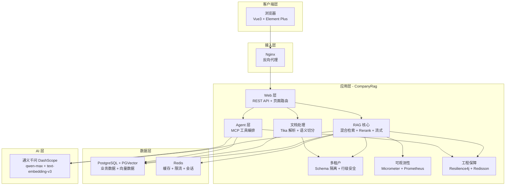
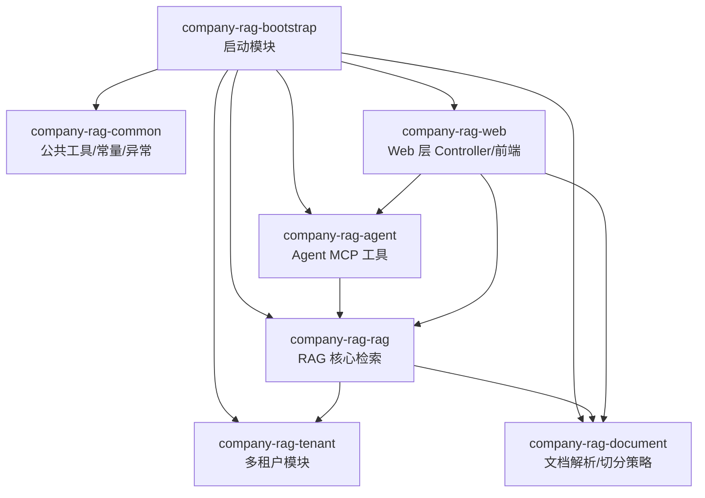

# 架构总览

## 系统概览

CompanyRag 是一个企业级知识库检索增强生成 (RAG) 系统，基于 Spring Boot 3.4 + Spring AI 1.0 构建，采用 Maven 多模块架构。系统提供文档解析、智能切分、向量化存储、混合检索、重排序与流式回答等完整 RAG 链路能力。

**核心定位**：
- 多租户架构：Schema 物理隔离 + 行级安全，支持 admin/user/viewer 三种角色
- 完整 RAG 流水线：文档解析 → 语义切分 → 向量化 → 混合检索 → Rerank → 流式回答
- Agent 能力：基于 MCP 协议的工具编排，支持数据库查询、代码检索和 API 文档生成
- 生产级工程保障：Resilience4j 熔断限流、两级缓存策略、Prometheus 可观测性

**技术栈**：
- 框架：Spring Boot 3.4.4 + Spring AI 1.0.4
- 数据库：PostgreSQL 16 + PGVector（HNSW 索引，1024 维，余弦距离）
- 缓存：Redis（Redisson 3.40.2）
- ORM：MyBatis-Plus 3.5.9
- AI 模型：通义千问 qwen-max（Chat） + text-embedding-v3（Embedding）
- 文档解析：Apache Tika 3.1.0
- 熔断限流：Resilience4j 2.2.0
- 可观测性：Micrometer + Prometheus + Grafana
- 前端：Vue3 + Element Plus（CDN 嵌入）
- 部署：Docker Compose

来源：[README.md](../../README.md)、[pom.xml](../../pom.xml)、[CompanyRagApplication.java](../../company-rag-bootstrap/src/main/java/com/company/rag/bootstrap/CompanyRagApplication.java)

## 顶层架构图

说明：
- 架构图展示了系统的分层结构，自顶向下分为客户端层、接入层、应用层、数据层和 AI 层
- 应用层内部模块依赖关系：Web 层依赖 RAG 核心、Agent 层和文档处理模块
- RAG 核心和 Agent 层都依赖多租户模块和工程保障模块
- 数据来源：[ARCHITECTURE.md](../../ARCHITECTURE.md)、[README.md](../../README.md)

## 顶层模块

项目采用 Maven 多模块架构，各模块职责清晰，依赖方向严格遵循分层原则。

| 模块 | 职责 | 依赖 |
|------|------|------|
| [company-rag-common](../../company-rag-common/) | 公共模块：常量定义、异常体系、统一响应模型 `R<T>`、公共配置 | 无内部依赖 |
| [company-rag-tenant](../../company-rag-tenant/) | 多租户模块：租户上下文管理、Schema 隔离拦截器、权限控制 | common |
| [company-rag-document](../../company-rag-document/) | 文档模块：Apache Tika 解析、三种切分策略（固定大小/滑动窗口/语义切分） | common |
| [company-rag-rag](../../company-rag-rag/) | RAG 核心：混合检索、Cross-Encoder Rerank、两级缓存、Prompt 管理、可观测性指标 | document + tenant + common |
| [company-rag-agent](../../company-rag-agent/) | Agent 模块：MCP 工具编排（数据库查询/代码检索/API 文档生成） | rag + common |
| [company-rag-web](../../company-rag-web/) | Web 层：REST API 控制器、Thymeleaf 页面路由 | rag + agent + document + common |
| [company-rag-bootstrap](../../company-rag-bootstrap/) | 启动模块：全局配置、Bean 注册、应用入口 | 所有模块 |

来源：[pom.xml](../../pom.xml)、[README.md](../../README.md)(L217-L243)、[boundaries.md](../../.gientech/harness/boundaries.md)

### 模块依赖关系图

来源：[项目概述.md](../../.gientech/wiki/项目概述.md)

## 关键边界

### 模块职责边界

根据模块边界定义，各模块的职责和不允许的行为如下：

1. **company-rag-common**
   - 职责：常量定义、异常体系、统一响应模型、公共配置
   - 不允许：依赖任何其他 company-rag 模块、包含业务逻辑
   - 关键产出：`R<T>`、`BizException`、`GlobalExceptionHandler`、`RagConstant`

2. **company-rag-tenant**
   - 职责：多租户上下文管理、Schema 隔离拦截器、权限控制
   - 不允许：直接访问 Document/RAG/Agent 业务逻辑
   - 关键产出：租户上下文 Holder、MyBatis-Plus 租户拦截器

3. **company-rag-document**
   - 职责：文档解析（Tika）、三种切分策略
   - 不允许：调用 RAG 检索逻辑、直接调用 AI 模型
   - 关键产出：`DocumentParseService`、`SplitStrategy` 枚举

4. **company-rag-rag**
   - 职责：混合检索、Cross-Encoder Rerank、两级缓存、Prompt 管理、可观测性指标
   - 不允许：依赖 agent 模块、直接操作 Web 层对象
   - 关键产出：`RagSearchService`、`RagCacheManager`、`RerankService`、`RagMetrics`

5. **company-rag-agent**
   - 职责：MCP 工具编排、数据库 NL 查询、代码检索、API 文档生成
   - 不允许：直接暴露 HTTP 接口、依赖 web 模块
   - 关键产出：`DatabaseQueryTool`、`CodeSearchTool`、`ApiDocTool`、`AgentToolRegistry`

6. **company-rag-web**
   - 职责：REST API 控制器、Thymeleaf 页面路由
   - 不允许：包含业务逻辑（仅做参数校验和路由转发）
   - 关键产出：5 个 Controller 类

7. **company-rag-bootstrap**
   - 职责：全局配置、Bean 注册、应用入口
   - 不允许：包含业务代码（仅配置和启动逻辑）

来源：[boundaries.md](../../.gientech/harness/boundaries.md)

### 外部依赖边界

| 外部系统 | 访问方式 | 配置位置 | 熔断保护 |
|---------|---------|---------|---------|
| PostgreSQL + PGVector | Spring Data + MyBatis-Plus | application.yml datasource | 连接池 Hikari |
| Redis | Redisson Client | application.yml redis | Redisson 自带重试 |
| 通义千问 DashScope | Spring AI OpenAI 兼容模式 | application.yml ai.openai | Resilience4j CircuitBreaker |
| Prometheus | Micrometer + Actuator | application.yml management | 无（监控系统） |

来源：[boundaries.md](../../.gientech/harness/boundaries.md)、[application.yml](../../company-rag-bootstrap/src/main/resources/application.yml)

## 主要链路

### RAG 检索链路

用户提问 → 前端请求 → REST API → 检查缓存（命中则直接返回） → 向量检索 (topK=10) + 关键词融合 → Cross-Encoder Rerank(topK=5) → 构建 Prompt → 调用通义千问 qwen-max → 缓存结果 + 记录指标 → 返回流式/JSON 响应。

核心服务：
- [RagSearchService.java](../../company-rag-rag/src/main/java/com/company/rag/rag/service/RagSearchService.java)：核心检索编排
- [RagCircuitBreakerConfig.java](../../company-rag-rag/src/main/java/com/company/rag/rag/service/RagCircuitBreakerConfig.java)：熔断配置（滑动窗口 10，失败率 50%，恢复等待 30 秒）
- 限流配置：每租户每秒 10 次请求，超时 500ms

来源：[README.md](../../README.md)(L55-L61)、[application.yml](../../company-rag-bootstrap/src/main/resources/application.yml)(L64-L77)

### 多租户数据隔离链路

系统采用 Schema 物理隔离策略：
- 每个租户独立 Schema（如 `tenant_company_a`、`tenant_company_b`）
- 公共 Schema（`public`）下存放 `sys_tenant`、`sys_user` 等公共表
- 启动时自动检查并为未初始化 Schema 的租户创建 Schema
- MyBatis-Plus 租户拦截器自动追加 `tenant_id` 条件

来源：[ARCHITECTURE.md](../../ARCHITECTURE.md)(L87-L113)、[CompanyRagApplication.java](../../company-rag-bootstrap/src/main/java/com/company/rag/bootstrap/CompanyRagApplication.java)(L35-L72)

### 文档切分策略

系统提供三种切分策略：

| 策略 | 原理 | 适用场景 | Token 利用率 |
|------|------|---------|------------|
| 语义切分 (RSE 风格) | 按 Markdown 标题/段落边界递归切分 | 结构化文档 (技术文档/手册) | ⭐⭐⭐⭐⭐ |
| 滑动窗口 | 固定大小 + 重叠 + 句边界感知 | 通用文本 | ⭐⭐⭐⭐ |
| 固定大小 | 按字符数切分 | 无结构文本 | ⭐⭐⭐ |

核心实现：
- [SemanticChunkSplitter.java](../../company-rag-document/src/main/java/com/company/rag/document/splitter/SemanticChunkSplitter.java)：语义边界切分
- [SlidingWindowSplitter.java](../../company-rag-document/src/main/java/com/company/rag/document/splitter/SlidingWindowSplitter.java)：滑动窗口切分
- [FixedSizeSplitter.java](../../company-rag-document/src/main/java/com/company/rag/document/splitter/FixedSizeSplitter.java)：固定大小切分

来源：[README.md](../../README.md)(L63-L69)

### Agent 工具链路

Agent 模块提供三个核心工具：
- **DatabaseQueryTool**：通过自然语言查询业务数据库
- **CodeSearchTool**：在项目源码中搜索代码片段
- **ApiDocTool**：动态扫描 Spring 端点生成 API 文档
- **AgentToolRegistry**：工具注册与编排

来源：[DirCache: company-rag-agent/tool](../../company-rag-agent/src/main/java/com/company/rag/agent/tool/)

## 建议阅读顺序

### 入门路径
1. [项目概述.md](../../.gientech/wiki/项目概述.md) — 了解项目整体定位、核心特性与技术栈
2. [README.md](../../README.md) — 快速开始指南、API 文档与部署说明
3. [ARCHITECTURE.md](../../ARCHITECTURE.md) — 系统架构图与多租户数据隔离架构

### 深入理解
4. [boundaries.md](../../.gientech/harness/boundaries.md) — 模块边界定义与外部依赖边界
5. [conventions.md](../../.gientech/harness/conventions.md) — Java 编码风格、异常处理、日志规范
6. [api-contracts.md](../../.gientech/harness/api-contracts.md) — REST API 定义、请求/响应格式、错误码
7. [iron-rules.md](../../.gientech/harness/iron-rules.md) — 10 条硬性规则

### 设计文档
8. [DESIGN-PHILOSOPHY-v8.md](../../.gientech/docs/DESIGN-PHILOSOPHY-v8.md) — 设计哲学
9. [PACKAGE-DESIGN.md](../../.gientech/docs/PACKAGE-DESIGN.md) — 包结构设计
10. [PRACTICE-ROADMAP.md](../../.gientech/docs/PRACTICE-ROADMAP.md) — 实践路线图
11. [VERIFICATION-PROTOCOL.md](../../.gientech/docs/VERIFICATION-PROTOCOL.md) — 验证协议

### 源码阅读建议
- 入口：[CompanyRagApplication.java](../../company-rag-bootstrap/src/main/java/com/company/rag/bootstrap/CompanyRagApplication.java)
- 配置：[application.yml](../../company-rag-bootstrap/src/main/resources/application.yml)
- Web 层：[company-rag-web/src/main/java/com/company/rag/web/controller](../../company-rag-web/src/main/java/com/company/rag/web/controller/)
- RAG 核心：[company-rag-rag/src/main/java/com/company/rag/rag/service](../../company-rag-rag/src/main/java/com/company/rag/rag/service/)
- Agent 工具：[company-rag-agent/src/main/java/com/company/rag/agent/tool](../../company-rag-agent/src/main/java/com/company/rag/agent/tool/)
- 文档切分：[company-rag-document/src/main/java/com/company/rag/document/splitter](../../company-rag-document/src/main/java/com/company/rag/document/splitter/)

---

## 本文档引用的文件

- [README.md](../../README.md)
- [pom.xml](../../pom.xml)
- [ARCHITECTURE.md](../../ARCHITECTURE.md)
- [CompanyRagApplication.java](../../company-rag-bootstrap/src/main/java/com/company/rag/bootstrap/CompanyRagApplication.java)
- [application.yml](../../company-rag-bootstrap/src/main/resources/application.yml)
- [项目概述.md](../../.gientech/wiki/项目概述.md)
- [boundaries.md](../../.gientech/harness/boundaries.md)
- [company-rag-web 模块](../../company-rag-web/)
- [company-rag-agent 模块 tool 目录](../../company-rag-agent/src/main/java/com/company/rag/agent/tool/)
- [company-rag-rag 模块 service 目录](../../company-rag-rag/src/main/java/com/company/rag/rag/service/)
- [company-rag-document 模块 splitter 目录](../../company-rag-document/src/main/java/com/company/rag/document/splitter/)
