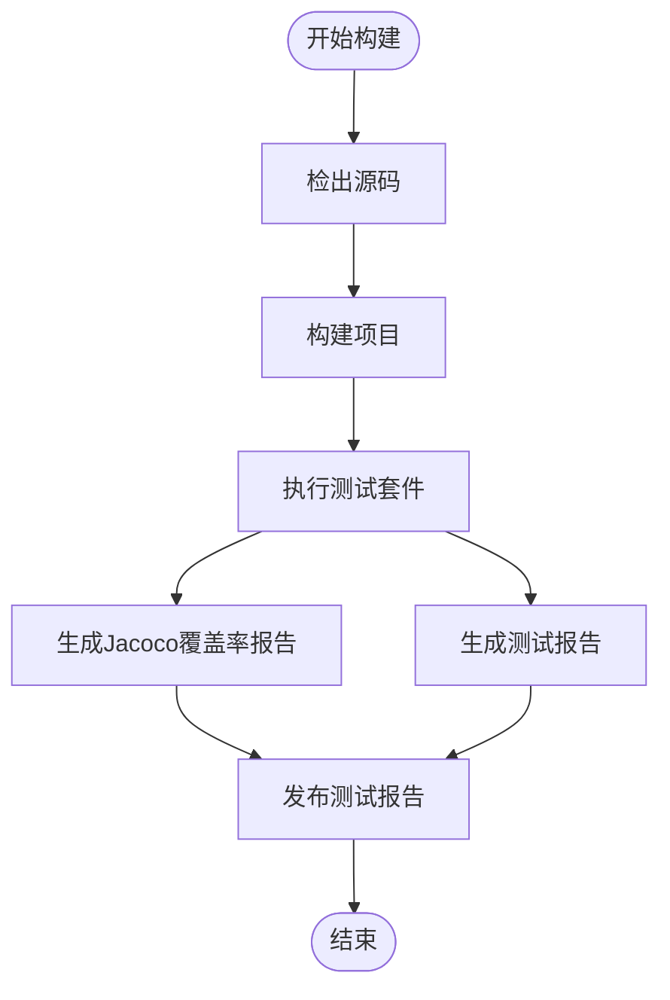

# 测试策略文档

**本文档中引用的文件**
- [README.md](../../README.md)
- [pom.xml](../../pom.xml)
- [docker-compose.yml](../../docker-compose.yml)
- [company-rag-bootstrap/pom.xml](../../company-rag-bootstrap/pom.xml)

## 目录
1. [项目概述](#项目概述)
2. [测试框架与工具](#测试框架与工具)
3. [持续集成与测试流程](#持续集成与测试流程)
4. [测试覆盖率与质量保证](#测试覆盖率与质量保证)
5. [总结](#总结)

## 项目概述

本项目是一个企业级知识库检索增强生成(RAG)系统，基于 Spring Boot 3.4 + Spring AI 1.0 + PGVector + 通义千问构建。项目采用 Maven 多模块架构，包含以下模块：

- **company-rag-common**: 公共模块（常量/异常/工具）
- **company-rag-tenant**: 多租户模块（上下文/拦截器/权限）
- **company-rag-document**: 文档模块（解析/切分策略）
- **company-rag-rag**: RAG核心（检索/Rerank/缓存/Prompt）
- **company-rag-agent**: Agent模块（MCP工具）
- **company-rag-web**: Web层（Controller + 前端页面）
- **company-rag-bootstrap**: 启动模块（配置/入口）

> 来源：[README.md](../../README.md)(L1-L4) - 项目概述与技术栈

## 测试框架与工具

### 核心测试框架

项目在 `company-rag-bootstrap` 模块中配置了 `spring-boot-starter-test` 依赖，该依赖包含以下核心测试框架：

1. **JUnit 5**: 主要的单元测试框架（Spring Boot 3.4 默认使用 JUnit 5）
2. **Mockito**: 模拟对象和行为测试
3. **Spring Boot Test**: Spring 应用测试支持
4. **Spring Test**: Spring 测试框架，支持集成测试和事务管理

**依赖配置来源**：[company-rag-bootstrap/pom.xml](../../company-rag-bootstrap/pom.xml)(L37-L41)

```xml
<dependency>
    <groupId>org.springframework.boot</groupId>
    <artifactId>spring-boot-starter-test</artifactId>
    <scope>test</scope>
</dependency>
```

> 注：`spring-boot-starter-test` 是 Spring Boot 提供的测试启动器，默认包含 JUnit 5、Mockito、AssertJ、Hamcrest、JSON Assert、Spring Test 等测试库。

### 当前测试状态

目前工程中各模块的测试目录结构如下：

| 模块 | 测试目录 | 测试文件 |
|------|---------|---------|
| company-rag-bootstrap | `src/test/java/` | 目录结构存在，暂无实际测试文件 |
| company-rag-common | 无 | - |
| company-rag-tenant | 无 | - |
| company-rag-document | 无 | - |
| company-rag-rag | 无 | - |
| company-rag-agent | 无 | - |
| company-rag-web | 无 | - |

> 来源：实际目录遍历结果 - 各模块 `src/test` 目录检查

## 持续集成与测试流程

### 构建与测试命令

项目使用 Maven 作为构建工具，当前构建命令如下：

```bash
# 编译项目（跳过测试）
mvn clean package -DskipTests
```

> 来源：[README.md](../../README.md)(L131) - 编译运行说明

### Docker 环境

项目通过 Docker Compose 管理基础设施服务，测试环境可复用以下服务：

```yaml
services:
  postgres:
    image: pgvector/pgvector:pg16
    ports:
      - "5432:5432"
  redis:
    image: redis:7-alpine
    ports:
      - "6379:6379"
```

> 来源：[docker-compose.yml](../../docker-compose.yml)(L3-L33) - 基础设施服务配置

### CI/CD 管道建议



**图表说明**：基于 Maven 构建流程与 `spring-boot-starter-test` 测试框架的 CI/CD 测试管道建议。

## 测试覆盖率与质量保证

### 覆盖率要求建议

基于项目技术栈与工程规范，建议设定以下覆盖率目标：

- 单元测试覆盖率 ≥ 80%（核心业务逻辑）
- 集成测试覆盖主要业务流程
- 关键模块（RAG检索、文档解析、Agent工具）需重点覆盖

### 代码质量工具建议

项目可集成以下代码质量工具：

- **Jacoco**: Java 代码覆盖率分析（Maven 原生支持）
- **Checkstyle**: Java 代码风格检查
- **SonarQube**: 综合代码质量分析

> 来源：[pom.xml](../../pom.xml)(L125-L158) - Maven 构建插件配置，可扩展集成质量工具

## 总结

本项目是一个基于 Spring Boot 3.4 + Spring AI 1.0 的企业知识库RAG系统，目前已在 `company-rag-bootstrap` 模块中配置了 `spring-boot-starter-test` 测试依赖，建立了测试目录结构骨架。

### 当前状态

1. **测试依赖已就绪**: `spring-boot-starter-test` 包含 JUnit 5、Mockito、Spring Test 等核心测试框架
2. **测试目录结构已建立**: `company-rag-bootstrap/src/test/java/` 目录已存在
3. **基础设施可复用**: Docker Compose 提供了 PostgreSQL 和 Redis 服务，可用于集成测试
4. **测试文件待补充**: 各模块尚未编写实际的测试用例

### 后续工作建议

1. **编写单元测试**: 为各模块的核心业务逻辑编写 JUnit 5 + Mockito 单元测试
2. **添加集成测试**: 基于 Spring Boot Test 和 Docker 基础设施编写集成测试
3. **配置代码覆盖率**: 集成 Jacoco 插件并设定覆盖率门禁
4. **建立 CI/CD 管道**: 将测试执行集成到持续集成流程中