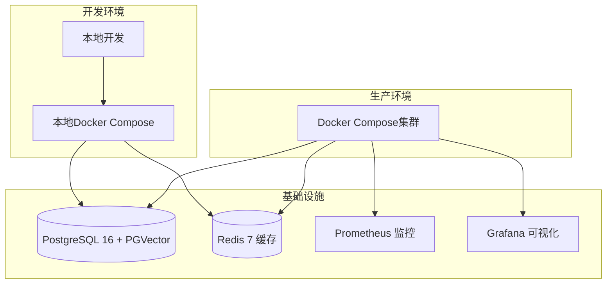
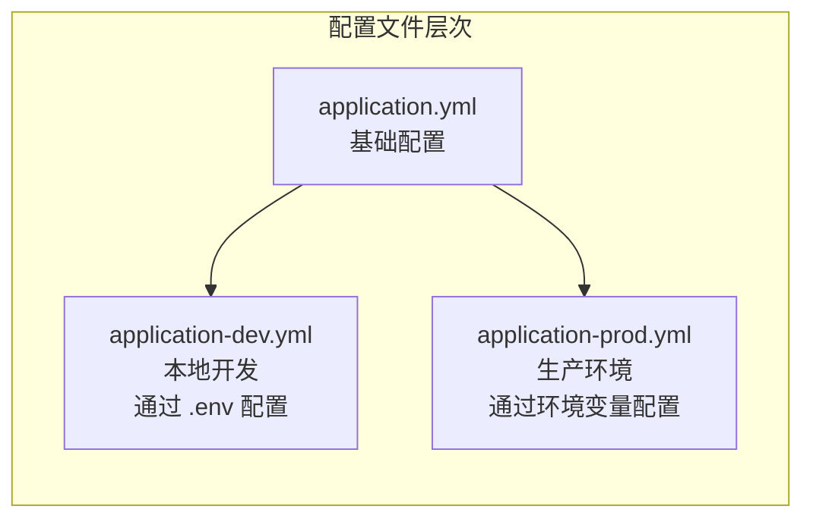

# 部署与运维指南

**本文档中引用的文件**
- [pom.xml](../../pom.xml)
- [README.md](../../README.md)
- [Dockerfile](../../Dockerfile)
- [docker-compose.yml](../../docker-compose.yml)
- [application.yml](../../company-rag-bootstrap/src/main/resources/application.yml)
- [prometheus.yml](../../prometheus.yml)
- [.env](../../.env)
- [sql/init.sql](../../sql/init.sql)
- [sql/README.md](../../sql/README.md)

## 目录
1. [概述](#概述)
2. [项目架构](#项目架构)
3. [Docker容器化部署](#docker容器化部署)
4. [环境配置管理](#环境配置管理)
5. [监控与日志](#监控与日志)
6. [健康检查机制](#健康检查机制)
7. [故障排查指南](#故障排查指南)
8. [运维最佳实践](#运维最佳实践)

## 概述

本指南详细介绍了 CompanyRag（企业知识库RAG系统）的部署与运维流程。该系统采用 Spring Boot 3.4.4 + Spring AI 1.0.4 构建，支持多环境部署（本地开发、生产环境），并集成了 Docker 容器化、Prometheus + Grafana 监控等 DevOps 工具链。

项目的核心特性包括：
- 基于 Spring Boot 3.4.4 + Java 17 的企业级应用架构
- 支持 PostgreSQL 16 + PGVector 向量数据库和 Redis 7 缓存的高可用配置
- 完整的 Docker Compose 容器化部署方案
- 多环境配置管理（通过 Spring Profile 切换）
- 自动化健康检查和 Prometheus 监控

## 项目架构



**图表来源**
- [README.md](../../README.md) - 系统架构说明
- [docker-compose.yml](../../docker-compose.yml) - 服务编排定义

## Docker容器化部署

### Docker镜像构建

项目使用多阶段构建的 Dockerfile 进行容器化，参考 [Dockerfile](../../Dockerfile)：

```dockerfile
# 构建阶段
FROM maven:3.9-eclipse-temurin-17 AS build
WORKDIR /build
COPY pom.xml .
COPY company-rag-common/pom.xml company-rag-common/
COPY company-rag-tenant/pom.xml company-rag-tenant/
COPY company-rag-document/pom.xml company-rag-document/
COPY company-rag-rag/pom.xml company-rag-rag/
COPY company-rag-agent/pom.xml company-rag-agent/
COPY company-rag-web/pom.xml company-rag-web/
COPY company-rag-bootstrap/pom.xml company-rag-bootstrap/
RUN mvn dependency:go-offline -B

COPY . .
RUN mvn package -DskipTests -B

# 运行阶段
FROM eclipse-temurin:17-jre
WORKDIR /app
COPY --from=build /build/company-rag-bootstrap/target/*.jar app.jar
EXPOSE 8080
ENTRYPOINT ["java", "-jar", "app.jar"]
```

**关键特性：**
- 基于 `maven:3.9-eclipse-temurin-17` 构建镜像，`eclipse-temurin:17-jre` 运行镜像
- 设置默认端口 8080
- 多阶段构建减小最终镜像体积
- 先下载依赖再编译源码，利用 Docker 缓存层加速构建

### Docker Compose配置

项目提供了完整的 Docker Compose 编排配置，参考 [docker-compose.yml](../../docker-compose.yml)：

```yaml
version: '3.8'

services:
  postgres:
    image: pgvector/pgvector:pg16
    container_name: company-rag-postgres
    environment:
      POSTGRES_DB: company_rag
      POSTGRES_USER: postgres
      POSTGRES_PASSWORD: postgres
    ports:
      - "5432:5432"
    volumes:
      - pgdata:/var/lib/postgresql/data
      - ./sql/init.sql:/docker-entrypoint-initdb.d/init.sql
    healthcheck:
      test: ["CMD-SHELL", "pg_isready -U postgres"]
      interval: 5s
      timeout: 5s
      retries: 5

  redis:
    image: redis:7-alpine
    container_name: company-rag-redis
    ports:
      - "6379:6379"
    volumes:
      - redisdata:/data
    healthcheck:
      test: ["CMD", "redis-cli", "ping"]
      interval: 5s
      timeout: 3s
      retries: 5

  app:
    build: .
    container_name: company-rag-app
    environment:
      SPRING_PROFILES_ACTIVE: prod
      DASHSCOPE_API_KEY: ${DASHSCOPE_API_KEY}
    ports:
      - "8080:8080"
    depends_on:
      postgres:
        condition: service_healthy
      redis:
        condition: service_healthy
    volumes:
      - uploads:/app/uploads

  prometheus:
    image: prom/prometheus:latest
    container_name: company-rag-prometheus
    ports:
      - "9090:9090"
    volumes:
      - ./prometheus.yml:/etc/prometheus/prometheus.yml
      - promdata:/prometheus

  grafana:
    image: grafana/grafana:latest
    container_name: company-rag-grafana
    ports:
      - "3000:3000"
    environment:
      GF_SECURITY_ADMIN_PASSWORD: admin
    volumes:
      - grafanadata:/var/lib/grafana

volumes:
  pgdata:
  redisdata:
  promdata:
  grafanadata:
  uploads:
```

#### 服务说明

| 服务 | 镜像 | 端口 | 用途 |
|------|------|------|------|
| postgres | pgvector/pgvector:pg16 | 5432 | PostgreSQL 数据库 + PGVector 向量扩展 |
| redis | redis:7-alpine | 6379 | 缓存、限流、会话存储 |
| app | 本地构建 | 8080 | CompanyRag 应用服务 |
| prometheus | prom/prometheus:latest | 9090 | 监控指标采集 |
| grafana | grafana/grafana:latest | 3000 | 监控可视化面板 |

### 快速部署命令

```bash
# 方式一：仅启动基础设施（PostgreSQL + Redis）
docker compose up -d postgres redis

# 方式二：完整部署（需先设置 API Key）
export DASHSCOPE_API_KEY=sk-your-api-key
docker compose up -d

# 方式三：编译后手动运行
mvn clean package -DskipTests
java -jar company-rag-bootstrap/target/company-rag-bootstrap-1.0.0-SNAPSHOT.jar
```

**节来源**
- [Dockerfile](../../Dockerfile)
- [docker-compose.yml](../../docker-compose.yml)
- [README.md](../../README.md)

## 环境配置管理

### 多环境配置结构

项目采用 Spring Profile 机制管理不同环境配置，通过 `SPRING_PROFILES_ACTIVE` 环境变量切换。主要配置文件位于 [application.yml](../../company-rag-bootstrap/src/main/resources/application.yml)：



**图表来源**
- [application.yml](../../company-rag-bootstrap/src/main/resources/application.yml) - 主配置
- [.env](../../.env) - 环境变量定义

### 关键配置项

#### 应用服务配置

```yaml
server:
  port: 8080

spring:
  application:
    name: company-rag
  # 禁用 Spring Cloud Function 自动配置(解决与 Spring Boot 3.4.4 的兼容性问题)
  cloud:
    function:
      enabled: false
```

#### 数据库连接配置

```yaml
spring:
  datasource:
    url: jdbc:postgresql://localhost:5433/company_rag
    username: postgres
    password: ***  # 已脱敏
    driver-class-name: org.postgresql.Driver
    hikari:
      connection-init-sql: SET search_path TO public
```

#### Redis缓存配置

```yaml
spring:
  data:
    redis:
      host: localhost
      port: 6379
      password: ***  # 已脱敏
      database: 0
```

#### AI模型配置

```yaml
spring:
  ai:
    openai:
      api-key: ${DASHSCOPE_API_KEY}  # 从环境变量读取
      base-url: https://dashscope.aliyuncs.com/compatible-mode/v1
      chat:
        options:
          model: qwen-max
          temperature: 0.7
      embedding:
        options:
          model: text-embedding-v3
```

#### 向量存储配置

```yaml
spring:
  vectorstore:
    pgvector:
      index-type: HNSW
      distance-type: COSINE_DISTANCE
      dimension: 1024
      remove-existing-vector-store-table: false
```

#### 文件上传配置

```yaml
spring:
  servlet:
    multipart:
      max-file-size: 50MB
      max-request-size: 100MB
```

### 环境变量管理

项目通过 [.env](../../.env) 文件管理本地开发环境的变量配置：

| 环境变量 | 默认值 | 说明 |
|---------|--------|------|
| `DASHSCOPE_API_KEY` | - | 通义千问 API Key（必填） |
| `SPRING_PROFILES_ACTIVE` | dev | Spring Profile 环境选择 |
| `POSTGRES_HOST` | localhost | PostgreSQL 主机地址 |
| `POSTGRES_PORT` | 5433 | PostgreSQL 端口 |
| `POSTGRES_DB` | company_rag | 数据库名 |
| `POSTGRES_USER` | postgres | 数据库用户名 |
| `POSTGRES_PASSWORD` | *** | 数据库密码（已脱敏） |
| `REDIS_HOST` | localhost | Redis 主机地址 |
| `REDIS_PORT` | 6379 | Redis 端口 |
| `REDIS_PASSWORD` | *** | Redis 密码（已脱敏） |

### 数据库初始化

项目提供完整的数据库初始化脚本 [sql/init.sql](../../sql/init.sql)，包含：

- **扩展创建**：`vector`（PGVector）、`pg_trgm`（模糊搜索）
- **系统表**：`sys_tenant`（租户表）、`sys_user`（用户表）
- **业务表模板**：`rag_document`（文档表）、`doc_chunk`（文档块）、`vector_store`（向量存储）、`rag_session`（会话历史）
- **行级安全策略**：基于租户 ID 的数据隔离
- **默认数据**：默认租户、默认管理员账号（admin/admin123）

初始化可通过 Docker Compose 自动执行或手动导入：

```bash
# 方式一：Docker Compose 自动初始化
docker compose up -d postgres

# 方式二：手动导入
psql -h localhost -U postgres -d company_rag -f init.sql
```

**节来源**
- [application.yml](../../company-rag-bootstrap/src/main/resources/application.yml)
- [.env](../../.env)
- [sql/init.sql](../../sql/init.sql)
- [sql/README.md](../../sql/README.md)

## 监控与日志

### Prometheus监控配置

项目集成了 Prometheus 监控，参考 [prometheus.yml](../../prometheus.yml)：

```yaml
global:
  scrape_interval: 15s
  evaluation_interval: 15s

scrape_configs:
  - job_name: 'company-rag'
    metrics_path: '/actuator/prometheus'
    static_configs:
      - targets: ['app:8080']
        labels:
          application: 'company-rag'
```

### Actuator监控端点

系统启用了 Spring Boot Actuator 监控功能，参考 [application.yml](../../company-rag-bootstrap/src/main/resources/application.yml)：

```yaml
management:
  endpoints:
    web:
      exposure:
        include: health,info,prometheus,metrics
  metrics:
    tags:
      application: ${spring.application.name}
```

**关键监控端点：**
- `/actuator/health` - 健康状态检查
- `/actuator/info` - 应用信息
- `/actuator/prometheus` - Prometheus 指标（被 Prometheus 采集）
- `/actuator/metrics` - 性能指标

### 日志配置

日志级别配置参考 [application.yml](../../company-rag-bootstrap/src/main/resources/application.yml)：

```yaml
logging:
  level:
    com.company.rag: DEBUG
    org.springframework.ai: INFO
```

### 可观测性体系

项目完整集成了以下可观测性组件：

| 组件 | 访问地址 | 用途 |
|------|---------|------|
| Prometheus | http://localhost:9090 | 指标采集与查询 |
| Grafana | http://localhost:3000 (admin/admin) | 监控可视化面板 |
| Actuator | http://localhost:8080/actuator | 应用健康与指标端点 |

**节来源**
- [prometheus.yml](../../prometheus.yml)
- [application.yml](../../company-rag-bootstrap/src/main/resources/application.yml)
- [docker-compose.yml](../../docker-compose.yml)

## 健康检查机制

### Docker Compose健康检查

项目在 Docker Compose 中为关键服务配置了健康检查，参考 [docker-compose.yml](../../docker-compose.yml)：

#### PostgreSQL 健康检查

```yaml
healthcheck:
  test: ["CMD-SHELL", "pg_isready -U postgres"]
  interval: 5s
  timeout: 5s
  retries: 5
```

#### Redis 健康检查

```yaml
healthcheck:
  test: ["CMD", "redis-cli", "ping"]
  interval: 5s
  timeout: 3s
  retries: 5
```

### 应用健康检查

应用服务通过 Spring Boot Actuator 的 `/actuator/health` 端点提供健康检查，并配置了服务依赖关系：

```yaml
depends_on:
  postgres:
    condition: service_healthy
  redis:
    condition: service_healthy
```

这意味着应用服务会在 PostgreSQL 和 Redis 健康检查通过后才启动，确保依赖服务就绪。

**节来源**
- [docker-compose.yml](../../docker-compose.yml)
- [application.yml](../../company-rag-bootstrap/src/main/resources/application.yml)

## 故障排查指南

### 常见问题诊断

#### 1. 应用启动失败

**症状**：容器启动后立即退出

**排查步骤**：
```bash
# 查看容器日志
docker logs company-rag-app

# 检查数据库连接
docker exec company-rag-app nc -zv postgres 5432

# 检查Redis连接
docker exec company-rag-app nc -zv redis 6379
```

#### 2. 数据库连接问题

**症状**：应用无法连接数据库

**排查步骤**：
```bash
# 检查数据库服务状态
docker compose ps postgres

# 检查数据库日志
docker logs company-rag-postgres

# 验证数据库连接
docker exec company-rag-postgres pg_isready -U postgres
```

#### 3. Redis连接问题

**症状**：缓存功能异常

**排查步骤**：
```bash
# 检查Redis服务
docker compose ps redis

# 测试Redis连接
docker exec company-rag-redis redis-cli ping

# 检查Redis配置
docker exec company-rag-app cat /app/application.yml | grep -A 5 redis
```

#### 4. 内存不足问题

**症状**：应用频繁崩溃

**排查步骤**：
```bash
# 检查容器资源使用
docker stats company-rag-app

# 检查系统内存
docker exec company-rag-app free -h

# 查看JVM堆内存使用（需先进入容器）
docker exec -it company-rag-app /bin/bash
# 容器内执行：jps 或 top
```

### 性能优化建议

#### JVM参数调优

推荐的生产环境 JVM 参数配置：

```bash
-Xms2g -Xmx2g -XX:+UseG1GC -XX:+UseStringDeduplication
-XX:ConcGCThreads=4 -XX:ParallelGCThreads=8
-XX:InitiatingHeapOccupancyPercent=45
-XX:G1ReservePercent=10 -XX:+AlwaysPreTouch
-Dfile.encoding=UTF-8
```

可在 `docker-compose.yml` 中通过 `JAVA_OPTS` 环境变量传递。

#### 数据库连接池优化

```yaml
spring:
  datasource:
    hikari:
      maximum-pool-size: 20
      max-lifetime: 1800000
```

#### Redis连接池优化

```yaml
spring:
  data:
    redis:
      lettuce:
        pool:
          max-active: 16
          min-idle: 4
      timeout: 3000ms
```

## 运维最佳实践

### 1. 部署前准备

#### 环境检查清单
- [ ] Docker & Docker Compose 已安装并运行
- [ ] 通义千问 API Key 已获取（[DashScope](https://dashscope.aliyun.com)）
- [ ] 端口 8080/5432/6379/9090/3000 未被占用
- [ ] 磁盘空间充足（至少 10GB）

#### 配置验证
```bash
# 验证Docker Compose配置
docker compose config

# 检查端口占用
netstat -tulpn | grep -E "8080|5432|6379|9090|3000"

# 测试数据库连接（如已有PostgreSQL）
psql -h localhost -U postgres -d company_rag -c "SELECT 1"
```

### 2. 监控告警配置

#### 关键指标监控
- CPU 使用率 > 80%
- 内存使用率 > 85%
- 磁盘使用率 > 80%
- 数据库连接数 > 15
- Redis 响应时间 > 100ms

#### 访问地址

| 服务 | 地址 | 默认凭证 |
|------|------|---------|
| 应用系统 | http://localhost:8080 | admin/admin123 |
| Prometheus | http://localhost:9090 | - |
| Grafana | http://localhost:3000 | admin/admin |

### 3. 日常维护任务

#### 定期任务清单
- [ ] 每日检查应用健康状态（`/actuator/health`）
- [ ] 每日检查 Docker 容器运行状态
- [ ] 每周检查磁盘使用情况
- [ ] 每月检查日志文件大小
- [ ] 每季度更新依赖版本和安全补丁

#### 常用运维命令

```bash
# 查看所有服务状态
docker compose ps

# 查看应用日志（实时）
docker logs -f company-rag-app

# 查看所有容器资源使用
docker stats

# 重启应用服务
docker compose restart app

# 重新构建并启动
docker compose up -d --build app

# 停止并清理所有服务
docker compose down

# 清理未使用的镜像和卷
docker system prune -f
```

### 4. 安全加固措施

#### 网络安全
- 使用防火墙限制外部访问端口（仅开放 8080）
- 启用 HTTPS 加密通信（通过反向代理如 Nginx）
- 定期更新 Docker 镜像和系统补丁

#### 访问控制
- 修改默认管理员密码
- 使用强密码策略
- 定期轮换 API Key
- 监控异常访问行为

#### 敏感信息保护
- API Key 通过环境变量注入，不硬编码在配置文件中
- 数据库密码和 Redis 密码在生产环境中使用强密码
- 生产环境禁用 Actuator 的敏感端点（如 `/actuator/env`）

### 5. 故障恢复流程

#### 应急响应流程
1. **故障发现**：监控告警触发或用户反馈
2. **影响评估**：确定故障范围和影响程度
3. **应急处理**：快速恢复服务（重启容器或回滚版本）
4. **根因分析**：查看日志定位根本原因
5. **预防措施**：制定改进方案并实施

#### 数据备份与恢复

```bash
# 备份数据库
docker exec company-rag-postgres pg_dump -U postgres company_rag > backup.sql

# 恢复数据库
cat backup.sql | docker exec -i company-rag-postgres psql -U postgres company_rag

# 备份持久化数据
tar -czf uploads-backup.tar.gz -C /var/lib/docker/volumes/company-rag_uploads/_data .
```

通过遵循这些最佳实践和故障排查指南，运维团队可以确保 CompanyRag 系统的稳定运行和快速故障恢复。定期的维护和监控是保障系统可靠性的关键。

**节来源**
- [Dockerfile](../../Dockerfile)
- [docker-compose.yml](../../docker-compose.yml)
- [application.yml](../../company-rag-bootstrap/src/main/resources/application.yml)
- [prometheus.yml](../../prometheus.yml)
- [.env](../../.env)
- [sql/init.sql](../../sql/init.sql)
- [sql/README.md](../../sql/README.md)
- [README.md](../../README.md)