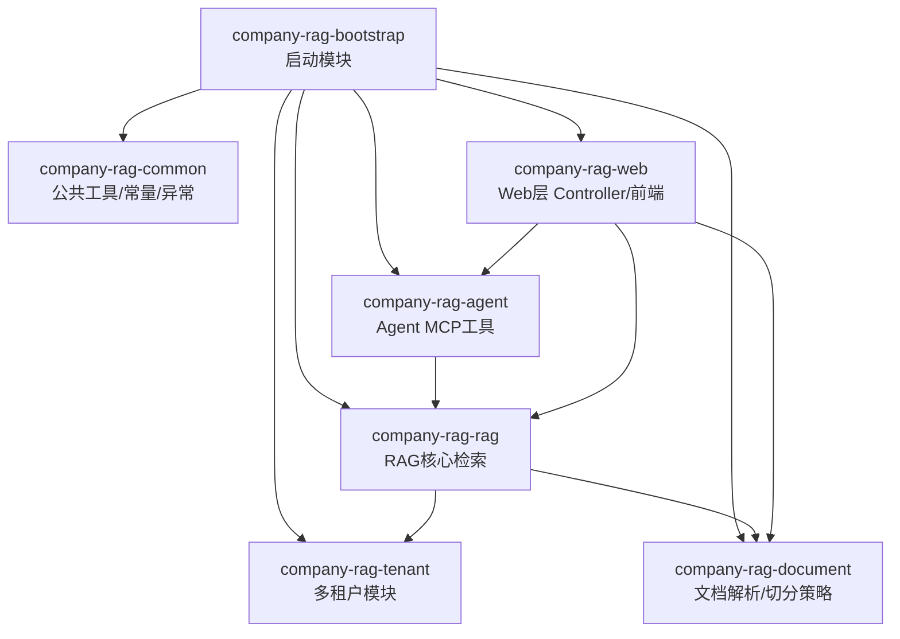
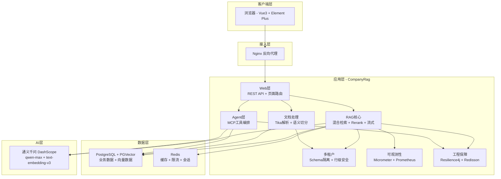

# 项目概述

**本文档引用的文件**
- [README.md](../../README.md)
- [CompanyRagApplication.java](../../company-rag-bootstrap/src/main/java/com/company/rag/bootstrap/CompanyRagApplication.java)
- [application.yml](../../company-rag-bootstrap/src/main/resources/application.yml)
- [ARCHITECTURE.md](../../ARCHITECTURE.md)
- [company-rag-web 模块](../../company-rag-web/)
- [company-rag-agent 模块 tool 目录](../../company-rag-agent/src/main/java/com/company/rag/agent/tool/)
- [company-rag-rag 模块 service 目录](../../company-rag-rag/src/main/java/com/company/rag/rag/service/)

## 目录
1. [简介](#简介)
2. [项目结构](#项目结构)
3. [核心组件](#核心组件)
4. [架构概述](#架构概述)
5. [详细组件分析](#详细组件分析)
6. [依赖分析](#依赖分析)
7. [性能考虑](#性能考虑)
8. [故障排除指南](#故障排除指南)
9. [结论](#结论)

## 简介

- **项目名称**：CompanyRag — 企业知识库RAG系统
- **项目定位**：企业级知识库检索增强生成(RAG)系统，基于 Spring AI + PGVector + 通义千问，提供多租户、文档解析、混合检索与智能问答能力。
- **核心特性**：
  1. **多租户架构**：Schema 物理隔离 + 行级安全，支持 admin/user/viewer 三种角色。来源：[README.md](../../README.md)(L50-L53)
  2. **RAG全链路**：文档解析(Apache Tika) → 语义切分(三种策略) → 向量化(text-embedding-v3) → 混合检索(向量+关键词) → 重排序(Cross-Encoder) → 流式回答(SSE)。来源：[README.md](../../README.md)(L55-L61)
  3. **Agent能力**：数据库自然语言查询、代码检索、API文档动态生成。来源：[README.md](../../README.md)(L71-L74)
  4. **可观测性**：Prometheus 指标埋点(请求数/延迟/召回率/Token消耗)、Grafana 可视化面板、Actuator 健康检查。来源：[README.md](../../README.md)(L76-L79)
  5. **工程保障**：Resilience4j 熔断限流、超时控制(30秒)、两级缓存(Redis + 热点检测)。来源：[README.md](../../README.md)(L81-L85)
- **技术栈**：
  - 框架：Spring Boot 3.4 + Spring AI 1.0
  - 数据库：PostgreSQL 16 + PGVector (HNSW索引)
  - 缓存：Redis (Redisson)
  - ORM：MyBatis-Plus 3.5
  - AI模型：通义千问 qwen-max + text-embedding-v3
  - 文档解析：Apache Tika
  - 熔断限流：Resilience4j
  - 可观测性：Micrometer + Prometheus + Grafana
  - 前端：Vue3 + Element Plus (CDN嵌入)
  - 部署：Docker Compose
  - 来源：[README.md](../../README.md)(L87-L100)，[CompanyRagApplication.java](../../company-rag-bootstrap/src/main/java/com/company/rag/bootstrap/CompanyRagApplication.java)(L22-L25)

## 项目结构

项目采用 Maven 多模块架构，包含以下模块：

**模块说明**：

| 模块 | 职责 |
|------|------|
| company-rag-common | 公共模块：常量、异常定义、工具类 |
| company-rag-tenant | 多租户模块：租户上下文、Schema隔离拦截器、权限控制 |
| company-rag-document | 文档模块：Apache Tika 解析、三种切分策略(固定大小/滑动窗口/语义切分) |
| company-rag-rag | RAG核心：混合检索、Cross-Encoder Rerank、两级缓存、Prompt管理、可观测性指标 |
| company-rag-agent | Agent模块：MCP工具(数据库查询/代码检索/API文档) |
| company-rag-web | Web层：REST API Controller、Thymeleaf页面路由 |
| company-rag-bootstrap | 启动模块：全局配置、入口类 |

来源：[README.md](../../README.md)(L217-L243)，[CompanyRagApplication.java](../../company-rag-bootstrap/src/main/java/com/company/rag/bootstrap/CompanyRagApplication.java)(L24-L25)

## 核心组件

### 📐 多租户模块 (company-rag-tenant)
- **职责**：Schema 物理隔离、MyBatis-Plus 租户拦截器自动追加 `tenant_id` 条件、admin/user/viewer 三种角色权限控制。
- 来源：[README.md](../../README.md)(L50-L53)

### 📄 文档处理模块 (company-rag-document)
- **职责**：Apache Tika 自动识别 PDF/DOCX/TXT/MD/HTML 格式；提供三种切分策略——语义切分(RSE风格)、滑动窗口、固定大小。
- 来源：[README.md](../../README.md)(L55-L69)

### 🔍 RAG核心模块 (company-rag-rag)
- **职责**：混合检索(向量+关键词加权融合)、Cross-Encoder Rerank 重排序、两级缓存管理、Prompt模板管理、Prometheus 指标埋点。
- 核心文件：[RagSearchService.java](../../company-rag-rag/src/main/java/com/company/rag/rag/service/RagSearchService.java)，[RagCircuitBreakerConfig.java](../../company-rag-rag/src/main/java/com/company/rag/rag/service/RagCircuitBreakerConfig.java)
- 来源：[README.md](../../README.md)(L55-L61)，[DirCache: company-rag-rag/service](../../company-rag-rag/src/main/java/com/company/rag/rag/service/)

### 🤖 Agent模块 (company-rag-agent)
- **职责**：MCP工具编排，提供数据库自然语言查询、项目源码代码检索、Spring端点API文档动态生成。
- 核心工具文件：`DatabaseQueryTool.java`、`CodeSearchTool.java`、`ApiDocTool.java`、`AgentTool.java`、`AgentToolRegistry.java`
- 来源：[README.md](../../README.md)(L71-L74)，[DirCache: company-rag-agent/tool](../../company-rag-agent/src/main/java/com/company/rag/agent/tool/)

### 🌐 Web层 (company-rag-web)
- **职责**：REST API 控制器、Thymeleaf 页面路由、Vue3 + Element Plus 前端页面(CDN嵌入)。
- 来源：[README.md](../../README.md)(L8-L10)，[DirCache: company-rag-web](../../company-rag-web/)

## 架构概述

系统采用分层架构，自底向上分为数据层、应用层、接入层和客户端层：

**RAG全链路流程**：用户提问 → 前端请求 → REST API → 检查缓存(命中则直接返回) → 向量检索(topK=10) + 关键词融合 → Cross-Encoder Rerank(topK=5) → 构建Prompt → 调用通义千问qwen-max → 缓存结果 + 记录指标 → 返回流式/JSON响应。

来源：[ARCHITECTURE.md](../../ARCHITECTURE.md)(L5-L85)

## 详细组件分析

### RAG检索服务
- **职责**：核心检索编排，集成混合检索(向量+关键词)、Rerank重排序、两级缓存、熔断限流保护。
- **核心类**：[RagSearchService.java](../../company-rag-rag/src/main/java/com/company/rag/rag/service/RagSearchService.java)
- **熔断配置**：[RagCircuitBreakerConfig.java](../../company-rag-rag/src/main/java/com/company/rag/rag/service/RagCircuitBreakerConfig.java) — 基于 Resilience4j，滑动窗口大小10，失败率阈值50%，熔断恢复等待30秒。来源：[application.yml](../../company-rag-bootstrap/src/main/resources/application.yml)(L64-L71)
- **限流配置**：每租户每秒10次请求，超时500ms。来源：[application.yml](../../company-rag-bootstrap/src/main/resources/application.yml)(L72-L77)

### Agent工具
- **DatabaseQueryTool**：通过自然语言查询业务数据库
- **CodeSearchTool**：在项目源码中搜索代码片段
- **ApiDocTool**：动态扫描Spring端点生成API文档
- **AgentToolRegistry**：工具注册与编排
- 来源：[DirCache: company-rag-agent/tool](../../company-rag-agent/src/main/java/com/company/rag/agent/tool/)

### 文档切分策略
| 策略 | 原理 | 适用场景 | Token利用率 |
|------|------|---------|------------|
| 语义切分 (RSE风格) | 按Markdown标题/段落边界递归切分 | 结构化文档(技术文档/手册) | ⭐⭐⭐⭐⭐ |
| 滑动窗口 | 固定大小 + 重叠 + 句边界感知 | 通用文本 | ⭐⭐⭐⭐ |
| 固定大小 | 按字符数切分 | 无结构文本 | ⭐⭐⭐ |

来源：[README.md](../../README.md)(L63-L69)

### 多租户数据隔离
- **Schema隔离**：每个租户独立Schema，数据物理隔离（如 `tenant_company_a`、`tenant_company_b`）
- **公共Schema**：`public` 下存放 `sys_tenant`、`sys_user` 等公共表
- **启动初始化**：[CompanyRagApplication.java](../../company-rag-bootstrap/src/main/java/com/company/rag/bootstrap/CompanyRagApplication.java)(L35-L72) 在启动时自动检查并为未初始化 Schema 的租户创建 Schema
- 来源：[ARCHITECTURE.md](../../ARCHITECTURE.md)(L87-L113)

## 依赖分析

| 依赖类型 | 具体组件 | 配置线索 |
|---------|---------|---------|
| 数据库 | PostgreSQL 16 + PGVector | `jdbc:postgresql://localhost:5433/company_rag`，HNSW索引，COSINE_DISTANCE，1024维度 |
| 缓存 | Redis (Redisson) | `localhost:6379`，database 0 |
| AI模型 | 通义千问 qwen-max + text-embedding-v3 | DashScope API，`base-url: https://dashscope.aliyuncs.com/compatible-mode/v1` |
| 文档解析 | Apache Tika | PDF/DOCX/TXT/MD/HTML 自动识别 |
| 熔断限流 | Resilience4j | CircuitBreaker(滑动窗口10，失败率50%) + RateLimiter(每秒10次) |
| 可观测性 | Micrometer + Prometheus + Grafana | Actuator 暴露 health/info/prometheus/metrics 端点 |
| 前端 | Vue3 + Element Plus (CDN嵌入) | Thymeleaf 模板集成 |
| 部署 | Docker Compose | PostgreSQL + Redis + 应用 + Prometheus + Grafana 容器编排 |

来源：[application.yml](../../company-rag-bootstrap/src/main/resources/application.yml)(L11-L49)，[README.md](../../README.md)(L87-L100)

## 性能考虑

### Token成本优化
1. **语义切分**减少冗余块，提升Token利用率
2. **两级缓存**（Redis + 热点检测）避免重复计算
3. **动态Top-K**根据查询复杂度调整检索数量
4. **Prompt压缩**去除低价值上下文

### 召回率提升
1. **混合检索**：向量 + 关键词加权融合
2. **Cross-Encoder Rerank**：精排Top-K准确率提升15-30%
3. **滑动窗口重叠**：减少信息断裂
4. **句边界感知**：切分时保持语义完整性

### 工程保障
- **熔断**：Resilience4j CircuitBreaker 保护LLM调用（滑动窗口10次，失败率阈值50%）
- **限流**：每租户每秒10次速率限制
- **超时控制**：LLM调用超时30秒
- **两级缓存**：Redis + 热点检测

来源：[README.md](../../README.md)(L203-L215)，[application.yml](../../company-rag-bootstrap/src/main/resources/application.yml)(L64-L77)

## 故障排除指南

### 日志配置
- 应用日志级别：`com.company.rag: DEBUG`，`org.springframework.ai: INFO`
- 日志输出到控制台（StdOut），MyBatis SQL 日志通过 `org.apache.ibatis.logging.stdout.StdOutImpl` 输出
- 来源：[application.yml](../../company-rag-bootstrap/src/main/resources/application.yml)(L90-L93)

### 健康检查
- Actuator 端点：`/actuator/health`、`/actuator/info`、`/actuator/prometheus`、`/actuator/metrics`
- 来源：[application.yml](../../company-rag-bootstrap/src/main/resources/application.yml)(L80-L87)

### 常见排查步骤
1. **检查基础设施**：确保 PostgreSQL 和 Redis 容器运行正常（`docker compose ps`）
2. **验证API Key**：确认 `DASHSCOPE_API_KEY` 环境变量已正确设置
3. **查看应用日志**：检查 DEBUG 级别日志中的检索链路和异常信息
4. **检查熔断状态**：通过 Actuator `/actuator/health` 查看 CircuitBreaker 状态
5. **验证数据库连接**：确认 PostgreSQL 端口 `5433` 可访问，连接池配置正常

来源：[README.md](../../README.md)(L110-L151)，[application.yml](../../company-rag-bootstrap/src/main/resources/application.yml)(L80-L93)

## 结论

CompanyRag 是一个基于 Spring Boot 3.4 + Spring AI 1.0 的企业级知识库 RAG 系统，采用 Maven 多模块架构，核心能力涵盖：

1. **多租户数据隔离**：通过 PostgreSQL Schema 物理隔离实现租户级数据安全，配合 MyBatis-Plus 拦截器实现行级权限控制。
2. **完整的 RAG 流水线**：从文档解析(Apache Tika)到语义切分(三种策略)、向量化(text-embedding-v3)、混合检索(向量+关键词)、重排序(Cross-Encoder)到流式回答(SSE)，形成完整闭环。
3. **智能 Agent 能力**：基于 MCP 协议的工具编排，支持数据库查询、代码检索和 API 文档生成。
4. **生产级工程保障**：Resilience4j 熔断限流、两级缓存策略、Prometheus 可观测性，确保系统稳定可靠。
5. **容器化部署**：通过 Docker Compose 一键部署 PostgreSQL(PGVector)、Redis、Prometheus、Grafana 等基础设施。