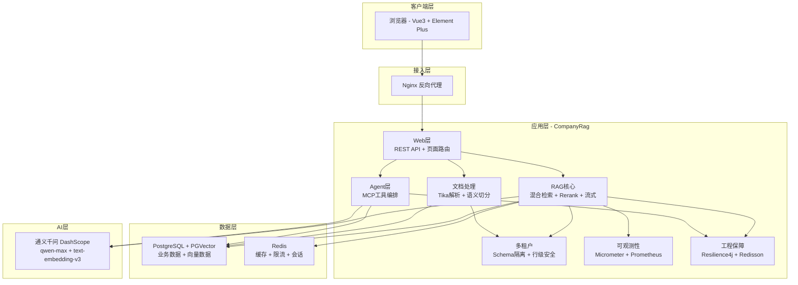
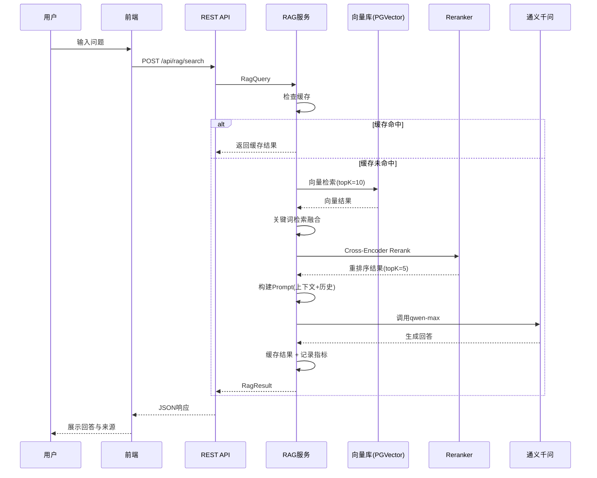
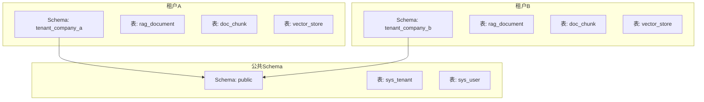
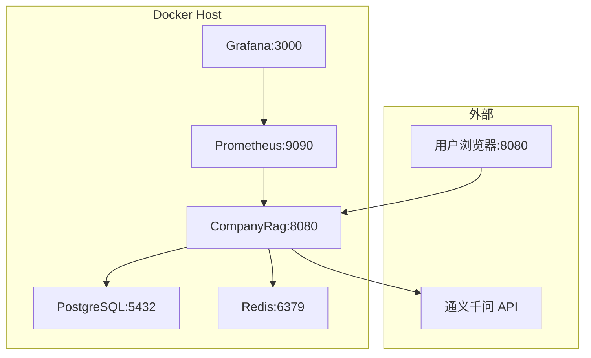

# CompanyRag 系统架构图

## 整体架构

```mermaid
graph TB
    subgraph "客户端层"
        B[浏览器 - Vue3 + Element Plus]
    end

    subgraph "接入层"
        N[Nginx 反向代理]
    end

    subgraph "应用层 - CompanyRag"
        direction TB
        WEB[Web层<br/>REST API + 页面路由]
        RAG[RAG核心<br/>混合检索 + Rerank + 流式]
        AGENT[Agent层<br/>MCP工具编排]
        TENANT[多租户<br/>Schema隔离 + 行级安全]
        DOC[文档处理<br/>Tika解析 + 语义切分]
        OBS[可观测性<br/>Micrometer + Prometheus]
        RESILIENCE[工程保障<br/>Resilience4j + Redisson]
    end

    subgraph "数据层"
        PG[PostgreSQL + PGVector<br/>业务数据 + 向量数据]
        REDIS[Redis<br/>缓存 + 限流 + 会话]
    end

    subgraph "AI层"
        DASHSCOPE[通义千问 DashScope<br/>qwen-max + text-embedding-v3]
    end

    B --> N
    N --> WEB
    WEB --> RAG
    WEB --> AGENT
    WEB --> DOC
    RAG --> TENANT
    DOC --> TENANT
    RAG --> RESILIENCE
    AGENT --> RESILIENCE
    RAG --> OBS
    RAG --> PG
    RAG --> REDIS
    DOC --> PG
    AGENT --> PG
    RAG --> DASHSCOPE
    AGENT --> DASHSCOPE
```

## RAG全链路流程

```mermaid
sequenceDiagram
    participant U as 用户
    participant F as 前端
    participant API as REST API
    participant RAG as RAG服务
    participant VS as 向量库(PGVector)
    participant RERANK as Reranker
    participant LLM as 通义千问

    U->>F: 输入问题
    F->>API: POST /api/rag/search
    API->>RAG: RagQuery
    RAG->>RAG: 检查缓存
    alt 缓存命中
        RAG-->>API: 返回缓存结果
    else 缓存未命中
        RAG->>VS: 向量检索(topK=10)
        VS-->>RAG: 向量结果
        RAG->>RAG: 关键词检索融合
        RAG->>RERANK: Cross-Encoder Rerank
        RERANK-->>RAG: 重排序结果(topK=5)
        RAG->>RAG: 构建Prompt(上下文+历史)
        RAG->>LLM: 调用qwen-max
        LLM-->>RAG: 生成回答
        RAG->>RAG: 缓存结果 + 记录指标
        RAG-->>API: RagResult
    end
    API-->>F: JSON响应
    F-->>U: 展示回答与来源
```

## 多租户数据隔离架构

```mermaid
graph TB
    subgraph "租户A"
        SA[Schema: tenant_company_a]
        TA1[表: rag_document]
        TA2[表: doc_chunk]
        TA3[表: vector_store]
    end

    subgraph "租户B"
        SB[Schema: tenant_company_b]
        TB1[表: rag_document]
        TB2[表: doc_chunk]
        TB3[表: vector_store]
    end

    subgraph "公共Schema"
        SP[Schema: public]
        T1[表: sys_tenant]
        T2[表: sys_user]
    end

    SA --> SP
    SB --> SP
```

## 部署架构

```mermaid
graph TB
    subgraph "Docker Host"
        PG[PostgreSQL:5432]
        REDIS[Redis:6379]
        APP[CompanyRag:8080]
        PROM[Prometheus:9090]
        GRAF[Grafana:3000]

        APP --> PG
        APP --> REDIS
        PROM --> APP
        GRAF --> PROM
    end

    subgraph "外部"
        DASHSCOPE[通义千问 API]
        USER[用户浏览器:8080]

        USER --> APP
        APP --> DASHSCOPE
    end
```
